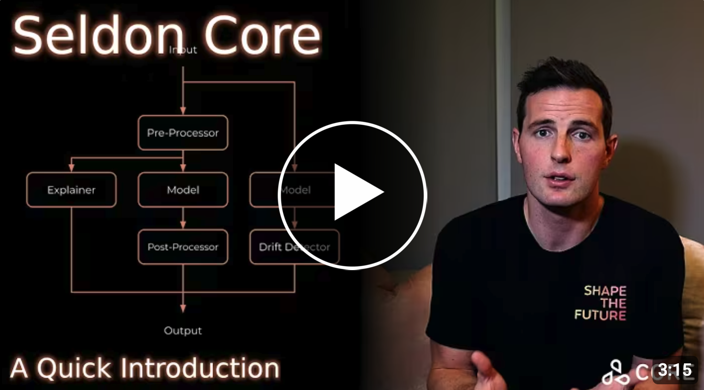

 

# Deploy Modular, Data-centric AI applications at scale

##  💡 About
Seldon Core 2 is an MLOps and LLMOps framework for deploying, managing and scaling AI systems in Kubernetes - from singular models, to modular and data-centric applications. With Core 2 you can deploy in a standardized way across a wide range of model types, on-prem or in any cloud, and production-ready out of the box. 

 
 

   
 

 

To learn more, or to contact Seldon regarding commercial use:

👉 [Read the Documentation](https://docs.seldon.ai/seldon-core-2)  
👉 [Contact Seldon](https://www.seldon.io/)

 
## 🧩 Features

 * **Pipelines**: Deploy composable AI applications, leveraging Kafka for realtime data streaming between components
 * **Autoscaling** for models and application components based on native or custom logic
 * **Multi-Model Serving**: Save infrastructure costs by consolidating multiple models on shared inference servers
 * **Overcommit**: Deploy more models than available memory allows, saving infrastructure costs for unused models
 * **Experiments**: Route data between candidate models or pipelines, with support for A/B tests and shadow deployments
 * **Custom Components**: Implement custom logic, drift & outlier detection, LLMs and more through plug-and-play integrate with the rest of Seldon's ecosytem of ML/AI products!
 
## 🔬 Research

These features are influenced by our position paper on the next generation of ML model serving frameworks: 

👉 [Desiderata for next generation of ML model serving](http://arxiv.org/abs/2210.14665)

## 📜 License

Seldon is distributed under the terms of the The Business Source License. A complete version of the license is available in the [LICENSE file](LICENSE) in this repository. Any contribution made to this project will be licensed under the Business Source License.

