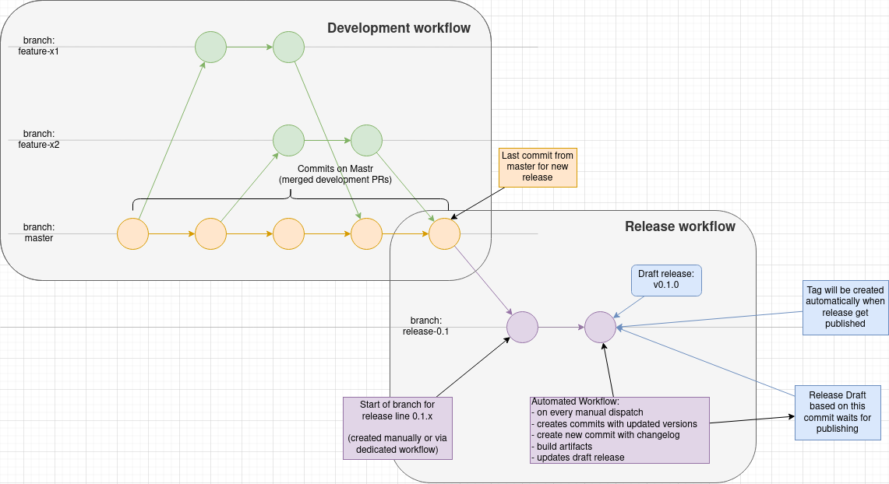
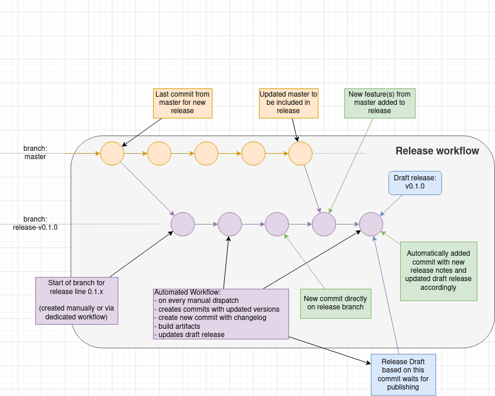

# Release Process

This document summarize the release process for Seldon Core V2.
This document is meant mainly at the maintainers.

> :warning: **NOTE:** This is work in progress. This is a very initial version of the release process. The process may change. Please, always check this document before conducting a release and verify if everything goes as expected.

## Process Summary

1. Cut branch for release, e.g. `release-0.1`
2. Run "Draft New Release" workflow (e.g. choose `release-0.1` branch and `v0.1.0-rc1` version)
3. Run "Build docker images" workflow (e.g. choose `release-0.1` branch and `0.1.0-rc1` tag)
4. Verify correctness or created artifacts and images (not yet automated!)
5. Publish the release.

## Process discussion

The development process follows a standard GitHub workflow.

The main development is happening in `master` branch.
This is where new features land through Pull Requests.
When all features for new release are merged, for example `v0.1.0`, we cut a branch for `release-0.1`.

The `release-0.1` branch will be base for `v0.1.0` release as well as the release candidates, e.g. `v0.1.0-rcX` and successive patch releases `v0.1.X`.
We use GitHub Actions to prepare the release, build images and run all necessary testing.

If the release draft needs to be updated before the release is published, the new commits should be merged into the `release-0.1` branch and relevant workflows re-triggered as required.

### Draft New Release Action

The [Draft New Release](./.github/workflows/draft-release.yml) workflow is the first one to run.
It must be triggered manually using the [Actions](https://github.com/SeldonIO/seldon-core-v2/actions/workflows/draft-release.yml) interface in GitHub UI.

When triggering the workflow, you must:
- select the release branch (here `release-0.1`)
- specify the release `version` (here `v0.1.0-rc1`).

This workflow cannot run on `master` branch.
It will also validate provided `version` against SemVer regex.

It will create a few commits with:
- updated helm charts
- updated k8s yaml manifests
- updated changelog

Once the workflow finishes, you will find a new release draft waiting to be published.

> :warning: **NOTE:** Before publishing the release run the images build workflow and necessary tests (not yet automated)!

### Build docker images Action

The [Build docker images](./.github/workflows/images.yml) workflow is the second one to run.

It must be triggered manually using the [Actions](https://github.com/SeldonIO/seldon-core-v2/actions/workflows/draft-release.yml) interface in GitHub UI.

When triggering the workflow, you must:
- select the release branch (here `release-0.1`)
- specify the release `version` (here `0.1.0-rc1` - note lack of `v` prefix!).

This workflow will then run unit tests and build a series of Docker images that will be automatically pushed to [DockerHub](https://hub.docker.com/).
