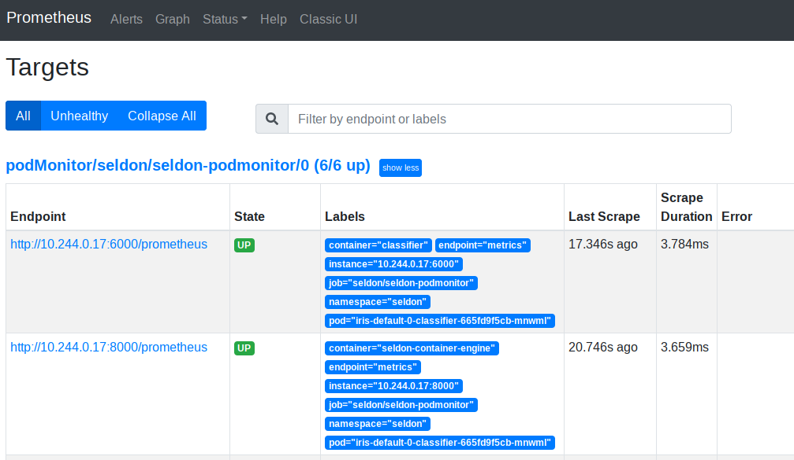
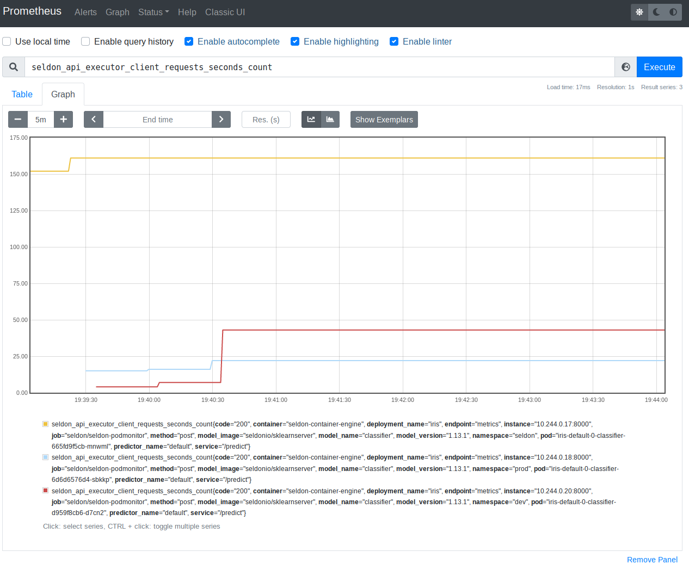

# Metrics

Seldon Core exposes metrics that can be scraped by Prometheus. The core metrics are exposed by the service orchestrator (`executor`).

The metrics are:

## Prediction Requests

- Requests to the service orchestrator from an ingress, e.g. API gateway or Ambassador

 * `seldon_api_executor_server_requests_seconds_(bucket,count,sum)` - `histogram` type metric
 * `seldon_api_executor_server_requests_seconds_summary_(count,sum)` - `summary` type metric

- Requests from the service orchestrator to a component, e.g., a model

 * `seldon_api_executor_client_requests_seconds_(bucket,count,sum)` - `histogram` type metric
 * `seldon_api_executor_client_requests_seconds_summary_(count,sum)` - `summary` type metric


Each metric has the following key value pairs for further filtering which will be taken from the SeldonDeployment custom resource that is running:

  * service
  * deployment_name
  * predictor_name
  * predictor_version (This will be derived from the predictor metadata labels)
  * model_name
  * model_image
  * model_version


## Metrics with Prometheus Operator

### Installation

We recommend to configure Prometheus using [Prometheus Operator](https://github.com/prometheus-operator/prometheus-operator).
The [kube-prometheus](https://github.com/prometheus-operator/kube-prometheus) stack configuration can be easily installed using the [Bitnami Helm Charts](https://github.com/bitnami/charts/tree/master/bitnami/kube-prometheus/)

```bash
kubectl create namespace seldon-system

helm upgrade --install prometheus kube-prometheus \
    --version 6.8.3 \
	--set fullnameOverride=seldon-monitoring \
    --namespace seldon-system \
    --repo https://charts.bitnami.com/bitnami

kubectl rollout status -n seldon-system statefulsets/prometheus-seldon-monitoring-prometheus
```

The following pods should now be present in the `seldon-system` namespace:
```bash
$ kubectl get pods -n seldon-system
NAME                                            READY   STATUS    RESTARTS   AGE
alertmanager-seldon-monitoring-alertmanager-0   2/2     Running   0          51s
prometheus-kube-state-metrics-d97b6b5ff-n5z7w   1/1     Running   0          52s
prometheus-node-exporter-jmffw                  1/1     Running   0          52s
prometheus-seldon-monitoring-prometheus-0       2/2     Running   0          51s
seldon-monitoring-operator-6d558f5696-xhq66     1/1     Running   0          52s
```

### Configuration

Following `PodMonitor` resource will instruct Prometheus to scrape ports named `metrics` from pods managed by Seldon Core.
Create `seldon-podmonitor.yaml` file
```yaml
apiVersion: monitoring.coreos.com/v1
kind: PodMonitor
metadata:
  name: seldon-podmonitor
spec:
  selector:
    matchLabels:
      app.kubernetes.io/managed-by: seldon-core
  podMetricsEndpoints:
    - port: metrics
      path: /prometheus
  namespaceSelector:
    any: true
```
and apply it with
```bash
kubectl apply -f seldon-podmonitor.yaml
```


### Verification

Assuming that there exist `SeldonDeployment` models running in the cluster one can verify Prometheus metrics by accessing the Prometheus UI.

Expose Prometheus to your localhost with
```bash
$ kubectl port-forward -n seldon-system svc/seldon-monitoring-prometheus 9090:9090
```

You can now head to your browser http://localhost:9090 to access the Prometheus UI.
Start by verifying at `Status -> Targets` information.



Then, head to `Graph` section and query for `seldon_api_executor_client_requests_seconds_count`.
You should see output similar to following (assuming that your `SeldonDeployments` are receiving some inference requests)




## Custom Metrics

Seldon Core exposes basic metrics via Prometheus endpoints on its service orchestrator that include request count, request time percentiles and rolling accuracy for each running model as described in [metrics](./analytics.md) documentation.
However, you may wish to expose custom metrics from your components which are automatically added to Prometheus.
For this purpose you can supply extra fields in the returned meta data of the response object in the API calls to your components as illustrated below:

```json
{
	"meta": {
		"metrics": [
			{
				"type": "COUNTER",
				"key": "mycounter",
				"value": 1.0,
				"tags": {"mytag": "mytagvalue"}
			},
			{
				"type": "GAUGE",
				"key": "mygauge",
				"value": 22.0
			},
			{
				"type": "TIMER",
				"key": "mytimer",
				"value": 1.0
			}
		]
	},
	"data": {
		"ndarray": [
			[
				1,
				2
			]
		]
	}
}
```

We provide three types of metric that can be returned in the meta.metrics list:

 * COUNTER : a monotonically increasing value. It will be added to any existing value from the metric key.
 * GAUGE : an absolute value showing a level, it will overwrite any existing value.
 * TIMER : a time value (in msecs), it will be aggregated into Prometheus' HISTOGRAM.

Each metric, apart from the type, takes a key and a value. The proto buffer definition is shown below:

```protobuf
message Metric {
 enum MetricType {
     COUNTER = 0;
     GAUGE = 1;
     TIMER = 2;
 }
 string key = 1;
 MetricType type = 2;
 float value = 3;
 map<string,string> tags = 4;
}
```

### Metrics endpoints

Custom metrics are exposed directly by the Python wrapper.
In order for `Prometheus` to scrape multiple endpoints from a single `Pod` we use `metrics` name for ports that expose `Prometheus` metrics:
```yaml
ports:
- containerPort: 6000
  name: metrics
  protocol: TCP
```

If you configured Prometheus using Prometheus Operator as discussed above you should be set to go.
If, however, you are configuring Prometheus not using Prometheus Operator this require us to use a following entry
```yaml
  - source_labels: [__meta_kubernetes_pod_container_port_name]
    action: keep
    regex: metrics(-.*)?
```
in the Prometheus [config](https://github.com/SeldonIO/seldon-core/blob/master/helm-charts/seldon-core-analytics/files/prometheus/prometheus-config.yaml) together with following two annotations:
```yaml
prometheus.io/scrape: "true"
prometheus.io/path: "/prometheus"
```

Note: we do not use `prometheus.io/port` annotation in this configuration.


Before Seldon Core 1.1 custom metrics have been returned to the orchestrator which exposed them all together to `Prometheus` via a single endpoint.
We used to have at this time all three following annotations:
```yaml
prometheus.io/scrape: "true"
prometheus.io/path: "/prometheus"
prometheus.io/port: "8000"
```


### Labels

As we expose the metrics via `Prometheus`, if `tags` are added they must appear in every metric response otherwise `Prometheus` will consider such metrics as a new time series, see official [documentation](https://prometheus.io/docs/practices/naming/).

Before Seldon Core 1.1 orchestrator enforced presence of same set of labels using the [micrometer](https://micrometer.io/) library to expose metrics. Exceptions would happen if this condition have been violated.


### Supported wrappers

At present the following Seldon Core wrappers provide integrations with custom metrics:

 * [Python Wrapper](../python/index.html)


## Example

There is [an example notebook you can use to test the metrics](../examples/metrics.html).
