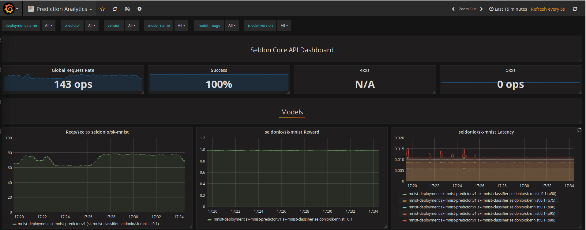

# Metrics

Seldon Core exposes metrics that can be scraped by Prometheus. The core metrics are exposed by the service orchestrator (`executor`).

The metrics are:

**Prediction Requests**

 * `seldon_api_executor_server_requests_seconds_(bucket,count,sum) ` : Requests to the service orchestrator from an ingress, e.g. API gateway or Ambassador
 * `seldon_api_executor_client_requests_seconds_(bucket,count,sum) ` : Requests from the service orchestrator to a component, e.g., a model

Each metric has the following key value pairs for further filtering which will be taken from the SeldonDeployment custom resource that is running:

  * service
  * deployment_name
  * predictor_name
  * predictor_version (This will be derived from the predictor metadata labels)
  * model_name
  * model_image
  * model_version


## Helm Analytics Chart

Seldon Core provides an example Helm analytics chart that displays the above Prometheus metrics in Grafana. You can install it with:

```bash
helm install seldon-core-analytics seldon-core-analytics \
   --repo https://storage.googleapis.com/seldon-charts \
   --namespace seldon-system
```

THe helm charts use the Prometheus and Grafana charts as dependencies, so all the variables from those charts are exposed and can be extended / modified. The `seldon-core-analytics` chart provides default values but you can override them.

Once running you can expose the Grafana dashboard with:

```bash
kubectl port-forward svc/seldon-core-analytics-grafana 3000:80 -n seldon-system
```

You can then view the dashboard at http://localhost:3000/dashboard/db/prediction-analytics



It is also possible expose Prometheus itself with:
```bash
kubectl port-forward svc/seldon-core-analytics-prometheus-seldon 3001:80 -n seldon-system
```

and then access it at http://localhost:3001/

## Example

There is [an example notebook you can use to test the metrics](../examples/metrics.html).


## Custom Metrics

Seldon Core exposes basic metrics via Prometheus endpoints on its service orchestrator that include request count, request time percentiles and rolling accuracy for each running model as described in [metrics](./analytics.md) documentation.
However, you may wish to expose custom metrics from your components which are automatically added to Prometheus.
For this purpose you can supply extra fields in the returned meta data of the response object in the API calls to your components as illustrated below:

```json
{
	"meta": {
		"metrics": [
			{
				"type": "COUNTER",
				"key": "mycounter",
				"value": 1.0,
				"tags": {"mytag": "mytagvalue"}
			},
			{
				"type": "GAUGE",
				"key": "mygauge",
				"value": 22.0
			},
			{
				"type": "TIMER",
				"key": "mytimer",
				"value": 1.0
			}
		]
	},
	"data": {
		"ndarray": [
			[
				1,
				2
			]
		]
	}
}
```

We provide three types of metric that can be returned in the meta.metrics list:

 * COUNTER : a monotonically increasing value. It will be added to any existing value from the metric key.
 * GAUGE : an absolute value showing a level, it will overwrite any existing value.
 * TIMER : a time value (in msecs), it will be aggregated into Prometheus' HISTOGRAM.

Each metric, apart from the type, takes a key and a value. The proto buffer definition is shown below:

```protobuf
message Metric {
 enum MetricType {
     COUNTER = 0;
     GAUGE = 1;
     TIMER = 2;
 }
 string key = 1;
 MetricType type = 2;
 float value = 3;
 map<string,string> tags = 4;
}
```

### Metrics endpoints

Custom metrics are exposed directly by the Python wrapper.
In order for `Prometheus` to scrape multiple endpoints from a single `Pod` we use `metrics` name for ports that expose `Prometheus` metrics:
```yaml
ports:
- containerPort: 6000
  name: metrics
  protocol: TCP
```

This require us to use a following entry
```yaml
  - source_labels: [__meta_kubernetes_pod_container_port_name]
    action: keep
    regex: metrics(-.*)?
```
in the Prometheus [config](https://github.com/SeldonIO/seldon-core/blob/master/helm-charts/seldon-core-analytics/files/prometheus/prometheus-config.yaml) together with following two annotations:
```yaml
prometheus.io/scrape: "true"
prometheus.io/path: "/prometheus"
```

Note: we do not use `prometheus.io/port` annotation in this configuration.


Before Seldon Core 1.1 custom metrics have been returned to the orchestrator which exposed them all together to `Prometheus` via a single endpoint.
We used to have at this time all three following annotations:
```yaml
prometheus.io/scrape: "true"
prometheus.io/path: "/prometheus"
prometheus.io/port: "8000"
```


### Labels

As we expose the metrics via `Prometheus`, if `tags` are added they must appear in every metric response otherwise `Prometheus` will consider such metrics as a new time series, see official [documentation](https://prometheus.io/docs/practices/naming/).

Before Seldon Core 1.1 orchestrator enforced presence of same set of labels using the [micrometer](https://micrometer.io/) library to expose metrics. Exceptions would happen if this condition have been violated.


### Supported wrappers

At present the following Seldon Core wrappers provide integrations with custom metrics:

 * [Python Wrapper](../python/index.html)


### Example

There is an [example notebook illustrating a model with custom metrics in python](../examples/custom_metrics.html).
