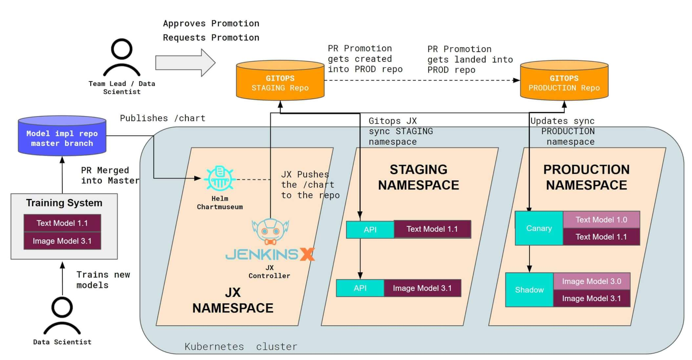

# Scaling Seldon Core Deployments with CI / CD

When integrating Seldon Core into your enterprise stack, it is common practice to introduce Continuous Integration and Continuous Delivery methodology into the deployment workflows.

## MLOps for Scale

Seldon Core has been built with this in mind, and is currently used in enterprises to support the containerisation, deployment and management of machine learning at massive scale.

This page contains a high level overview on the the concepts that Seldon Core uses to enable continuous deployment of machine learning through the concept of "MLOps".

## Hands on Examples

We have put together a set of examples that showcase how to integrate Seldon Core with Jenkins Classic, ArgoCD and/or Jenkins X:

* [CI / CD with Jenkins Classic](../examples/jenkins_classic.html)
* [CI / CD with Jenkins X](../examples/jenkins_x.html)
