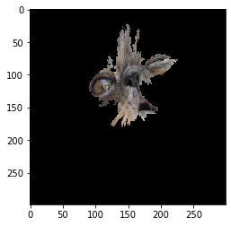

# Model Explainers




Seldon provides model explanations using its [Alibi](https://github.com/SeldonIO/alibi)  Open Source library.

We support explainers saved using dill with python 3.7.

| Package | Version |
| ------ | ----- |
| `alibi` | `0.6.0` |


We provide [an example notebook](../examples/explainer_examples.html) showing how to deploy an explainer for Tabular, Text and Image models.


## Available Methods

Seldon Core supports a subset of the methods currently available in [Alibi](https://github.com/SeldonIO/alibi). Presently this the following:


| Method | Explainer Key | Example |
|--------|---------------|---------||
| [Anchor Tabular](https://docs.seldon.io/projects/alibi/en/latest/methods/Anchors.html) | `AnchorTabular` | [Example](../examples/explainer_examples.html#Income-Prediction-Model-with-Anchors-Explainer) |
| [Anchor Text](https://docs.seldon.io/projects/alibi/en/latest/methods/Anchors.html) | `AnchorText` | [Example](../examples/explainer_examples.html#Movie-Sentiment-Model) |
| [Anchor Images](https://docs.seldon.io/projects/alibi/en/latest/methods/Anchors.html) | `AnchorImages` | [Example](../examples/explainer_examples.html#Tensorflow-CIFAR10-Model) |
| [kernel Shap](https://docs.seldon.io/projects/alibi/en/latest/methods/KernelSHAP.html) | `KernelShap` | [Example](../examples/explainer_examples.html#Wine-Prediction-Model-with-Shap-Explainer) |
| [Integrated Gradients](https://docs.seldon.io/projects/alibi/en/latest/methods/IntegratedGradients.html) | `IntegratedGradients` | [Example](../examples/explainer_examples.html#MNIST-Model-with-Integrated-Gradients-Explainer) |
| [Tree Shap](https://docs.seldon.io/projects/alibi/en/latest/methods/TreeSHAP.html) | `TreeShap` | [Example](../examples/explainer_examples.html#XGBoost-Model-with-TreeShap-Explainer) |

## Creating your explainer

For Alibi explainers that need to be trained you should

 1. Use python 3.7 as the Seldon python Alibi explainer wrapper also runs in python 3.7.10 when it loads your explainer.
 1. Follow the [Alibi docs](https://docs.seldon.io/projects/alibi/en/latest/index.html) for your particular desired explainer. The Seldon Wrapper presently supports: Anchors (Tabular, Text and Image), KernelShap and Integrated Gradients.
 1. Save your explainer using [explainer.save](https://docs.seldon.io/projects/alibi/en/latest/overview/saving.html) method and store in the object store or PVC in your cluster. We support various cloud storage solutions through our [init container](../servers/overview.html).

The runtime environment in our [Alibi Explain Server](https://github.com/SeldonIO/seldon-core/tree/master/components/alibi-explain-server) is locked using [Poetry](https://python-poetry.org/). See our e2e example [here](../examples/iris_explainer_poetry.html) on how to use that definition to train your explainers.

## Explain API

For the Seldon Protocol an endpoint path will be exposed for:

```
http://<ingress-gateway>/seldon/<namespace>/<deployment name>/<predictor name>/api/v1.0/explain
```

So for example if you deployed:

```
apiVersion: machinelearning.seldon.io/v1
kind: SeldonDeployment
metadata:
  name: income
  namespace: seldon
spec:
  name: income
  annotations:
    seldon.io/rest-timeout: "100000"
  predictors:
  - graph:
      children: []
      implementation: SKLEARN_SERVER
      modelUri: gs://seldon-models/sklearn/income/model-0.23.2
      name: classifier
    explainer:
      type: AnchorTabular
      modelUri: gs://seldon-models/sklearn/income/explainer-py36-0.5.2
    name: default
    replicas: 1
```

If you were port forwarding to Ambassador on localhost:8003 then the API call would be:

```
http://localhost:8003/seldon/seldon/income-explainer/default/api/v1.0/explain
```

The explain method is also supported for tensorflow and v2 kfserving protocols. The full list of endpoint URIs is:

| Protocol | URI |
| ------ | ----- |
| seldon | `http://<host>/<ingress-path>/api/v1.0/explain` |
| tensorflow | `http://<host>/<ingress-path>/v1/models/<model-name>:explain` |
| kfserving | `http://<host>/<ingress-path>/v2/models/<model-name>/explain` |


Note: for `tensorflow` protocol we support similar non-standard extension as for the [prediction API](../graph/protocols.md#rest-and-grpc-tensorflow-protocol), `http://<host>/<ingress-path>/v1/models/:explain`.
