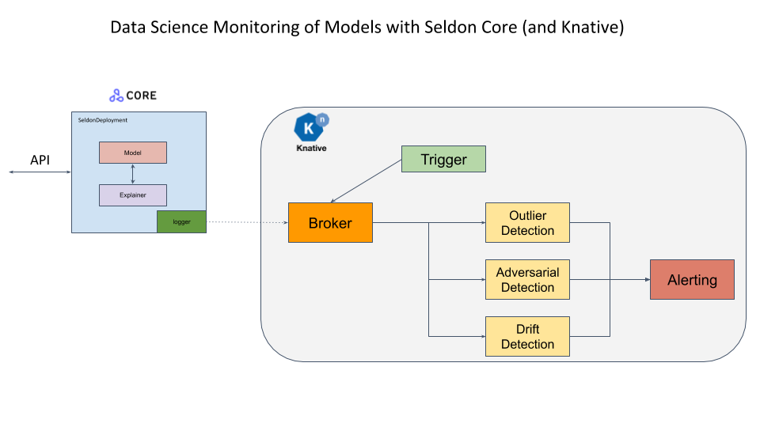

# Outlier Detection in Seldon Core

Machine learning models do not extrapolate well outside of the training data distribution. In order to trust and reliably act on model predictions, it is crucial to monitor the distribution of incoming requests via different types of detectors. Outlier detectors aim to flag individual instances which do not follow the original training distribution.

| Package | Version |
| ------ | ----- |
| `alibi-detect` | `0.9.0` |

A [worked example with using the CIFAR10 task](../examples/outlier_cifar10.html) is available. This example focuses on the serving infrastructure and discusses it in details.

The general framework shown in this example is to use the Seldon Core payload logger to pass requests to components that process them asynchronously. The results can be passed onwards to alterting systems.

## Creating your own detector

For Alibi Detect outlier detectors that need to be trained you should

 1. Use python 3.7 as the Seldon Alibi Detect Server also runs in python 3.7.10 when it loads your detector.
 1. Follow the [Alibi Detect docs](https://docs.seldon.io/projects/alibi-detect/en/stable/) for your particular desired detector.
 1. Save your detector using [save_detector](https://docs.seldon.io/projects/alibi-detect/en/stable/overview/saving.html) method and store in the object store or PVC in your cluster. We support various cloud storage solutions through our [init container](../servers/overview.html).

The runtime environment in our [Alibi Explain Detector](https://github.com/SeldonIO/seldon-core/tree/master/components/alibi-detect-server) is locked using [Poetry](https://python-poetry.org/). See our e2e example [here](../examples/cifar10_od_poetry.html) on how to use that definition to train your detector.
