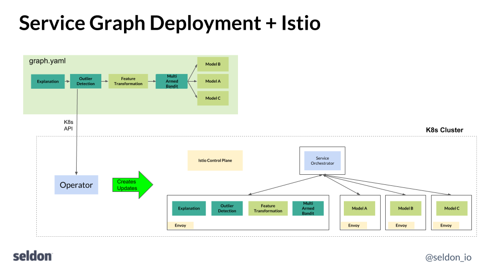

# Istio and Seldon

[Istio](https://istio.io/) provides service mesh functionality and can be a useful addition to Seldon to provide extra traffic management, end-to-end security and policy enforcement in your runtime machine learning deployment graph. Seldon-core can be seen as  providing a service graph for machine learning deployments. As part of that it provides an Operator which takes your ML deployment graph definition described as a SeldonDeployment Kubernetes resource and deploys and manages it on a Kubernetes cluster so you can connect your business applications that need to access machine learning services. Data scientists can focus on building pluggable docker containers for parts of their runtime machine learning graph, such as runtime inference, transformations, outlier detection, ensemblers etc. These can be composed together as needed to satisfy your runtime ML functionality. To allow modules to be built without knowing what service graph they will exist in means Seldon also deploys a Service Orchestrator as part of each deployment which manages the request/response flow to satisfy the defined ML service graph for multi-component graphs.

The components are illustrated below. A user's graph resource definition (graph.yaml) is sent over the Kubernetes API and the Seldon Operator manages the creation and update of the underlying components including the Seldon service orchestrator which manages the request/response flow logic through the deployed graph.

Out of the box Seldon provides rolling updates to SeldonDeployment service graphs provided by the underlying Kubernetes functionality. However, there are cases where you want to manage updates to your ML deployments in a more controlled way with fine grained traffic management including canary updates, blue-green deployments and shadowing. This is where Istio can help in combination with Seldon.

The addition of Istio is complementary to Seldon and is illustrated below where Envoy sidecars are injected into the defined Kubernetes Deployments and the user can manage the service mesh using the Istio control plane.

