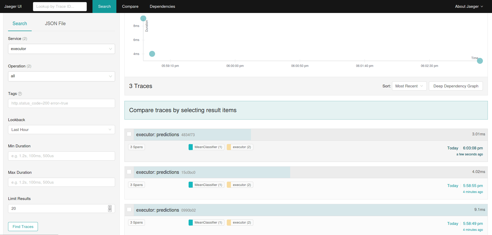
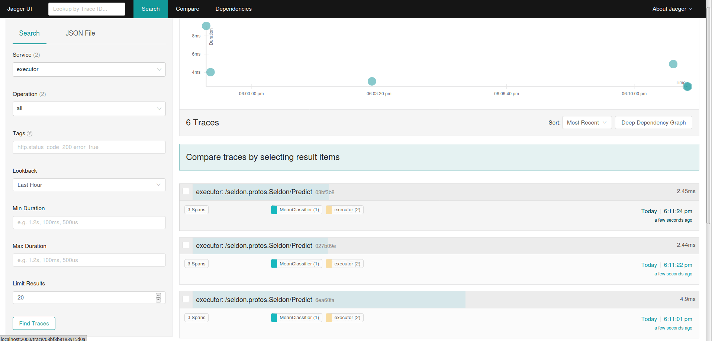

# Distributed Tracing

You can use Open Tracing to trace your API calls to Seldon Core. By default we support Jaeger for Distributed Tracing, which will allow you to obtain insights on latency and performance across each microservice-hop in your Seldon deployment.

Datadog tracing is also supported, see [Distributed Tracing with Datadog](distributed-tracing-dd.md)

## Install Jaeger

You will need to install Jaeger on your Kubernetes cluster. Follow their [documentation](https://www.jaegertracing.io/docs/1.18/operator/)

## Configuration

You will need to annotate your Seldon Deployment resource with environment variables to make tracing active and set the appropriate Jaeger configuration variables.

  * For the Seldon Service Orchestrator you will need to set the environment variables in the `spec.predictors[].svcOrchSpec.env` section. See the [Jaeger Java docs](https://github.com/jaegertracing/jaeger-client-java/tree/master/jaeger-core#configuration-via-environment) for available configuration variables.
  * For each Seldon component you run (e.g., model transformer etc.) you will need to add environment variables to the container section.


### Python Wrapper Configuration

Add an environment variable: TRACING with value 1 to activate tracing.

You can utilize the default configuration by simply providing the name of the Jaeger agent service by providing JAEGER_AGENT_HOST environment variable. Override default Jaeger agent port `5775` by setting JAEGER_AGENT_PORT environment variable.

To provide a custom configuration following the Jaeger Python configuration yaml defined [here](https://github.com/jaegertracing/jaeger-client-python) you can provide a configmap and the path to the YAML file in JAEGER_CONFIG_PATH environment variable.

An example is show below:

```yaml
apiVersion: machinelearning.seldon.io/v1
kind: SeldonDeployment
metadata:
  name: tracing-example
  namespace: seldon
spec:
  name: tracing-example
  predictors:
  - componentSpecs:
    - spec:
        containers:
        - env:
          - name: TRACING
            value: '1'
          - name: JAEGER_AGENT_HOST
            valueFrom:
              fieldRef:
                fieldPath: status.hostIP
          - name: JAEGER_AGENT_PORT
            value: '5775'
          - name: JAEGER_SAMPLER_TYPE
            value: const
          - name: JAEGER_SAMPLER_PARAM
            value: '1'
          image: seldonio/mock_classifier_rest:1.3
          name: model1
        terminationGracePeriodSeconds: 1
    graph:
      children: []
      endpoint:
        type: REST
      name: model1
      type: MODEL
    name: tracing
    replicas: 1
    svcOrchSpec:
      env:
      - name: TRACING
        value: '1'
      - name: JAEGER_AGENT_HOST
        valueFrom:
          fieldRef:
            fieldPath: status.hostIP
      - name: JAEGER_AGENT_PORT
        value: '5775'
      - name: JAEGER_SAMPLER_TYPE
        value: const
      - name: JAEGER_SAMPLER_PARAM
        value: '1'
```
        


## REST Example



## gRPC Example




## Worked Example

You can see it in action and try it yourself by following the example below:

[A fully worked template example](../examples/tracing.html) is provided.
