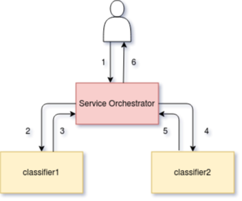

# Service Orchestrator

The service orchestrator is a component that is added to your inference graph,
as a sidecar container.
Its main responsibilities are:

- Correctly manage the request / response paths described by your inference graph.
- Expose Prometheus metrics.
- Provide Tracing via Open Tracing.
- Add CloudEvent-based payload logging.

From Seldon Core `>=1.1`, the service orchestrator allows you to specify the
protocol for the data plane of your inference graph.
At present, we support the following protocols:

| Protocol | `SeldonDeployment` Key | Reference | 
| --- | --- | --- | --- |
| Seldon | `seldon` | [OpenAPI spec for Seldon](https://docs.seldon.io/projects/seldon-core/en/latest/reference/apis/openapi.html) |
| Tensorflow | `tensorflow` | [REST API](https://www.tensorflow.org/tfx/serving/api_rest) and [gRPC API](https://github.com/tensorflow/serving/blob/master/tensorflow_serving/apis/prediction_service.proto) reference |
| KFServing | `kfserving` | [KFServing Dataplane reference](https://github.com/kubeflow/kfserving/tree/master/docs/predict-api/v2) |

These protocols are supported by some of our pre-packaged servers out of the
box.
You can check their
[documentation](https://docs.seldon.io/projects/seldon-core/en/latest/servers/overview.html)
for more details.

Additionally, you can see basic examples for all options in the [protocol
examples notebook](../examples/protocol_examples.html).

## Design

The service orchestrator's core concern is to manage the request/response flow of calls through the defined inference graph.
Given a graph shown below:

```YAML
apiVersion: machinelearning.seldon.io/v1
kind: SeldonDeployment
metadata:
  name: fixed
spec:
  name: fixed
  protocol: seldon
  transport: rest
  predictors:
  - componentSpecs:
    - spec:
        containers:
        - image: seldonio/fixed-model:0.1
          name: classifier1
        - image: seldonio/fixed-model:0.1
          name: classifier2
    graph:
      name: classifier1
      type: MODEL
      children:
      - name: classifier2
        type: MODEL
    name: default
    replicas: 1
```

The service orchestrator component is added to the graph and manages the request flow as shown below:



The initial request (1) reaches the service orchestrator which forwards it to the first model (2) and the response is captured by the service orchestrator (3) which then forwards to second model (4) before the response is again captured by service orchestrator (5) before being returned to caller (6).

For more complex inference graphs the service orchestrator will handle routing components which may decide which of a subset of child components to send the request or aggregation components to combine responses from multiple components.


## Resource Requests/Limits for Service Orchestrator

You can set custom resource request and limits for this component by specifying them in a `svcOrchSpec` section in your Seldon Deployment. An example is shown below to set the engine cpu and memory requests:

```JSON
{
  "apiVersion": "machinelearning.seldon.io/v1alpha2",
  "kind": "SeldonDeployment",
  "metadata": {
    "name": "svcorch"
  },
  "spec": {
    "name": "resources",
    "predictors": [
      {
        "componentSpecs": [
          {
            "spec": {
              "containers": [
                {
                  "image": "seldonio/mock_classifier:1.0",
                  "name": "classifier"
                }
              ]
            }
          }
        ],
        "graph": {
          "children": [],
          "name": "classifier",
          "type": "MODEL",
          "endpoint": {
            "type": "REST"
          }
        },
        "svcOrchSpec": {
          "resources": {
            "requests": {
               "cpu": "1",
               "memory": "3Gi"
            }
          }
        },
        "name": "release-name",
        "replicas": 1
      }
    ]
  }
}

```

## Bypass Service Orchestrator (version >= 0.5.0)

If you are deploying a single model then for those wishing to minimize the latency and resource usage for their deployed model you can opt out of having the service orchestrator included. To do this add the annotation `seldon.io/no-engine: "true"` to the predictor. The predictor must contain just a single node graph. An example is shown below:

```YAML
apiVersion: machinelearning.seldon.io/v1alpha2
kind: SeldonDeployment
metadata:
  labels:
    app: seldon
  name: noengine
spec:
  name: noeng
  predictors:
  - annotations:
      seldon.io/no-engine: "true"
    componentSpecs:
    - spec:
        containers:
        - image: seldonio/mock_classifier_rest:1.3
          name: classifier
    graph:
      children: []
      endpoint:
        type: REST
      name: classifier
      type: MODEL
    name: noeng
    replicas: 1
```

In these cases the external API requests will be sent directly to your model. At present only the python wrapper (>=0.13-SNAPSHOT) has been modified to allow this.

Note no metrics or extra data will be added to the request so this would need to be done by your model itself if needed.

## Routing in Metadata

The current default orchestrator in Go the "executor" does not return routing meta data in request calls. This is a [known issue](https://github.com/SeldonIO/seldon-core/issues/1823). 


## Java Engine [DEPRECATED]

.. Attention:: 
   The Java version of the service orchestrator has now been deprecated and
   will be completely removed in future versions of Seldon Core.
   We strongly suggest **migrating to the new version of the service
   orchestrator** (implemented in Go) before upgrading.
   Note that the new version of the service orchestator is enabled by default
   since Seldon Core `1.1`.

For further details on the Java engine see previous versions of this page in the docs.

