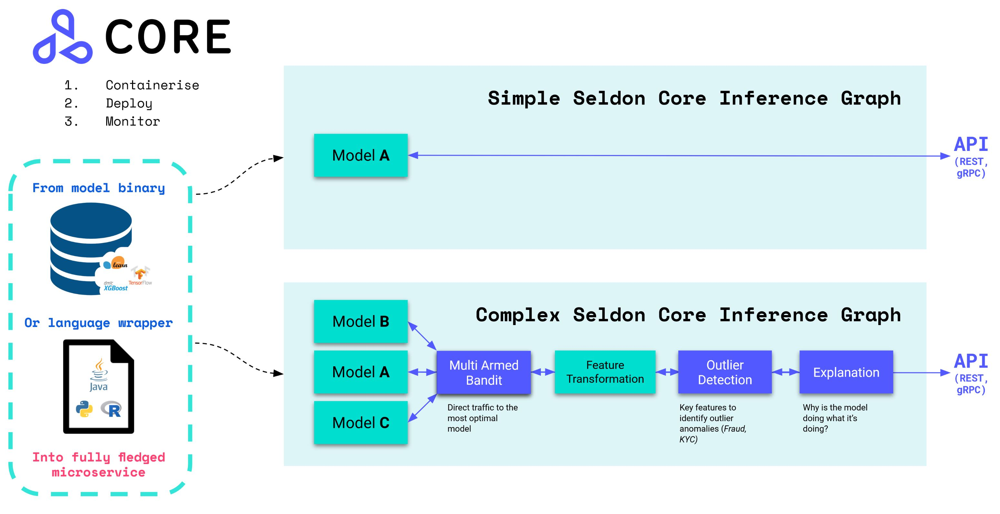

===========
Seldon Core
===========

.. These are hidden links, which are not linked anywhere but may still be
   exposed through an URL in readthedocs
.. TODO Filter through these to remove or ignore old ones
.. toctree::
   :hidden:

   R Wrapping Docker <R/r_wrapping_docker>
   Seldon OpenVINO <charts/seldon-openvino>
   Custom svc Name <graph/custom_svc_name>
   gRPC Load Balancing Ambassador <graph/grpc_load_balancing_ambassador>
   Model REST gRPC Settings <graph/model_rest_grpc_settings>
   Model svcOrch Sep <graph/model_svcorch_sep>
   APIs Reference <reference/apis/readme>
   Integration NVIDIA Link <reference/integration_nvidia_link>
   Integration Sagemaker Link <reference/integration_sagemaker_link>
   Quickstart <workflow/quickstart>
   S2I <wrappers/s2i>
   Ambassador Circuit Breakers <examples/ambassador_circuit_breakers>
   Istio <examples/istio>
   Custom Metrics <examples/custom_metrics>
   Drift CIFAR10 <examples/drift_cifar10>
   Pachyderm <examples/pachyderm-simple>
   DVC <examples/dvc>
   Custom Init Container <examples/custom_init_container>
   Graph Metadata <examples/graph-metadata>
   Metadata <examples/metadata>
   Metadata gRPC <examples/metadata_grpc>
   Metadata Schema <examples/metadata_schema>
   PVC TFJob <examples/pvc-tfjob>
   Seldon Client <examples/seldon_client>
   Server Examples <examples/server_examples>

An open source platform to deploy your machine learning models on Kubernetes at massive scale.

Overview
--------
Seldon core converts your ML models (Tensorflow, Pytorch, H2o, etc.) or language wrappers (Python, Java, etc.) into production REST/GRPC microservices.

Seldon handles scaling to thousands of production machine learning models and provides advanced machine learning capabilities out of the box including Advanced Metrics, Request Logging, Explainers, Outlier Detectors, A/B Tests, Canaries and more.

Quick Links
-----------

* Read the `Seldon Core Documentation <./>`_
* Join our `community Slack <https://join.slack.com/t/seldondev/shared_invite/zt-vejg6ttd-ksZiQs3O_HOtPQsen_labg>`_ to ask any questions
* Get started with `Seldon Core Notebook Examples <./examples/notebooks.html>`_
* Join our fortnightly `online community calls <./developer/community.html#community-calls>`_ : `Google Calendar <https://calendar.google.com/event?action=TEMPLATE&tmeid=MXBtNzI1cjk0dG9kczhsZTRkcWlmcm1kdjVfMjAyMDA3MDlUMTUwMDAwWiBzZWxkb24uaW9fbTRuMnZtcmZubDI3M3FsczVnYjlwNjVpMHNAZw&tmsrc=seldon.io_m4n2vmrfnl273qls5gb9p65i0s%40group.calendar.google.com&scp=ALL>`_
* Learn how you can `start contributing <./developer/contributing.html>`_
* Check out `Blogs <./tutorials/blogs.html>`_ that dive into Seldon Core components
* Watch some of the `Videos and Talks <./tutorials/videos.html>`_ using Seldon Core

Documentation Index
-------------------

.. toctree::
   :maxdepth: 1
   :caption: Getting Started

   Quickstart Guide <workflow/github-readme.rst>
   Overview of Components <workflow/overview.md>
   Install on Kubernetes <workflow/install.md>
   Join the Community <developer/community.md>

.. toctree::
   :maxdepth: 1
   :caption: Seldon Core Deep Dive

   Detailed Installation Parameters <reference/helm.rst>
   Pre-packaged Inference Servers <servers/overview.md>
   Language Wrappers for Custom Models <wrappers/language_wrappers.md>
   Create your Inference Graph <graph/inference-graph.md>
   Deploy your Model  <workflow/deploying.md>
   Testing your Model Endpoints  <workflow/serving.md>
   Python Module and Client <python/index.rst>
   Troubleshooting guide <workflow/troubleshooting.md>
   Usage reporting <workflow/usage-reporting.md>
   Upgrading <reference/upgrading.md>
   Changelog <reference/changelog.rst>

.. toctree::
   :maxdepth: 1
   :caption: Pre-Packaged Inference Servers

   Configuration <servers/index>
   MLflow Server <servers/mlflow.md>
   SKLearn Server <servers/sklearn.md>
   Triton Inference Server <servers/triton.md>
   Tempo Server <servers/tempo.md>   
   Tensorflow Serving <servers/tensorflow.md>
   XGBoost Server <servers/xgboost.md>

.. toctree::
   :maxdepth: 1
   :caption: Production

   AB Tests and Progressive Rollouts <rollouts/abtests.md>
   Supported API Protocols <graph/protocols.md>
   CI/CD MLOps at Scale <analytics/cicd-mlops.md>
   Metrics with Prometheus <analytics/analytics.md>
   Model Metadata <reference/apis/metadata.md>
   Prediction Request Logging <analytics/logging.md>
   Distributed Tracing with Jaeger <graph/distributed-tracing.md>
   Replica Scaling  <graph/scaling.md>
   Budgeting Disruptions <graph/disruption-budgets.md>
   Custom Inference Servers <servers/custom.md>
   Inference Optimization <production/optimization.md>

.. toctree::
   :maxdepth: 1
   :caption: Language Wrappers

   Python Language Wrapper <python/index.rst>

.. toctree::
   :maxdepth: 1
   :caption: Incubating Projects

   Java Language Wrapper <java/README.md>
   Java (JNI) Language Wrapper [ALPHA] <java-jni/README.md>
   C++ Language Wrapper [ALPHA] <cpp/README.md>
   R Language Wrapper [ALPHA] <R/README.md>
   NodeJS Language Wrapper [ALPHA] <nodejs/README.md>
   Go Language Wrapper [ALPHA] <go/go_wrapper_link.rst>

.. toctree::
   :maxdepth: 1
   :caption: Ingress

   Ambassador Ingress <ingress/ambassador.md>
   Istio Ingress <ingress/istio.md>
   OpenShift <ingress/openshift.md>

.. toctree::
   :maxdepth: 1
   :caption: Streaming and Batch Processing

   Overview of Batch Processing <servers/batch.md>
   Stream Processing with KNative <streaming/knative_eventing.md>
   Native Kafka Integration <streaming/kafka.md>

.. toctree::
   :maxdepth: 1
   :caption: Advanced Inference

   Model Explanations <analytics/explainers.md>
   Outlier Detection <analytics/outlier_detection.md>
   Drift Detection <analytics/drift_detection.md>
   Routers (incl. Multi Armed Bandits)  <analytics/routers.md>

.. toctree::
   :maxdepth: 1
   :caption: Examples

   Notebooks <examples/notebooks>
   Articles/Blogs <tutorials/blogs>
   Videos <tutorials/videos>
   Podcasts <tutorials/podcasts>
   Kubeflow Pipelines <https://github.com/kubeflow/pipelines/blob/master/samples/contrib/e2e-outlier-drift-explainer/seldon/README.md>

.. toctree::
   :maxdepth: 1
   :caption: Reference

   Annotation-based Configuration <graph/annotations.md>
   Benchmarking <reference/benchmarking.md>
   General Availability <reference/ga.md>
   Helm Charts <graph/helm_charts.md>
   Images <reference/images.md>
   Logging & Log Level <analytics/log_level.md>
   Private Docker Registry <graph/private_registries.md>
   Prediction APIs <reference/apis/index>
   Python API reference <python/api/modules>
   Release Highlights <reference/release-highlights>
   Seldon Deployment CRD <reference/seldon-deployment.md>
   Service Orchestrator <graph/svcorch.md>
   Kubeflow <analytics/kubeflow.md>
   Concepts <reference/concepts.md>

.. toctree::
   :maxdepth: 1
   :caption: Developer

   Overview <developer/readme.md>
   Contributing to Seldon Core <developer/contributing.rst>
   End to End Tests <developer/e2e.rst>
   Roadmap <developer/roadmap.md>
   Build using private repo <developer/build-using-private-repo.md>
