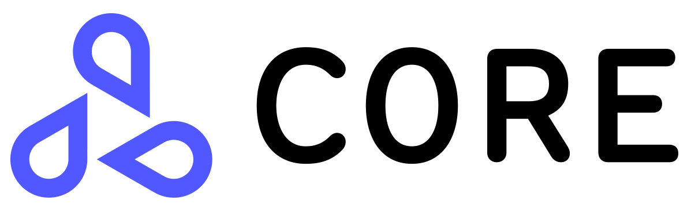

===========
Seldon Core
===========

.. important::
   `Seldon Core V2 <https://docs.seldon.io/projects/seldon-core/en/v2/index.html>`_ **is now available**. If you're new to Seldon Core we recommend you `start here <https://docs.seldon.io/projects/seldon-core/en/v2/contents/getting-started/index.html>`_. Check out the `full docs here <https://docs.seldon.io/projects/seldon-core/en/v2/index.html>`_ and make sure to leave feedback on `our slack community <https://join.slack.com/t/seldondev/shared_invite/zt-vejg6ttd-ksZiQs3O_HOtPQsen_labg>`_ and `submit bugs or feature requests on the repo <https://github.com/SeldonIO/seldon-core/issues/new/choose>`_.

.. These are hidden links, which are not linked anywhere but may still be
   exposed through an URL in readthedocs
.. TODO Filter through these to remove or ignore old ones

A platform to deploy your machine learning models on Kubernetes at massive scale.

Overview
--------
Seldon core converts your ML models (Tensorflow, Pytorch, H2o, etc.) or language wrappers (Python, Java, etc.) into production REST/GRPC microservices.

Seldon handles scaling to thousands of production machine learning models and provides advanced machine learning capabilities out of the box including Advanced Metrics, Request Logging, Explainers, Outlier Detectors, A/B Tests, Canaries and more.

.. youtube:: 5Q-03We8aDE
   :width: 100%

   
Quick Links
-----------

* Join our `community Slack <https://join.slack.com/t/seldondev/shared_invite/zt-vejg6ttd-ksZiQs3O_HOtPQsen_labg>`_ to ask any questions
* Get started with `Seldon Core Notebook Examples <./examples/notebooks.html>`_
* Join our fortnightly `online community calls <./developer/community.html#community-calls>`_ (`Google Calendar <https://calendar.google.com/event?action=TEMPLATE&tmeid=MmpzaWliOTQxdjEzbmduMTkyaHF0MnBpcGZfMjAyMTExMDRUMTYwMDAwWiBzZWxkb24uaW9fbTRuMnZtcmZubDI3M3FsczVnYjlwNjVpMHNAZw&tmsrc=seldon.io_m4n2vmrfnl273qls5gb9p65i0s%40group.calendar.google.com&scp=ALL>`_ , `iCal <https://calendar.google.com/calendar/ical/seldon.io_m4n2vmrfnl273qls5gb9p65i0s%40group.calendar.google.com/public/basic.ics>`_)
* Learn how you can `start contributing <./developer/contributing.html>`_
* Check out `Blogs <./tutorials/blogs.html>`_ that dive into Seldon Core components
* Watch some of the `Videos and Talks <./tutorials/videos.html>`_ using Seldon Core

.. toctree::
   :hidden:
   
   Getting Started </nav/getting-started.rst>
   Concepts </nav/concepts.rst>
   Configuration </nav/configuration.rst>
   Tutorials </nav/tutorials.rst>
   Reference <nav/reference.rst>
   Contributing </nav/contributing.rst>
