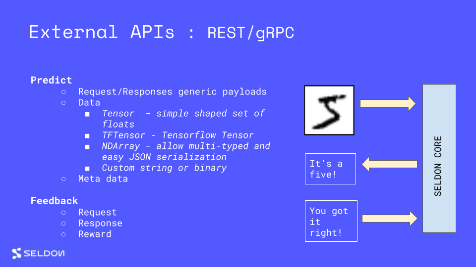

# External Prediction API



The Seldon Core exposes a generic external API to connect your ML runtime prediction to external business applications.

## REST API

### Prediction

 - endpoint : POST /api/v1.0/predictions
 - payload : JSON representation of `SeldonMessage` - see [proto definition](./prediction.md#proto-buffer-and-grpc-definition)
 - example payload :

   ```json
   {"data":{"names":["a","b"],"tensor":{"shape":[2,2],"values":[0,0,1,1]}}}
   ```

### Feedback

 - endpoint : POST /api/v1.0/feedback
 - payload : JSON representation of `Feedback` - see [proto definition](./prediction.md#proto-buffer-and-grpc-definition)

### Metadata - Graph Level

- endpoint : GET /api/v1.0/metadata
- example response :

```json
{
  "name": "example",
  "models": {
    "model-1": {
      "name": "Model 1",
      "platform": "platform-name",
      "versions": ["model-version"],
      "inputs": [{"datatype": "BYTES", "name": "input", "shape": [1, 5]}],
      "outputs": [{"datatype": "BYTES", "name": "output", "shape": [1, 3]}]
    },
    "model-2": {
      "name": "Model 2",
      "platform": "platform-name",
      "versions": ["model-version"],
      "inputs": [{"datatype": "BYTES", "name": "input", "shape": [1, 3]}],
      "outputs": [{"datatype": "BYTES", "name": "output", "shape": [3]}]
    }
  },
  "graphinputs": [{"datatype": "BYTES", "name": "input", "shape": [1, 5]}],
  "graphoutputs": [{"datatype": "BYTES", "name": "output", "shape": [3]}]
}
```

see metadata [documentation](./metadata.md) for more details.


### Metadata - Model Level

- endpoint : GET /api/v1.0/metadata/{MODEL_NAME}
- example response:

```json
{
  "name": "Model 1",
  "versions": ["model-version"],
  "platform": "platform-name",
  "inputs": [{"datatype": "BYTES", "name": "input", "shape": [1, 5]}],
  "outputs": [{"datatype": "BYTES", "name": "output", "shape": [1, 3]}],
}
```

see metadata [documentation](./metadata.md) for more details.


## gRPC

```protobuf
service Seldon {
  rpc Predict(SeldonMessage) returns (SeldonMessage) {};
  rpc SendFeedback(Feedback) returns (SeldonMessage) {};
  rpc ModelMetadata(SeldonModelMetadataRequest) returns (SeldonModelMetadata) {};
  rpc GraphMetadata(google.protobuf.Empty) returns (SeldonGraphMetadata) {};
}
```

see full [proto definition](./prediction.md#proto-buffer-and-grpc-definition)
