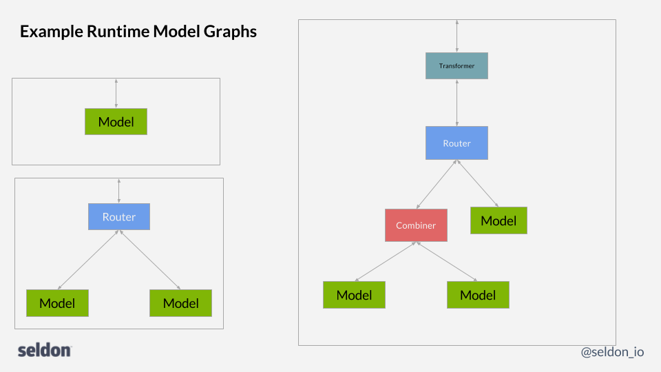

# Internal Microservice API



To add microservice components to a runtime prediction graph users need to create service that respects the internal API. The API provides a default service for each type of component within the system:

 * [Model](#model)
 * [Router](#router)
 * [Combiner](#combiner)
 * [Transformer](#transformer)
 * [Output_Transformer](#output_transformer)

See full [proto definition](./prediction.md#proto-buffer-and-grpc-definition).

## Model

A service to return predictions.

### REST API

 | | |
 | - |- |
 | Endpoint | POST /predict |
 | Request | JSON representation of SeldonMessage
 | Response | JSON representation of SeldonMessage

Example request payload:

```json
{"data":{"names":["a","b"],"tensor":{"shape":[2,2],"values":[0,0,1,1]}}}
```

Example response payload


### gRPC

```protobuf
service Model {
  rpc Predict(SeldonMessage) returns (SeldonMessage) {};
 }
```

## Route

A service to route requests to one of its children and receive feedback rewards for them.

### REST API


 | | |
 | - |- |
 | Endpoint | POST /route |
 | Request | JSON representation of SeldonMessage
 | Response | JSON representation of SeldonMessage

Example request payload:

```json
{"data":{"names":["a","b"],"tensor":{"shape":[2,2],"values":[0,0,1,1]}}}
```

Exxample response payload:

```json
{"data":{"ndarray":[1]}}
```

### gRPC

```protobuf
service Router {
  rpc Route(SeldonMessage) returns (SeldonMessage) {};
 }
```


## Send Feedback

 | | |
 | - |- |
 | Endpoint | POST /send-feedback |
 | Request | JSON representation of Feedback
 | Response | JSON representation of SeldonMessage

Example request payload:

```json
{
    "request": {
        "data": {
            "names": ["a", "b"],
            "tensor": {
                "shape": [1, 2],
                "values": [0, 1]
            }
        }
    },
    "response": {
        "data": {
            "names": ["a", "b"],
            "tensor": {
                "shape": [1, 1],
                "values": [0.9]
            }
        }
    },
    "reward": 1.0
}
```


### gRPC

```protobuf
service Router {
  rpc SendFeedback(Feedback) returns (SeldonMessage) {};
 }
```

## Combiner

A service to combine responses from its children into a single response.

### REST API


 | | |
 | - |- |
 | Endpoint | POST /combine |
 | Request | JSON representation of SeldonMessageList
 | Response | JSON representation of SeldonMessage


### gRPC

```protobuf
service Combiner {
  rpc Aggregate(SeldonMessageList) returns (SeldonMessage) {};
}
```


## Transformer

A service to transform its input.

### REST API


 | | |
 | - |- |
 | Endpoint | POST /transform-input |
 | Request | JSON representation of SeldonMessage
 | Response | JSON representation of SeldonMessage

Example request payload:

```json
{"data":{"names":["a","b"],"tensor":{"shape":[2,2],"values":[0,0,1,1]}}}
```

### gRPC

```protobuf
service Transformer {
  rpc TransformInput(SeldonMessage) returns (SeldonMessage) {};
}
```


## Output_Transformer

A service to transform the response from its child.

### REST API

 | | |
 | - |- |
 | Endpoint | POST /transform-output |
 | Request | JSON representation of SeldonMessage
 | Response | JSON representation of SeldonMessage

Example request payload:

```json
{"data":{"names":["a","b"],"tensor":{"shape":[2,2],"values":[0,0,1,1]}}}
```

### gRPC

```protobuf
service OutputTransformer {
  rpc TransformOutput(SeldonMessage) returns (SeldonMessage) {};
}
```

