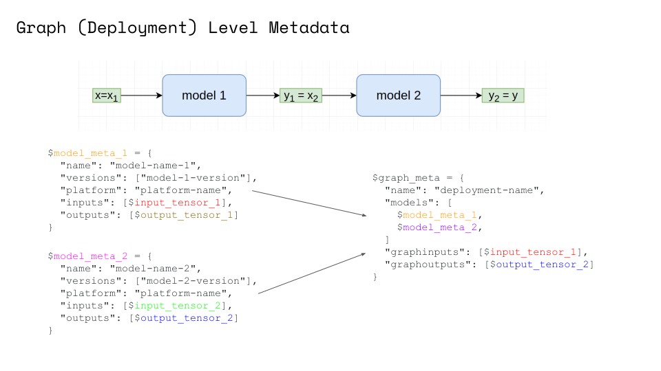

# Model and Deployment Metadata


## Examples

### Basic Examples
- [Simple Metadata Example](../../examples/metadata.html)
- [Complex Graphs Metadata Example](../../examples/graph-metadata.html)
- [Metadata GRPC API example](../../examples/metadata_grpc.html)
- [Metadata Schema and Validation](../../examples/metadata_schema.html)

### Metadata integrations with Frameworks

- [SKLearn Server example with MinIO](../../examples/minio-sklearn.html)
- [Deploying models trained with Pachyderm](../../examples/pachyderm-simple.html)
- [Deploying models trained with DVC](../../examples/dvc.html)


## Model Metadata

With Seldon you can easily add metadata to your models.

### Prepackaged model servers

To add metadata to your prepackaged model servers simply add a file named `metadata.yaml`
to the S3 bucket with your model:
```YAML
name: my-model
versions: [my-model/v1]
platform: platform-name
inputs:
- messagetype: tensor
  schema:
    names: [a, b, c, d]
    shape: [4]
outputs:
- messagetype: tensor
  schema:
    shape: [ 1 ]
custom:
  author: seldon-dev
  extra: information
```

See [SKLearn Server example with MinIO](../../examples/minio-sklearn.html) for more details.

### Python Language Wrapper

You can add model metadata you your custom Python model by implementing `init_metadata` method:

```python
class Model:
    ...
    def init_metadata(self):
        meta = {
            "name": "my-model-name",
            "versions": ["my-model-version-01"],
            "platform": "seldon",
            "inputs": [
                {
                    "messagetype": "tensor",
                    "schema": {"names": ["a", "b", "c", "d"], "shape": [4]},
                }
            ],
            "outputs": [{"messagetype": "tensor", "schema": {"shape": [1]}}],
            "custom": {"author": "seldon-dev", "extra": "information"},
        }
        return meta
```

See [Python wrapper](../../python/python_component.html#incubating-features) documentation for more details and
notebook [Basic Examples for Model with Metadata](../../examples/metadata.html).

### Overwrite via environmental variable

You can also always specify `MODEL_METADATA` environmental variable which takes ultimate priority.

```YAML
apiVersion: machinelearning.seldon.io/v1
kind: SeldonDeployment
metadata:
  name: seldon-model
spec:
  name: test-deployment
  predictors:
  - componentSpecs:
    - spec:
        containers:
        - name: my-model
          image: ...
          env:
          - name: MODEL_METADATA
            value: |
              ---
              name: my-model-name
              versions: [ my-model-version ]
              platform: seldon
              inputs:
              - messagetype: tensor
                schema:
                  names: [a, b, c, d]
                  shape: [4]
              outputs:
              - messagetype: tensor
                schema:
                  shape: [ 1 ]
              custom:
                author: seldon-dev
                extra: information
    graph:
      name: my-model
      ...
    name: example
    replicas: 1
```


## Deployment Metadata
Model metadata allow you to specify metadata for each of the components (nodes) in your graph.
New orchestrator engine will probe all nodes for their metadata and derive global `inputs` and `outputs` of your graph.
It will then expose them together with all nodes' metadata at a single endpoint `/api/v1.0/metadata/` of your deployment.



Example response:
```json
{
    "name": "example",
    "models": {
        "node-one": {
            "name": "node-one",
            "platform": "seldon",
            "versions": ["generic-node/v0.3"],
            "inputs": [
                {"messagetype": "tensor", "schema": {"names": ["one-input"]}}
            ],
            "outputs": [
                {"messagetype": "tensor", "schema": {"names": ["one-output"]}}
            ],
            "custom": {"author": "seldon-dev", "extra": "information"}
        },
        "node-two": {
            "name": "node-two",
            "platform": "seldon",
            "versions": ["generic-node/v0.3"],
            "inputs": [
                {"messagetype": "tensor", "schema": {"names": ["two-input"]}}
            ],
            "outputs": [
                {"messagetype": "tensor", "schema": {"names": ["two-output"]}}
            ],
            "custom": {"author": "seldon-dev", "extra": "information"}
        }
    },
    "graphinputs": [
        {"messagetype": "tensor", "schema": {"names": ["one-input"]}}
    ],
    "graphoutputs": [
        {"messagetype": "tensor", "schema": {"names": ["two-output"]}}
    ]
}
```

See example [notebook](../../examples/graph-metadata.html) for more details.


## Metadata endpoint

Model metadata can be obtained through GET request at `/api/v1.0/metadata/{MODEL_NAME}` endpoint of your deployment.

Example response:
```json
{
  "name": "my-model",
  "versions": ["my-model/v1"],
  "platform": "platform-name",
  "inputs": [{"messagetype": "tensor", "schema": {"shape": [1, 5]}}],
  "outputs": [{"messagetype": "tensor", "schema": {"shape": [1, 3]}}],
  "custom": {"author": "seldon-dev", "extra": "information"}
}
```


## Deep dive: SeldonMessage and kfserving V2 metadata reference

You can define inputs/outputs of your model metadata using one of two formats:
- `v1` format that closely correlates to the current structure of `SeldonMessage`
- `v2` format that is future-proof and fully compatible with [kfserving dataplane proposal](https://github.com/kubeflow/kfserving/blob/master/docs/predict-api/v2/required_api.md#model-metadata).

Though most fields that you can specify on model metadata follows [kfserving dataplane proposal](https://github.com/kubeflow/kfserving/blob/master/docs/predict-api/v2/required_api.md#model-metadata) you can also specify extra one called `custom` that allows you define any custom metadata you may find useful. The `custom` field is meant to hold dict-like structure with both keys and values being `string`.

See also: [Metadata Schema and Validation](../../examples/metadata_schema.html) notebook.

### SeldonMessage metadata

#### ndarray input/output
```YAML
name: my-model-name
versions: [ my-model-version-01 ]
platform: seldon
inputs:
- messagetype: ndarray
  schema:
    names: [a, b]
    shape: [ 2, 2 ]
outputs:
- messagetype: ndarray
  schema:
    shape: [ 1 ]
custom:
  author: seldon-dev
  extra: information
```

This metadata would mean that following two input is valid for this model:
```JSON
{"data": {"names": ["a", "b"], "ndarray": [[1, 2], [3, 4]]}}
```

Note: similar format is valid for messagetype of `tensor` and `tftensor`.

#### jsonData input/output
```YAML
name: my-model-name
versions: [ my-model-version-01 ]
platform: seldon
inputs:
- messagetype: jsonData
  schema:
      type: object
      properties:
          my-names:
              type: array
              items:
                  type: string
          my-data:
            type: array
            items:
                type: number
                format: double
outputs:
- messagetype: ndarray
  schema:
    shape: [ 1 ]
custom:
  author: seldon-dev
  extra: information
```

Example model input:
```JSON
{"jsonData": {"my-names": ["a", "b", "c"], "my-data": [1.0, 4.2, 3.14]}}
```

The `schema` field is optional and can leaves user total freedom over its structure.

Note: as you can see you can mix inputs and outputs of different types!

#### strData input/output
```YAML
name: my-model-name
versions: [ my-model-version-01 ]
platform: seldon
inputs:
- messagetype: strData
outputs:
- messagetype: strData
custom:
  author: seldon-dev
  extra: information
```

Example model input:
```JSON
{"strData": "some test input"}
```

#### custom input/output format

You can also specify your custom `messagetype`. In this case there are no restrictions
on keys that you define under the `schema` field. This may be useful for `raw` methods.

```YAML
name: my-model-name
versions: [ my-model-version-01 ]
platform: seldon
inputs:
- messagetype: customData
  schema:
    my-names: ["a", "b", "c"]
outputs:
- messagetype: tensor
  schema:
    shape: [ 1 ]
custom:
  author: seldon-dev
  extra: information
```


### V2 TensorMetadata

You can easily define metadata for your models that is compatible with [kfserving V2 dataplane proposal](https://github.com/kubeflow/kfserving/blob/master/docs/predict-api/v2/required_api.md#model-metadata) specification.
```javascript
$metadata_model_response =
{
  "name" : $string,
  "versions" : [ $string, ... ], // optional
  "platform" : $string,
  "inputs" : [ $metadata_tensor, ... ],
  "outputs" : [ $metadata_tensor, ... ]
}
```
with
```javascript
$metadata_tensor =
{
  "name" : $string,
  "datatype" : $string,
  "shape" : [ $number, ... ]
}
```

Example definition
```YAML
name: my-model-name
versions: [ my-model-version-01 ]
platform: seldon
inputs:
- datatype: BYTES
  name: input
  shape: [ 1, 4 ]
outputs:
- datatype: BYTES
  name: output
  shape: [ 3 ]
```
