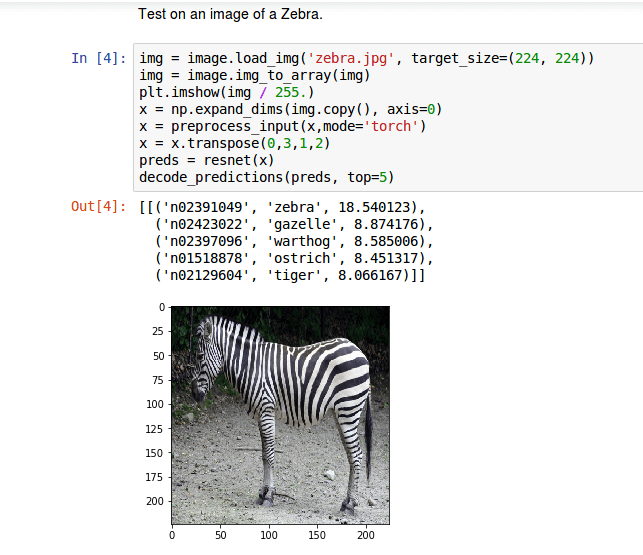

# Seldon Core Release 0.2.3

[Seldon Core version 0.2.3](https://github.com/SeldonIO/seldon-core/releases/tag/v0.2.3) has several exciting additions to help users deploy machine learning models. The main additions are discussed below:

## ONNX Support via Intel nGraph

[Open Neural Network Exchange Format (ONNX)](https://onnx.ai/) is an initiative started by Facebook and Microsoft to allow machine learning estimators to output their trained models in an open format which will allow sharing of models between machine learning tools and organisations. We have integrated [Intel's nGraph](https://ai.intel.com/intel-ngraph/) inference engine inside a Seldon S2I wrapper to allow users who have exported their models in the ONNX format to easily include them in a Seldon Core inference graph. Our [python S2I wrappers](https://github.com/SeldonIO/seldon-core/blob/master/docs/wrappers/python.md) allow users to take their ONNX models and wrap them as a Docker container to be managed by Seldon Core. We have provided an [end-to-end example Jupyter notebook](https://github.com/SeldonIO/seldon-core/blob/master/examples/models/onnx_resnet50/onnx_resnet50.ipynb) showing an ONNX ResNet image classification model being run inside Seldon Core.



## Annotation based configuration

You can now configure aspects of Seldon Core via annotations in the SeldonDeployment resource and also the optional API OAuth Gateway. The current release allow configuration of REST and gRPC timeouts and also max message sizes for gRPC.

An example Seldon Deployment YAML resource with a gRPC max message size annotation is shown below.

```yaml
apiVersion: machinelearning.seldon.io/v1alpha2
kind: SeldonDeployment
metadata:
  name: seldon-model
spec:
  annotations:
    seldon.io/grpc-max-message-size: '10000000'
  name: test-deployment
  predictors:
  - componentSpecs:
    - spec:
        containers:
        - image: seldonio/mock_classifier_grpc:1.0
          name: classifier
    graph:
      children: []
      endpoint:
        type: GRPC
      name: classifier
      type: MODEL
    name: grpc-size
    replicas: 1

```

## Initial NodeJS Wrapper Support

We have an external contribution by @SachinVarghese that provides an initial Seldon Core wrapper for NodeJS allowing you to take advantage of the emerging machine learning tools within the Javascript ecosystem. Thanks Sachin!

An example notebook for an [MNIST Tensorflow model](https://github.com/SeldonIO/seldon-core/blob/master/examples/models/nodejs_tensorflow/nodejs_tensorflow.ipynb) is provided which has the following Javascript inference code:

```js
const tf = require("@tensorflow/tfjs");
require("@tensorflow/tfjs-node");
const path = require("path");
const model_path = "/model.json";

class MnistClassifier {
  async init() {
    this.model = await tf.loadModel(
      "file://" + path.join(__dirname, model_path)
    );
    const optimizer = "rmsprop";
    this.model.compile({
      optimizer: optimizer,
      loss: "categoricalCrossentropy",
      metrics: ["accuracy"]
    });
  }

  predict(X, feature_names) {
    console.log("Predicting ...");
    try {
      X = tf.tensor(X);
    } catch (msg) {
      console.log("Predict input may be a Tensor already");
    }
    const result = this.model.predict(X);
    let obj = result.dataSync();
    let values = Object.keys(obj).map(key => obj[key]);
    var newValues = [];
    while (values.length) newValues.push(values.splice(0, 10));
    return newValues;
  }
}

module.exports = MnistClassifier;
```

## Stability updates

There have also been a few stability updates that should provide improvements for those moving towards production with Seldon Core:

 * [Lifecycle status updates](https://github.com/SeldonIO/seldon-core/pull/223)
    * The ```Status``` field of the SeldonDeployment is now updated as it transitions from CREATING, to AVAILABLE or FAILED. When FAILED there will be a more descriptive error message in the ```Status``` section.
 * Isolation of predictors on SeldonDeployment updates
    * A [bug fix](https://github.com/SeldonIO/seldon-core/issues/199) ensures that when you update one predictor in a Seldon Deployment any others are not affected by the change. This is important for cases where you want to do canary and other advanced roll out techniques.


For the full release details see [here](https://github.com/SeldonIO/seldon-core/releases/tag/v0.2.3). We welcome feedback and suggestions on your machine learning deployment needs on our [Slack channel](https://join.slack.com/t/seldondev/shared_invite/enQtMzA2Mzk1Mzg0NjczLTJlNjQ1NTE5Y2MzMWIwMGUzYjNmZGFjZjUxODU5Y2EyMDY0M2U3ZmRiYTBkOTRjMzZhZjA4NjJkNDkxZTA2YmU).
