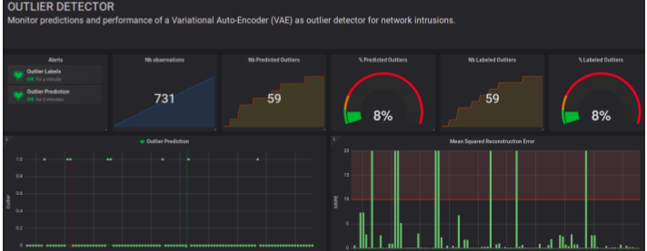
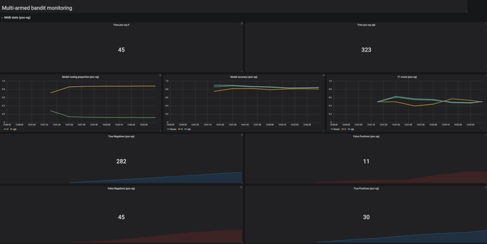
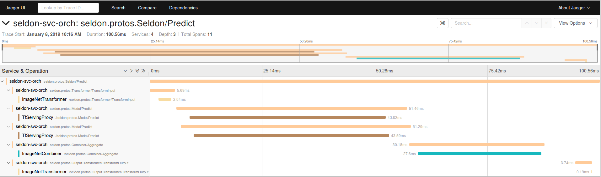

# Seldon Core Release 0.2.5

A summary of the main contributions to the [Seldon Core release 0.2.5](https://github.com/SeldonIO/seldon-core/releases/tag/v0.2.5).

## PyPI Python Module

When packaging components to run under Seldon Core we provide easy integration via [S2I](https://github.com/openshift/source-to-image) builder images. The core functionality for our Python S2I image has now been packaged as a Python module which can be easily installed via pip with:

```bash
pip install seldon-core
```

The module contains:

 * The top level REST and gRPC wrapper code which can be tested with your component via the executable `seldon-core-microservice`.
 * An internal tester for the Seldon microservice REST and gRPC API accessible via the executable `seldon-core-tester`. See the [Microservice Tester documentation](https://github.com/SeldonIO/seldon-core/blob/master/docs/api-testing.md#microservice-api-tester) for further information.
 * An external tester for the external Seldon REST and gRPC API  accessible via the executable `seldon-core-api-tester`. See the [API Tester documentation](https://github.com/SeldonIO/seldon-core/blob/master/docs/api-testing.md#seldon-core-api-tester) for further information.

## Inference Graph Components
One of the aims of Seldon Core is to allow machine learning models to be deployed in production with the appropriate metrics and optimisation to give the required compliance and observability guarantees needed. We have recently extended Seldon Core with Outlier Detection and Multi-Armed Bandit components as discussed below.

### Outlier Detection
The ability to identify unexpected input feature payloads to a machine learning model is an important feature for production deployments. As part of this release we have added outlier detection modules as a plug-and-play component in Seldon Core. The training and deployment of the implemented deep learning and tree based algorithms ([Variational Auto-Encoders](https://github.com/SeldonIO/seldon-core/tree/master/components/outlier-detection/vae) and [Isolation Forests](https://github.com/SeldonIO/seldon-core/tree/master/components/outlier-detection/isolation-forest)) are illustrated by detecting computer network intrusions in real time.



### Multi-Armed Bandits

The problem of deciding how to route requests to competing machine learning model so that one determines which model is the best in the shortest amount of time can be treated as a [Multi-Armed Bandit Problem](https://en.wikipedia.org/wiki/Multi-armed_bandit). Seldon Core has extended the available components you can use with [Thompson Sampling](https://github.com/SeldonIO/seldon-core/tree/master/components/routers/thompson-sampling) and a [case study](https://github.com/SeldonIO/seldon-core/blob/master/components/routers/case_study/credit_card_default.ipynb) comparing it to the more basic [Epsilon Greedy](https://github.com/SeldonIO/seldon-core/tree/master/components/routers/epsilon-greedy) strategy.



## Cluster Wide Operations
Seldon Core can now be installed in two ways:

 * Single-Namespace (default) : Manages and controls only Seldon Deployments created in that namespace. This only requires RBAC roles local to that namespace.
 * Cluster-wide : Manages and controls Seldon Deployments in any namespace. This requires RBAC Cluster Roles.

Cluster-wide operations have the advantage that only a single Seldon Core Operator needs to be installed and thus saves resources. This could be set up by the Kubernetes cluster manager. Single Namespace operations are best for multi-tenant use cases where you want to ensure everything is local to one namespace. See the [Install Docs](https://github.com/SeldonIO/seldon-core/blob/master/docs/install.md).

## Extended API Payloads

We have extended the Seldon Core API payload to include Tensorflow's [TensorProto](https://github.com/SeldonIO/seldon-core/blob/4149c6aeb11be518ec8589fd91599242c907e681/proto/prediction.proto#L29). This will allow utilisation of the fine grained type information available to most compactly send tensor based payloads as well as allow the use of [Tensorflow's library](https://www.tensorflow.org/api_docs/python/tf/make_tensor_proto) to construct the payload needed.

We have ensured its now possible to use the `binData` and `strData` payload types to send arbitrary binary or string payloads via the Python wrapper. The python wrappers also allow more easy access to the low level payloads by allowing users to provide a `predict_rest` or `predict_grpc` methods to gain access directly to the underlying `SeldonMessage`.

## Custom Metrics

The Seldon Core Service Orchestrator component that manages the request/response flow through a user's deployment graph already exposes Prometheus metrics for each of the API calls to the underling components in the graph (e.g. Models, Transformers etc). However, users can now pass back their own custom metrics in the returned `SeldonMessage` response from their components. Presently available are Counters, Gauges and Timers. Full documentation can be found [here](https://github.com/SeldonIO/seldon-core/blob/master/docs/custom_metrics.md).

## Distributed Tracing
We have integrated distributed tracing via [Jaeger](https://www.jaegertracing.io/) into the Service Orchestrator and Python wrappers. This will allow you to get tracing information as shown below for REST and gRPC requests through your Seldon Deployment. For more details see the [full documentation](../distributed-tracing.md).


