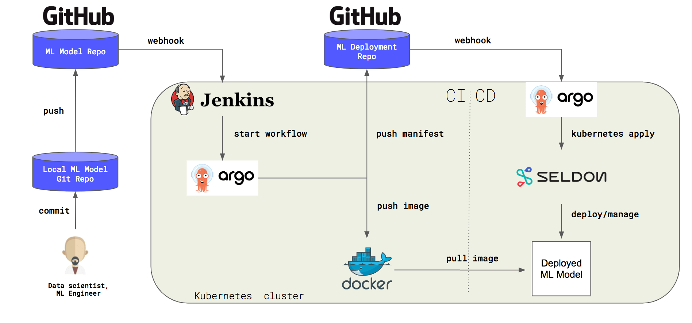

# Seldon Core Release 0.2.6

A summary of the main contributions to the [Seldon Core release 0.2.6](https://github.com/SeldonIO/seldon-core/releases/tag/v0.2.6).

## Production Deployment Strategies
Its is important to have a variety of options when deploying new versions of machine learning models to production. With the 0.2.6 release of Seldon Core we provide a range of deployment strategies that can be applied when using the Ambassador reverse proxy for ingress. These include:

  * [Canary deployments](https://github.com/SeldonIO/seldon-core/blob/master/docs/ambassador.md#canary-deployments): Send a small percentage of traffic to the new Seldon Deployment graph while keeping most traffic going to the existing Seldon Deployment graph.
  * [Shadow deployments](https://github.com/SeldonIO/seldon-core/blob/master/docs/ambassador.md#shadow-deployments): Split traffic so all traffic goes to the existing Seldon Deployment as well as a "shadow" deployment whose responses are ignored. This allows for full production traffic loads to be tested on the new Seldon Deployment graph.
  * [Header based routing](https://github.com/SeldonIO/seldon-core/blob/master/docs/ambassador.md#header-based-routing): This allows traffic with certain headers to be routed to a new Seldon Deployment. It can be used both for deployment strategies as well as for production use cases where you want to split traffic based on header content.

We also allow advanced users to provide a complete custom Ambassador config to be used rather than allow Seldon to generate it.

## Intel OpenVINO ImageNet Example
An advanced machine learning deployment for image classification is provided that highlights the power of Intel OpenVINO optimised models used in conjunction with Seldon. An ImageNet ensemble is created with two model architectures, ResNet and DenseNet. The results of the two predictions are combined and the output is transformed into a human readable format. On the input request stream the raw input is compressed JPEG which is then decompressed and converted to a TFTensor proto payload.  The pipeline of the Seldon deployment is illustrated below.

The inference graph shows the ability to combine multiple transformation steps and model serving toolkits together in a single Seldon Deployment. See the [OpenVINO Jupyter Notebook](https://github.com/SeldonIO/seldon-core/blob/master/examples/models/openvino_imagenet_ensemble/openvino_imagenet_ensemble.ipynb) for further details.

## AWS SageMaker Integration
An example is provided in this release for using [AWS SageMaker](https://aws.amazon.com/sagemaker/) to train a model which is then deployed locally on a Kubernetes cluster with Seldon Core. This example illustrates the flexibility to use various tools to train models when and then deploy all of them in a consistent manner on Kubernetes with Seldon.

## MlFlow Integration

We provide an [example MLFlow Jupyter Notebook](https://github.com/SeldonIO/seldon-core/blob/master/examples/models/mlflow_model/mlflow.ipynb) that shows how you can train a model with [MLFlow](https://mlflow.org/) and then deploy it onto Seldon Core.

## CI/CD Integration

Seldon Core aims to easily fit into the Continuous Integration and Deployment (CI/CD) pipeline of your organisation. In this release we provide an example CI/CD pipeline following the "GitOps" paradigm. Using standard tools such as [Argo](https://github.com/argoproj/argo), [Argo CD](https://github.com/argoproj/argo-cd), and [Jenkins](https://jenkins.io/) we show how changes by data scientists on new inference source code can easily trigger builds to create new images and push the resulting updated Seldon Deployment graphs into production to serve the new models. The pipeline schematic is show below.

The full demo with instructions on how to apply it can be found [here](https://github.com/SeldonIO/seldon-core/tree/master/examples/cicd-argocd).

