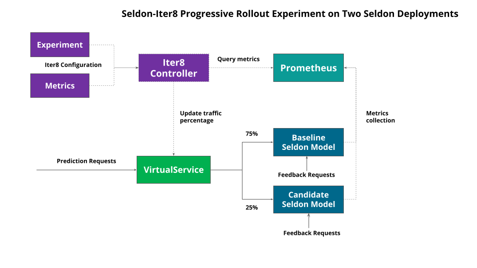

# AB Testing and Progressive Rollouts

## Simple AB Tests

Seldon Core provides the ability to easily create AB Tests and Shadows using Istio and Ambassador to split traffic as required.

 * [Istio AB Test/Canary Example](../examples/istio_canary.html)
 * [Ambassador AB Tests/Canary Example](../examples/ambassador_canary.html)

Metrics can be evaluated in prometheus for the different predictors in the AB Test using the [Seldon Analytics dashboard](../analytics/analytics.html).


## Advanced AB Test Experiments and Progressive Rollouts

For more advanced use cases we recommend our integration with [Iter8](https://iter8.tools) to provide clear experimentation utilizing clear objectives and rewards for candidate model selection. Iter8 also provides progressive rollout capabilities to automatically allow testing of candidate models and promoting them to the production model if they perform better than the incumbant model.

In Seldon we provide two current examples on how to run Iter8 experiments.

 1. Seldon/Iter8 Experiment over single Seldon Deployment.
 1. Seldon/Iter8 experiment over separate Seldon Deployments.


## Seldon - Iter8 Experiment over single Seldon Deployment

The first option is to create an AB Test for the candidate model with an updated Seldon Deployment and run an Iter8 experiment to progressively rollout the candidate based on a set of metrics. The architecture is show below:


We begin by updating our default model to start an AB test as shown below:

```yaml
apiVersion: v1
kind: Namespace
metadata:
    name: ns-production
---
apiVersion: machinelearning.seldon.io/v1
kind: SeldonDeployment
metadata:
  name: iris
  namespace: ns-production
spec:
  predictors:
  - name: baseline
    traffic: 100    
    graph:
      name: classifier
      modelUri: gs://seldon-models/v1.13.0-dev/sklearn/iris
      implementation: SKLEARN_SERVER
  - name: candidate
    traffic: 0
    graph:
      name: classifier
      modelUri: gs://seldon-models/xgboost/iris
      implementation: XGBOOST_SERVER

```

Here we have the incumbant SKLearn model and a candidate XGBoost model to replace it, presently with 0 traffic.

Next, we tell Iter8 the metrics it can use with an Iter8 Metrics custom resource.

```yaml
apiVersion: v1
kind: Namespace
metadata:
  name: iter8-seldon
---
apiVersion: iter8.tools/v2alpha2
kind: Metric
metadata:
  name: 95th-percentile-tail-latency
  namespace: iter8-seldon
spec:
  description: 95th percentile tail latency
  jqExpression: .data.result[0].value[1] | tonumber
  params:
  - name: query
    value: |
      histogram_quantile(0.95, sum(rate(seldon_api_executor_client_requests_seconds_bucket{seldon_deployment_id='$sid',predictor_name='$predictor',kubernetes_namespace='$ns'}[${elapsedTime}s])) by (le))
  provider: prometheus
  sampleSize: iter8-seldon/request-count
  type: Gauge
  units: milliseconds
  urlTemplate: http://seldon-core-analytics-prometheus-seldon.seldon-system/api/v1/query
---
apiVersion: iter8.tools/v2alpha2
kind: Metric
metadata:
  name: error-count
  namespace: iter8-seldon
spec:
  description: Number of error responses
  jqExpression: .data.result[0].value[1] | tonumber
  params:
  - name: query
    value: |
      sum(increase(seldon_api_executor_server_requests_seconds_count{code!='200',seldon_deployment_id='$sid',predictor_name='$predictor',kubernetes_namespace='$ns'}[${elapsedTime}s])) or on() vector(0)
  provider: prometheus
  type: Counter
  urlTemplate: http://seldon-core-analytics-prometheus-seldon.seldon-system/api/v1/query  
---
apiVersion: iter8.tools/v2alpha2
kind: Metric
metadata:
  name: error-rate
  namespace: iter8-seldon
spec:
  description: Fraction of requests with error responses
  jqExpression: .data.result[0].value[1] | tonumber
  params:
  - name: query
    value: |
      (sum(increase(seldon_api_executor_server_requests_seconds_count{code!='200',seldon_deployment_id='$sid',predictor_name='$predictor',kubernetes_namespace='$ns'}[${elapsedTime}s])) or on() vector(0)) / (sum(increase(seldon_api_executor_server_requests_seconds_count{seldon_deployment_id='$sid',predictor_name='$predictor',kubernetes_namespace='$ns'}[${elapsedTime}s])) or on() vector(0))
  provider: prometheus
  sampleSize: iter8-seldon/request-count
  type: Gauge
  urlTemplate: http://seldon-core-analytics-prometheus-seldon.seldon-system/api/v1/query    
---
apiVersion: iter8.tools/v2alpha2
kind: Metric
metadata:
  name: mean-latency
  namespace: iter8-seldon
spec:
  description: Mean latency
  jqExpression: .data.result[0].value[1] | tonumber
  params:
  - name: query
    value: |
      (sum(increase(seldon_api_executor_client_requests_seconds_sum{seldon_deployment_id='$sid',predictor_name='$predictor',kubernetes_namespace='$ns'}[${elapsedTime}s])) or on() vector(0)) / (sum(increase(seldon_api_executor_client_requests_seconds_count{seldon_deployment_id='$sid',predictor_name='$predictor',kubernetes_namespace='$ns'}[${elapsedTime}s])) or on() vector(0))
  provider: prometheus
  sampleSize: iter8-seldon/request-count
  type: Gauge
  units: milliseconds
  urlTemplate: http://seldon-core-analytics-prometheus-seldon.seldon-system/api/v1/query      
---
apiVersion: iter8.tools/v2alpha2
kind: Metric
metadata:
  name: request-count
  namespace: iter8-seldon
spec:
  description: Number of requests
  jqExpression: .data.result[0].value[1] | tonumber
  params:
  - name: query
    value: |
      sum(increase(seldon_api_executor_client_requests_seconds_sum{seldon_deployment_id='$sid',predictor_name='$predictor',kubernetes_namespace='$ns'}[${elapsedTime}s])) or on() vector(0)
  provider: prometheus
  type: Counter
  urlTemplate: http://seldon-core-analytics-prometheus-seldon.seldon-system/api/v1/query
---
apiVersion: iter8.tools/v2alpha2
kind: Metric
metadata:
  name: user-engagement
  namespace: iter8-seldon
spec:
  description: Number of feedback requests
  jqExpression: .data.result[0].value[1] | tonumber
  params:
  - name: query
    value: |
      sum(increase(seldon_api_executor_server_requests_seconds_count{service='feedback',seldon_deployment_id='$sid',predictor_name='$predictor',kubernetes_namespace='$ns'}[${elapsedTime}s])) or on() vector(0)
  provider: prometheus
  type: Gauge
  urlTemplate: http://seldon-core-analytics-prometheus-seldon.seldon-system/api/v1/query

```

This creates a set of metrics for use in experiments with their corresponding Prometheus Query Language expressions. These metrics are parameterized and can be used across different experiments.

```
NAME                           TYPE      DESCRIPTION
95th-percentile-tail-latency   Gauge     95th percentile tail latency
error-count                    Counter   Number of error responses
error-rate                     Gauge     Fraction of requests with error responses
mean-latency                   Gauge     Mean latency
request-count                  Counter   Number of requests
user-engagement                Gauge     Number of feedback requests
```

The metrics can then be used in experiments to define rewards to compare models and service level objectives models need to attain to be considered to be running successfully.

Once the metrics are defined an experiment can be started as expressed by the Iter8 Experiment CRD:

```yaml
apiVersion: iter8.tools/v2alpha2
kind: Experiment
metadata:
  name: quickstart-exp
spec:
  target: iris
  strategy:
    testingPattern: A/B
    deploymentPattern: Progressive
    actions:
      # when the experiment completes, promote the winning version using kubectl apply
      finish:
      - task: common/exec
        with:
          cmd: /bin/bash
          args: [ "-c", "kubectl apply -f {{ .promote }}" ]
  criteria:
    requestCount: iter8-seldon/request-count
    rewards: # Business rewards
    - metric: iter8-seldon/user-engagement
      preferredDirection: High # maximize user engagement
    objectives:
    - metric: iter8-seldon/mean-latency
      upperLimit: 2000
    - metric: iter8-seldon/95th-percentile-tail-latency
      upperLimit: 5000
    - metric: iter8-seldon/error-rate
      upperLimit: "0.01"
  duration:
    intervalSeconds: 10
    iterationsPerLoop: 15
  versionInfo:
    # information about model versions used in this experiment
    baseline:
      name: iris-v1
      weightObjRef:
        apiVersion: machinelearning.seldon.io/v1
        kind: SeldonDeployment
        name: iris
        namespace: ns-production
        fieldPath: .spec.predictors[0].traffic
      variables:
      - name: ns
        value: ns-production
      - name: sid
        value: iris
      - name: predictor
        value: baseline
      - name: promote
        value: https://raw.githubusercontent.com/SeldonIO/seldon-core/master/examples/iter8/progressive_rollout/single_sdep/promote-v1.yaml
    candidates:
    - name: iris-v2
      weightObjRef:
        apiVersion: machinelearning.seldon.io/v1
        kind: SeldonDeployment
        name: iris
        namespace: ns-production
        fieldPath: .spec.predictors[1].traffic
      variables:
      - name: ns
        value: ns-production
      - name: sid
        value: iris
      - name: predictor
        value: candidate
      - name: promote
        value: https://raw.githubusercontent.com/SeldonIO/seldon-core/master/examples/iter8/progressive_rollout/single_sdep/promote-v2.yaml

```

This has several key sections:

 * Strategy: The type of experiment to run and actions to take on completion.
 * Criteria: Key metrics for rewards and service objectives.
 * Duration: How long to run the experiment.
 * VersionInfo: Details of the various candidate models to compare.

Once the experiment is launched traffic will be moved to the various candidates based on the defined rewards and objectives.

As the experiment progresses the status can be tracked with iter8 tool, `iter8ctl`:

```
****** Overview ******
Experiment name: quickstart-exp
Experiment namespace: seldon
Target: iris
Testing pattern: A/B
Deployment pattern: Progressive

****** Progress Summary ******
Experiment stage: Running
Number of completed iterations: 6

****** Winner Assessment ******
App versions in this experiment: [iris-v1 iris-v2]
Winning version: iris-v2
Version recommended for promotion: iris-v2

****** Objective Assessment ******
> Identifies whether or not the experiment objectives are satisfied by the most recently observed metrics values for each version.
+-------------------------------------------+---------+---------+
|                 OBJECTIVE                 | IRIS-V1 | IRIS-V2 |
+-------------------------------------------+---------+---------+
| iter8-seldon/mean-latency <=              | true    | true    |
|                                  2000.000 |         |         |
+-------------------------------------------+---------+---------+
| iter8-seldon/95th-percentile-tail-latency | true    | true    |
| <= 5000.000                               |         |         |
+-------------------------------------------+---------+---------+
| iter8-seldon/error-rate <=                | true    | true    |
|                                     0.010 |         |         |
+-------------------------------------------+---------+---------+

****** Metrics Assessment ******
> Most recently read values of experiment metrics for each version.
+-------------------------------------------+---------+---------+
|                  METRIC                   | IRIS-V1 | IRIS-V2 |
+-------------------------------------------+---------+---------+
| iter8-seldon/request-count                |   5.256 |   1.655 |
+-------------------------------------------+---------+---------+
| iter8-seldon/user-engagement              |  49.867 |  68.240 |
+-------------------------------------------+---------+---------+
| iter8-seldon/mean-latency                 |   0.016 |   0.016 |
| (milliseconds)                            |         |         |
+-------------------------------------------+---------+---------+
| iter8-seldon/95th-percentile-tail-latency |   0.025 |   0.045 |
| (milliseconds)                            |         |         |
+-------------------------------------------+---------+---------+
| iter8-seldon/error-rate                   |   0.000 |   0.000 |
+-------------------------------------------+---------+---------+


```

We can check the state of the experiment via kubectl also:

```bash
kubectl get experiment
NAME             TYPE   TARGET   STAGE       COMPLETED ITERATIONS   MESSAGE
quickstart-exp   A/B    iris     Completed   15                     ExperimentCompleted: Experiment Completed

```

In the above examples a final stage promotion action is defined for the successful candidate to be updated to the new default Seldon deployment.

As a next step [run the notebook running through this example](../examples/iter8-single.html).

## Seldon/Iter8 Experiment over separate Seldon Deployments

We can also run experiments over separate Seldon Deployments. This though would require the creation in your service mesh of choice for a routing rule that Iter8 can modify to push traffic to each Seldon Deployment.

The architecture for this type of experiment is shown below:



The difference here is we have two Seldon Deployments. A baseline:

```yaml
apiVersion: v1
kind: Namespace
metadata:
    name: ns-baseline
---
apiVersion: machinelearning.seldon.io/v1
kind: SeldonDeployment
metadata:
  name: iris
  namespace: ns-baseline
spec:
  predictors:
  - name: default
    graph:
      name: classifier
      modelUri: gs://seldon-models/v1.13.0-dev/sklearn/iris
      implementation: SKLEARN_SERVER
```

We also have a candidate:

```yaml
apiVersion: v1
kind: Namespace
metadata:
    name: ns-candidate
---
apiVersion: machinelearning.seldon.io/v1
kind: SeldonDeployment
metadata:
  name: iris
  namespace: ns-candidate
spec:
  predictors:
  - name: default
    graph:
      name: classifier
      modelUri: gs://seldon-models/xgboost/iris
      implementation: XGBOOST_SERVER
```

Then, for Istio we need a new routing-rule to split traffic between the two:


```yaml
apiVersion: networking.istio.io/v1alpha3
kind: VirtualService
metadata:
  name: routing-rule
  namespace: default
spec:
  gateways:
  - istio-system/seldon-gateway
  hosts:
  - iris.example.com
  http:
  - route:
    - destination:
        host: iris-default.ns-baseline.svc.cluster.local
        port:
          number: 8000
      headers:
        response:
          set:
            version: iris-v1
      weight: 100
    - destination:
        host: iris-default.ns-candidate.svc.cluster.local
        port:
          number: 8000
      headers:
        response:
          set:
            version: iris-v2
      weight: 0

```

The metrics are the same as in the previous section. The experiment is very similar but has different VersionInfo section to point to the Istio VirtualService to modify to switch traffic:

```yaml
apiVersion: iter8.tools/v2alpha2
kind: Experiment
metadata:
  name: quickstart-exp
spec:
  target: iris
  strategy:
    testingPattern: A/B
    deploymentPattern: Progressive
    actions:
      # when the experiment completes, promote the winning version using kubectl apply
      finish:
      - task: common/exec
        with:
          cmd: /bin/bash
          args: [ "-c", "kubectl apply -f {{ .promote }}" ]
  criteria:
    requestCount: iter8-seldon/request-count
    rewards: # Business rewards
    - metric: iter8-seldon/user-engagement
      preferredDirection: High # maximize user engagement
    objectives:
    - metric: iter8-seldon/mean-latency
      upperLimit: 2000
    - metric: iter8-seldon/95th-percentile-tail-latency
      upperLimit: 5000
    - metric: iter8-seldon/error-rate
      upperLimit: "0.01"
  duration:
    intervalSeconds: 10
    iterationsPerLoop: 10
  versionInfo:
    # information about model versions used in this experiment
    baseline:
      name: iris-v1
      weightObjRef:
        apiVersion: networking.istio.io/v1alpha3
        kind: VirtualService
        name: routing-rule
        namespace: default
        fieldPath: .spec.http[0].route[0].weight      
      variables:
      - name: ns
        value: ns-baseline
      - name: sid
        value: iris
      - name: predictor
        value: default
      - name: promote
        value: https://raw.githubusercontent.com/SeldonIO/seldon-core/master/examples/iter8/progressive_rollout/separate_sdeps/promote-v1.yaml
    candidates:
    - name: iris-v2
      weightObjRef:
        apiVersion: networking.istio.io/v1alpha3
        kind: VirtualService
        name: routing-rule
        namespace: default
        fieldPath: .spec.http[0].route[1].weight      
      variables:
      - name: ns
        value: ns-candidate
      - name: sid
        value: iris
      - name: predictor
        value: default
      - name: promote
        value: https://raw.githubusercontent.com/SeldonIO/seldon-core/master/examples/iter8/progressive_rollout/separate_sdeps/promote-v2.yaml

```

The progression of the experiment is very similar with in this case the best model be promoted onto of the existing default baseline.

As a next step [run the notebook running through this example](../examples/iter8-separate.html).