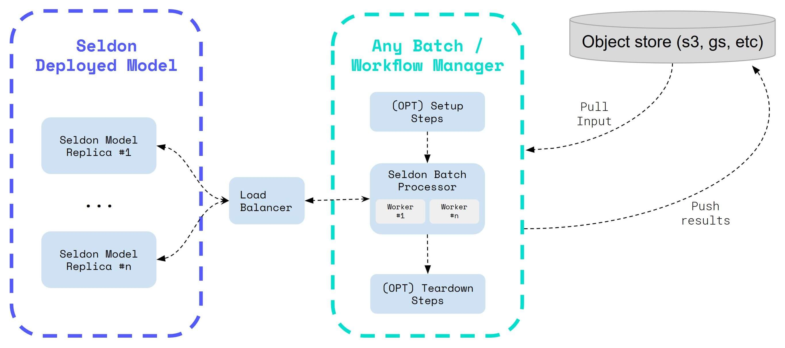

# Batch Processing with Seldon Core

Seldon Core provides a command line component that allows for highly parallelizable batch processing with the horizontally scalable seldon core kubernetes model deployments.

For stream processing with Seldon Core please see [Stream Processing with KNative Eventing](../streaming/knative_eventing.md).


## Horizontally Scalable Workers and Replicas

The parallelizable batch processor worker allows for high throughput as it is able to leverage the Seldon Core horizontal scaling replicas as well as autoscaling, and hence providing flexibility to the user to optimize their configuration as required. 

The diagram below shows a standard workflow where data can be downloaded and then uploaded through an object store, and the Seldon model can be created and deleted when the job finishes successfully.



## Integration with ETL & Workflow Managers

The Seldon Batch component has been built to be modular and flexible such that it can be integrated across any workflow managers.

This allows you to leverage Seldon on a large number of batch applications, including triggers that have to take place on a scheduled basis (e.g. once a day, once a month, etc), or jobs that can be triggered programmatically.


## Hands on Examples

We have provided a set of examples that show you how you can use the Seldon batch processing component:

* [Batch Processing with Argo Workflows and S3 / Minio](../examples/argo_workflows_batch.html)
* [Batch processing with Argo Workflows and HDFS](../examples/argo_workflows_hdfs_batch.html)
* [Batch Processing with Kubeflow Pipelines Example](../examples/kubeflow_pipelines_batch.html)

## High Level Implementation Details

### CLI Parameters

To get more insights on each of the commands available you can interact with the batch processor component as follows:

```bash
$ seldon-batch-processor --help

Usage: seldon-batch-processor [OPTIONS]

  Command line interface for Seldon Batch Processor, which can be used to send
  requests through configurable parallel workers to Seldon Core models. It is
  recommended that the respective Seldon Core model is also optimized with
  number of replicas to distribute and scale out the batch processing work.
  The processor is able to process data from local filestore input file in
  various formats supported by the SeldonClient module. It is also suggested
  to use the batch processor component integrated with an ETL Workflow Manager
  such as Kubeflow, Argo Pipelines, Airflow, etc. which would allow for extra
  setup / teardown steps such as downloading the data from object store or
  starting a seldon core model with replicas. See the Seldon Core examples
  folder for implementations of this batch module with Seldon Core.

Options:
  -d, --deployment-name TEXT      The name of the SeldonDeployment to send the
                                  requests to  [required]
  -g, --gateway-type [ambassador|istio|seldon]
                                  The gateway type for the seldon model, which
                                  can be through the ingress provider
                                  (istio/ambassador) or directly through the
                                  service (seldon)
  -n, --namespace TEXT            The Kubernetes namespace where the
                                  SeldonDeployment is deployed in
  -h, --host TEXT                 The hostname for the seldon model to send
                                  the request to, which can be the ingress of
                                  the Seldon model or the service itself
  -t, --transport [rest|grpc]     The transport type of the SeldonDeployment
                                  model which can be REST or GRPC
  -a, --data-type [data|json|str|raw]
                                  Whether to use json, strData or Seldon Data
                                  type for the payload to send to the
                                  SeldonDeployment which aligns with the
                                  SeldonClient format
  -p, --payload-type [ndarray|tensor|tftensor]
                                  The payload type expected by the
                                  SeldonDeployment and hence the expected
                                  format for the data in the input file which
                                  can be an array
  -w, --workers INTEGER           The number of parallel request processor
                                  workers to run for parallel processing
  -r, --retries INTEGER           The number of retries for each request
                                  before marking an error
  -i, --input-data-path PATH      The local filestore path where the input
                                  file with the data to process is located
  -o, --output-data-path PATH     The local filestore path where the output
                                  file should be written with the outputs of
                                  the batch processing
  -m, --method [predict|feedback]
                                  The method of the SeldonDeployment to send
                                  the request to which currently only supports
                                  the predict method
  -l, --log-level [debug|info|warning|error]
                                  The log level for the batch processor
  -b, --benchmark                 If true the batch processor will print the
                                  elapsed time taken to run the process
  -u, --batch-id TEXT             Unique batch ID to identify all datapoints
                                  processed in this batch, if not provided is
                                  auto generated
  -u, --batch-size INTEGER        Batch size greater than 1 can be used to
                                  group multiple predictions into a single
                                  request.
  -t, --batch-interval FLOAT      Time interval(in seconds) between batch
                                  predictions made by every worker
  --help                          Show this message and exit.
```

### Identifiers

Each data point that is sent to the Seldon Core model contains the following identifiers in the request metadata:
* Batch ID - A unique identifier which can be provided through CLI or is automatically generated
* Batch Instance ID - A generated unique identifier for each datapoint processed
* Batch Index - The local ordered descending index for the datapoint relative to the input file location

These identifiers are added on each request as follows:

```javascript
seldon_request = {
    <data>: <current_batch_instance>,
    "meta": {
        "tags": {
            "batch_id": <BATCH_ID>
            "batch_instance_id": <BATCH_INSTANCE_ID>
            "batch_index": <BATCH_INDEX>
            }
        }
    }
```

This allows the requests to be identified and matched against the initial request in the data.

### Performance

The implementation of the module is done leveraging Python's Threading system. 

Benchmarking was carried out using vanilla Python requests module to assess performance of Threading vs Twisted vs AsyncIO. The results showed better performance with Asyncio, however given that the logic in the worker is quite minimal (ie sending a request) and most of the time is waiting for the response, the implementation with Python's native threading was able to perform at speeds that were efficient enough to very easily scale to thousands of workers.

However currently the implementation uses the Seldon Client which does not leverage quite a few optimization requirements to increase the performance of processing, such as re-using a requests.py session. However even without these optimisations the worker will still reach a highly concurrent performance, and these optimizations will be introduced as adoption of this component (and feedback) grows.

### Micro batching

When using the batch processor CLI you can specify a `batch-size` parameter which can group multiple predictions into a single request. This allows you to take advantage of the higher performance this provides for some models, and reduce networking overhead. The response will be split back into multiple single prediction responses so that the output file looks identical to running the processor with a batch size of 1.

Currently we only support micro batching for `ndarray` and `tensor` payload types.
