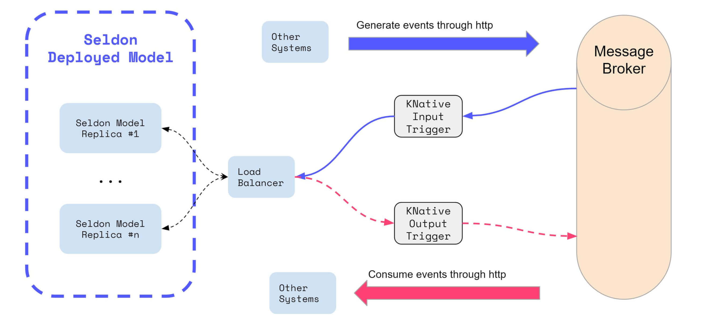

# KNative Eventing Integration

Seldon has an integration with KNative eventing that allows for real time processing.

This allow Seldon Core users to connect SeldonDeployments through triggers that will receive any relevant Cloudevents.



## Triggers

The way that KNative Eventing works is by creating triggers that send any relevant Cloudevents that match a specific setup into the relevant addressable location.

Seldon Core implements the KNative Eventing Duck Typing requirements which allows users to create triggers that reference specific SeldonDeployments.

An example of a trigger for a SeldonDeployment named "iris-deployment" can be created with the following format:

```yaml
apiVersion: eventing.knative.dev/v1beta1
kind: Trigger
metadata:

  name: seldon-eventing-sklearn-trigger
spec:
  broker: default
  filter:
    attributes:
      type: seldon.iris-deployment.default.request
  subscriber:
    ref: 
      apiVersion: machinelearning.seldon.io/v1
      kind: SeldonDeployment
      name: iris-deployment
```

This means that any Cloudevents of type "`seldon.iris-deployment.default.request`" will be sent to the SeldonDeployment with the name `iris-deployment`.

The URL path is inferred through our implementation of the Duck Typing from Knative, which automatically extracts the URL from the Kubernetes resource status, specifically from the attribute `status.addressable.url`. 

In the case of every Seldon Deployment, the `status.addressable.url` is always the serviceName, port and path for the first predictor. You can see the Addressable type in [our CRD definition](../reference/seldon-deployment.rst).

## Overriding URI

In the case of multiple predictors, or in the case that you want to send the Cloudevent through your ingress, you can actually create a trigger that overrides the URI. An example of this would be the following:

```yaml
apiVersion: eventing.knative.dev/v1beta1
kind: Trigger
metadata:

  name: seldon-eventing-sklearn-trigger
spec:
  broker: default
  filter:
    attributes:
      type: seldon.iris-deployment.default.request
  subscriber:
    uri: http://istio-ingressgateway/seldon/default/iris-deployment/api/v1.0/predicions
```

Which would then create a trigger that would forward the messages of that type into that URI.

## Sending Test Requests

In production you would have multiple services creating cloudevents from various different sources. However for testing, it's possible to send requests directly from your terminal to the KNative Eventing broker, by using the following `curl` docker image locally:

```bash
kubectl run --quiet=true -it --rm curl --image=radial/busyboxplus:curl --restart=Never -- \
    curl -v "default-broker.default.svc.cluster.local" \
        -H "Ce-Id: 536808d3-88be-4077-9d7a-a3f162705f79" \
        -H "Ce-specversion: 0.3" \
        -H "Ce-Type: seldon.iris-deployment.default.request" \
        -H "Ce-Source: seldon.examples.streaming.curl" \
        -H "Content-Type: application/json" \
        -d '{"data": { "ndarray": [[1,2,3,4]]}}'
```

This will be sending a cloud event with the type `seldon.iris-deployment.default.request` into the default broker in the default namespace, which would actually match the example provided in the trigger above.

## Seldon Cloudevent Response

When receiving a Cloudevent, SeldonDeployments will return a Cloudevent-enabled response, which is available for other services to consume.

What this means is that you can create further triggers that could perform other actions with the resulting data.

THe triggers will have to match the cloudevent headers, which are standardised by the SeldonDEployment, and are of the following format:

```text
Ce-Id: SeldonDeployment unique request ID
Ce-Specversion: Version of the specversion used (default: 0.3)
Ce-Type: seldon.<sdep_name>.<namespace>.response
Ce-Source: seldon.<sdep_name>.<namespace>
```

This means that you could create a trigger for a seldon deployment of name `iris-deployment` in namespace `default`, such as the following example which woudl create an `event-display` pod that will print out the contents of that cloudevent:

```yaml
---
# Trigger to send events to service above
apiVersion: eventing.knative.dev/v1alpha1
kind: Trigger
metadata:
  name: event-display
spec:
  broker: default
  filter:
    attributes:
      type: seldon.iris-deployment.default.response
      source: seldon.iris-deployment
  subscriber:
    ref:
      apiVersion: v1
      kind: Service
      name: event-display
---
# event-display app deploment
apiVersion: apps/v1
kind: Deployment
metadata:
  n
ame: event-display
spec:
  replicas: 1
  selector:
    matchLabels: &labels
      app: event-display
  template:
    metadata:
      labels: *labels
    spec:
      containers:
        - name: helloworld-python
          image: gcr.io/knative-releases/github.com/knative/eventing-sources/cmd/event_display
---
# Service that exposes event-display app.
# This will be the subscriber for the Trigger
kind: Service
apiVersion: v1
metadata:
  name: event-display
spec:
  selector:
    app: event-display
  ports:
    - protocol: TCP
      port: 80
      targetPort: 8080
```

This will show all the cloudevents that are sent with that are processed by the SeldonDeployment.

## Hands on Example

We have a fully worked notebook where we showcase these capabilities end to end.

You can try it yourself through the [Seldon Core Real Time Stream Processing with KNative Eventing](../examples/knative_eventing_streaming.nblink) page


