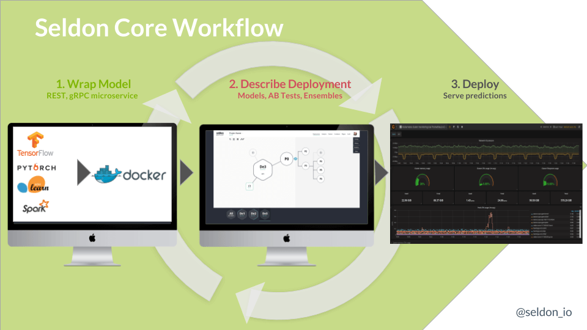
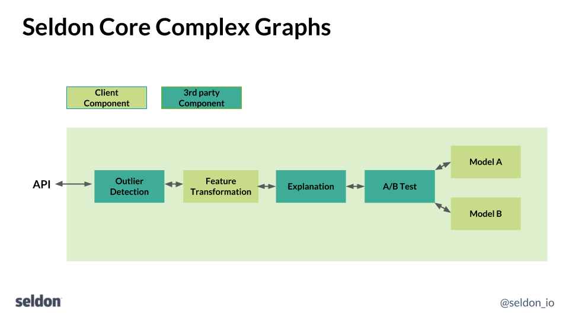
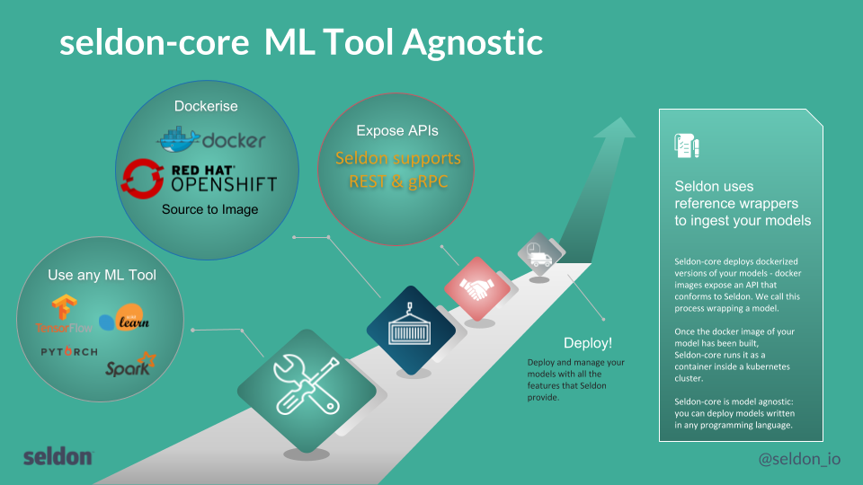

# Using Openshift Source-to-Image to facilitate Machine Learning Deployment

Seldon aims to help organisations put their data science projects into production so they can decrease the time to get return on investment. By helping data scientists take their data science models and place them into production, scale them, get analytics and modify them Seldon allows data scientists to bridge the gap from development to production and use current dev-ops best practices in machine learning. Our core products run on top of Kubernetes and can be deployed on-cloud on on-premise. Integrating with enterprise ready Kubernetes distributions such as Openshift allows us to provide a solid foundation in which to supply our products for use in demanding verticals such as the FinTech sector.

[Seldon-Core](https://github.com/SeldonIO/seldon-core) is an open source project that provides scalable machine learning deployment running on [Kubernetes](https://kubernetes.io/). One of Seldon-Core’s goals is to allow data scientists to continue to construct their training and inference components using any of the many available machine learning toolkits, be that python based (e.g., TensorFlow, sklearn), R or Java (e.g., Spark, H2O) amongst many popular options. Seldon-Core will then allow them easily to package and run their runtime prediction modules on Kubernetes. To achieve this goal we need to make it easy for data scientists to take their source code and package it as a Docker-formatted container in the correct form such that it can be managed as part of a runtime microservice graph on Kubernetes by Seldon-Core. For this we utilize Openshift’s Source-to-Image open source library to allow any code to be packaged in the correct format with minimal requirements from the data scientist.

## Seldon-Core Overview

Seldon-core provides scalable machine learning deployments running on Kubernetes. To deploy their models data scientists follow the steps as shown below:



1.  Package their runtime model as a Docker-formatted image
1.  Describe their runtime graph as a Kubernetes resource
1.  Deploy to Kubernetes using standard tools such as kubectl, Helm, ksonnet.

Once running their deployment can be updated as new image releases are created for the runtime model as well as updates to the runtime graph.

The components of the runtime graph can be of various types. The most typical is a model which will provide predictions given some input features. Typically, the data scientist will have trained a model and saved the model parameters for use by a runtime component that will be provide new predictions at runtime. However, Seldon-Core allows a range of components to be created that can be joined together as building blocks to create more complex runtime graphs as show below:



The types of component you can create can include:

- Models - e.g., TensorFlow, sklearn models
- Routers - e.g., A-B Tests, Multi-Armed Bandits
- Combiners - e.g., Model ensemblers
- Transformers - e.g., Feature normalization, Outlier detection, concept drift

As the above diagram shows these need to be fitted into the microservice API of seldon-core either as REST or gRPC services.

## Source-to-Image integration

To integrate a component into seldon-core the data scientist needs to accomplish two things:

1.  Create a Docker-formatted image from your source code
1.  Wrap your component as a service that exposes REST or gRPC endpoints that follow the seldon-core miroserice API.



To accomplish this we use Openshift's [source-to-image (s2i)](https://github.com/openshift/source-to-image) open source tool. S2i allows data scientists to wrap their code using a single command line call that can easily be embedded into a continuous integration pipeline. Seldon provides s2i builder images that contain middleware code to wrap the data scientist's component within a REST or gRPC server that respects the seldon-core microservice API. All that is needed is for the data scientist to follow a few conventions when creating their component in various languages as will be illustrated below. The growing set of source-to-image builder images can be found [here](https://github.com/SeldonIO/seldon-core/tree/master/wrappers/s2i).

### Python

There are many popular machine learning libraries in python including Tensorflow, keras, sklearn, pyTorch and Statsmodels amongst many others. To use the Seldon-Core s2i builder image to package a python model the data scientist simply needs to provide:

- A python file with a class that runs your model
- optional requirements.txt or setup.py
- .s2i/environment - model definitions used by the s2i builder to correctly wrap your model

The data scientist's source code should contain a python file which defines a class of the same name as the file. For example:

```python
class MyModel(object):
    """
    Model template. You can load your model parameters in __init__ from a location accessible at runtime
    """

    def __init__(self):
        """
        Add any initialization parameters. These will be passed at runtime from the graph definition parameters defined in your seldondeployment Kubernetes resource manifest.
        """
        print("Initializing")

    def predict(self,X,features_names):
        """
        Return a prediction.

        Parameters
        ----------
        X : array-like
        feature_names : array of feature names (optional)
        """
        print("Predict called - will run identity function")
        return X
```

- The file is called MyModel.py and it defines a class MyModel
- The class contains a predict method that takes an array (numpy) X and feature_names and returns an array of predictions.
- Any required initialization can be put inside the class init method.

An optional requirements.txt can detail any software dependencies the code requires.

To allow the s2i builder image to correctly package the component the data scientist needs to provide a few environment variables either in an .s2i/environment file in the source code folder or on the command line. An example is:

```bash
MODEL_NAME=MyModel
API_TYPE=REST
SERVICE_TYPE=MODEL
```

Finally we Use `s2i build` to create the Docker-formatted image from source code. Examples for python3 code are:

```bash
s2i build <git-repo> seldonio/seldon-core-s2i-python3 <my-image-name>
s2i build <src-folder> seldonio/seldon-core-s2i-python3 <my-image-name>
```

## R

R is a popular statistical language which provides many machine learning related packages.

To use the seldon s2i builder image to package an R model the requirements are:

- An R file which provides an S3 class for your model via an `initialise_seldon` function and that has appropriate generics for the component, e.g. predict for a model.
- An optional install.R to be run to install any libraries needed
- .s2i/environment - model definitions used by the s2i builder to correctly wrap your model

The data scientist's source code should contain an R file which defines an S3 class for their model. For example,

```R
library(methods)

predict.mymodel <- function(mymodel,newdata=list()) {
  write("MyModel predict called", stdout())
  newdata
}

new_mymodel <- function() {
  structure(list(), class = "mymodel")
}

initialise_seldon <- function(params) {
  new_mymodel()
}
```

The above contains:

- A `seldon_initialise` function that creates an S3 class for the model via a constructor `new_mymodel`. This will be called on startup and you can run any configuration the model needs.
- A generic `predict` function is created for my model class. This will be called with a `newdata` field with the `data.frame` to be predicted.

An `install.R` with any software dependencies required. For example:

```R
install.packages('rpart')
```

Finally, as with all cases the builder image needs a few environment variables to be set to correctly package the R model. An example is:

```bash
MODEL_NAME=MyModel
API_TYPE=REST
SERVICE_TYPE=MODEL
```

These values can also be provided in an .s2i/environment file with the source code or overridden on the command line when building the image.

Once these steps are done we can use `s2i build` to create the Docker-formatted image from the source code.

```bash
s2i build <git-repo> seldonio/seldon-core-s2i-r <my-image-name>
s2i build <src-folder> seldonio/seldon-core-s2i-r <my-image-name>
```

An example invocation using the test template model inside seldon-core:

```bash
s2i build https://github.com/seldonio/seldon-core.git --context-dir=incubating/wrappers/s2i/R/test/model-template-app seldonio/seldon-core-s2i-r seldon-core-template-model
```

### Java

There are several popular machine learning libraries in Java including Spark, H2O and DL4J. Seldon-core also provides builder images for Java. To accomplish this we provide a Java library seldon-core-wrappers that can be included in a Maven Spring project to allow a Java component to be easily wrapped.

To use the Seldon-Core s2i builder image to package a Java model the data scientist will need:

- A Maven project that depends on the `io.seldon.wrapper` library
- A Spring Boot configuration class
- A class that implements `io.seldon.wrapper.SeldonPredictionService` for the type of component you are creating
- An optional .s2i/environment - model definitions used by the s2i builder to correctly wrap your model

More details can be found in the seldon-core docs.

## Summary

By utilizing Openshift's source-to-image tool data scientists can easily build Docker-formatted images for their runtime components to be deployed at scale using seldon-core. This allows data science teams to use the best machine learning tool for the task and deploy the resulting model in a consistent manner. The seldon-core project is working on providing full Openshift integration in the near future so that Enterprise customers can easily utilize machine learning models within their organisation.

Seldon will be joining Openshift Commons and will be present at [Kubecon Europe 2018](https://events.linuxfoundation.org/events/kubecon-cloudnativecon-europe-2018/) and the OpenShift Kubecon Europe event on Tues 1st May. Feel free to contact us to discuss Seldon-Core and Openshift and how they can work together to help data scientists put machine learning into production.
