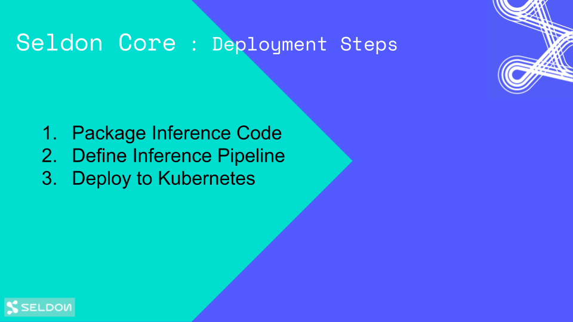

# Seldon Core Workflow

There are 4 steps to using seldon-core.

 1. Install seldon-core onto a Kubernetes cluster
 1. Wrap your components (usually runtime model servers) as Docker containers that respect the internal Seldon microservice API.
 1. Define your runtime service graph as a SeldonDeployment resource and deploy your model and serve predictions
 1. Deploy and request predictions

At the end of this page you will find a set of suggested tutorials you can follow to get started with Seldon.



## 1. Install Seldon Core

To install seldon-core follow the [installation guide](install.md).

## 2. Wrap Your Model

The components you want to run in production need to be wrapped as Docker containers that respect the [Seldon microservice API](../reference/apis/internal-api.md). You can create models that serve predictions, routers that decide on where requests go, such as A-B Tests, Combiners that combine responses and transformers that provide generic components that can transform requests and/or responses.

To allow users to easily wrap machine learning components built using different languages and toolkits we provide wrappers that allow you easily to build a docker container from your code that can be run inside seldon-core. Our current recommended tool is RedHat's Source-to-Image. More detail can be found in [Wrapping your models docs](../wrappers/README.md).

## 3. Define Runtime Service Graph

To run your machine learning graph on Kubernetes you need to define how the components you created in the last step fit together to represent a service graph. This is defined inside a `SeldonDeployment` Kubernetes Custom resource. A [guide to constructing this inference graph is provided](../graph/inference-graph.md).


## 4. Deploy and Serve Predictions

You can use ```kubectl``` to deploy your ML service like any other Kubernetes resource. This is discussed [here](deploying.md). Once deployed you can get predictions by [calling the exposed API](serving.md).

## Next Steps

If you have a saved model for SKLearn, XGBoost or Tensorflow then you can use one of our [prepackaged model servers](../servers/overview.html).

If you want to wrap your custom inference code then follow one of our starter tutorials below for the framework you are using.

### Prepacked Model Servers

 * [SKLearn](../servers/sklearn.html)
 * [XGBoost](../servers/xgboost.html) 
 * [Tensorflow](../servers/tensorflow.html)
 
### Recommended starter tutorials for custom inference code

* [Tensorflow Deep MNIST Tutorial](https://docs.seldon.io/projects/seldon-core/en/latest/examples/deep_mnist.html) (Try it also in [AWS](https://docs.seldon.io/projects/seldon-core/en/latest/examples/aws_eks_deep_mnist.html), [Azure](https://docs.seldon.io/projects/seldon-core/en/latest/examples/azure_aks_deep_mnist.html) and [GKE with GPU](https://github.com/SeldonIO/seldon-core/tree/master/examples/models/gpu_tensorflow_deep_mnist))
* [SKlearn SpaCy Reddit Text Classification Tutorial](https://docs.seldon.io/projects/seldon-core/en/latest/examples/sklearn_spacy_text_classifier_example.html)
* Deploy your R models with the [MNIST example](https://docs.seldon.io/projects/seldon-core/en/latest/examples/r_mnist.html) and the [Iris example](https://docs.seldon.io/projects/seldon-core/en/latest/examples/r_iris.html)
* [Deploy your Java models with the H2O example](https://docs.seldon.io/projects/seldon-core/en/latest/examples/h2o_mojo.html)

### More complex deployments

* [Example Seldon Core Deployments using Helm](https://docs.seldon.io/projects/seldon-core/en/latest/examples/helm_examples.html)
* [Canary deployment with Seldon and Istio](https://docs.seldon.io/projects/seldon-core/en/latest/examples/istio_canary.html)
* [Autoscaling Seldon Example](https://docs.seldon.io/projects/seldon-core/en/latest/examples/autoscaling_example.html)
* [Seldon Model with Custom Metrics](https://docs.seldon.io/projects/seldon-core/en/latest/examples/tmpl_model_with_metrics.html)

### End-to-end / use-case tutorials

* [End-to-end Reusable ML Pipeline with Seldon and Kubeflow](https://docs.seldon.io/projects/seldon-core/en/latest/examples/kubeflow_seldon_e2e_pipeline.html)
* [Seldon Deployment of Income Classifier and Alibi Anchor Explainer](https://docs.seldon.io/projects/seldon-core/en/latest/examples/alibi_anchor_tabular.html)

### Integration with other platforms

* [Sagemaker (Seldon SKLearn integration example)](https://docs.seldon.io/projects/seldon-core/en/latest/examples/sagemaker_sklearn.html)
* [Tensorflow Serving (TFServing) integration example](https://docs.seldon.io/projects/seldon-core/en/latest/examples/tfserving_mnist.html)
* [MLFlow integration example](https://docs.seldon.io/projects/seldon-core/en/latest/examples/mlflow.html)

### Other sources

* [Blogs](https://docs.seldon.io/projects/seldon-core/en/latest/tutorials/blogs.html)
* [Videos](https://docs.seldon.io/projects/seldon-core/en/latest/tutorials/videos.html)


