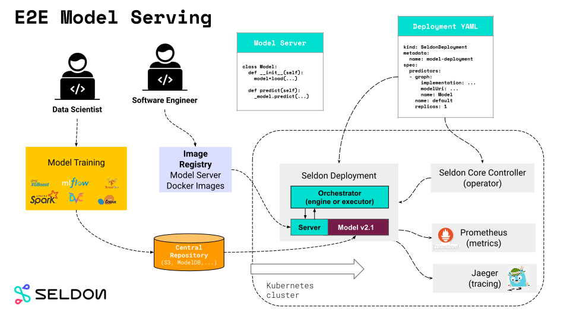
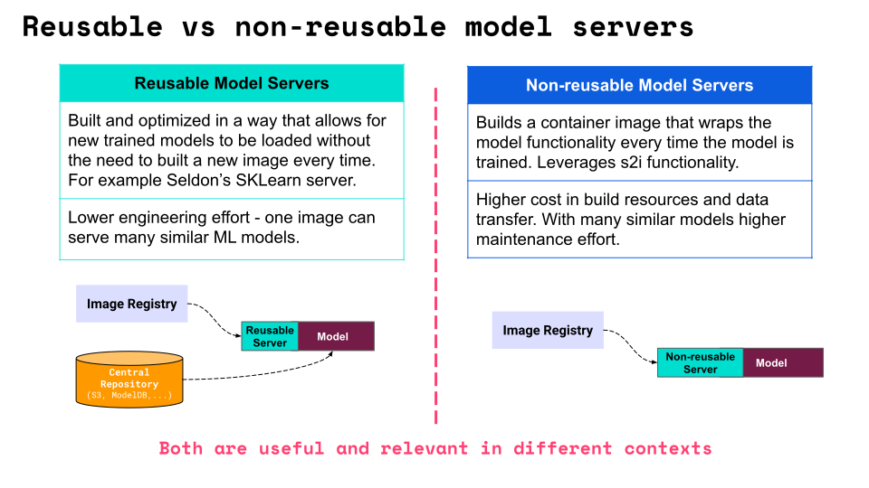
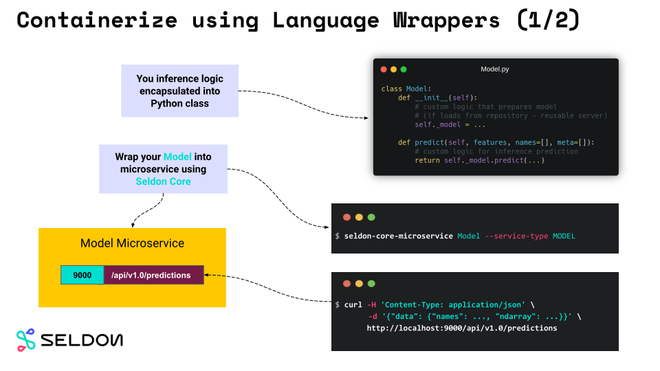
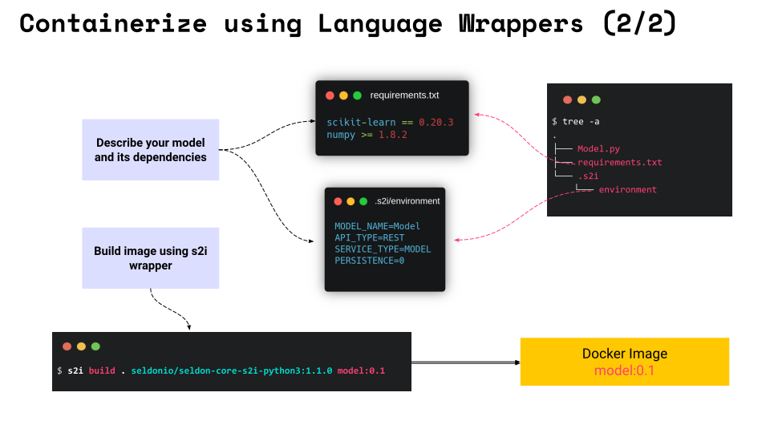
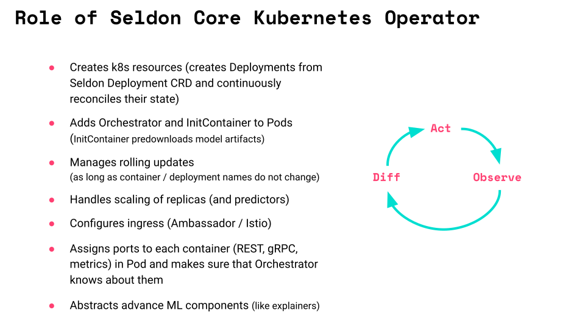
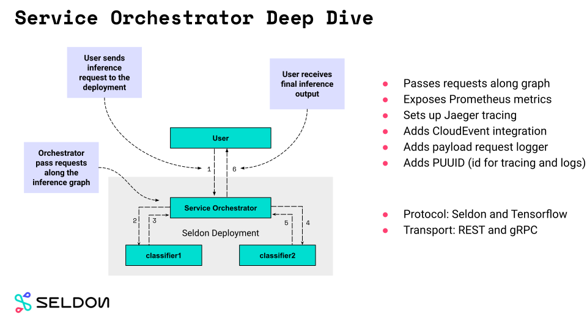
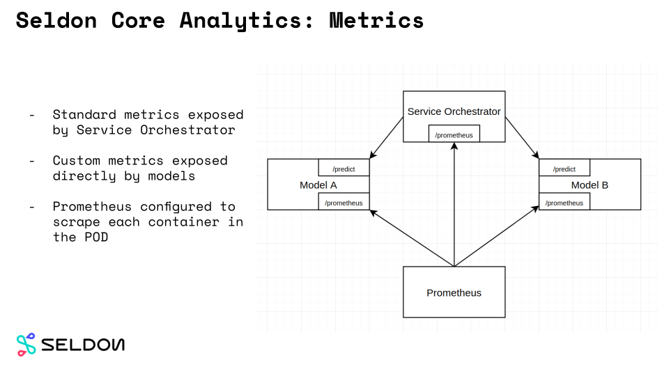

# Overview of Seldon Core Components

Seldon core converts your ML models into production ready REST/gRPC microservices.

These are Seldon Core main components:
- Reusable and non-reusable [model servers](./overview.html#model-servers)
- [Language Wrappers](./overview.html#language-wrappers) to containerise models
- [SeldonDeployment](./overview.html#seldondeployment-crd) CRD and [Seldon Core Operator](./overview.html#seldon-core-operator)
- [Service Orchestrator](./overview.html#service-orchestrator) for advanced inference graphs

as well as integration with third-party systems:
- Kubernetes Ingress integration with [Ambassador](https://www.getambassador.io/) and [Istio](https://istio.io/)
- [Metrics](./overview.html#metrics-with-prometheus) with [Prometheus](https://prometheus.io/)
- [Tracing](./overview.html#distributed-tracing-with-jaeger) with [Jaeger](https://www.jaegertracing.io/)
- [Endpoint Documentation](./overview.html#endpoint-documentation) with [OpenApi](https://swagger.io/docs/specification/about/)

Keep reading to learn more!


## E2E Serving with Model Servers

With `Seldon Core` you can take and put it directly into the production using our flexible `Model Servers`.



Using the so-called `Reusable Model Servers` you can deploy your models into Kubernetes cluster in just a few steps:

1. *Data Scientist* prepares ML `model` using state of the art libraries (mlflow, dvc, xgboost, scikit-learn just to name a few).
2. Trained model is uploaded to the central repository (e.g. S3 storage).
3. *Software Engineer* prepares a `Reusable Model Server` using `Seldon Core` which is uploaded as Docker Image to the Image Registry.
4. Deployment manifest (`Seldon Deployment` CRD) is created and applied to the Kubernetes cluster.
5. Seldon Core `Operator` creates all required Kubernetes resources.
6. Inference requests sent to the `Seldon Deployment` are passed to all internal models by the `Service Orchestrator`.
7. Metrics and tracing data can be collected by leveraging our integrations with third party frameworks.

If you would be to use the `Non-Reusable Model Servers` in steps 2. and 3. you would prepare a Docker image with your ML Model embedded.
We discuss difference between these two approaches in the next section.

## Two Types of Model Servers

With Seldon Core you can build two type of servers: reusable and non-reusable ones.
Each of these are useful depending on the context and the actual use case.

- **Reusable Model Servers**: Often referred to as prepackaged model servers.
  Allow to deploy a family of similar models without the need to build a new server each time.
  They often fetch models from a central repository (like your company's S3 storage)
- **Non-Reusable Model Servers**: Specialised server meant to serve a single model.
  Does not require the central repository but requires a build of a new image for every model.




Read more about our pre-packaged `Model Servers` on their dedicated documentation pages:
- [MLflow Server](../servers/mlflow.html)
- [SKLearn Server](../servers/sklearn.html)
- [Tensorflow Server](../servers/tensorflow.html)
- [XGBoost Server](../servers/xgboost.html)

Read how to build your own pre-packaged model server [here](../servers/custom.html).

## Language Wrappers

Language wrappers allows Seldon Core users to build `Reusable` and `Non-Reusable` model servers.
As you will see, the whole process is very simple and requires user to only define logic that
loads models and perform inference prediction as well as the required runtime dependencies.




Model loading and inference logic is defined in `Model.py` file:
```python
class Model:
  def __init__(self, ...):
    """Custom logic that prepares model.

    - Reusable servers: your_loader downloads model from remote repository.
    - Non-Reusable servers: your_loader loads model from a file embedded in the image.
    """
    self._model = your_loader(...)

  def predict(self, features, names=[], meta=[]):
    """Custom inference logic.""""
    return self._model.predict(...)
```

Main difference between `Reusable` and `Non-Reusable` model servers is if the model is loaded dynamically
or embedded in the image itself.

The `seldon-core-microservice` Python wrapper can be used to turn `Model.py` into a fully operational microservice:
```bash
$ seldon-core-microservice Model --service-type MODEL
```

That serves the inference requests on its endpoint (default: 9000):
```bash
$ curl http://localhost:9000/api/v1.0/predictions \
    -H 'Content-Type: application/json' \
    -d '{"data": {"names": ..., "ndarray": ...}}'

{
   "meta" : {...},
   "data" : {"names": ..., "ndarray" : ...}
}
```



To complete containerisation process you need two more components:
- `requirements.txt` file that describes your runtime dependencies
- `.s2/environment` file that describes your microservice (api and model type)

Once these are in place you can use a simple s2i command
```bash
s2i build . seldonio/seldon-core-s2i-python3:1.11.0-dev model:0.1
```
to create ready to use Docker image.

Read more about Python [Language Wrapper on its dedicated documentation page](../python/index.html).


## Seldon Deployment CRD

Seldon Deployment CRD (Custom Resource Definition) is the real strength of Seldon Core.
It allows you to easily deploy your inference model to the Kubernetes cluster and handle some real production traffic!

[Custom Resources](https://kubernetes.io/docs/concepts/extend-kubernetes/api-extension/custom-resources/) are basically extensions of the Kubernetes API.
They allow one to create a custom combination of basic Kubernetes objects that acts together.
In Seldon Core we use CRDs to define the inference graph through the manifest yaml files.

The manifest file that you write is very powerful yet simple.
You can easily define what models do you want in your deployment and how they are connected in the inference graph.


You can think about the CRD as an abstraction around the actual deployment and services that are created in the cluster.
Once the manifest is applied to the cluster, Seldon Core `Operator` creates all Kubernetes objects required to serve the inference requests.

Read more about [Seldon Deployment CRD on its dedicated documentation page](../reference/seldon-deployment.html).


## Seldon Core Operator

Seldon Core `Operator`, build using [Kubebuilder](https://github.com/kubernetes-sigs/kubebuilder), is what controls your `Seldon Deployments` in the `Kubernetes` cluster.
It reads the CRD definition of `Seldon Deployment` resources applied to the cluster and takes
care that all required components like `Pods` and `Services` are created.

It works according to the common Kubernetes operator pattern - in a continues loop it:
- `observe` current state of the cluster
- `diff` against desired state
- if necessary `act` to apply desired state




## Service Orchestrator

`Service Orchestrator` is responsible for managing intra-graph traffic.
It reads the inference graph structure from the `CRD` and when inference request is received it makes sure that it is passed to each node of the graph in the right order.

It is because of the presence of `Service Orchestrator` that complex graph components like `routers`, `combiners` and output/input `transformers` are available in the `Seldon` world.



`Service Orchestrator` is also responsible for providing many advance features out of the box:
- `Jaeger` tracing
- `Prometheus` metrics
- request payload logging

to just name a few.

Read more about [Service Orchestrator on its dedicated documentation page](../graph/svcorch.html).


## Metadata Provenance

In `Seldon` we understand the importance of the Model Metadata.
You can easily version your model and describe its expected inputs and outputs.

These allow you to make connection to the platform you trained your model with (DVC, Pachyderm, ...)
and know what inputs / outputs you can expect from your inference graph.


Read more about [metadata provenance on its dedicated documentation page](../reference/apis/metadata.html).


## Metrics with Prometheus

Metrics is important aspect of serving ML inference models in production.
Out of the box Seldon Core deployments expose standard metrics to [Prometheus](https://prometheus.io/) on the `Service Orchestrator`.



Users can also define their custom metrics that will be exposed by models directly.
To add metrics to Python models one can simply define `metrics` method:
```python
class Model:
    ...

    def metrics(self):
        return [
            # a counter which will increase by the given value
            {"type": "COUNTER", "key": "mycounter", "value": 1},

            # a gauge which will be set to given value
            {"type": "GAUGE", "key": "mygauge", "value": 100},

            # a timer which will add sum and count metrics - assumed millisecs
            {"type": "TIMER", "key": "mytimer", "value": 20.2},
        ]
```

Read more about [metrics on its dedicated documentation page](../analytics/analytics.html).


## Distributed Tracing with Jaeger

You can use Open Tracing to trace your API calls to Seldon Core. By default we support [Jaeger](https://www.jaegertracing.io/) for Distributed Tracing, which will allow you to obtain insights on latency and performance across each microservice-hop in your Seldon deployment.


Read more about [tracing on its dedicated documentation page](../graph/distributed-tracing.html).


## So.... Why just not wrap my model with Flask?

You may ask yourself: why wouldn't I just simply wrap my model with [Flask](https://flask.palletsprojects.com/)?

Here are some benefits of choosing Seldon Core:
- all hard work is already done
- complex inference graphs possible out of the box
- reusable model servers (build once, deploy many)
- integration with metrics and tracing solutions
- automated ingress configuration
- Seldon Core is battle-tested by wide community of both open-source and commercial users


## Other features of Seldon Core?

With over 2M installs, Seldon Core is used across organisations to manage large scale deployment of machine learning models, and key benefits include:

 * Easy way to containerise ML models using our language wrappers or pre-packaged inference servers.
 * Out of the box endpoints which can be tested through Swagger UI, Seldon Python Client or Curl / GRPCurl
 * Cloud agnostic and tested on AWS EKS, Azure AKS, Google GKE, Alicloud, Digital Ocean and Openshift.
 * Powerful and rich inference graphs made out of predictors, transformers, routers, combiners, and more.
 * A standardised serving layer across models from heterogeneous toolkits and languages.
 * Advanced and customisable metrics with integration to Prometheus and Grafana.
 * Full auditability through model input-output request logging integration with Elasticsearch.
 * Microservice tracing through integration to Jaeger for insights on latency across microservice hops.
