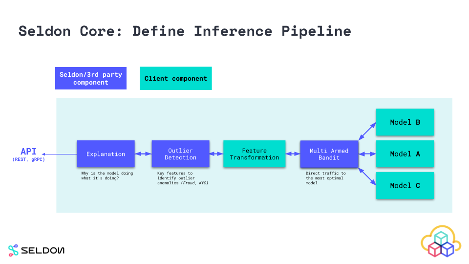

# Quickstart

In this page we have put together a very containerised example that will get you up and running with your first Seldon Core model.

We will show you how to deploy your model using a pre-packaged model server, as well as a language wrapper for more custom servers.

You can dive into a deeper dive of each of the components and stages of the [Seldon Core Workflow](../workflow/index.html).

## Seldon Core Workflow

Once you've [installed Seldon Core](install.md), you can productionise your model with the following three steps:

 1. Wrap your model using our prepackaged inference servers or language wrappers
 1. Define and deploy your Seldon Core inference graph
 1. Send predictions and monitor performance

### 1. Wrap Your Model

The components you want to run in production need to be wrapped as Docker containers that respect the [Seldon microservice API](../reference/apis/internal-api.md). You can create models that serve predictions, routers that decide on where requests go, such as A-B Tests, Combiners that combine responses and transformers that provide generic components that can transform requests and/or responses.

To allow users to easily wrap machine learning components built using different languages and toolkits we provide wrappers that allow you easily to build a docker container from your code that can be run inside seldon-core. Our current recommended tool is RedHat's Source-to-Image. More detail can be found in [Wrapping your models docs](../wrappers/language_wrappers.md).

### 2. Define Runtime Service Graph

To run your machine learning graph on Kubernetes you need to define how the components you created in the last step fit together to represent a service graph. This is defined inside a `SeldonDeployment` Kubernetes Custom resource. A [guide to constructing this inference graph is provided](../graph/inference-graph.md).



### 3. Deploy and Serve Predictions

You can use `kubectl` to deploy your ML service like any other Kubernetes resource. This is discussed [here](deploying.md). Once deployed you can get predictions by [calling the exposed API](serving.md).


## Hands on Example of Seldon Core Workflow


### Install Seldon Core in your Cluster

**Install using Helm 3 (you can also use Kustomize)**

```bash
kubectl create namespace seldon-system

helm install seldon-core seldon-core-operator \
    --repo https://storage.googleapis.com/seldon-charts \
    --set usageMetrics.enabled=true \
    --namespace seldon-system \
    --set istio.enabled=true
    # You can set ambassador instead with --set ambassador.enabled=true
```

For a more advanced guide that shows you how to install Seldon Core with many different options and parameters you can dive further in our [detailed installation guide](./install.html).

### Productionise your first Model with Seldon Core

There are two main ways you can productionise using Seldon Core:

* Wrap your model with our pre-packaged inference servers
* Wrap your model with our language wrappers

#### Wrap your model with our pre-packaged inference servers

You can use our pre-packaged inference servers which are optimized for popular machine learning frameworks and languages, and allow for simplified workflows that can be scaled across large number of usecases.

A typical workflow would normally be programmatic (triggered through CI/CD), however below we show the commands you would normally carry out.

**1. Export your model binaries / artifacts**

Export your model binaries using the instructions provided in the requirements outlined in the respective [pre-packaged model server](../servers/overview.html) you are planning to use.

```python
>>my_sklearn_model.train(...)
>>joblib.dump(my_sklearn_model, "model.joblib")

[Created file at /mypath/model.joblib]
```

**2. Upload your model to an object store**

You can upload your models into any of the object stores supported by our pre-package model server file downloader, or alternatively add your custom file downloader.

For simplicity we have already uploaded it to the bucket so you can just proceed to the next step and run your model on Seldon Core.

```console
$ gsutil cp model.joblib gs://seldon-models/v1.12.0/sklearn/iris/model.joblib

[ Saved into gs://seldon-models/v1.12.0/sklearn/iris/model.joblib ]
```

**3. Deploy to Seldon Core in Kubernetes**

Finally you can just deploy your model by loading the binaries/artifacts using the pre-packaged model server of your choice. You can build [complex inference graphs](../graph/inference-graph.html) that use multiple components for inference.

```yaml
$ kubectl apply -f - << END
apiVersion: machinelearning.seldon.io/v1
kind: SeldonDeployment
metadata:
  name: iris-model
  namespace: model-namespace
spec:
  name: iris
  predictors:
  - graph:
      implementation: SKLEARN_SERVER
      modelUri: gs://seldon-models/v1.12.0/sklearn/iris
      name: classifier
    name: default
    replicas: 1
END
```

**4. Send a request in Kubernetes cluster**

Every model deployed exposes a standardised User Interface to send requests using our OpenAPI schema.

This can be accessed through the endpoint `http://<ingress_url>/seldon/<namespace>/<model-name>/api/v1.0/doc/` which will allow you to send requests directly through your browser.


Or alternatively you can send requests programmatically using our [Seldon Python Client](../python/seldon_client.html) or another Linux CLI:

```console
$ curl -X POST http://<ingress>/seldon/model-namespace/iris-model/api/v1.0/predictions \
    -H 'Content-Type: application/json' \
    -d '{ "data": { "ndarray": [1,2,3,4] } }' | json_pp

{
   "meta" : {},
   "data" : {
      "names" : [
         "t:0",
         "t:1",
         "t:2"
      ],
      "ndarray" : [
         [
            0.000698519453116284,
            0.00366803903943576,
            0.995633441507448
         ]
      ]
   }
}
```

#### Wrap your model with our language wrappers

Below are the high level steps required to containerise your model using Seldon Core's Language Wrappers.

Language wrappers are used for more custom use-cases that require dependencies that are not covered by our pre-packaged model servers. Language wrappers can be built using our graduated Python and Java wrappers - for further details check out our [Language Wrappers section](../wrappers/language_wrappers.html).

**1. Export your model binaries and/or artifacts:**

In this case we are also exporting the model binaries/artifacts, but we will be in charge of the logic to load the models. This means that we can use third party dependencies and even external system calls. Seldon Core is running production use-cases with very heterogeneous models.

```python
>> my_sklearn_model.train(...)
>> joblib.dump(my_sklearn_model, "model.joblib")

[Created file at /mypath/model.joblib]
```

**2. Create a wrapper class Model.py**

In this case we're using the Python language wrapper, which allows us to create a custom wrapper file which allows us to expose all functionality through the `predict` method - any HTTP/GRPC requests sent through the API are passed to that function, and the response will contain whatever we return from that function.

The python SDK also allows for other functions such as `load` for loading logic, `metrics` for custom Prometheus metrics, `tags` for metadata, and more.

```python
class Model:
    def __init__(self):
        self._model = joblib.load("model.joblib")

    def predict(self, X):
        output = self._model(X)
        return output
```

**3. Test model locally**

Before we deploy our model to production, we can actually run our model locally using the [Python seldon-core Module](../python/python_module.md) microservice CLI functionality.

```console
$ seldon-core-microservice Model REST --service-type MODEL

2020-03-23 16:59:17,366 - werkzeug:_log:122 - INFO:   * Running on http://0.0.0.0:5000/ (Press CTRL+C to quit)

$ curl -X POST localhost:5000/api/v1.0/predictions \
    -H 'Content-Type: application/json' \
    -d '{ "data": { "ndarray": [1,2,3,4] } }' \
    | json_pp

{
   "meta" : {},
   "data" : {
      "names" : [
         "t:0",
         "t:1",
         "t:2"
      ],
      "ndarray" : [
         [
            0.000698519453116284,
            0.00366803903943576,
            0.995633441507448
         ]
      ]
   }
}
```

**4. Use the Seldon tools to containerise your model**

Now we can use the Seldon Core utilities to convert our python class into a fully fledged Seldon Core microservice. In this case we are also containerising the model binaries.

The result below is a container with the name `sklearn_iris` and the tag `0.1` which we will be able to deploy using Seldon Core.

```console
s2i build . seldonio/seldon-core-s2i-python3:1.12.0 sklearn_iris:0.1
```

**5. Deploy to Kubernetes**

Similar to what we did with the pre-packaged model server, we define here our deployment structure however we also have to specify the container that we just built, together with any further containerSpec options we may want to add.

```yaml
$ kubectl apply -f - << END
apiVersion: machinelearning.seldon.io/v1
kind: SeldonDeployment
metadata:
  name: iris-model
  namespace: model-namespace
spec:
  name: iris
  predictors:
  - componentSpecs:
    - spec:
      containers:
      - name: classifier
        image: sklearn_iris:0.1
  - graph:
      name: classifier
    name: default
    replicas: 1
END
```

**6. Send a request to your deployed model in Kubernetes**

Every model deployed exposes a standardised User Interface to send requests using our OpenAPI schema.

This can be accessed through the endpoint `http://<ingress_url>/seldon/<namespace>/<model-name>/api/v1.0/doc/` which will allow you to send requests directly through your browser.


Or alternatively you can send requests programmatically using our [Seldon Python Client](../python/seldon_client.html) or another Linux CLI:

```console
$ curl -X POST http://<ingress>/seldon/model-namespace/iris-model/api/v1.0/predictions \
    -H 'Content-Type: application/json' \
    -d '{ "data": { "ndarray": [1,2,3,4] } }' | json_pp

{
   "meta" : {},
   "data" : {
      "names" : [
         "t:0",
         "t:1",
         "t:2"
      ],
      "ndarray" : [
         [
            0.000698519453116284,
            0.00366803903943576,
            0.995633441507448
         ]
      ]
   }
}
```

## Hands on Examples

Below are a set of Jupyter notebooks that you can try out yourself for deploying Seldon Core as well as using some of the more advanced features.

### Prepacked Model Servers

 * [Deploy a Scikit-learn Model Binary](../servers/sklearn.html)
 * [Deploy a Tensorflow Exported Model](../servers/tensorflow.html)
 * [MLflow Pre-packaged Model Server A/B Test](../examples/mlflow_server_ab_test_ambassador.html)
 * [Deploy an XGBoost Model Binary](../servers/xgboost.html)
 * [Deploy Pre-packaged Model Server with Cluster's MinIO](../examples/minio-sklearn.html)

### Recommended starter tutorials for custom inference code

* [Tensorflow Deep MNIST Tutorial](../examples/tfserving_mnist.html) (Try it also in [AWS](../examples/aws_eks_deep_mnist.html), [Azure](../examples/azure_aks_deep_mnist.html), [GKE with GPU](../examples/gpu_tensorflow_deep_mnist.html) and [Alibaba Cloud](../examples/alibaba_ack_deep_mnist.html))
* [SKlearn SpaCy Reddit Text Classification Tutorial](../examples/sklearn_spacy_text_classifier_example.html)
* [Deploy your Java models with the H2O example](../examples/h2o_mojo.html)

### More complex deployments

* [Example Seldon Core Deployments using Helm](../examples/helm_examples.html)
* [Canary deployment with Seldon and Istio](../examples/istio_canary.html)
* [Autoscaling Seldon Example](../examples/autoscaling_example.html)
* [Seldon Model with Custom Metrics](../examples/custom_metrics.html)

### End-to-end / use-case tutorials

* [End-to-end Reusable ML Pipeline with Seldon and Kubeflow](../examples/kubeflow_seldon_e2e_pipeline.html)
* [Seldon Deployment of Income Classifier and Alibi Anchor Explainer](../examples/explainer_examples.html)

### Integration with other platforms

* [Sagemaker (Seldon SKLearn integration example)](../examples/sagemaker_sklearn.html)
* [Tensorflow Serving (TFServing) integration example](../examples/tfserving_mnist.html)
* [MLFlow integration example](../examples/mlflow_server_ab_test_ambassador.html)

## About the name "Seldon Core"

The name Seldon (ˈSɛldən) Core was inspired from [the Foundation Series (Scifi Novel)](https://en.wikipedia.org/wiki/Foundation_series) where it's premise consists of a mathematician called "Hari Seldon" who spends his life developing a theory of Psychohistory, a new and effective mathematical sociology which allows for the future to be predicted extremely accurate through long periods of time (across hundreds of thousands of years).
