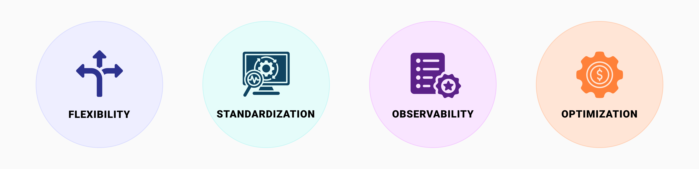

# Why Seldon Core 2

Seldon Core 2 is a source-available, Kubernetes-native framework designed to deploy and manage machine learning (ML), and Large Language Model (LLM) systems at scale. Its data-centric approach and modular architecture enable you to handle everything from simple models to complex ML applications, ensuring flexibility, standardization, observability, and cost optimization across diverse environments, including on-premise, hybrid, and multi-cloud setups.

## **Flexibility: Real-time, your way**

With a "develop in anything, deploy anywhere" approach Seldon Core 2 offers a platform-agnostic, flexible framework for seamless deployment of different types of ML models across on-premise, cloud, and hybrid environments. Its adaptive architecture enables customizable applications, future-proofing MLOps or LLMOps by scaling deployments as data and applications evolve. The modular design enhances resource-efficiency, allowing dynamic scaling, component reuse, and optimized resource allocation. This ensures long-term scalability, operational efficiency, and adaptability to changing demands.

## **Standardization: Consistency across workflows**

Seldon Core 2 enforces best practices for ML deployment, ensuring consistency, reliability, and efficiency across the entire lifecycle. By automating key deployment steps, it removes operational bottlenecks, enabling faster rollouts and allowing teams to focus on high-value tasks.

With a "learn once, deploy anywhere" approach, Seldon Core 2 standardizes model deployment across on-premise, cloud, and hybrid environments, reducing risks and improving productivity. Its unified execution framework supports conventional, foundational, and LLM models, providing a consistent and efficient way to deploy diverse model types. This enhances operational efficiency, fosters innovation, and ensures accuracy, compliance, and seamless scalability. Also, enhances collaboration between MLOps Engineers, Data Scientists, and Software Engineers through a customizable framework that promotes knowledge sharing, innovation, and seamless adoption of new data science features.

## **Enhanced Observability**

Observability in Seldon Core 2 enables real-time monitoring, analysis, and performance tracking of ML systems, covering data pipelines, models, and deployment environments. Its customizable framework combines operational and data science monitoring, ensuring teams have the key metrics needed for maintenance and decision-making.

Seldon simplifies operational monitoring, allowing real-time ML or LLM deployments to expand across organizations while supporting complex, mission-critical use cases. A [data-centric approach](./concepts/README.md#data-centric-mlops)ensures all prediction data is auditable, maintaining explainability, compliance, and trust in AI-driven decisions.

Seldon Core 2 provides flexible metric aggregation, surfacing operational, data science, and custom metrics for different users. Whether teams need high-level overviews or deep insights, Seldon ensures full transparency. With real-time access, you can register, monitor, and audit models step by step, gaining visibility into data-driven decisions and ensuring accountable, trustworthy AI systems.

## **Optimization: Modularity to maximize resource efficiency**

Seldon Core 2 is built for scalability, efficiency, and cost-effective ML operations, enabling you to deploy only the necessary components while maintaining agility and high performance. Its modular architecture ensures that resources are optimized, infrastructure is consolidated, and deployments remain adaptable to evolving business needs.

**Scaling for Efficiency:** enables dynamic infrastructure scaling based on real-time demand, ensuring that only the required resources are used. With support for scaling to zero, unused resources can be completely deallocated, reducing infrastructure costs when models are not in use. Additionally, scaling to one ensures that at least one replica remains active, preventing cold starts and maintaining responsiveness. By eliminating redundancy and optimizing model deployments, you can balance cost efficiency with performance, ensuring seamless and reliable inference at any scale.

**Consolidated Serving Infrastructure**: With multi-model serving (MMS) and overcommit capabilities, Seldon Core 2 maximizes resource utilization by intelligently allocating models across available infrastructure. This approach reduces compute overhead while ensuring reliable and efficient model inference.

**Extendability & Modular Adaptation**: Designed for flexibility, Seldon Core 2 seamlessly integrates with external modules like LLMs and Alibi, enabling you to extend the ML capabilities as needed. Its modular design puts you in control, offering a commercially viable approach to purchase and implement only the capabilities you need, when you need them. This ensures that you can scale your AI platform strategy in alignment with evolving business demands, keeping pace with internal clients’ needs for continuous value extraction from AI investments while maintaining agility and cost efficiency.

**Reusability for Cost Optimization:** Seldon Core 2 is designed to provide predictable, fixed, and affordable pricing, ensuring that you can experiment, scale, and innovate without unexpected costs. By aligning pricing with your needs, Seldon enables you to maximize AI investments while maintaining financial transparency.

By combining scalability, infrastructure consolidation, and modular adaptability, Seldon Core 2 empowers you to lower costs, streamline workflows, and drive AI innovation, all while ensuring financial flexibility and operational efficiency.
