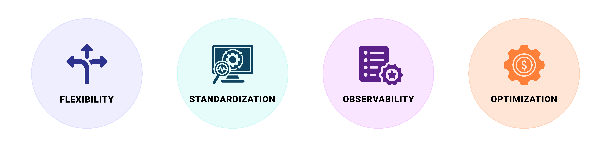

# Production-ready Machine Learning Serving Framework

Seldon Core 2 is a Kubernetes-native framework for deploying and managing machine learning (ML) and Large Language Model (LLM) systems at scale. Its [data-centric approach](./concepts/README.md#data-centric-mlops) and modular [architecture](./architecture/README.md) enable seamless handling of simple models to complex ML applications across on-premise, hybrid, and multi-cloud environments while ensuring flexibility, standardization, observability, and cost efficiency.

## **Flexibility: Real-time, your way**

Seldon Core 2 offers a platform-agnostic, flexible framework for seamless deployment of different types of ML models across on-premise, cloud, and hybrid environments. Its adaptive architecture enables customizable applications, future-proofing MLOps or LLMOps by scaling deployments as data and applications evolve. The modular design enhances resource-efficiency, allowing dynamic scaling, component reuse, and optimized resource allocation. This ensures long-term scalability, operational efficiency, and adaptability to changing demands.

## **Standardization: Consistency across workflows**

Seldon Core 2 enforces best practices for ML deployment, ensuring consistency, reliability, and efficiency across the entire lifecycle. By automating key deployment steps, it removes operational bottlenecks, enabling faster rollouts and allowing teams to focus on high-value tasks.

With a "learn once, deploy anywhere" approach, Seldon Core 2 standardizes model deployment across on-premise, cloud, and hybrid environments, reducing risk and improving productivity. Its unified execution framework supports conventional, foundational, and LLM models, streamlining deployment and enabling seamless scalability. It also enhances collaboration between MLOps Engineers, Data Scientists, and Software Engineers by providing a customizable framework that fosters knowledge sharing, innovation, and the adoption of new data science capabilities.

## **Enhanced Observability**

Observability in Seldon Core 2 enables real-time monitoring, analysis, and performance tracking of ML systems, covering data pipelines, models, and deployment environments. Its customizable framework combines [operational](./operational-monitoring/README.md) and [data science](./architecture/dataflow.md) monitoring, ensuring teams have the key metrics needed for maintenance and decision-making.

Seldon simplifies operational monitoring, allowing real-time ML or LLM deployments to expand across organizations while supporting complex, mission-critical use cases. A [data-centric approach](./concepts/README.md#data-centric-mlops) ensures all prediction data is auditable, maintaining explainability, compliance, and trust in AI-driven decisions.

## **Optimization: Modularity to maximize resource efficiency**

Seldon Core 2 is built for scalability, efficiency, and cost-effective ML operations, enabling you to deploy only the necessary components while maintaining agility and high performance. Its modular architecture ensures that resources are optimized, infrastructure is consolidated, and deployments remain adaptable to evolving business needs.

**Scaling for Efficiency:** [scaling](./scaling/README.md) infrastructure dynamically based on demand, auto-scaling for real-time use cases while scaling to zero for on-demand workloads, preserving deployment state for seamless reactivation. By eliminating redundancy and optimizing deployments, it balances cost efficiency and performance, ensuring reliable inference at any scale.

**Consolidated Serving Infrastructure**: maximizes resource utilization with multi-model serving (MMS) and overcommit, reducing compute overhead while ensuring efficient, reliable inference.

**Extendability & Modular Adaptation**: integrates with LLMs, Alibi, and other modules, enabling on-demand ML expansion. Its modular design ensures scalable AI, maximizing value extraction, agility, and cost efficiency.

**Reusability for Cost Optimization**: provides predictable, fixed pricing, enabling cost-effective scaling and innovation while ensuring financial transparency and flexibility.

## Next Steps

- Explore our other [Solutions](https://www.seldon.io/pricing/)
- Learn about the [feature of Seldon Core 2](./core-features.md)
- [Join our Slack Community](https://seldondev.slack.com/join/shared_invite/zt-vejg6ttd-ksZiQs3O_HOtPQsen_labg#/shared-invite/email) for updates or for answers to any questions