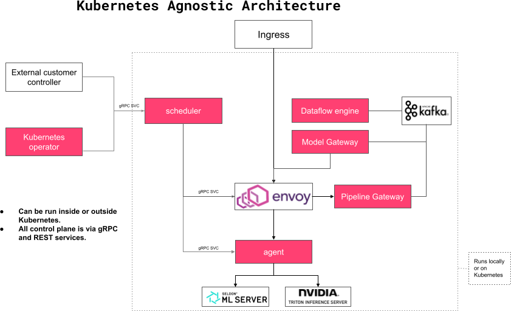
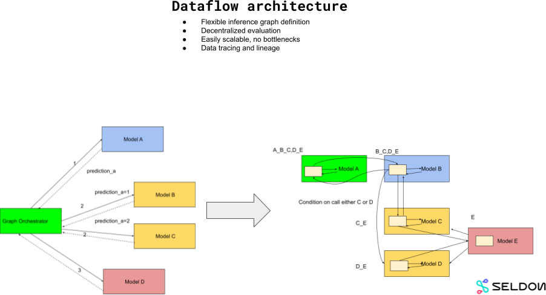
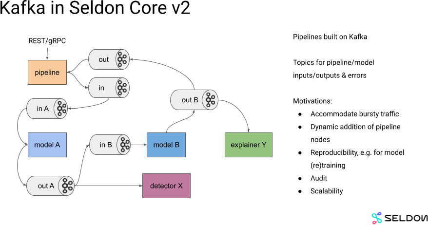
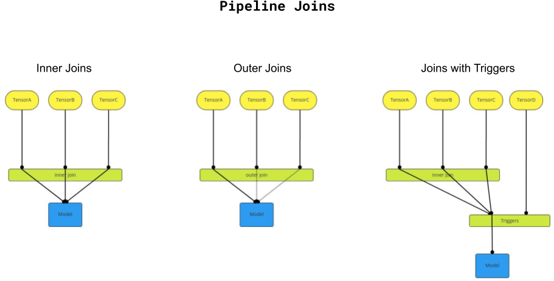

# Architecture

Seldon Core 2 architecture is based on microservices - a set of components, each with limited and well-defined responsibility working together to orchestrate scalable and fault tolerant ML serving features. They communicate internally using gRPC and they can be scaled independently depending on the use case.

These components can be split into two categories: **control** and **data** plane services.

## Control Plane

Control plane services provide features to the users such as the ability to instantiate a new inference server, load models, update a model to a new version, configure model experiments and pipelines, expose endpoints that may receive inference requests, etc. The main component is **Scheduler** that is responsible of managing loading and unloading of resources (models, pipelines, experiments) onto the respective components.

## Data Plane

Data plane services respond to inferences from users for resources that are currently loaded. Core 2 supports REST and gRPC payloads that follow the Open Inference Protocol (OIP). The main component is **Envoy**, which acts as a single ingress for all data plane load and routes them to the relevant servers internally (e.g. Seldon MLServer or NVidia Triton pods). 


**Note**: Core 2 architecture does not overlap control plane with data plane services. This means that when control plane services are down (e.g. Scheduler), data plane inference can still be served. In this manner the system is more resilient to failures and especially outage of control plane services does not impact the ability of the system to respond to end user traffic.

Currently Core 2 can be provisioned to be highly available on data plane services. Control plane on the other hand can be out and in this case any control plane operations could be delayed.


The current set of components used in Seldon Core 2 is shown below:

The core components are:

### Scheduler (control plane)
This service manages the load and unload of Models, Pipelines and Experiments.

### Agent (control plane)
This service manages the load and unload of models on a server and access to the server over REST/gRPC.

### Pipeline Gateway (data plane)
This service handles REST/gRPC calls to pipelines.

### Dataflow Engine (data plane)
This service handles the flow of data between components in a pipeline, using Kafka Streams.

### Model Gateway (data plane)
This service handles the flow of data from models to inference requests on servers and passes on the responses.

### Envoy (data plane)
This service manages the proxying of requests to the correct servers including load balancing.


**Note**: All the above are Kubernetes agnostic and can run locally, e.g. on Docker Compose.


### Controller (control plane)
We also provide a Kubernetes Operator to allow Kubernetes usage. This is implemented in Controller Manager micro service, which manages CRDs reconciliation with Scheduler.

## Dataflow Architecture (Pipelines)

Seldon Core 2 follows a dataflow design paradigm and it's part of the current movement for data centric machine learning. By taking a decentralized route that focuses on the flow of data users can have more flexibility and insight in building complex applications containing machine learning and traditional components. This contrasts with a more centralized orchestration more traditional in service orientated architectures.

### Kafka
Kafka is used as the backbone for Pipelines allowing a decentralized, synchronous and asynchronous usage. This enables Models to be connected together into arbitrary directed acyclic graphs. Models can be reused in different Pipelines. The flow of data between models is handled by the dataflow engine using [Kafka Streams](https://docs.confluent.io/platform/current/streams/concepts.html).

By focusing on the data we allow users to join various flows together using stream joining concepts as shown below.

We support several types of joins:
* _inner joins_, where all inputs need to be present for a transaction to join the tensors passed through the Pipeline;
* _outer joins_, where only a subset needs to be available during the join window
* _triggers_, in which data flows need to wait until records on one or more trigger data flows appear. The data in these triggers is not passed onwards from the join.

These techniques allow users to create complex pipeline flows of data between machine learning components.

More discussion on the data flow view of machine learning and its effect on v2 design can be found [here](dataflow.md).
