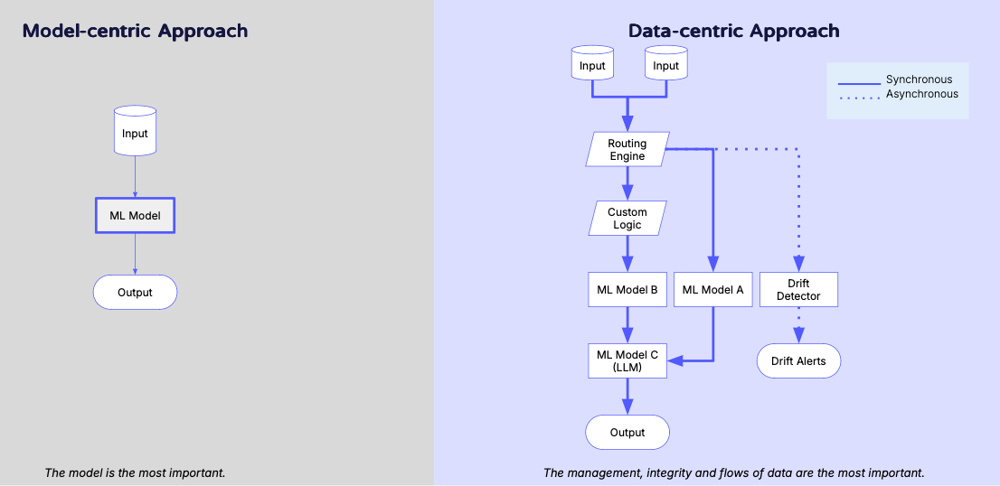
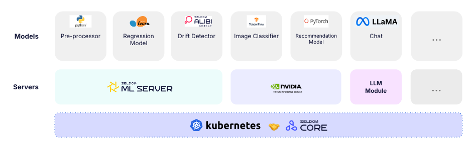

# Features

After the models are deployed, Core 2 enables the monitoring and experimentation on those systems in production. With support for a wide range of model types and design patterns to build around those models, you can standardize ML deployment across a range of use-cases in the cloud or on-premise, serving infrastructure of your choice. 



## Model Deployment

Seldon Core 2 orchestrates and scales machine learning components running as production-grade microservices. These components can be deployed locally or in enterprise-scale kubernetes clusters. The components of your ML system - such as models, processing steps, custom logic, or monitoring methods - are deployed as *Models*, leveraging serving solutions compatible with Core 2 such as MLServer, Alibi, LLM Module, or Triton Inference Server. These serving solutions package the required dependencies and standardize inference using the Open Inference Protocol. This ensures that all requests and responses follow a unified format regardless of your model types and use-cases. After models are deployed, they can process REST or gRPC requests for real-time inference.

## Complex Applications & Orchestration

Machine learning applications are increasingly complex. They've evolved from individual models deployed as services, to complex applications that can consist of multiple models, processing steps, custom logic, and asynchronous monitoring components. With Core you can build  Pipelines that connect any of these components to make data-centric applications. Core 2 handles orchestration and scaling of the underlying components of such an application, and exposes the data streamed through the application in real time using Kafka. 


Data-centricity is an approach that places the management, integrity, and flow of data at the core of the machine learning deployment framework. 


This approach to MLOps, influenced by our position paper [Desiderata for next generation of ML model serving](https://arxiv.org/abs/2210.14665), enables real-time observability, insight, and control on the behavior, and performance of your ML systems.  

Lastly, Core 2 provides Experiments as part of its orchestration capabilities, enabling users to implement routing logic such as A/B tests or Canary deployments to models or pipelines in production. After experiments are run, you can promote new models or pipelines or launch new experiments so that you can continuously improve the performance of your ML applications.

## Resource Management

In Seldon Core 2 your models are deployed on inference servers, which are software that manage the packaging and execution of ML workloads. Core 2 separates out **Servers** and **Models** as separate resources as part of its design. This approach enables flexible allocation of models to servers aligning with your models' requirements and your infrastructure. Core 2 also provides functionality to autoscale your models and servers up and down as needed based on your workload requirements or user-defined metrics.

With the modular design of Core 2, users are able to implement cutting-edge methods to minimize hardware costs:

- **Multi-model serving** consolidates multiple models onto shared inference servers to optimize resource utilization and decrease the number of servers required..
- **Overcommit** allows you to provision more models than the available memory would normally allow by dynamically loading and unloading models from memory to disk based on demand.

## End-to-End MLOps with Core 2

Core 2 demonstrates the power of a standardized, data-centric approach to MLOps at scale, ensuring that data observability and management are prioritized across every layer of machine learning operations. Furthermore, Core 2 seamlessly integrates into end-to-end MLOps workflows, from CI/CD, managing traffic with the service mesh of your choice, alerting, data visualization, or authentication and authorization.

This modular, flexible architecture not only supports diverse deployment patterns but also ensures compatibility with the latest AI innovations. By embedding data-centricity and adaptability into its foundation, Core 2 equips organizations to scale and improve their machine learning systems effectively to capture value from increasingly complex AI systems.

## Next Steps

- [Install Seldon Core 2](./getting-started/README.md)
- Explore our [Tutorials](./examples/README.md)
- [Join our Slack Community](https://seldondev.slack.com/join/shared_invite/zt-vejg6ttd-ksZiQs3O_HOtPQsen_labg#/shared-invite/email) for updates or for answers to any questions
