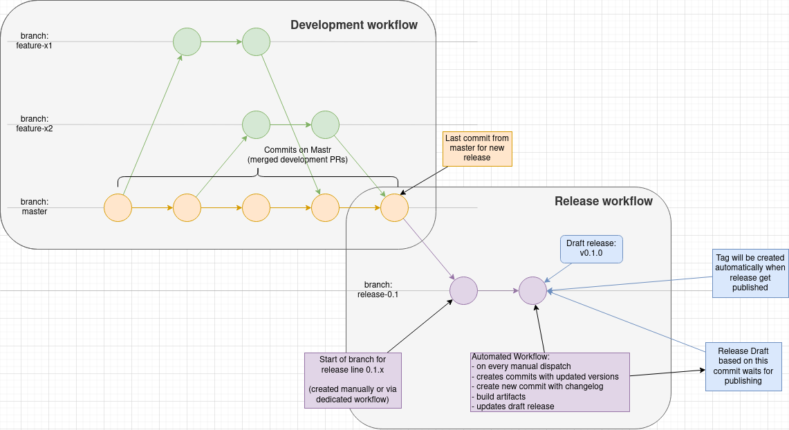
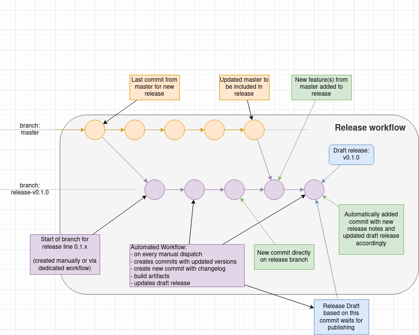
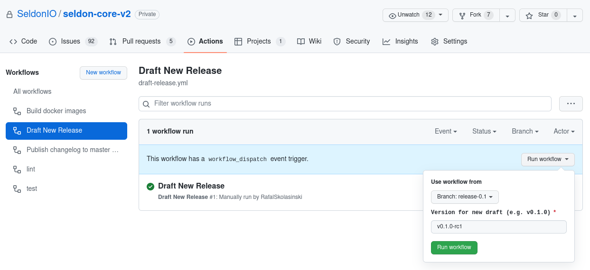
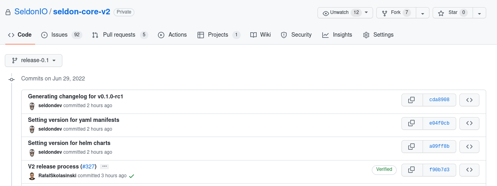
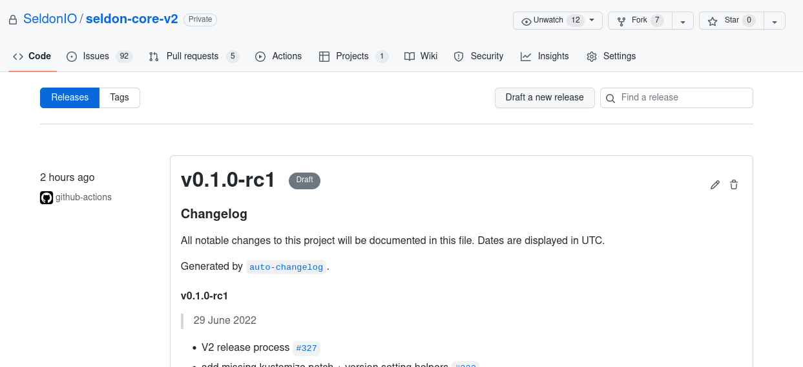
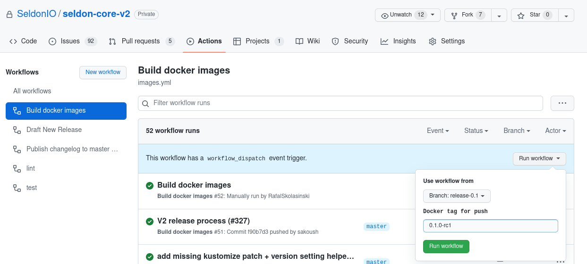

# Release Process

This document summarizes the release process for Seldon Core v2.
It is aimed mainly at the maintainers.


This is a work in progress.

This is an early version of the release process, which is subject to change.
Please, always check this document before conducting a release, and verify if everything goes as expected.


## Process Summary

1. Cut branch for release, e.g. `release-0.1`
2. Run "Draft New Release" workflow (e.g. choose `release-0.1` branch and `v0.1.0-rc1` version)
3. Run "Build docker images" workflow (e.g. choose `release-0.1` branch and `0.1.0-rc1` tag)
4. Verify correctness of created artifacts and images (not yet automated!)
5. Publish release
6. Publish tags for the Go modules


## Process discussion

The development process follows a standard GitHub workflow.



The main development is happening in the `v2` branch.
This is where new features land through Pull Requests.
When all features for a new release have been merged, for example `v0.1.0`, we cut a branch for that release, e.g. `release-0.1`.

The `release-0.1` branch will be the base for the `v0.1.0` release as well as the release candidates, i.e. `v0.1.0-rcX`, and successive patch releases, i.e. `v0.1.X`.
We use GitHub Actions to prepare the release, build images and run all necessary testing.

If the release draft needs to be updated before being published, the new commits should be merged into the `release-0.1` branch and relevant workflows re-triggered as required.




### Draft New Release Action

The [Draft New Release](https://github.com/SeldonIO/seldon-core/blob/v2/.github/workflows/draft-release.yml) workflow is the
first one to run. It must be triggered manually using the [Actions](https://github.com/SeldonIO/seldon-core/actions/workflows/draft-release.yml)
interface in the GitHub UI.

When triggering the workflow, you must:
- Select the release branch (here `release-0.1`)
- Specify the release `version` (here `v0.1.0-rc1`)



This workflow cannot run on the `v2` branch.

It will validate the provided `version` against a SemVer regex.

It will create a few commits with:
- Updated Helm charts
- Updated Kubernetes YAML manifests
- An updated changelog



Once the workflow finishes, you will find a new release draft waiting to be published.



> :warning: **NOTE:** Before publishing the release, run the images build workflow and necessary tests (not yet automated)!


### Build docker images Action

The [Build docker images](https://github.com/SeldonIO/seldon-core/blob/v2/.github/workflows/images.yml) workflow is the
second one to run. It must be triggered manually using the [Actions](https://github.com/SeldonIO/seldon-core/actions/workflows/draft-release.yml)
interface in the GitHub UI.

When triggering the workflow, you must:
- Select the release branch (here `release-0.1`)
- Specify the release `version`, e.g. `0.1.0-rc1`
  - Note the lack of the `v` prefix here



This workflow will then run unit tests and build a series of Docker images that will be automatically pushed to
[DockerHub](https://hub.docker.com/).


### Add Go module tags

Go module versions are mapped to VCS versions via semantic version tags.
This process is described in the [Go documentation](https://go.dev/ref/mod#vcs-version).

As we have multiple Go modules in subdirectories of the repository, we need to use corresponding prefixes for our git tags.
From the above link on mapping versions to commits:
> If a module is defined in a subdirectory within the repository, that is, the module subdirectory portion of the module
path is not empty, then each tag name must be prefixed with the module subdirectory, followed by a slash. For example,
the module golang.org/x/tools/gopls is defined in the gopls subdirectory of the repository with root path
golang.org/x/tools. The version v0.4.0 of that module must have the tag named gopls/v0.4.0 in that repository.

Thus, for any given release, we should have one tag for the release as a whole plus one corresponding tag for every Go module.
At the time of writing, this comprises:
* `apis/go`
* `components/tls`
* `hodometer`
* `operator`
* `scheduler`


Adding these tags is currently a **manual** process.


To add the appropriate tags:
* Check out the relevant tag, e.g.
  ```sh
  git checkout v2.4.0
  ```
* Find all relevant Go modules and identify their subdirectory paths, e.g. with
  ```sh
  find . -name go.mod -exec sed -n '1 { s|^module.*seldon-core/||; s|/v2$||; p }' {} \;
  ```
* Add corresponding tags for each module, e.g.
  ```sh
  git tag apis/go/v2.4.0 v2.4.0
  ```
* Confirm that all tags point to the same place, e.g. with
  ```sh
  git tag --contains v2.4.0
  ```
* Push the tags to the upstream repository, e.g.
  ```sh
  git push <upstream name> apis/go/v2.4.0 components/tls/v2.4.0 ...
  ```

If you are feeling confident in the process, you can chain these together into a longer pipeline.
In any case, it is best to confirm that the tags appear as expected both via the git CLI and also in the GitHub UI.


A short list of commands to cover all above in single go is:
```bash
VERSION=v2.4.0
git tag apis/go/${VERSION} ${VERSION}
git tag components/tls/${VERSION} ${VERSION}
git tag hodometer/${VERSION} ${VERSION}
git tag operator/${VERSION} ${VERSION}
git tag scheduler/${VERSION} ${VERSION}

git push origin apis/go/${VERSION}
git push origin components/tls/${VERSION}
git push origin hodometer/${VERSION}
git push origin operator/${VERSION}
git push origin scheduler/${VERSION}
```
