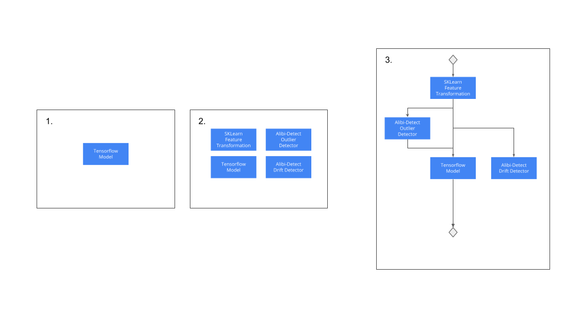

# Workflow, Examples and Tutorials

## Workflows

Seldon inference is built from atomic Model components. Models as [shown here](../models/inference-artifacts.md)
cover a wide range of artifacts including:

* Core machine learning models, e.g. a PyTorch model.
* Feature transformations that might be built with custom python code.
* Drift detectors.
* Outlier detectors.
* Explainers
* Adversarial detectors.

A typical workflow for a production machine learning setup might be as follows:

1. You create a Tensorflow model for your core application use case and test this model in isolation to validate.
2. You create SKLearn feature transformation component before your model to convert the input into the correct
form for your model. You also create Drift and Outlier detectors using Seldon's open source Alibi-detect library
and test these in isolation.
3. You join these components together into a Pipeline for the final production setup.

These steps are shown in the diagram below:

## Examples & Tutorials

This section will provide some examples to allow operations with Seldon to be tested so you can run your own
models, experiments, pipelines and explainers.

## Getting Started Examples

* [Local examples](local-examples.md)
* [Kubernetes examples](k8s-examples.md)

## Models

* [Huggingface models](huggingface.md)
* [Model zoo](model-zoo.md)
* [Artifact versions](multi-version.md)

## Pipelines

* [Pipeline examples](pipeline-examples.md)
* [Pipeline to pipeline examples](pipeline-to-pipeline.md)

## Explainers

* [Explainer examples](explainer-examples.md)

## Servers

* [Custom Servers](custom-servers.md)

## Experiments

* [Local experiments](local-experiments.md)
* [Experiment version examples](experiment-versions.md)

## Making Inference Requests

* [Inference examples](inference.md)
* [Tritonclient examples](tritonclient-examples.md)
* [Batch Inference examples (kubernetes)](batch-examples-k8s.md)
* [Batch Inference examples (local)](batch-examples-local.md)

## Misc

* [Checking Pipeline readiness](pipeline-ready-and-metadata.md)
* [Local Overcommit](local-overcommit-examples)

## Further Kubernetes Examples

* [Kubernetes custerwide example](k8s-clusterwide.md)

## Advanced Examples

* [Huggingface speech to sentiment with explanations pipeline](speech-to-sentiment.md)
* [Production image classifier with drift and outlier monitoring](cifar10.md)
* [Production income classifier with drift, outlier and explanations](income.md)
* [Conditional pipeline with pandas query model](pandasquery.md)
* [Kubernetes Server with PVC](k8s-pvc.md)
