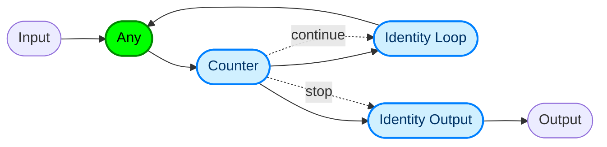

# Cyclic Pipeline

Learn how to deploy a cyclic pipeline using Core 2. In this example, you'll build a simple counter that begins at a user-defined starting value and increments by one until it reaches 10. If the starting value is already greater than 10, the pipeline terminates immediately without running.

## Before you begin

1. Ensure that you have [installed Seldon Core 2](../installation/production-environment/README.md#installing-seldon-core-2) in the namespace `seldon-mesh`.

2. Ensure that you are performing these steps in the directory where you have downloaded the [samples](https://github.com/SeldonIO/seldon-core/tree/v2/samples).

3. Get the IP address of the Seldon Core 2 instance running with Istio:

  ```bash
  ISTIO_INGRESS=$(kubectl get svc seldon-mesh -n seldon-mesh -o jsonpath='{.status.loadBalancer.ingress[0].ip}')

  echo "Seldon Core 2: http://$ISTIO_INGRESS"
  ```
  
  Make a note of the IP address that is displayed in the output. Replace <INGRESS_IP> with your service mesh's ingress IP address in the following commands.
  

## Models

Start by implementing the first model: a simple counter.

```python
from mlserver.model import MLModel
from mlserver.codecs import NumpyCodec, StringCodec
from mlserver.types import InferenceRequest, InferenceResponse
from mlserver.logging import logger


class Counter(MLModel):
    async def load(self) -> bool:
        self.ready = True
        return self.ready

    async def predict(self, payload: InferenceRequest) -> InferenceResponse:
        x = NumpyCodec.decode_input(payload.inputs[0]) + 1
        message = "continue" if x.item() < 10 else "stop"
        return InferenceResponse(
            model_name=self.name,
            model_version=self.version,
            outputs=[
                NumpyCodec.encode_output(
                    name="output",
                    payload=x
                ),
                StringCodec.encode_output(
                    name=message,
                    payload=[""]
                ),
            ]
        )
```

This model produces two output tensors. The first contains the incremented number, while the second is an empty tensor labeled either continue or stop. This second tensor acts as a trigger, directing the data flow through either the feedback loop or the output path.
For more information on triggering tensors, see the [intro to pipelines page](../pipelines.md).

Next, define the second model — an identity model:

```python
import asyncio
from mlserver.logging import logger
from mlserver import MLModel, ModelSettings
from mlserver.types import (
    InferenceRequest, InferenceResponse, ResponseOutput
)


class IdentityModel(MLModel):
    def __init__(self, settings: ModelSettings):
        super().__init__(settings)
        self.params = settings.parameters
        self.extra = self.params.extra if self.params is not None else None
        self.delay = self.extra.get("delay", 0)
        

    async def load(self) -> bool:
        self.ready = True
        return self.ready

    async def predict(self, payload: InferenceRequest) -> InferenceResponse:
        if self.delay:
            await asyncio.sleep(self.delay)
        
        return InferenceResponse(
            model_name=self.name,
            model_version=self.version,
            outputs=[
                ResponseOutput(
                    name=request_input.name,
                    shape=request_input.shape,
                    datatype=request_input.datatype,
                    parameters=request_input.parameters,
                    data=request_input.data
                ) for request_input in payload.inputs
            ]
        )
```

The identity model simply passes the input tensors through to the output while introducing a delay. This delay is crucial for preventing infinite loops in the pipeline, which can occur due to the join interval behavior in Kafka Streams. For further details, see [Kafka documentation](https://kafka.apache.org/documentation/).

## Pipeline

This counter application pipeline consists of three models: the counter model, an identity model for the feedback loop, and another identity model for the output. The structure of the pipeline is illustrated as follows:



## Models deployment

To deploy the pipeline, you need to load each model into the cluster. The `model-settings.json` configuration for the counter model is as follows:

```json
{
    "name": "counter",
    "implementation": "model.Counter",
    "parameters": {
        "version": "v0.1.0"
    }
}
```

For the identity feedback loop model, reuse the `model-settings.json` file and configure it to include a 1-millisecond delay:

```json
{
    "name": "identity-loop",
    "implementation": "model.IdentityModel",
    "parameters": {
        "version": "v0.1.0",
        "extra": {
            "delay": 0.001
        }
    }
}
```
The one-millisecond delay is crucial to prevent infinite loops in the pipeline. It aligns with the join window applied to all input types for the counter model, as well as the join window configured for the identity model, which is specified in the pipeline definition.

Similarly, for the identity output model, reuse the same `model-settings.json` file without introducing any delay.

```json
{
    "name": "identity-output",
    "implementation": "model.IdentityModel",
    "parameters": {
        "version": "v0.1.0"
    }
}
```

The manifest files for the three models are the following:

```bash
cat ./models/counter.yaml
```

```yaml
apiVersion: mlops.seldon.io/v1alpha1
kind: Model
metadata:
  name: counter
spec:
  storageUri: "gs://seldon-models/scv2/examples/cyclic-pipeline/counter"
  requirements:
  - mlserver
```

```bash
cat ./models/identity-loop.yaml
```

```yaml
apiVersion: mlops.seldon.io/v1alpha1
kind: Model
metadata:
  name: identity-loop
spec:
  storageUri: "gs://seldon-models/scv2/examples/cyclic-pipeline/identity-loop"
  requirements:
  - mlserver
```

```bash
cat ./models/identity-output.yaml
```

```yaml
apiVersion: mlops.seldon.io/v1alpha1
kind: Model
metadata:
  name: identity-output
spec:  
  storageUri: "gs://seldon-models/scv2/examples/cyclic-pipeline/identity-output"
  requirements:
  - mlserver
```

To deploy the models, use the following command:

```bash
kubectl apply -f - --namespace=seldon-mesh <<EOF
apiVersion: mlops.seldon.io/v1alpha1
kind: Model
metadata:
  name: counter
spec:
  storageUri: "gs://seldon-models/scv2/examples/cyclic-pipeline/counter"
  requirements:
    - mlserver
EOF
```
```bash
kubectl apply -f - --namespace=seldon-mesh <<EOF
apiVersion: mlops.seldon.io/v1alpha1
kind: Model
metadata:
  name: identity-loop
spec:
  storageUri: "gs://seldon-models/scv2/examples/cyclic-pipeline/identity-loop"
  requirements:
    - mlserver
EOF
```
```bash
kubectl apply -f - --namespace=seldon-mesh <<EOF
apiVersion: mlops.seldon.io/v1alpha1
kind: Model
metadata:
  name: identity-output
spec:
  storageUri: "gs://seldon-models/scv2/examples/cyclic-pipeline/identity-output"
  requirements:
    - mlserver
EOF
```
```bash
kubectl wait --for condition=ready --timeout=300s model --all -n seldon-mesh

```
```outputs
model.mlops.seldon.io/counter condition met
model.mlops.seldon.io/identity-loop condition met
model.mlops.seldon.io/identity-output condition met
```


## Pipeline deployment

After the models are deployed, proceed to deploy the pipeline. The pipeline manifest file is defined as follows:

```yaml
apiVersion: mlops.seldon.io/v1alpha1
kind: Pipeline
metadata:
  name: counter-pipeline
spec:
  allowCycles: true
  maxStepRevisits: 100
  steps:
  - name: counter
    inputsJoinType: any
    inputs:
    - counter-pipeline.inputs
    - identity-loop.outputs
  - name: identity-output
    joinWindowMs: 1
    inputs:
    - counter.outputs
    triggers:
    - counter.outputs.stop
  - name: identity-loop
    joinWindowMs: 1
    inputs:
    - counter.outputs.output
    triggers:
    - counter.outputs.continue
  output:
    steps:
    - identity-output.outputs
```

**Note**: that the `joinWindowMs` parameter is set to 1 millisecond for both the identity loop and identity output models. This setting is essential to prevent messages from different iterations from being joined (e.g., a message from iteration `t` being joined with messages from iterations `t-1, t-2, ..., 1`). Additionally, we limit the number of step revisits to 100 — the maximum number of times the pipeline can revisit a step during execution. While our pipeline behaves deterministically and is guaranteed to terminate, this parameter is especially useful in cyclic pipelines where a terminal state might not be reached (e.g., agentic workflows where control flow is determined by an LLM). It helps safeguard against infinite loops.

To deploy the pipeline, use the following command:

```bash
kubectl create -f counter-pipeline.yaml -n seldon-mesh
```
```outputs
pipeline.mlops.seldon.io/counter-pipeline created
```

## Testing the pipeline

To send a request to the pipeline, use the following command:



```bash
curl -k http://<INGRESS_IP>:80/v2/models/counter-pipeline/infer \
  -H "Host: seldon-mesh.inference.seldon" \
  -H "Seldon-Model: counter-pipeline.pipeline" \
  -H "Content-Type: application/json" \
  -d '{
    "inputs": [
      {
        "name": "counter-pipeline.inputs",
        "datatype": "INT32",
        "shape": [1],
        "data": [0]
      }
    ]
  }' | jq -M .
```   

```bash
{
  "model_name": "",
  "outputs": [
    {
      "data": [
        10
      ],
      "name": "output",
      "shape": [
        1,
        1
      ],
      "datatype": "INT32",
      "parameters": {
        "content_type": "np"
      }
    },
    {
      "data": [
        ""
      ],
      "name": "stop",
      "shape": [
        1,
        1
      ],
      "datatype": "BYTES",
      "parameters": {
        "content_type": "str"
      }
    }
  ]
}
```



```bash
seldon pipeline infer counter-pipeline --inference-host <INGRESS_IP>:80\
  '{"inputs":[{"name":"counter-pipeline.inputs","shape":[1],"datatype":"INT32","data":[0]}]}' | jq -M .
```

```bash
{
  "model_name": "",
  "outputs": [
    {
      "data": [
        10
      ],
      "name": "output",
      "shape": [
        1,
        1
      ],
      "datatype": "INT32",
      "parameters": {
        "content_type": "np"
      }
    },
    {
      "data": [
        ""
      ],
      "name": "stop",
      "shape": [
        1,
        1
      ],
      "datatype": "BYTES",
      "parameters": {
        "content_type": "str"
      }
    }
  ]
}
```




This request initiates the pipeline with an input value of 0. The pipeline increments this value step by step until it reaches 10, at which point it stops. The response includes the final counter value, 10, along with a message indicating that the pipeline has terminated.

## Cleanup
To clean up the models and the pipeline, use the following commands:

```bash
kubectl delete pipeline counter-pipeline -n seldon-mesh
```
```outputs
pipeline.mlops.seldon.io "counter-pipeline" deleted
```

```bash
kubectl delete model identity-loop -n seldon-mesh
kubectl delete model identity-output -n seldon-mesh
kubectl delete model counter -n seldon-mesh
```

```outputs
model.mlops.seldon.io "identity-loop" deleted
model.mlops.seldon.io "identity-output" deleted
model.mlops.seldon.io "counter" deleted
```

