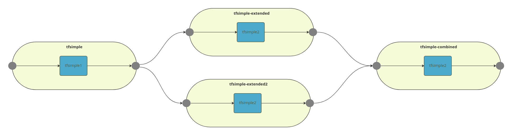

# Pipeline to pipeline examples

This examples illustrates a series of Pipelines that are joined together.

## Before you begin

1. Ensure that you have [installed Seldon Core 2](../installation/production-environment/#installing-seldon-core-2) in the namespace `seldon-mesh`.
2. Ensure that you are performing these steps in the directory where you have downloaded the [samples](https://github.com/SeldonIO/seldon-core/tree/v2/samples).
3. Get the IP address of the Seldon Core 2 instance running with Istio:

```bash
ISTIO_INGRESS=$(kubectl get svc seldon-mesh -n seldon-mesh -o jsonpath='{.status.loadBalancer.ingress[0].ip}')

echo "Seldon Core 2: http://$ISTIO_INGRESS"
```


Make a note of the IP address that is displayed in the output. Replace \<INGRESS\_IP> with your service mesh's ingress IP address in the following commands.


### Models Used

* `gs://seldon-models/triton/simple` an example Triton tensorflow model that takes 2\
  inputs INPUT0 and INPUT1 and adds them to produce OUTPUT0 and also subtracts `INPUT1`\
  from `INPUT0` to produce OUTPUT1. See [here](https://github.com/triton-inference-server/server/tree/main/docs/examples/model_repository/simple)\
  for the original source code and license.
* Other models can be found at https://github.com/SeldonIO/triton-python-examples

### Pipeline pulling from one other Pipeline


```bash
cat ./models/tfsimple1.yaml
cat ./models/tfsimple2.yaml
```

```yaml
apiVersion: mlops.seldon.io/v1alpha1
kind: Model
metadata:
  name: tfsimple1
spec:
  storageUri: "gs://seldon-models/triton/simple"
  requirements:
  - tensorflow
  memory: 100Ki
apiVersion: mlops.seldon.io/v1alpha1
kind: Model
metadata:
  name: tfsimple2
spec:
  storageUri: "gs://seldon-models/triton/simple"
  requirements:
  - tensorflow
  memory: 100Ki

```

```bash
kubectl create -f ./models/tfsimple1.yaml -n seldon-mesh
kubectl create -f ./models/tfsimple2.yaml -n seldon-mesh
```

```output
model.mlops.seldon.io/tfsimple1 created
model.mlops.seldon.io/tfsimple2 created
```

```bash
kubectl wait --for condition=ready --timeout=300s model --all -n seldon-mesh
```

```outputs
model.mlops.seldon.io/tfsimple1 condition met
model.mlops.seldon.io/tfsimple2 condition met
```

```bash
cat ./pipelines/tfsimple.yaml
```

```yaml
apiVersion: mlops.seldon.io/v1alpha1
kind: Pipeline
metadata:
  name: tfsimple
spec:
  steps:
    - name: tfsimple1
  output:
    steps:
    - tfsimple1

```

```bash
kubectl create -f ./pipelines/tfsimple.yaml -n seldon-mesh
```

```outputs
pipeline.mlops.seldon.io/tfsimple created

```

```bash
kubectl wait --for condition=ready --timeout=300s pipeline --all -n seldon-mesh
```

```outputs
pipeline.mlops.seldon.io/tfsimple condition met
```



```bash
curl -k http://<INGRESS_IP>:80/v2/models/tfsimple/infer \
  -H "Host: seldon-mesh.inference.seldon" \
  -H "Content-Type: application/json" \
  -H "Seldon-Model: tfsimple.pipeline" \
  -d '{
    "inputs": [
      {
        "name": "INPUT0",
        "datatype": "INT32",
        "shape": [1,16],
        "data": [1,2,3,4,5,6,7,8,9,10,11,12,13,14,15,16]
      },
      {
        "name": "INPUT1",
        "datatype": "INT32",
        "shape": [1,16],
        "data": [1,2,3,4,5,6,7,8,9,10,11,12,13,14,15,16]
      }
    ]
  }' | jq -M .
```

```json
{
  "model_name": "",
  "outputs": [
    {
      "data": [
        2,
        4,
        6,
        8,
        10,
        12,
        14,
        16,
        18,
        20,
        22,
        24,
        26,
        28,
        30,
        32
      ],
      "name": "OUTPUT0",
      "shape": [
        1,
        16
      ],
      "datatype": "INT32"
    },
    {
      "data": [
        0,
        0,
        0,
        0,
        0,
        0,
        0,
        0,
        0,
        0,
        0,
        0,
        0,
        0,
        0,
        0
      ],
      "name": "OUTPUT1",
      "shape": [
        1,
        16
      ],
      "datatype": "INT32"
    }
  ]
}
```



```bash
seldon pipeline infer tfsimple --inference-host <INGRESS_IP>:80\
    '{"inputs":[{"name":"INPUT0","data":[1,2,3,4,5,6,7,8,9,10,11,12,13,14,15,16],"datatype":"INT32","shape":[1,16]},{"name":"INPUT1","data":[1,2,3,4,5,6,7,8,9,10,11,12,13,14,15,16],"datatype":"INT32","shape":[1,16]}]}' | jq -M .
```

```json
{
  "model_name": "",
  "outputs": [
    {
      "data": [
        2,
        4,
        6,
        8,
        10,
        12,
        14,
        16,
        18,
        20,
        22,
        24,
        26,
        28,
        30,
        32
      ],
      "name": "OUTPUT0",
      "shape": [
        1,
        16
      ],
      "datatype": "INT32"
    },
    {
      "data": [
        0,
        0,
        0,
        0,
        0,
        0,
        0,
        0,
        0,
        0,
        0,
        0,
        0,
        0,
        0,
        0
      ],
      "name": "OUTPUT1",
      "shape": [
        1,
        16
      ],
      "datatype": "INT32"
    }
  ]
}

```



```bash
cat ./pipelines/tfsimple-extended.yaml
```

```yaml
apiVersion: mlops.seldon.io/v1alpha1
kind: Pipeline
metadata:
  name: tfsimple-extended
spec:
  input:
    externalInputs:
      - tfsimple.outputs
    tensorMap:
      tfsimple.outputs.OUTPUT0: INPUT0
      tfsimple.outputs.OUTPUT1: INPUT1
  steps:
    - name: tfsimple2
  output:
    steps:
    - tfsimple2

```

```bash
kubectl create -f ./pipelines/tfsimple-extended.yaml -n seldon-mesh
```

```outputs
pipeline.mlops.seldon.io/tfsimple-extended created

```

```bash
kubectl wait --for condition=ready --timeout=300s pipeline --all -n seldon-mesh
```

```outputs
pipeline.mlops.seldon.io/tfsimple-extended condition met
```



```bash
curl -k http://<INGRESS_IP>:80/v2/models/tfsimple/infer \
  -H "Host: seldon-mesh.inference.seldon" \
  -H "Seldon-Model: tfsimple.pipeline" \
  -H "x-request-id: test-id" \
  -H "Content-Type: application/json" \
  -d '{
    "inputs": [
      {
        "name": "INPUT0",
        "datatype": "INT32",
        "shape": [1,16],
        "data": [1,2,3,4,5,6,7,8,9,10,11,12,13,14,15,16]
      },
      {
        "name": "INPUT1",
        "datatype": "INT32",
        "shape": [1,16],
        "data": [1,2,3,4,5,6,7,8,9,10,11,12,13,14,15,16]
      }
    ]
  }' | jq -M .

```

```json
{
  "model_name": "",
  "outputs": [
    {
      "data": [
        2,
        4,
        6,
        8,
        10,
        12,
        14,
        16,
        18,
        20,
        22,
        24,
        26,
        28,
        30,
        32
      ],
      "name": "OUTPUT0",
      "shape": [
        1,
        16
      ],
      "datatype": "INT32"
    },
    {
      "data": [
        0,
        0,
        0,
        0,
        0,
        0,
        0,
        0,
        0,
        0,
        0,
        0,
        0,
        0,
        0,
        0
      ],
      "name": "OUTPUT1",
      "shape": [
        1,
        16
      ],
      "datatype": "INT32"
    }
  ]
}
```



```bash
seldon pipeline infer tfsimple --header x-request-id=test-id --inference-host <INGRESS_IP>:80 \
    '{"inputs":[{"name":"INPUT0","data":[1,2,3,4,5,6,7,8,9,10,11,12,13,14,15,16],"datatype":"INT32","shape":[1,16]},{"name":"INPUT1","data":[1,2,3,4,5,6,7,8,9,10,11,12,13,14,15,16],"datatype":"INT32","shape":[1,16]}]}'
```

```json
{
	"model_name": "",
	"outputs": [
		{
			"data": [
				2,
				4,
				6,
				8,
				10,
				12,
				14,
				16,
				18,
				20,
				22,
				24,
				26,
				28,
				30,
				32
			],
			"name": "OUTPUT0",
			"shape": [
				1,
				16
			],
			"datatype": "INT32"
		},
		{
			"data": [
				0,
				0,
				0,
				0,
				0,
				0,
				0,
				0,
				0,
				0,
				0,
				0,
				0,
				0,
				0,
				0
			],
			"name": "OUTPUT1",
			"shape": [
				1,
				16
			],
			"datatype": "INT32"
		}
	]
}

```



```bash
seldon pipeline inspect tfsimple
```

```bash
seldon.default.model.tfsimple1.inputs	test-id	{"inputs":[{"name":"INPUT0", "datatype":"INT32", "shape":["1", "16"], "contents":{"intContents":[1, 2, 3, 4, 5, 6, 7, 8, 9, 10, 11, 12, 13, 14, 15, 16]}}, {"name":"INPUT1", "datatype":"INT32", "shape":["1", "16"], "contents":{"intContents":[1, 2, 3, 4, 5, 6, 7, 8, 9, 10, 11, 12, 13, 14, 15, 16]}}]}
seldon.default.model.tfsimple1.outputs	test-id	{"modelName":"tfsimple1_1", "modelVersion":"1", "outputs":[{"name":"OUTPUT0", "datatype":"INT32", "shape":["1", "16"], "contents":{"intContents":[2, 4, 6, 8, 10, 12, 14, 16, 18, 20, 22, 24, 26, 28, 30, 32]}}, {"name":"OUTPUT1", "datatype":"INT32", "shape":["1", "16"], "contents":{"intContents":[0, 0, 0, 0, 0, 0, 0, 0, 0, 0, 0, 0, 0, 0, 0, 0]}}]}
seldon.default.pipeline.tfsimple.inputs	test-id	{"inputs":[{"name":"INPUT0", "datatype":"INT32", "shape":["1", "16"], "contents":{"intContents":[1, 2, 3, 4, 5, 6, 7, 8, 9, 10, 11, 12, 13, 14, 15, 16]}}, {"name":"INPUT1", "datatype":"INT32", "shape":["1", "16"], "contents":{"intContents":[1, 2, 3, 4, 5, 6, 7, 8, 9, 10, 11, 12, 13, 14, 15, 16]}}]}
seldon.default.pipeline.tfsimple.outputs	test-id	{"outputs":[{"name":"OUTPUT0", "datatype":"INT32", "shape":["1", "16"], "contents":{"intContents":[2, 4, 6, 8, 10, 12, 14, 16, 18, 20, 22, 24, 26, 28, 30, 32]}}, {"name":"OUTPUT1", "datatype":"INT32", "shape":["1", "16"], "contents":{"intContents":[0, 0, 0, 0, 0, 0, 0, 0, 0, 0, 0, 0, 0, 0, 0, 0]}}]}

```

```bash
seldon pipeline inspect tfsimple-extended
```

```bash
seldon.default.model.tfsimple2.inputs	test-id	{"inputs":[{"name":"INPUT0", "datatype":"INT32", "shape":["1", "16"], "contents":{"intContents":[2, 4, 6, 8, 10, 12, 14, 16, 18, 20, 22, 24, 26, 28, 30, 32]}}, {"name":"INPUT1", "datatype":"INT32", "shape":["1", "16"], "contents":{"intContents":[0, 0, 0, 0, 0, 0, 0, 0, 0, 0, 0, 0, 0, 0, 0, 0]}}], "rawInputContents":["AgAAAAQAAAAGAAAACAAAAAoAAAAMAAAADgAAABAAAAASAAAAFAAAABYAAAAYAAAAGgAAABwAAAAeAAAAIAAAAA==", "AAAAAAAAAAAAAAAAAAAAAAAAAAAAAAAAAAAAAAAAAAAAAAAAAAAAAAAAAAAAAAAAAAAAAAAAAAAAAAAAAAAAAA=="]}
seldon.default.model.tfsimple2.outputs	test-id	{"modelName":"tfsimple2_1", "modelVersion":"1", "outputs":[{"name":"OUTPUT0", "datatype":"INT32", "shape":["1", "16"], "contents":{"intContents":[2, 4, 6, 8, 10, 12, 14, 16, 18, 20, 22, 24, 26, 28, 30, 32]}}, {"name":"OUTPUT1", "datatype":"INT32", "shape":["1", "16"], "contents":{"intContents":[2, 4, 6, 8, 10, 12, 14, 16, 18, 20, 22, 24, 26, 28, 30, 32]}}]}
seldon.default.pipeline.tfsimple-extended.inputs	test-id	{"inputs":[{"name":"INPUT0", "datatype":"INT32", "shape":["1", "16"], "contents":{"intContents":[2, 4, 6, 8, 10, 12, 14, 16, 18, 20, 22, 24, 26, 28, 30, 32]}}, {"name":"INPUT1", "datatype":"INT32", "shape":["1", "16"], "contents":{"intContents":[0, 0, 0, 0, 0, 0, 0, 0, 0, 0, 0, 0, 0, 0, 0, 0]}}], "rawInputContents":["AgAAAAQAAAAGAAAACAAAAAoAAAAMAAAADgAAABAAAAASAAAAFAAAABYAAAAYAAAAGgAAABwAAAAeAAAAIAAAAA==", "AAAAAAAAAAAAAAAAAAAAAAAAAAAAAAAAAAAAAAAAAAAAAAAAAAAAAAAAAAAAAAAAAAAAAAAAAAAAAAAAAAAAAA=="]}
seldon.default.pipeline.tfsimple-extended.outputs	test-id	{"outputs":[{"name":"OUTPUT0", "datatype":"INT32", "shape":["1", "16"], "contents":{"intContents":[2, 4, 6, 8, 10, 12, 14, 16, 18, 20, 22, 24, 26, 28, 30, 32]}}, {"name":"OUTPUT1", "datatype":"INT32", "shape":["1", "16"], "contents":{"intContents":[2, 4, 6, 8, 10, 12, 14, 16, 18, 20, 22, 24, 26, 28, 30, 32]}}]}

```

```bash
kubectl delete -f ./pipelines/tfsimple.yaml -n seldon-mesh
kubectl delete -f ./pipelines/tfsimple-extended.yaml -n seldon-mesh
```

```bash
kubectl delete -f ./models/tfsimple1.yaml -n seldon-mesh
kubectl delete -f ./models/tfsimple2.yaml -n seldon-mesh
```

### Pipeline pulling from two other Pipelines



```bash
cat ./models/tfsimple1.yaml
cat ./models/tfsimple2.yaml
```

```yaml
apiVersion: mlops.seldon.io/v1alpha1
kind: Model
metadata:
  name: tfsimple1
spec:
  storageUri: "gs://seldon-models/triton/simple"
  requirements:
  - tensorflow
  memory: 100Ki
apiVersion: mlops.seldon.io/v1alpha1
kind: Model
metadata:
  name: tfsimple2
spec:
  storageUri: "gs://seldon-models/triton/simple"
  requirements:
  - tensorflow
  memory: 100Ki

```

```bash
kubectl create -f ./models/tfsimple1.yaml -n seldon-mesh
kubectl create -f ./models/tfsimple2.yaml -n seldon-mesh
```

```output
model.mlops.seldon.io/tfsimple1 created
model.mlops.seldon.io/tfsimple2 created
```

```bash
kubectl wait --for condition=ready --timeout=300s model --all -n seldon-mesh
```

```outputs
model.mlops.seldon.io/tfsimple1 condition met
model.mlops.seldon.io/tfsimple2 condition met
```

```bash
cat ./pipelines/tfsimple.yaml
```

```yaml
apiVersion: mlops.seldon.io/v1alpha1
kind: Pipeline
metadata:
  name: tfsimple
spec:
  steps:
    - name: tfsimple1
  output:
    steps:
    - tfsimple1

```

```bash
kubectl create -f ./pipelines/tfsimple.yaml -n seldon-mesh
```

```outputs
pipeline.mlops.seldon.io/tfsimple created

```

```bash
kubectl wait --for condition=ready --timeout=300s pipeline --all -n seldon-mesh
```

```outputs
pipeline.mlops.seldon.io/tfsimple condition met
```



```bash
curl -k http://<INGRESS_IP>:80/v2/models/tfsimple/infer \
  -H "Host: seldon-mesh.inference.seldon" \
  -H "Content-Type: application/json" \
  -H "Seldon-Model: tfsimple.pipeline" \
  -d '{
    "inputs": [
      {
        "name": "INPUT0",
        "datatype": "INT32",
        "shape": [1,16],
        "data": [1,2,3,4,5,6,7,8,9,10,11,12,13,14,15,16]
      },
      {
        "name": "INPUT1",
        "datatype": "INT32",
        "shape": [1,16],
        "data": [1,2,3,4,5,6,7,8,9,10,11,12,13,14,15,16]
      }
    ]
  }' | jq -M .
```

```json
{
  "model_name": "",
  "outputs": [
    {
      "data": [
        2,
        4,
        6,
        8,
        10,
        12,
        14,
        16,
        18,
        20,
        22,
        24,
        26,
        28,
        30,
        32
      ],
      "name": "OUTPUT0",
      "shape": [
        1,
        16
      ],
      "datatype": "INT32"
    },
    {
      "data": [
        0,
        0,
        0,
        0,
        0,
        0,
        0,
        0,
        0,
        0,
        0,
        0,
        0,
        0,
        0,
        0
      ],
      "name": "OUTPUT1",
      "shape": [
        1,
        16
      ],
      "datatype": "INT32"
    }
  ]
}
```



```bash
seldon pipeline infer tfsimple --inference-host <INGRESS_IP>:80\
    '{"inputs":[{"name":"INPUT0","data":[1,2,3,4,5,6,7,8,9,10,11,12,13,14,15,16],"datatype":"INT32","shape":[1,16]},{"name":"INPUT1","data":[1,2,3,4,5,6,7,8,9,10,11,12,13,14,15,16],"datatype":"INT32","shape":[1,16]}]}' | jq -M .
```

```json
{
  "model_name": "",
  "outputs": [
    {
      "data": [
        2,
        4,
        6,
        8,
        10,
        12,
        14,
        16,
        18,
        20,
        22,
        24,
        26,
        28,
        30,
        32
      ],
      "name": "OUTPUT0",
      "shape": [
        1,
        16
      ],
      "datatype": "INT32"
    },
    {
      "data": [
        0,
        0,
        0,
        0,
        0,
        0,
        0,
        0,
        0,
        0,
        0,
        0,
        0,
        0,
        0,
        0
      ],
      "name": "OUTPUT1",
      "shape": [
        1,
        16
      ],
      "datatype": "INT32"
    }
  ]
}

```



```bash
cat ./pipelines/tfsimple-extended.yaml
echo "---"
cat ./pipelines/tfsimple-extended2.yaml
echo "---"
cat ./pipelines/tfsimple-combined.yaml
```

```yaml
apiVersion: mlops.seldon.io/v1alpha1
kind: Pipeline
metadata:
  name: tfsimple-extended
spec:
  input:
    externalInputs:
      - tfsimple.outputs
    tensorMap:
      tfsimple.outputs.OUTPUT0: INPUT0
      tfsimple.outputs.OUTPUT1: INPUT1
  steps:
    - name: tfsimple2
  output:
    steps:
    - tfsimple2
---
apiVersion: mlops.seldon.io/v1alpha1
kind: Pipeline
metadata:
  name: tfsimple-extended2
spec:
  input:
    externalInputs:
      - tfsimple.outputs
    tensorMap:
      tfsimple.outputs.OUTPUT0: INPUT0
      tfsimple.outputs.OUTPUT1: INPUT1
  steps:
    - name: tfsimple2
  output:
    steps:
    - tfsimple2
---
apiVersion: mlops.seldon.io/v1alpha1
kind: Pipeline
metadata:
  name: tfsimple-combined
spec:
  input:
    externalInputs:
      - tfsimple-extended.outputs.OUTPUT0
      - tfsimple-extended2.outputs.OUTPUT1
    tensorMap:
      tfsimple-extended.outputs.OUTPUT0: INPUT0
      tfsimple-extended2.outputs.OUTPUT1: INPUT1
  steps:
    - name: tfsimple2
  output:
    steps:
    - tfsimple2

```

```bash
kubectl create -f ./pipelines/tfsimple-extended.yaml -n seldon-mesh
kubectl create -f ./pipelines/tfsimple-extended2.yaml -n seldon-mesh
kubectl create -f ./pipelines/tfsimple-combined.yaml -n seldon-mesh
```

```outputs
pipeline.mlops.seldon.io/tfsimple-extended created
pipeline.mlops.seldon.io/tfsimple-extended2 created
pipeline.mlops.seldon.io/tfsimple-combined created

```

```bash
kubectl wait --for condition=ready --timeout=300s pipeline --all -n seldon-mesh
```

```outputs
pipeline.mlops.seldon.io/tfsimple-extended condition met
pipeline.mlops.seldon.io/tfsimple-extended2 condition met
pipeline.mlops.seldon.io/tfsimple-combined condition met
```



```bash
curl -k http://<INGRESS_IP>:80/v2/models/tfsimple/infer \
  -H "Host: seldon-mesh.inference.seldon" \
  -H "Seldon-Model: tfsimple.pipeline" \
  -H "x-request-id: test-id2" \
  -H "Content-Type: application/json" \
  -d '{
    "inputs": [
      {
        "name": "INPUT0",
        "datatype": "INT32",
        "shape": [1,16],
        "data": [1,2,3,4,5,6,7,8,9,10,11,12,13,14,15,16]
      },
      {
        "name": "INPUT1",
        "datatype": "INT32",
        "shape": [1,16],
        "data": [1,2,3,4,5,6,7,8,9,10,11,12,13,14,15,16]
      }
    ]
  }' | jq -M .
```

```json
{
  "model_name": "",
  "outputs": [
    {
      "data": [
        2,
        4,
        6,
        8,
        10,
        12,
        14,
        16,
        18,
        20,
        22,
        24,
        26,
        28,
        30,
        32
      ],
      "name": "OUTPUT0",
      "shape": [
        1,
        16
      ],
      "datatype": "INT32"
    },
    {
      "data": [
        0,
        0,
        0,
        0,
        0,
        0,
        0,
        0,
        0,
        0,
        0,
        0,
        0,
        0,
        0,
        0
      ],
      "name": "OUTPUT1",
      "shape": [
        1,
        16
      ],
      "datatype": "INT32"
    }
  ]
}
```



```bash
seldon pipeline infer tfsimple --header x-request-id=test-id2 --inference-host <INGRESS_IP>:80 \
    '{"inputs":[{"name":"INPUT0","data":[1,2,3,4,5,6,7,8,9,10,11,12,13,14,15,16],"datatype":"INT32","shape":[1,16]},{"name":"INPUT1","data":[1,2,3,4,5,6,7,8,9,10,11,12,13,14,15,16],"datatype":"INT32","shape":[1,16]}]}'
```

```json
{
	"model_name": "",
	"outputs": [
		{
			"data": [
				2,
				4,
				6,
				8,
				10,
				12,
				14,
				16,
				18,
				20,
				22,
				24,
				26,
				28,
				30,
				32
			],
			"name": "OUTPUT0",
			"shape": [
				1,
				16
			],
			"datatype": "INT32"
		},
		{
			"data": [
				0,
				0,
				0,
				0,
				0,
				0,
				0,
				0,
				0,
				0,
				0,
				0,
				0,
				0,
				0,
				0
			],
			"name": "OUTPUT1",
			"shape": [
				1,
				16
			],
			"datatype": "INT32"
		}
	]
}

```



```bash
seldon pipeline inspect tfsimple
```

```bash
seldon.default.model.tfsimple1.inputs	test-id2	{"inputs":[{"name":"INPUT0", "datatype":"INT32", "shape":["1", "16"], "contents":{"intContents":[1, 2, 3, 4, 5, 6, 7, 8, 9, 10, 11, 12, 13, 14, 15, 16]}}, {"name":"INPUT1", "datatype":"INT32", "shape":["1", "16"], "contents":{"intContents":[1, 2, 3, 4, 5, 6, 7, 8, 9, 10, 11, 12, 13, 14, 15, 16]}}]}
seldon.default.model.tfsimple1.outputs	test-id2	{"modelName":"tfsimple1_1", "modelVersion":"1", "outputs":[{"name":"OUTPUT0", "datatype":"INT32", "shape":["1", "16"], "contents":{"intContents":[2, 4, 6, 8, 10, 12, 14, 16, 18, 20, 22, 24, 26, 28, 30, 32]}}, {"name":"OUTPUT1", "datatype":"INT32", "shape":["1", "16"], "contents":{"intContents":[0, 0, 0, 0, 0, 0, 0, 0, 0, 0, 0, 0, 0, 0, 0, 0]}}]}
seldon.default.pipeline.tfsimple.inputs	test-id2	{"inputs":[{"name":"INPUT0", "datatype":"INT32", "shape":["1", "16"], "contents":{"intContents":[1, 2, 3, 4, 5, 6, 7, 8, 9, 10, 11, 12, 13, 14, 15, 16]}}, {"name":"INPUT1", "datatype":"INT32", "shape":["1", "16"], "contents":{"intContents":[1, 2, 3, 4, 5, 6, 7, 8, 9, 10, 11, 12, 13, 14, 15, 16]}}]}
seldon.default.pipeline.tfsimple.outputs	test-id2	{"outputs":[{"name":"OUTPUT0", "datatype":"INT32", "shape":["1", "16"], "contents":{"intContents":[2, 4, 6, 8, 10, 12, 14, 16, 18, 20, 22, 24, 26, 28, 30, 32]}}, {"name":"OUTPUT1", "datatype":"INT32", "shape":["1", "16"], "contents":{"intContents":[0, 0, 0, 0, 0, 0, 0, 0, 0, 0, 0, 0, 0, 0, 0, 0]}}]}

```

```bash
seldon pipeline inspect tfsimple-extended --offset 2 --verbose
```

```bash
seldon.default.model.tfsimple2.inputs	test-id2	{"inputs":[{"name":"INPUT0", "datatype":"INT32", "shape":["1", "16"], "contents":{"intContents":[2, 4, 6, 8, 10, 12, 14, 16, 18, 20, 22, 24, 26, 28, 30, 32]}}, {"name":"INPUT1", "datatype":"INT32", "shape":["1", "16"], "contents":{"intContents":[0, 0, 0, 0, 0, 0, 0, 0, 0, 0, 0, 0, 0, 0, 0, 0]}}], "rawInputContents":["AgAAAAQAAAAGAAAACAAAAAoAAAAMAAAADgAAABAAAAASAAAAFAAAABYAAAAYAAAAGgAAABwAAAAeAAAAIAAAAA==", "AAAAAAAAAAAAAAAAAAAAAAAAAAAAAAAAAAAAAAAAAAAAAAAAAAAAAAAAAAAAAAAAAAAAAAAAAAAAAAAAAAAAAA=="]}		x-request-id=[test-id2]	x-forwarded-proto=[http]	x-seldon-route=[:tfsimple1_1:]	x-envoy-upstream-service-time=[1]	pipeline=[tfsimple-extended]	traceparent=[00-e438b82ad361ac2d5481bcfc494074d2-e468d06afdab8f52-01]	x-envoy-expected-rq-timeout-ms=[60000]	x-request-id=[test-id]	x-forwarded-proto=[http]	x-envoy-upstream-service-time=[5]	x-seldon-route=[:tfsimple1_1:]
seldon.default.model.tfsimple2.outputs	test-id2	{"modelName":"tfsimple2_1", "modelVersion":"1", "outputs":[{"name":"OUTPUT0", "datatype":"INT32", "shape":["1", "16"], "contents":{"intContents":[2, 4, 6, 8, 10, 12, 14, 16, 18, 20, 22, 24, 26, 28, 30, 32]}}, {"name":"OUTPUT1", "datatype":"INT32", "shape":["1", "16"], "contents":{"intContents":[2, 4, 6, 8, 10, 12, 14, 16, 18, 20, 22, 24, 26, 28, 30, 32]}}]}		x-envoy-expected-rq-timeout-ms=[60000]	x-request-id=[test-id2]	x-forwarded-proto=[http]	x-seldon-route=[:tfsimple1_1: :tfsimple2_1:]	x-envoy-upstream-service-time=[1]	pipeline=[tfsimple-extended]	traceparent=[00-e438b82ad361ac2d5481bcfc494074d2-73bd1ee54a94d8fb-01]
seldon.default.pipeline.tfsimple-extended.inputs	test-id	{"inputs":[{"name":"INPUT0", "datatype":"INT32", "shape":["1", "16"], "contents":{"intContents":[2, 4, 6, 8, 10, 12, 14, 16, 18, 20, 22, 24, 26, 28, 30, 32]}}, {"name":"INPUT1", "datatype":"INT32", "shape":["1", "16"], "contents":{"intContents":[0, 0, 0, 0, 0, 0, 0, 0, 0, 0, 0, 0, 0, 0, 0, 0]}}], "rawInputContents":["AgAAAAQAAAAGAAAACAAAAAoAAAAMAAAADgAAABAAAAASAAAAFAAAABYAAAAYAAAAGgAAABwAAAAeAAAAIAAAAA==", "AAAAAAAAAAAAAAAAAAAAAAAAAAAAAAAAAAAAAAAAAAAAAAAAAAAAAAAAAAAAAAAAAAAAAAAAAAAAAAAAAAAAAA=="]}		pipeline=[tfsimple-extended]	traceparent=[00-3a6047efa647efc2b3fc5266ae023d23-fee12926788ce3b6-01]	x-envoy-expected-rq-timeout-ms=[60000]	x-request-id=[test-id]	x-forwarded-proto=[http]	x-envoy-upstream-service-time=[5]	x-seldon-route=[:tfsimple1_1:]
seldon.default.pipeline.tfsimple-extended.inputs	test-id2	{"inputs":[{"name":"INPUT0", "datatype":"INT32", "shape":["1", "16"], "contents":{"intContents":[2, 4, 6, 8, 10, 12, 14, 16, 18, 20, 22, 24, 26, 28, 30, 32]}}, {"name":"INPUT1", "datatype":"INT32", "shape":["1", "16"], "contents":{"intContents":[0, 0, 0, 0, 0, 0, 0, 0, 0, 0, 0, 0, 0, 0, 0, 0]}}], "rawInputContents":["AgAAAAQAAAAGAAAACAAAAAoAAAAMAAAADgAAABAAAAASAAAAFAAAABYAAAAYAAAAGgAAABwAAAAeAAAAIAAAAA==", "AAAAAAAAAAAAAAAAAAAAAAAAAAAAAAAAAAAAAAAAAAAAAAAAAAAAAAAAAAAAAAAAAAAAAAAAAAAAAAAAAAAAAA=="]}		x-forwarded-proto=[http]	x-seldon-route=[:tfsimple1_1:]	x-envoy-upstream-service-time=[1]	pipeline=[tfsimple-extended]	traceparent=[00-e438b82ad361ac2d5481bcfc494074d2-4df8459a992e0278-01]	x-envoy-expected-rq-timeout-ms=[60000]	x-request-id=[test-id2]
seldon.default.pipeline.tfsimple-extended.outputs	test-id	{"outputs":[{"name":"OUTPUT0", "datatype":"INT32", "shape":["1", "16"], "contents":{"intContents":[2, 4, 6, 8, 10, 12, 14, 16, 18, 20, 22, 24, 26, 28, 30, 32]}}, {"name":"OUTPUT1", "datatype":"INT32", "shape":["1", "16"], "contents":{"intContents":[2, 4, 6, 8, 10, 12, 14, 16, 18, 20, 22, 24, 26, 28, 30, 32]}}]}		pipeline=[tfsimple-extended]	traceparent=[00-3a6047efa647efc2b3fc5266ae023d23-b2f899a739c5cafd-01]	x-envoy-expected-rq-timeout-ms=[60000]	x-request-id=[test-id]	x-forwarded-proto=[http]	x-envoy-upstream-service-time=[5]	x-seldon-route=[:tfsimple1_1: :tfsimple2_1:]
seldon.default.pipeline.tfsimple-extended.outputs	test-id2	{"outputs":[{"name":"OUTPUT0", "datatype":"INT32", "shape":["1", "16"], "contents":{"intContents":[2, 4, 6, 8, 10, 12, 14, 16, 18, 20, 22, 24, 26, 28, 30, 32]}}, {"name":"OUTPUT1", "datatype":"INT32", "shape":["1", "16"], "contents":{"intContents":[2, 4, 6, 8, 10, 12, 14, 16, 18, 20, 22, 24, 26, 28, 30, 32]}}]}		x-envoy-upstream-service-time=[1]	pipeline=[tfsimple-extended]	traceparent=[00-e438b82ad361ac2d5481bcfc494074d2-dfa399143feec23d-01]	x-envoy-expected-rq-timeout-ms=[60000]	x-request-id=[test-id2]	x-forwarded-proto=[http]	x-seldon-route=[:tfsimple1_1: :tfsimple2_1:]

```

```bash
seldon pipeline inspect tfsimple-extended2 --offset 2
```

```bash
seldon.default.pipeline.tfsimple-extended2.inputs	test-id3	{"inputs":[{"name":"INPUT0", "datatype":"INT32", "shape":["1", "16"], "contents":{"intContents":[2, 4, 6, 8, 10, 12, 14, 16, 18, 20, 22, 24, 26, 28, 30, 32]}}, {"name":"INPUT1", "datatype":"INT32", "shape":["1", "16"], "contents":{"intContents":[0, 0, 0, 0, 0, 0, 0, 0, 0, 0, 0, 0, 0, 0, 0, 0]}}], "rawInputContents":["AgAAAAQAAAAGAAAACAAAAAoAAAAMAAAADgAAABAAAAASAAAAFAAAABYAAAAYAAAAGgAAABwAAAAeAAAAIAAAAA==", "AAAAAAAAAAAAAAAAAAAAAAAAAAAAAAAAAAAAAAAAAAAAAAAAAAAAAAAAAAAAAAAAAAAAAAAAAAAAAAAAAAAAAA=="]}
seldon.default.pipeline.tfsimple-extended2.inputs	test-id	{"inputs":[{"name":"INPUT0", "datatype":"INT32", "shape":["1", "16"], "contents":{"intContents":[2, 4, 6, 8, 10, 12, 14, 16, 18, 20, 22, 24, 26, 28, 30, 32]}}, {"name":"INPUT1", "datatype":"INT32", "shape":["1", "16"], "contents":{"intContents":[0, 0, 0, 0, 0, 0, 0, 0, 0, 0, 0, 0, 0, 0, 0, 0]}}], "rawInputContents":["AgAAAAQAAAAGAAAACAAAAAoAAAAMAAAADgAAABAAAAASAAAAFAAAABYAAAAYAAAAGgAAABwAAAAeAAAAIAAAAA==", "AAAAAAAAAAAAAAAAAAAAAAAAAAAAAAAAAAAAAAAAAAAAAAAAAAAAAAAAAAAAAAAAAAAAAAAAAAAAAAAAAAAAAA=="]}
seldon.default.pipeline.tfsimple-extended2.outputs	test-id3	{"outputs":[{"name":"OUTPUT0", "datatype":"INT32", "shape":["1", "16"], "contents":{"intContents":[2, 4, 6, 8, 10, 12, 14, 16, 18, 20, 22, 24, 26, 28, 30, 32]}}, {"name":"OUTPUT1", "datatype":"INT32", "shape":["1", "16"], "contents":{"intContents":[2, 4, 6, 8, 10, 12, 14, 16, 18, 20, 22, 24, 26, 28, 30, 32]}}]}
seldon.default.pipeline.tfsimple-extended2.outputs	test-id	{"outputs":[{"name":"OUTPUT0", "datatype":"INT32", "shape":["1", "16"], "contents":{"intContents":[2, 4, 6, 8, 10, 12, 14, 16, 18, 20, 22, 24, 26, 28, 30, 32]}}, {"name":"OUTPUT1", "datatype":"INT32", "shape":["1", "16"], "contents":{"intContents":[2, 4, 6, 8, 10, 12, 14, 16, 18, 20, 22, 24, 26, 28, 30, 32]}}]}

```

```bash
seldon pipeline inspect tfsimple-combined
```

```bash
seldon.default.model.tfsimple2.inputs	test-id	{"inputs":[{"name":"INPUT0", "datatype":"INT32", "shape":["1", "16"], "contents":{"intContents":[2, 4, 6, 8, 10, 12, 14, 16, 18, 20, 22, 24, 26, 28, 30, 32]}}, {"name":"INPUT1", "datatype":"INT32", "shape":["1", "16"], "contents":{"intContents":[2, 4, 6, 8, 10, 12, 14, 16, 18, 20, 22, 24, 26, 28, 30, 32]}}], "rawInputContents":["AgAAAAQAAAAGAAAACAAAAAoAAAAMAAAADgAAABAAAAASAAAAFAAAABYAAAAYAAAAGgAAABwAAAAeAAAAIAAAAA==", "AgAAAAQAAAAGAAAACAAAAAoAAAAMAAAADgAAABAAAAASAAAAFAAAABYAAAAYAAAAGgAAABwAAAAeAAAAIAAAAA=="]}
seldon.default.model.tfsimple2.outputs	test-id	{"modelName":"tfsimple2_1", "modelVersion":"1", "outputs":[{"name":"OUTPUT0", "datatype":"INT32", "shape":["1", "16"], "contents":{"intContents":[4, 8, 12, 16, 20, 24, 28, 32, 36, 40, 44, 48, 52, 56, 60, 64]}}, {"name":"OUTPUT1", "datatype":"INT32", "shape":["1", "16"], "contents":{"intContents":[0, 0, 0, 0, 0, 0, 0, 0, 0, 0, 0, 0, 0, 0, 0, 0]}}]}
seldon.default.pipeline.tfsimple-combined.inputs	test-id	{"inputs":[{"name":"INPUT0", "datatype":"INT32", "shape":["1", "16"], "contents":{"intContents":[2, 4, 6, 8, 10, 12, 14, 16, 18, 20, 22, 24, 26, 28, 30, 32]}}, {"name":"INPUT1", "datatype":"INT32", "shape":["1", "16"], "contents":{"intContents":[2, 4, 6, 8, 10, 12, 14, 16, 18, 20, 22, 24, 26, 28, 30, 32]}}], "rawInputContents":["AgAAAAQAAAAGAAAACAAAAAoAAAAMAAAADgAAABAAAAASAAAAFAAAABYAAAAYAAAAGgAAABwAAAAeAAAAIAAAAA==", "AgAAAAQAAAAGAAAACAAAAAoAAAAMAAAADgAAABAAAAASAAAAFAAAABYAAAAYAAAAGgAAABwAAAAeAAAAIAAAAA=="]}
seldon.default.pipeline.tfsimple-combined.outputs	test-id	{"outputs":[{"name":"OUTPUT0", "datatype":"INT32", "shape":["1", "16"], "contents":{"intContents":[4, 8, 12, 16, 20, 24, 28, 32, 36, 40, 44, 48, 52, 56, 60, 64]}}, {"name":"OUTPUT1", "datatype":"INT32", "shape":["1", "16"], "contents":{"intContents":[0, 0, 0, 0, 0, 0, 0, 0, 0, 0, 0, 0, 0, 0, 0, 0]}}]}

```

```bash
kubectl delete -f ./pipelines/tfsimple-combined.yaml -n seldon-mesh
kubectl delete -f ./pipelines/tfsimple.yaml -n seldon-mesh
kubectl delete -f ./pipelines/tfsimple-extended.yaml -n seldon-mesh
kubectl delete -f ./pipelines/tfsimple-extended2.yaml -n seldon-mesh
```

```bash
kubectl delete -f ./models/tfsimple1.yaml -n seldon-mesh
kubectl delete -f ./models/tfsimple2.yaml -n seldon-mesh
```

### Pipeline pullin from one pipeline with a trigger to another


```bash
cat ./models/tfsimple1.yaml
cat ./models/tfsimple2.yaml
```

```yaml
apiVersion: mlops.seldon.io/v1alpha1
kind: Model
metadata:
  name: tfsimple1
spec:
  storageUri: "gs://seldon-models/triton/simple"
  requirements:
  - tensorflow
  memory: 100Ki
apiVersion: mlops.seldon.io/v1alpha1
kind: Model
metadata:
  name: tfsimple2
spec:
  storageUri: "gs://seldon-models/triton/simple"
  requirements:
  - tensorflow
  memory: 100Ki

```

```bash
kubectl create -f ./models/tfsimple1.yaml -n seldon-mesh
kubectl create -f ./models/tfsimple2.yaml -n seldon-mesh
```

```output
model.mlops.seldon.io/tfsimple1 created
model.mlops.seldon.io/tfsimple2 created
```

```bash
kubectl wait --for condition=ready --timeout=300s model --all -n seldon-mesh
```

```outputs
model.mlops.seldon.io/tfsimple1 condition met
model.mlops.seldon.io/tfsimple2 condition met
```

```bash
cat ./pipelines/tfsimple.yaml
```

```yaml
apiVersion: mlops.seldon.io/v1alpha1
kind: Pipeline
metadata:
  name: tfsimple
spec:
  steps:
    - name: tfsimple1
  output:
    steps:
    - tfsimple1

```

```bash
kubectl create -f ./pipelines/tfsimple.yaml -n seldon-mesh
```

```outputs
pipeline.mlops.seldon.io/tfsimple created

```

```bash
kubectl wait --for condition=ready --timeout=300s pipeline --all -n seldon-mesh
```

```outputs
pipeline.mlops.seldon.io/tfsimple condition met
```



```bash
curl -k http://<INGRESS_IP>:80/v2/models/tfsimple/infer \
  -H "Host: seldon-mesh.inference.seldon" \
  -H "Content-Type: application/json" \
  -H "Seldon-Model: tfsimple.pipeline" \
  -d '{
    "inputs": [
      {
        "name": "INPUT0",
        "datatype": "INT32",
        "shape": [1,16],
        "data": [1,2,3,4,5,6,7,8,9,10,11,12,13,14,15,16]
      },
      {
        "name": "INPUT1",
        "datatype": "INT32",
        "shape": [1,16],
        "data": [1,2,3,4,5,6,7,8,9,10,11,12,13,14,15,16]
      }
    ]
  }' | jq -M .
```

```json
{
  "model_name": "",
  "outputs": [
    {
      "data": [
        2,
        4,
        6,
        8,
        10,
        12,
        14,
        16,
        18,
        20,
        22,
        24,
        26,
        28,
        30,
        32
      ],
      "name": "OUTPUT0",
      "shape": [
        1,
        16
      ],
      "datatype": "INT32"
    },
    {
      "data": [
        0,
        0,
        0,
        0,
        0,
        0,
        0,
        0,
        0,
        0,
        0,
        0,
        0,
        0,
        0,
        0
      ],
      "name": "OUTPUT1",
      "shape": [
        1,
        16
      ],
      "datatype": "INT32"
    }
  ]
}
```



```bash
seldon pipeline infer tfsimple --inference-host <INGRESS_IP>:80\
    '{"inputs":[{"name":"INPUT0","data":[1,2,3,4,5,6,7,8,9,10,11,12,13,14,15,16],"datatype":"INT32","shape":[1,16]},{"name":"INPUT1","data":[1,2,3,4,5,6,7,8,9,10,11,12,13,14,15,16],"datatype":"INT32","shape":[1,16]}]}' | jq -M .
```

```json
{
  "model_name": "",
  "outputs": [
    {
      "data": [
        2,
        4,
        6,
        8,
        10,
        12,
        14,
        16,
        18,
        20,
        22,
        24,
        26,
        28,
        30,
        32
      ],
      "name": "OUTPUT0",
      "shape": [
        1,
        16
      ],
      "datatype": "INT32"
    },
    {
      "data": [
        0,
        0,
        0,
        0,
        0,
        0,
        0,
        0,
        0,
        0,
        0,
        0,
        0,
        0,
        0,
        0
      ],
      "name": "OUTPUT1",
      "shape": [
        1,
        16
      ],
      "datatype": "INT32"
    }
  ]
}

```



```bash
cat ./pipelines/tfsimple-extended.yaml
echo "---"
cat ./pipelines/tfsimple-extended2.yaml
echo "---"
cat ./pipelines/tfsimple-combined-trigger.yaml
```

```yaml
apiVersion: mlops.seldon.io/v1alpha1
kind: Pipeline
metadata:
  name: tfsimple-extended
spec:
  input:
    externalInputs:
      - tfsimple.outputs
    tensorMap:
      tfsimple.outputs.OUTPUT0: INPUT0
      tfsimple.outputs.OUTPUT1: INPUT1
  steps:
    - name: tfsimple2
  output:
    steps:
    - tfsimple2
---
apiVersion: mlops.seldon.io/v1alpha1
kind: Pipeline
metadata:
  name: tfsimple-extended2
spec:
  input:
    externalInputs:
      - tfsimple.outputs
    tensorMap:
      tfsimple.outputs.OUTPUT0: INPUT0
      tfsimple.outputs.OUTPUT1: INPUT1
  steps:
    - name: tfsimple2
  output:
    steps:
    - tfsimple2
---
apiVersion: mlops.seldon.io/v1alpha1
kind: Pipeline
metadata:
  name: tfsimple-combined-trigger
spec:
  input:
    externalInputs:
      - tfsimple-extended.outputs
    externalTriggers:
      - tfsimple-extended2.outputs
    tensorMap:
      tfsimple-extended.outputs.OUTPUT0: INPUT0
      tfsimple-extended.outputs.OUTPUT1: INPUT1
  steps:
    - name: tfsimple2
  output:
    steps:
    - tfsimple2

```

```bash
kubectl create -f ./pipelines/tfsimple-extended.yaml -n seldon-mesh
kubectl create -f ./pipelines/tfsimple-extended2.yaml -n seldon-mesh
kubectl create -f ./pipelines/tfsimple-combined-trigger.yaml -n seldon-mesh
```

```outputs
pipeline.mlops.seldon.io/tfsimple-extended created
pipeline.mlops.seldon.io/tfsimple-extended2 created
pipeline.mlops.seldon.io/tfsimple-combined-trigger created

```

```bash
kubectl wait --for condition=ready --timeout=300s pipeline --all -n seldon-mesh
```

```outputs
pipeline.mlops.seldon.io/tfsimple-extended condition met
pipeline.mlops.seldon.io/tfsimple-extended2 condition met
pipeline.mlops.seldon.io/tfsimple-combined-trigger condition met
```



```bash
curl -k http://<INGRESS_IP>:80/v2/models/tfsimple/infer \
  -H "Host: seldon-mesh.inference.seldon" \
  -H "Seldon-Model: tfsimple.pipeline" \
  -H "x-request-id: test-id3" \
  -H "Content-Type: application/json" \
  -d '{
    "inputs": [
      {
        "name": "INPUT0",
        "datatype": "INT32",
        "shape": [1,16],
        "data": [1,2,3,4,5,6,7,8,9,10,11,12,13,14,15,16]
      },
      {
        "name": "INPUT1",
        "datatype": "INT32",
        "shape": [1,16],
        "data": [1,2,3,4,5,6,7,8,9,10,11,12,13,14,15,16]
      }
    ]
  }' | jq -M .
```

```json
{
  "model_name": "",
  "outputs": [
    {
      "data": [
        2,
        4,
        6,
        8,
        10,
        12,
        14,
        16,
        18,
        20,
        22,
        24,
        26,
        28,
        30,
        32
      ],
      "name": "OUTPUT0",
      "shape": [
        1,
        16
      ],
      "datatype": "INT32"
    },
    {
      "data": [
        0,
        0,
        0,
        0,
        0,
        0,
        0,
        0,
        0,
        0,
        0,
        0,
        0,
        0,
        0,
        0
      ],
      "name": "OUTPUT1",
      "shape": [
        1,
        16
      ],
      "datatype": "INT32"
    }
  ]
}
```



```bash
seldon pipeline infer tfsimple --header x-request-id=test-id3 --inference-host <INGRESS_IP>:80 \
    '{"inputs":[{"name":"INPUT0","data":[1,2,3,4,5,6,7,8,9,10,11,12,13,14,15,16],"datatype":"INT32","shape":[1,16]},{"name":"INPUT1","data":[1,2,3,4,5,6,7,8,9,10,11,12,13,14,15,16],"datatype":"INT32","shape":[1,16]}]}'
```

```json
{
	"model_name": "",
	"outputs": [
		{
			"data": [
				2,
				4,
				6,
				8,
				10,
				12,
				14,
				16,
				18,
				20,
				22,
				24,
				26,
				28,
				30,
				32
			],
			"name": "OUTPUT0",
			"shape": [
				1,
				16
			],
			"datatype": "INT32"
		},
		{
			"data": [
				0,
				0,
				0,
				0,
				0,
				0,
				0,
				0,
				0,
				0,
				0,
				0,
				0,
				0,
				0,
				0
			],
			"name": "OUTPUT1",
			"shape": [
				1,
				16
			],
			"datatype": "INT32"
		}
	]
}

```



```bash
seldon pipeline inspect tfsimple
```

```bash
seldon.default.model.tfsimple1.inputs	test-id3	{"inputs":[{"name":"INPUT0", "datatype":"INT32", "shape":["1", "16"], "contents":{"intContents":[1, 2, 3, 4, 5, 6, 7, 8, 9, 10, 11, 12, 13, 14, 15, 16]}}, {"name":"INPUT1", "datatype":"INT32", "shape":["1", "16"], "contents":{"intContents":[1, 2, 3, 4, 5, 6, 7, 8, 9, 10, 11, 12, 13, 14, 15, 16]}}]}
seldon.default.model.tfsimple1.outputs	test-id3	{"modelName":"tfsimple1_1", "modelVersion":"1", "outputs":[{"name":"OUTPUT0", "datatype":"INT32", "shape":["1", "16"], "contents":{"intContents":[2, 4, 6, 8, 10, 12, 14, 16, 18, 20, 22, 24, 26, 28, 30, 32]}}, {"name":"OUTPUT1", "datatype":"INT32", "shape":["1", "16"], "contents":{"intContents":[0, 0, 0, 0, 0, 0, 0, 0, 0, 0, 0, 0, 0, 0, 0, 0]}}]}
seldon.default.pipeline.tfsimple.inputs	test-id3	{"inputs":[{"name":"INPUT0", "datatype":"INT32", "shape":["1", "16"], "contents":{"intContents":[1, 2, 3, 4, 5, 6, 7, 8, 9, 10, 11, 12, 13, 14, 15, 16]}}, {"name":"INPUT1", "datatype":"INT32", "shape":["1", "16"], "contents":{"intContents":[1, 2, 3, 4, 5, 6, 7, 8, 9, 10, 11, 12, 13, 14, 15, 16]}}]}
seldon.default.pipeline.tfsimple.outputs	test-id3	{"outputs":[{"name":"OUTPUT0", "datatype":"INT32", "shape":["1", "16"], "contents":{"intContents":[2, 4, 6, 8, 10, 12, 14, 16, 18, 20, 22, 24, 26, 28, 30, 32]}}, {"name":"OUTPUT1", "datatype":"INT32", "shape":["1", "16"], "contents":{"intContents":[0, 0, 0, 0, 0, 0, 0, 0, 0, 0, 0, 0, 0, 0, 0, 0]}}]}

```

```bash
seldon pipeline inspect tfsimple-extended --offset 2
```

```bash
seldon.default.model.tfsimple2.outputs	test-id3	{"modelName":"tfsimple2_1", "modelVersion":"1", "outputs":[{"name":"OUTPUT0", "datatype":"INT32", "shape":["1", "16"], "contents":{"intContents":[2, 4, 6, 8, 10, 12, 14, 16, 18, 20, 22, 24, 26, 28, 30, 32]}}, {"name":"OUTPUT1", "datatype":"INT32", "shape":["1", "16"], "contents":{"intContents":[2, 4, 6, 8, 10, 12, 14, 16, 18, 20, 22, 24, 26, 28, 30, 32]}}]}
seldon.default.pipeline.tfsimple-extended.inputs	test-id3	{"inputs":[{"name":"INPUT0", "datatype":"INT32", "shape":["1", "16"], "contents":{"intContents":[2, 4, 6, 8, 10, 12, 14, 16, 18, 20, 22, 24, 26, 28, 30, 32]}}, {"name":"INPUT1", "datatype":"INT32", "shape":["1", "16"], "contents":{"intContents":[0, 0, 0, 0, 0, 0, 0, 0, 0, 0, 0, 0, 0, 0, 0, 0]}}], "rawInputContents":["AgAAAAQAAAAGAAAACAAAAAoAAAAMAAAADgAAABAAAAASAAAAFAAAABYAAAAYAAAAGgAAABwAAAAeAAAAIAAAAA==", "AAAAAAAAAAAAAAAAAAAAAAAAAAAAAAAAAAAAAAAAAAAAAAAAAAAAAAAAAAAAAAAAAAAAAAAAAAAAAAAAAAAAAA=="]}
seldon.default.pipeline.tfsimple-extended.inputs	test-id3	{"inputs":[{"name":"INPUT0", "datatype":"INT32", "shape":["1", "16"], "contents":{"intContents":[2, 4, 6, 8, 10, 12, 14, 16, 18, 20, 22, 24, 26, 28, 30, 32]}}, {"name":"INPUT1", "datatype":"INT32", "shape":["1", "16"], "contents":{"intContents":[0, 0, 0, 0, 0, 0, 0, 0, 0, 0, 0, 0, 0, 0, 0, 0]}}], "rawInputContents":["AgAAAAQAAAAGAAAACAAAAAoAAAAMAAAADgAAABAAAAASAAAAFAAAABYAAAAYAAAAGgAAABwAAAAeAAAAIAAAAA==", "AAAAAAAAAAAAAAAAAAAAAAAAAAAAAAAAAAAAAAAAAAAAAAAAAAAAAAAAAAAAAAAAAAAAAAAAAAAAAAAAAAAAAA=="]}
seldon.default.pipeline.tfsimple-extended.outputs	test-id3	{"outputs":[{"name":"OUTPUT0", "datatype":"INT32", "shape":["1", "16"], "contents":{"intContents":[2, 4, 6, 8, 10, 12, 14, 16, 18, 20, 22, 24, 26, 28, 30, 32]}}, {"name":"OUTPUT1", "datatype":"INT32", "shape":["1", "16"], "contents":{"intContents":[2, 4, 6, 8, 10, 12, 14, 16, 18, 20, 22, 24, 26, 28, 30, 32]}}]}
seldon.default.pipeline.tfsimple-extended.outputs	test-id3	{"outputs":[{"name":"OUTPUT0", "datatype":"INT32", "shape":["1", "16"], "contents":{"intContents":[2, 4, 6, 8, 10, 12, 14, 16, 18, 20, 22, 24, 26, 28, 30, 32]}}, {"name":"OUTPUT1", "datatype":"INT32", "shape":["1", "16"], "contents":{"intContents":[2, 4, 6, 8, 10, 12, 14, 16, 18, 20, 22, 24, 26, 28, 30, 32]}}]}

```

```bash
seldon pipeline inspect tfsimple-extended2 --offset 2
```

```bash
seldon.default.model.tfsimple2.inputs	test-id3	{"inputs":[{"name":"INPUT0", "datatype":"INT32", "shape":["1", "16"], "contents":{"intContents":[2, 4, 6, 8, 10, 12, 14, 16, 18, 20, 22, 24, 26, 28, 30, 32]}}, {"name":"INPUT1", "datatype":"INT32", "shape":["1", "16"], "contents":{"intContents":[0, 0, 0, 0, 0, 0, 0, 0, 0, 0, 0, 0, 0, 0, 0, 0]}}], "rawInputContents":["AgAAAAQAAAAGAAAACAAAAAoAAAAMAAAADgAAABAAAAASAAAAFAAAABYAAAAYAAAAGgAAABwAAAAeAAAAIAAAAA==", "AAAAAAAAAAAAAAAAAAAAAAAAAAAAAAAAAAAAAAAAAAAAAAAAAAAAAAAAAAAAAAAAAAAAAAAAAAAAAAAAAAAAAA=="]}
seldon.default.pipeline.tfsimple-extended2.inputs	test-id3	{"inputs":[{"name":"INPUT0", "datatype":"INT32", "shape":["1", "16"], "contents":{"intContents":[2, 4, 6, 8, 10, 12, 14, 16, 18, 20, 22, 24, 26, 28, 30, 32]}}, {"name":"INPUT1", "datatype":"INT32", "shape":["1", "16"], "contents":{"intContents":[0, 0, 0, 0, 0, 0, 0, 0, 0, 0, 0, 0, 0, 0, 0, 0]}}], "rawInputContents":["AgAAAAQAAAAGAAAACAAAAAoAAAAMAAAADgAAABAAAAASAAAAFAAAABYAAAAYAAAAGgAAABwAAAAeAAAAIAAAAA==", "AAAAAAAAAAAAAAAAAAAAAAAAAAAAAAAAAAAAAAAAAAAAAAAAAAAAAAAAAAAAAAAAAAAAAAAAAAAAAAAAAAAAAA=="]}
seldon.default.pipeline.tfsimple-extended2.inputs	test-id3	{"inputs":[{"name":"INPUT0", "datatype":"INT32", "shape":["1", "16"], "contents":{"intContents":[2, 4, 6, 8, 10, 12, 14, 16, 18, 20, 22, 24, 26, 28, 30, 32]}}, {"name":"INPUT1", "datatype":"INT32", "shape":["1", "16"], "contents":{"intContents":[0, 0, 0, 0, 0, 0, 0, 0, 0, 0, 0, 0, 0, 0, 0, 0]}}], "rawInputContents":["AgAAAAQAAAAGAAAACAAAAAoAAAAMAAAADgAAABAAAAASAAAAFAAAABYAAAAYAAAAGgAAABwAAAAeAAAAIAAAAA==", "AAAAAAAAAAAAAAAAAAAAAAAAAAAAAAAAAAAAAAAAAAAAAAAAAAAAAAAAAAAAAAAAAAAAAAAAAAAAAAAAAAAAAA=="]}
seldon.default.pipeline.tfsimple-extended2.outputs	test-id3	{"outputs":[{"name":"OUTPUT0", "datatype":"INT32", "shape":["1", "16"], "contents":{"intContents":[2, 4, 6, 8, 10, 12, 14, 16, 18, 20, 22, 24, 26, 28, 30, 32]}}, {"name":"OUTPUT1", "datatype":"INT32", "shape":["1", "16"], "contents":{"intContents":[2, 4, 6, 8, 10, 12, 14, 16, 18, 20, 22, 24, 26, 28, 30, 32]}}]}
seldon.default.pipeline.tfsimple-extended2.outputs	test-id3	{"outputs":[{"name":"OUTPUT0", "datatype":"INT32", "shape":["1", "16"], "contents":{"intContents":[2, 4, 6, 8, 10, 12, 14, 16, 18, 20, 22, 24, 26, 28, 30, 32]}}, {"name":"OUTPUT1", "datatype":"INT32", "shape":["1", "16"], "contents":{"intContents":[2, 4, 6, 8, 10, 12, 14, 16, 18, 20, 22, 24, 26, 28, 30, 32]}}]}

```

```bash
seldon pipeline inspect tfsimple-combined-trigger
```

```bash
seldon.default.model.tfsimple2.inputs	test-id3	{"inputs":[{"name":"INPUT0", "datatype":"INT32", "shape":["1", "16"], "contents":{"intContents":[2, 4, 6, 8, 10, 12, 14, 16, 18, 20, 22, 24, 26, 28, 30, 32]}}, {"name":"INPUT1", "datatype":"INT32", "shape":["1", "16"], "contents":{"intContents":[2, 4, 6, 8, 10, 12, 14, 16, 18, 20, 22, 24, 26, 28, 30, 32]}}], "rawInputContents":["AgAAAAQAAAAGAAAACAAAAAoAAAAMAAAADgAAABAAAAASAAAAFAAAABYAAAAYAAAAGgAAABwAAAAeAAAAIAAAAA==", "AgAAAAQAAAAGAAAACAAAAAoAAAAMAAAADgAAABAAAAASAAAAFAAAABYAAAAYAAAAGgAAABwAAAAeAAAAIAAAAA=="]}
seldon.default.model.tfsimple2.outputs	test-id3	{"modelName":"tfsimple2_1", "modelVersion":"1", "outputs":[{"name":"OUTPUT0", "datatype":"INT32", "shape":["1", "16"], "contents":{"intContents":[4, 8, 12, 16, 20, 24, 28, 32, 36, 40, 44, 48, 52, 56, 60, 64]}}, {"name":"OUTPUT1", "datatype":"INT32", "shape":["1", "16"], "contents":{"intContents":[0, 0, 0, 0, 0, 0, 0, 0, 0, 0, 0, 0, 0, 0, 0, 0]}}]}
seldon.default.pipeline.tfsimple-combined-trigger.inputs	test-id3	{"inputs":[{"name":"INPUT0", "datatype":"INT32", "shape":["1", "16"], "contents":{"intContents":[2, 4, 6, 8, 10, 12, 14, 16, 18, 20, 22, 24, 26, 28, 30, 32]}}, {"name":"INPUT1", "datatype":"INT32", "shape":["1", "16"], "contents":{"intContents":[2, 4, 6, 8, 10, 12, 14, 16, 18, 20, 22, 24, 26, 28, 30, 32]}}], "rawInputContents":["AgAAAAQAAAAGAAAACAAAAAoAAAAMAAAADgAAABAAAAASAAAAFAAAABYAAAAYAAAAGgAAABwAAAAeAAAAIAAAAA==", "AgAAAAQAAAAGAAAACAAAAAoAAAAMAAAADgAAABAAAAASAAAAFAAAABYAAAAYAAAAGgAAABwAAAAeAAAAIAAAAA=="]}
seldon.default.pipeline.tfsimple-combined-trigger.outputs	test-id3	{"outputs":[{"name":"OUTPUT0", "datatype":"INT32", "shape":["1", "16"], "contents":{"intContents":[4, 8, 12, 16, 20, 24, 28, 32, 36, 40, 44, 48, 52, 56, 60, 64]}}, {"name":"OUTPUT1", "datatype":"INT32", "shape":["1", "16"], "contents":{"intContents":[0, 0, 0, 0, 0, 0, 0, 0, 0, 0, 0, 0, 0, 0, 0, 0]}}]}

```

```bash
kubectl delete -f ./pipelines/tfsimple-combined-trigger.yaml -n seldon-mesh
kubectl delete -f ./pipelines/tfsimple.yaml -n seldon-mesh
kubectl delete -f ./pipelines/tfsimple-extended.yaml -n seldon-mesh
kubectl delete -f ./pipelines/tfsimple-extended2.yaml -n seldon-mesh
```

```bash
kubectl delete -f ./models/tfsimple1.yaml -n seldon-mesh
kubectl delete -f ./models/tfsimple2.yaml -n seldon-mesh
```

### Pipeline pulling from one other Pipeline Step


```bash
cat ./models/tfsimple1.yaml
cat ./models/tfsimple2.yaml
```

```yaml
apiVersion: mlops.seldon.io/v1alpha1
kind: Model
metadata:
  name: tfsimple1
spec:
  storageUri: "gs://seldon-models/triton/simple"
  requirements:
  - tensorflow
  memory: 100Ki
apiVersion: mlops.seldon.io/v1alpha1
kind: Model
metadata:
  name: tfsimple2
spec:
  storageUri: "gs://seldon-models/triton/simple"
  requirements:
  - tensorflow
  memory: 100Ki

```

```bash
kubectl create -f ./models/tfsimple1.yaml -n seldon-mesh
kubectl create -f ./models/tfsimple2.yaml -n seldon-mesh
```

```output
model.mlops.seldon.io/tfsimple1 created
model.mlops.seldon.io/tfsimple2 created
```

```bash
kubectl wait --for condition=ready --timeout=300s model --all -n seldon-mesh
```

```outputs
model.mlops.seldon.io/tfsimple1 condition met
model.mlops.seldon.io/tfsimple2 condition met
```

```bash
cat ./pipelines/tfsimple.yaml
```

```yaml
apiVersion: mlops.seldon.io/v1alpha1
kind: Pipeline
metadata:
  name: tfsimple
spec:
  steps:
    - name: tfsimple1
  output:
    steps:
    - tfsimple1

```

```bash
kubectl create -f ./pipelines/tfsimple.yaml -n seldon-mesh
```

```outputs
pipeline.mlops.seldon.io/tfsimple created

```

```bash
kubectl wait --for condition=ready --timeout=300s pipeline --all -n seldon-mesh
```

```outputs
pipeline.mlops.seldon.io/tfsimple condition met
```



```bash
curl -k http://<INGRESS_IP>:80/v2/models/tfsimple/infer \
  -H "Host: seldon-mesh.inference.seldon" \
  -H "Content-Type: application/json" \
  -H "Seldon-Model: tfsimple.pipeline" \
  -d '{
    "inputs": [
      {
        "name": "INPUT0",
        "datatype": "INT32",
        "shape": [1,16],
        "data": [1,2,3,4,5,6,7,8,9,10,11,12,13,14,15,16]
      },
      {
        "name": "INPUT1",
        "datatype": "INT32",
        "shape": [1,16],
        "data": [1,2,3,4,5,6,7,8,9,10,11,12,13,14,15,16]
      }
    ]
  }' | jq -M .
```

```json
{
  "model_name": "",
  "outputs": [
    {
      "data": [
        2,
        4,
        6,
        8,
        10,
        12,
        14,
        16,
        18,
        20,
        22,
        24,
        26,
        28,
        30,
        32
      ],
      "name": "OUTPUT0",
      "shape": [
        1,
        16
      ],
      "datatype": "INT32"
    },
    {
      "data": [
        0,
        0,
        0,
        0,
        0,
        0,
        0,
        0,
        0,
        0,
        0,
        0,
        0,
        0,
        0,
        0
      ],
      "name": "OUTPUT1",
      "shape": [
        1,
        16
      ],
      "datatype": "INT32"
    }
  ]
}
```



```bash
seldon pipeline infer tfsimple --inference-host <INGRESS_IP>:80\
    '{"inputs":[{"name":"INPUT0","data":[1,2,3,4,5,6,7,8,9,10,11,12,13,14,15,16],"datatype":"INT32","shape":[1,16]},{"name":"INPUT1","data":[1,2,3,4,5,6,7,8,9,10,11,12,13,14,15,16],"datatype":"INT32","shape":[1,16]}]}' | jq -M .
```

```json
{
  "model_name": "",
  "outputs": [
    {
      "data": [
        2,
        4,
        6,
        8,
        10,
        12,
        14,
        16,
        18,
        20,
        22,
        24,
        26,
        28,
        30,
        32
      ],
      "name": "OUTPUT0",
      "shape": [
        1,
        16
      ],
      "datatype": "INT32"
    },
    {
      "data": [
        0,
        0,
        0,
        0,
        0,
        0,
        0,
        0,
        0,
        0,
        0,
        0,
        0,
        0,
        0,
        0
      ],
      "name": "OUTPUT1",
      "shape": [
        1,
        16
      ],
      "datatype": "INT32"
    }
  ]
}

```



```bash
cat ./pipelines/tfsimple-extended-step.yaml
```

```yaml
apiVersion: mlops.seldon.io/v1alpha1
kind: Pipeline
metadata:
  name: tfsimple-extended-step
spec:
  input:
    externalInputs:
      - tfsimple.step.tfsimple1.outputs
    tensorMap:
      tfsimple.step.tfsimple1.outputs.OUTPUT0: INPUT0
      tfsimple.step.tfsimple1.outputs.OUTPUT1: INPUT1
  steps:
    - name: tfsimple2
  output:
    steps:
    - tfsimple2

```

```bash
kubectl create -f ./pipelines/tfsimple-extended-step.yaml -n seldon-mesh
```

```outputs
pipeline.mlops.seldon.io/tfsimple-extended-step created
```

```bash
kubectl wait --for condition=ready --timeout=300s pipeline --all -n seldon-mesh
```

```outputs
pipeline.mlops.seldon.io/tfsimple-extended-step condition met
```



```bash
curl -k http://<INGRESS_IP>:80/v2/models/tfsimple/infer \
  -H "Host: seldon-mesh.inference.seldon" \
  -H "Seldon-Model: tfsimple.pipeline" \
  -H "Content-Type: application/json" \
  -d '{
    "inputs": [
      {
        "name": "INPUT0",
        "datatype": "INT32",
        "shape": [1,16],
        "data": [1,2,3,4,5,6,7,8,9,10,11,12,13,14,15,16]
      },
      {
        "name": "INPUT1",
        "datatype": "INT32",
        "shape": [1,16],
        "data": [1,2,3,4,5,6,7,8,9,10,11,12,13,14,15,16]
      }
    ]
  }' | jq -M .
```

```json
{
  "model_name": "",
  "outputs": [
    {
      "data": [
        2,
        4,
        6,
        8,
        10,
        12,
        14,
        16,
        18,
        20,
        22,
        24,
        26,
        28,
        30,
        32
      ],
      "name": "OUTPUT0",
      "shape": [
        1,
        16
      ],
      "datatype": "INT32"
    },
    {
      "data": [
        0,
        0,
        0,
        0,
        0,
        0,
        0,
        0,
        0,
        0,
        0,
        0,
        0,
        0,
        0,
        0
      ],
      "name": "OUTPUT1",
      "shape": [
        1,
        16
      ],
      "datatype": "INT32"
    }
  ]
}
```



```bash
seldon pipeline infer tfsimple \
    '{"inputs":[{"name":"INPUT0","data":[1,2,3,4,5,6,7,8,9,10,11,12,13,14,15,16],"datatype":"INT32","shape":[1,16]},{"name":"INPUT1","data":[1,2,3,4,5,6,7,8,9,10,11,12,13,14,15,16],"datatype":"INT32","shape":[1,16]}]}'
```

```json
{
	"model_name": "",
	"outputs": [
		{
			"data": [
				2,
				4,
				6,
				8,
				10,
				12,
				14,
				16,
				18,
				20,
				22,
				24,
				26,
				28,
				30,
				32
			],
			"name": "OUTPUT0",
			"shape": [
				1,
				16
			],
			"datatype": "INT32"
		},
		{
			"data": [
				0,
				0,
				0,
				0,
				0,
				0,
				0,
				0,
				0,
				0,
				0,
				0,
				0,
				0,
				0,
				0
			],
			"name": "OUTPUT1",
			"shape": [
				1,
				16
			],
			"datatype": "INT32"
		}
	]
}

```



```bash
seldon pipeline inspect tfsimple --verbose
```

```bash
seldon.default.model.tfsimple1.inputs	cg5g6ogfh5ss73a44vvg	{"inputs":[{"name":"INPUT0","datatype":"INT32","shape":["1","16"],"contents":{"intContents":[1,2,3,4,5,6,7,8,9,10,11,12,13,14,15,16]}},{"name":"INPUT1","datatype":"INT32","shape":["1","16"],"contents":{"intContents":[1,2,3,4,5,6,7,8,9,10,11,12,13,14,15,16]}}]}		pipeline=[tfsimple]	traceparent=[00-2c66ff815d920ad238365be52a4467f5-90824e4cb70c3242-01]	x-forwarded-proto=[http]	x-envoy-expected-rq-timeout-ms=[60000]	x-request-id=[cg5g6ogfh5ss73a44vvg]
seldon.default.model.tfsimple1.outputs	cg5g6ogfh5ss73a44vvg	{"modelName":"tfsimple1_1","modelVersion":"1","outputs":[{"name":"OUTPUT0","datatype":"INT32","shape":["1","16"],"contents":{"intContents":[2,4,6,8,10,12,14,16,18,20,22,24,26,28,30,32]}},{"name":"OUTPUT1","datatype":"INT32","shape":["1","16"],"contents":{"intContents":[0,0,0,0,0,0,0,0,0,0,0,0,0,0,0,0]}}]}		x-request-id=[cg5g6ogfh5ss73a44vvg]	pipeline=[tfsimple]	x-envoy-upstream-service-time=[8]	x-seldon-route=[:tfsimple1_1:]	traceparent=[00-2c66ff815d920ad238365be52a4467f5-ca023a540fa463b3-01]	x-forwarded-proto=[http]	x-envoy-expected-rq-timeout-ms=[60000]
seldon.default.pipeline.tfsimple.inputs	cg5g6ogfh5ss73a44vvg	{"inputs":[{"name":"INPUT0","datatype":"INT32","shape":["1","16"],"contents":{"intContents":[1,2,3,4,5,6,7,8,9,10,11,12,13,14,15,16]}},{"name":"INPUT1","datatype":"INT32","shape":["1","16"],"contents":{"intContents":[1,2,3,4,5,6,7,8,9,10,11,12,13,14,15,16]}}]}		pipeline=[tfsimple]	x-request-id=[cg5g6ogfh5ss73a44vvg]	traceparent=[00-2c66ff815d920ad238365be52a4467f5-843d6ce39292396d-01]	x-forwarded-proto=[http]	x-envoy-expected-rq-timeout-ms=[60000]
seldon.default.pipeline.tfsimple.outputs	cg5g6ogfh5ss73a44vvg	{"outputs":[{"name":"OUTPUT0","datatype":"INT32","shape":["1","16"],"contents":{"intContents":[2,4,6,8,10,12,14,16,18,20,22,24,26,28,30,32]}},{"name":"OUTPUT1","datatype":"INT32","shape":["1","16"],"contents":{"intContents":[0,0,0,0,0,0,0,0,0,0,0,0,0,0,0,0]}}]}		x-envoy-expected-rq-timeout-ms=[60000]	x-request-id=[cg5g6ogfh5ss73a44vvg]	x-envoy-upstream-service-time=[8]	x-seldon-route=[:tfsimple1_1:]	pipeline=[tfsimple]	traceparent=[00-2c66ff815d920ad238365be52a4467f5-ee7527353e9fe5a2-01]	x-forwarded-proto=[http]

```

```bash
seldon pipeline inspect tfsimple-extended-step
```

```bash
seldon.default.model.tfsimple2.inputs	cg5g6ogfh5ss73a44vvg	{"inputs":[{"name":"INPUT0","datatype":"INT32","shape":["1","16"],"contents":{"intContents":[2,4,6,8,10,12,14,16,18,20,22,24,26,28,30,32]}},{"name":"INPUT1","datatype":"INT32","shape":["1","16"],"contents":{"intContents":[0,0,0,0,0,0,0,0,0,0,0,0,0,0,0,0]}}],"rawInputContents":["AgAAAAQAAAAGAAAACAAAAAoAAAAMAAAADgAAABAAAAASAAAAFAAAABYAAAAYAAAAGgAAABwAAAAeAAAAIAAAAA==","AAAAAAAAAAAAAAAAAAAAAAAAAAAAAAAAAAAAAAAAAAAAAAAAAAAAAAAAAAAAAAAAAAAAAAAAAAAAAAAAAAAAAA=="]}
seldon.default.model.tfsimple2.outputs	cg5g6ogfh5ss73a44vvg	{"modelName":"tfsimple2_1","modelVersion":"1","outputs":[{"name":"OUTPUT0","datatype":"INT32","shape":["1","16"],"contents":{"intContents":[2,4,6,8,10,12,14,16,18,20,22,24,26,28,30,32]}},{"name":"OUTPUT1","datatype":"INT32","shape":["1","16"],"contents":{"intContents":[2,4,6,8,10,12,14,16,18,20,22,24,26,28,30,32]}}]}
seldon.default.pipeline.tfsimple-extended-step.inputs	cg5g6ogfh5ss73a44vvg	{"inputs":[{"name":"INPUT0","datatype":"INT32","shape":["1","16"],"contents":{"intContents":[2,4,6,8,10,12,14,16,18,20,22,24,26,28,30,32]}},{"name":"INPUT1","datatype":"INT32","shape":["1","16"],"contents":{"intContents":[0,0,0,0,0,0,0,0,0,0,0,0,0,0,0,0]}}],"rawInputContents":["AgAAAAQAAAAGAAAACAAAAAoAAAAMAAAADgAAABAAAAASAAAAFAAAABYAAAAYAAAAGgAAABwAAAAeAAAAIAAAAA==","AAAAAAAAAAAAAAAAAAAAAAAAAAAAAAAAAAAAAAAAAAAAAAAAAAAAAAAAAAAAAAAAAAAAAAAAAAAAAAAAAAAAAA=="]}
seldon.default.pipeline.tfsimple-extended-step.outputs	cg5g6ogfh5ss73a44vvg	{"outputs":[{"name":"OUTPUT0","datatype":"INT32","shape":["1","16"],"contents":{"intContents":[2,4,6,8,10,12,14,16,18,20,22,24,26,28,30,32]}},{"name":"OUTPUT1","datatype":"INT32","shape":["1","16"],"contents":{"intContents":[2,4,6,8,10,12,14,16,18,20,22,24,26,28,30,32]}}]}

```

```bash
kubectl delete -f ./pipelines/tfsimple-extended-step.yaml -n seldon-mesh
kubectl delete -f ./pipelines/tfsimple.yaml -n seldon-mesh
```

```bash
kubectl delete -f ./models/tfsimple1.yaml -n seldon-mesh
kubectl delete -f ./models/tfsimple2.yaml -n seldon-mesh
```

### Pipeline pulling from two other Pipeline steps from same model


```bash
cat ./models/tfsimple1.yaml
cat ./models/tfsimple2.yaml
```

```yaml
apiVersion: mlops.seldon.io/v1alpha1
kind: Model
metadata:
  name: tfsimple1
spec:
  storageUri: "gs://seldon-models/triton/simple"
  requirements:
  - tensorflow
  memory: 100Ki
apiVersion: mlops.seldon.io/v1alpha1
kind: Model
metadata:
  name: tfsimple2
spec:
  storageUri: "gs://seldon-models/triton/simple"
  requirements:
  - tensorflow
  memory: 100Ki

```

```bash
kubectl create -f ./models/tfsimple1.yaml -n seldon-mesh
kubectl create -f ./models/tfsimple2.yaml -n seldon-mesh
```

```output
model.mlops.seldon.io/tfsimple1 created
model.mlops.seldon.io/tfsimple2 created
```

```bash
kubectl wait --for condition=ready --timeout=300s model --all -n seldon-mesh
```

```outputs
model.mlops.seldon.io/tfsimple1 condition met
model.mlops.seldon.io/tfsimple2 condition met
```

```bash
cat ./pipelines/tfsimple.yaml
```

```yaml
apiVersion: mlops.seldon.io/v1alpha1
kind: Pipeline
metadata:
  name: tfsimple
spec:
  steps:
    - name: tfsimple1
  output:
    steps:
    - tfsimple1

```

```bash
kubectl create -f ./pipelines/tfsimple.yaml -n seldon-mesh
```

```outputs
pipeline.mlops.seldon.io/tfsimple created

```

```bash
kubectl wait --for condition=ready --timeout=300s pipeline --all -n seldon-mesh
```

```outputs
pipeline.mlops.seldon.io/tfsimple condition met
```



```bash
curl -k http://<INGRESS_IP>:80/v2/models/tfsimple/infer \
  -H "Host: seldon-mesh.inference.seldon" \
  -H "Content-Type: application/json" \
  -H "Seldon-Model: tfsimple.pipeline" \
  -d '{
    "inputs": [
      {
        "name": "INPUT0",
        "datatype": "INT32",
        "shape": [1,16],
        "data": [1,2,3,4,5,6,7,8,9,10,11,12,13,14,15,16]
      },
      {
        "name": "INPUT1",
        "datatype": "INT32",
        "shape": [1,16],
        "data": [1,2,3,4,5,6,7,8,9,10,11,12,13,14,15,16]
      }
    ]
  }' | jq -M .
```

```json
{
  "model_name": "",
  "outputs": [
    {
      "data": [
        2,
        4,
        6,
        8,
        10,
        12,
        14,
        16,
        18,
        20,
        22,
        24,
        26,
        28,
        30,
        32
      ],
      "name": "OUTPUT0",
      "shape": [
        1,
        16
      ],
      "datatype": "INT32"
    },
    {
      "data": [
        0,
        0,
        0,
        0,
        0,
        0,
        0,
        0,
        0,
        0,
        0,
        0,
        0,
        0,
        0,
        0
      ],
      "name": "OUTPUT1",
      "shape": [
        1,
        16
      ],
      "datatype": "INT32"
    }
  ]
}
```



```bash
seldon pipeline infer tfsimple --inference-host <INGRESS_IP>:80\
    '{"inputs":[{"name":"INPUT0","data":[1,2,3,4,5,6,7,8,9,10,11,12,13,14,15,16],"datatype":"INT32","shape":[1,16]},{"name":"INPUT1","data":[1,2,3,4,5,6,7,8,9,10,11,12,13,14,15,16],"datatype":"INT32","shape":[1,16]}]}' | jq -M .
```

```json
{
  "model_name": "",
  "outputs": [
    {
      "data": [
        2,
        4,
        6,
        8,
        10,
        12,
        14,
        16,
        18,
        20,
        22,
        24,
        26,
        28,
        30,
        32
      ],
      "name": "OUTPUT0",
      "shape": [
        1,
        16
      ],
      "datatype": "INT32"
    },
    {
      "data": [
        0,
        0,
        0,
        0,
        0,
        0,
        0,
        0,
        0,
        0,
        0,
        0,
        0,
        0,
        0,
        0
      ],
      "name": "OUTPUT1",
      "shape": [
        1,
        16
      ],
      "datatype": "INT32"
    }
  ]
}

```



```bash
cat ./pipelines/tfsimple-extended.yaml
echo "---"
cat ./pipelines/tfsimple-extended2.yaml
echo "---"
cat ./pipelines/tfsimple-combined-step.yaml
```

```yaml
apiVersion: mlops.seldon.io/v1alpha1
kind: Pipeline
metadata:
  name: tfsimple-extended
spec:
  input:
    externalInputs:
      - tfsimple.outputs
    tensorMap:
      tfsimple.outputs.OUTPUT0: INPUT0
      tfsimple.outputs.OUTPUT1: INPUT1
  steps:
    - name: tfsimple2
  output:
    steps:
    - tfsimple2
---
apiVersion: mlops.seldon.io/v1alpha1
kind: Pipeline
metadata:
  name: tfsimple-extended2
spec:
  input:
    externalInputs:
      - tfsimple.outputs
    tensorMap:
      tfsimple.outputs.OUTPUT0: INPUT0
      tfsimple.outputs.OUTPUT1: INPUT1
  steps:
    - name: tfsimple2
  output:
    steps:
    - tfsimple2
---
apiVersion: mlops.seldon.io/v1alpha1
kind: Pipeline
metadata:
  name: tfsimple-combined-step
spec:
  input:
    externalInputs:
      - tfsimple-extended.step.tfsimple2.outputs.OUTPUT0
      - tfsimple-extended2.step.tfsimple2.outputs.OUTPUT0
    tensorMap:
      tfsimple-extended.step.tfsimple2.outputs.OUTPUT0: INPUT0
      tfsimple-extended2.step.tfsimple2.outputs.OUTPUT0: INPUT1
  steps:
    - name: tfsimple2
  output:
    steps:
    - tfsimple2

```

```bash
kubectl create -f ./pipelines/tfsimple-extended.yaml -n seldon-mesh 
kubectl create -f ./pipelines/tfsimple-extended2.yaml -n seldon-mesh 
kubectl create -f ./pipelines/tfsimple-combined-step.yaml -n seldon-mesh
```

```outputs
pipeline.mlops.seldon.io/tfsimple-extended created
pipeline.mlops.seldon.io/tfsimple-extended2 created
pipeline.mlops.seldon.io/tfsimple-combined-step created

```

```bash
kubectl wait --for condition=ready --timeout=300s pipeline --all -n seldon-mesh
```

```outputs
pipeline.mlops.seldon.io/tfsimple-extended condition met
pipeline.mlops.seldon.io/tfsimple-extended2 condition met
pipeline.mlops.seldon.io/tfsimple-combined-step condition met
```



```bash
curl -k http://<INGRESS_IP>:80/v2/models/tfsimple/infer \
  -H "Host: seldon-mesh.inference.seldon" \
  -H "Content-Type: application/json" \
  -H "Seldon-Model: tfsimple.pipeline" \
  -d '{
    "inputs": [
      {
        "name": "INPUT0",
        "datatype": "INT32",
        "shape": [1,16],
        "data": [1,2,3,4,5,6,7,8,9,10,11,12,13,14,15,16]
      },
      {
        "name": "INPUT1",
        "datatype": "INT32",
        "shape": [1,16],
        "data": [1,2,3,4,5,6,7,8,9,10,11,12,13,14,15,16]
      }
    ]
  }' | jq -M .
```

```json
{
  "model_name": "",
  "outputs": [
    {
      "data": [
        2,
        4,
        6,
        8,
        10,
        12,
        14,
        16,
        18,
        20,
        22,
        24,
        26,
        28,
        30,
        32
      ],
      "name": "OUTPUT0",
      "shape": [
        1,
        16
      ],
      "datatype": "INT32"
    },
    {
      "data": [
        0,
        0,
        0,
        0,
        0,
        0,
        0,
        0,
        0,
        0,
        0,
        0,
        0,
        0,
        0,
        0
      ],
      "name": "OUTPUT1",
      "shape": [
        1,
        16
      ],
      "datatype": "INT32"
    }
  ]
}
```



```bash
seldon pipeline infer tfsimple --inference-host <INGRESS_IP>:80\
    '{"inputs":[{"name":"INPUT0","data":[1,2,3,4,5,6,7,8,9,10,11,12,13,14,15,16],"datatype":"INT32","shape":[1,16]},{"name":"INPUT1","data":[1,2,3,4,5,6,7,8,9,10,11,12,13,14,15,16],"datatype":"INT32","shape":[1,16]}]}' | jq -M .
```

```json
{
  "model_name": "",
  "outputs": [
    {
      "data": [
        2,
        4,
        6,
        8,
        10,
        12,
        14,
        16,
        18,
        20,
        22,
        24,
        26,
        28,
        30,
        32
      ],
      "name": "OUTPUT0",
      "shape": [
        1,
        16
      ],
      "datatype": "INT32"
    },
    {
      "data": [
        0,
        0,
        0,
        0,
        0,
        0,
        0,
        0,
        0,
        0,
        0,
        0,
        0,
        0,
        0,
        0
      ],
      "name": "OUTPUT1",
      "shape": [
        1,
        16
      ],
      "datatype": "INT32"
    }
  ]
}

```



```bash
seldon pipeline inspect tfsimple
```

```bash
seldon.default.model.tfsimple1.inputs	cg5g710fh5ss73a4500g	{"inputs":[{"name":"INPUT0","datatype":"INT32","shape":["1","16"],"contents":{"intContents":[1,2,3,4,5,6,7,8,9,10,11,12,13,14,15,16]}},{"name":"INPUT1","datatype":"INT32","shape":["1","16"],"contents":{"intContents":[1,2,3,4,5,6,7,8,9,10,11,12,13,14,15,16]}}]}
seldon.default.model.tfsimple1.outputs	cg5g710fh5ss73a4500g	{"modelName":"tfsimple1_1","modelVersion":"1","outputs":[{"name":"OUTPUT0","datatype":"INT32","shape":["1","16"],"contents":{"intContents":[2,4,6,8,10,12,14,16,18,20,22,24,26,28,30,32]}},{"name":"OUTPUT1","datatype":"INT32","shape":["1","16"],"contents":{"intContents":[0,0,0,0,0,0,0,0,0,0,0,0,0,0,0,0]}}]}
seldon.default.pipeline.tfsimple.inputs	cg5g710fh5ss73a4500g	{"inputs":[{"name":"INPUT0","datatype":"INT32","shape":["1","16"],"contents":{"intContents":[1,2,3,4,5,6,7,8,9,10,11,12,13,14,15,16]}},{"name":"INPUT1","datatype":"INT32","shape":["1","16"],"contents":{"intContents":[1,2,3,4,5,6,7,8,9,10,11,12,13,14,15,16]}}]}
seldon.default.pipeline.tfsimple.outputs	cg5g710fh5ss73a4500g	{"outputs":[{"name":"OUTPUT0","datatype":"INT32","shape":["1","16"],"contents":{"intContents":[2,4,6,8,10,12,14,16,18,20,22,24,26,28,30,32]}},{"name":"OUTPUT1","datatype":"INT32","shape":["1","16"],"contents":{"intContents":[0,0,0,0,0,0,0,0,0,0,0,0,0,0,0,0]}}]}

```

```bash
seldon pipeline inspect tfsimple-extended
```

```bash
seldon.default.model.tfsimple2.inputs	cg5g710fh5ss73a4500g	{"inputs":[{"name":"INPUT0","datatype":"INT32","shape":["1","16"],"contents":{"intContents":[2,4,6,8,10,12,14,16,18,20,22,24,26,28,30,32]}},{"name":"INPUT1","datatype":"INT32","shape":["1","16"],"contents":{"intContents":[2,4,6,8,10,12,14,16,18,20,22,24,26,28,30,32]}}],"rawInputContents":["AgAAAAQAAAAGAAAACAAAAAoAAAAMAAAADgAAABAAAAASAAAAFAAAABYAAAAYAAAAGgAAABwAAAAeAAAAIAAAAA==","AgAAAAQAAAAGAAAACAAAAAoAAAAMAAAADgAAABAAAAASAAAAFAAAABYAAAAYAAAAGgAAABwAAAAeAAAAIAAAAA=="]}
seldon.default.model.tfsimple2.outputs	cg5g710fh5ss73a4500g	{"modelName":"tfsimple2_1","modelVersion":"1","outputs":[{"name":"OUTPUT0","datatype":"INT32","shape":["1","16"],"contents":{"intContents":[4,8,12,16,20,24,28,32,36,40,44,48,52,56,60,64]}},{"name":"OUTPUT1","datatype":"INT32","shape":["1","16"],"contents":{"intContents":[0,0,0,0,0,0,0,0,0,0,0,0,0,0,0,0]}}]}
seldon.default.pipeline.tfsimple-extended.inputs	cg5g710fh5ss73a4500g	{"inputs":[{"name":"INPUT0","datatype":"INT32","shape":["1","16"],"contents":{"intContents":[2,4,6,8,10,12,14,16,18,20,22,24,26,28,30,32]}},{"name":"INPUT1","datatype":"INT32","shape":["1","16"],"contents":{"intContents":[0,0,0,0,0,0,0,0,0,0,0,0,0,0,0,0]}}],"rawInputContents":["AgAAAAQAAAAGAAAACAAAAAoAAAAMAAAADgAAABAAAAASAAAAFAAAABYAAAAYAAAAGgAAABwAAAAeAAAAIAAAAA==","AAAAAAAAAAAAAAAAAAAAAAAAAAAAAAAAAAAAAAAAAAAAAAAAAAAAAAAAAAAAAAAAAAAAAAAAAAAAAAAAAAAAAA=="]}
seldon.default.pipeline.tfsimple-extended.outputs	cg5g710fh5ss73a4500g	{"outputs":[{"name":"OUTPUT0","datatype":"INT32","shape":["1","16"],"contents":{"intContents":[2,4,6,8,10,12,14,16,18,20,22,24,26,28,30,32]}},{"name":"OUTPUT1","datatype":"INT32","shape":["1","16"],"contents":{"intContents":[2,4,6,8,10,12,14,16,18,20,22,24,26,28,30,32]}}]}

```

```bash
seldon pipeline inspect tfsimple-extended2
```

```bash
seldon.default.model.tfsimple2.inputs	cg5g710fh5ss73a4500g	{"inputs":[{"name":"INPUT0","datatype":"INT32","shape":["1","16"],"contents":{"intContents":[2,4,6,8,10,12,14,16,18,20,22,24,26,28,30,32]}},{"name":"INPUT1","datatype":"INT32","shape":["1","16"],"contents":{"intContents":[2,4,6,8,10,12,14,16,18,20,22,24,26,28,30,32]}}],"rawInputContents":["AgAAAAQAAAAGAAAACAAAAAoAAAAMAAAADgAAABAAAAASAAAAFAAAABYAAAAYAAAAGgAAABwAAAAeAAAAIAAAAA==","AgAAAAQAAAAGAAAACAAAAAoAAAAMAAAADgAAABAAAAASAAAAFAAAABYAAAAYAAAAGgAAABwAAAAeAAAAIAAAAA=="]}
seldon.default.model.tfsimple2.outputs	cg5g710fh5ss73a4500g	{"modelName":"tfsimple2_1","modelVersion":"1","outputs":[{"name":"OUTPUT0","datatype":"INT32","shape":["1","16"],"contents":{"intContents":[4,8,12,16,20,24,28,32,36,40,44,48,52,56,60,64]}},{"name":"OUTPUT1","datatype":"INT32","shape":["1","16"],"contents":{"intContents":[0,0,0,0,0,0,0,0,0,0,0,0,0,0,0,0]}}]}
seldon.default.pipeline.tfsimple-extended2.inputs	cg5g710fh5ss73a4500g	{"inputs":[{"name":"INPUT0","datatype":"INT32","shape":["1","16"],"contents":{"intContents":[2,4,6,8,10,12,14,16,18,20,22,24,26,28,30,32]}},{"name":"INPUT1","datatype":"INT32","shape":["1","16"],"contents":{"intContents":[0,0,0,0,0,0,0,0,0,0,0,0,0,0,0,0]}}],"rawInputContents":["AgAAAAQAAAAGAAAACAAAAAoAAAAMAAAADgAAABAAAAASAAAAFAAAABYAAAAYAAAAGgAAABwAAAAeAAAAIAAAAA==","AAAAAAAAAAAAAAAAAAAAAAAAAAAAAAAAAAAAAAAAAAAAAAAAAAAAAAAAAAAAAAAAAAAAAAAAAAAAAAAAAAAAAA=="]}
seldon.default.pipeline.tfsimple-extended2.outputs	cg5g710fh5ss73a4500g	{"outputs":[{"name":"OUTPUT0","datatype":"INT32","shape":["1","16"],"contents":{"intContents":[2,4,6,8,10,12,14,16,18,20,22,24,26,28,30,32]}},{"name":"OUTPUT1","datatype":"INT32","shape":["1","16"],"contents":{"intContents":[2,4,6,8,10,12,14,16,18,20,22,24,26,28,30,32]}}]}

```

```bash
seldon pipeline inspect tfsimple-combined-step
```

```bash
seldon.default.model.tfsimple2.inputs	cg5g710fh5ss73a4500g	{"inputs":[{"name":"INPUT0","datatype":"INT32","shape":["1","16"],"contents":{"intContents":[2,4,6,8,10,12,14,16,18,20,22,24,26,28,30,32]}},{"name":"INPUT1","datatype":"INT32","shape":["1","16"],"contents":{"intContents":[2,4,6,8,10,12,14,16,18,20,22,24,26,28,30,32]}}],"rawInputContents":["AgAAAAQAAAAGAAAACAAAAAoAAAAMAAAADgAAABAAAAASAAAAFAAAABYAAAAYAAAAGgAAABwAAAAeAAAAIAAAAA==","AgAAAAQAAAAGAAAACAAAAAoAAAAMAAAADgAAABAAAAASAAAAFAAAABYAAAAYAAAAGgAAABwAAAAeAAAAIAAAAA=="]}
seldon.default.model.tfsimple2.outputs	cg5g710fh5ss73a4500g	{"modelName":"tfsimple2_1","modelVersion":"1","outputs":[{"name":"OUTPUT0","datatype":"INT32","shape":["1","16"],"contents":{"intContents":[4,8,12,16,20,24,28,32,36,40,44,48,52,56,60,64]}},{"name":"OUTPUT1","datatype":"INT32","shape":["1","16"],"contents":{"intContents":[0,0,0,0,0,0,0,0,0,0,0,0,0,0,0,0]}}]}
seldon.default.pipeline.tfsimple-combined-step.inputs	cg5g710fh5ss73a4500g	{"inputs":[{"name":"INPUT0","datatype":"INT32","shape":["1","16"],"contents":{"intContents":[2,4,6,8,10,12,14,16,18,20,22,24,26,28,30,32]}},{"name":"INPUT1","datatype":"INT32","shape":["1","16"],"contents":{"intContents":[2,4,6,8,10,12,14,16,18,20,22,24,26,28,30,32]}}],"rawInputContents":["AgAAAAQAAAAGAAAACAAAAAoAAAAMAAAADgAAABAAAAASAAAAFAAAABYAAAAYAAAAGgAAABwAAAAeAAAAIAAAAA==","AgAAAAQAAAAGAAAACAAAAAoAAAAMAAAADgAAABAAAAASAAAAFAAAABYAAAAYAAAAGgAAABwAAAAeAAAAIAAAAA=="]}
seldon.default.pipeline.tfsimple-combined-step.outputs	cg5g710fh5ss73a4500g	{"outputs":[{"name":"OUTPUT0","datatype":"INT32","shape":["1","16"],"contents":{"intContents":[4,8,12,16,20,24,28,32,36,40,44,48,52,56,60,64]}},{"name":"OUTPUT1","datatype":"INT32","shape":["1","16"],"contents":{"intContents":[0,0,0,0,0,0,0,0,0,0,0,0,0,0,0,0]}}]}

```

```bash
kubectl delete -f ./pipelines/tfsimple-extended.yaml -n seldon-mesh
kubectl delete -f ./pipelines/tfsimple-extended2.yaml -n seldon-mesh
kubectl delete -f ./pipelines/tfsimple-combined-step.yaml -n seldon-mesh
kubectl delete -f ./pipelines/tfsimple.yaml -n seldon-mesh
```

```bash
kubectl delete -f ./models/tfsimple1.yaml -n seldon-mesh
kubectl delete -f ./models/tfsimple2.yaml -n seldon-mesh
```
