# Quickstart: Deploy an AI Application with Seldon Core 2

In this notebook, we will demonstrate how to deploy a production-ready AI application with Seldon Core 2. This application will have two components - an sklearn model and a preprocessor written in Python - leveraging Core 2 **Pipelines** to connect the two. Once deployed, users will have an endpoint available to call the deployed application. The inference logic can be visualized with the following diagram:


To do this we will:

1. Set up a **Server** resource to deploy our models
2. Deploy an sklearn **Model**
3. Deploy a multi-step **Pipeline**, including a preprocessing step that will be run before calling our model.
5. Call our inference endpoint, and observe data within our pipeline


**Setup**: In order to run this demo, you need to connect to a cluster set up with an installation of Core 2 (see [here](../../docs-gb/installation/README.md)). We will be using the `kubectl` command line tool to interact with the Kubernetes cluster's control plane. Once you are set up, you can run this demo as a pre-built jupyter notebook by accessing it in our github repo (the v2 branch), under `docs-gb/getting-started/quickstart/quickstart.ipynb`


## Step 1: Deploy a Custom Server

As part of the Core 2 installation, you will have install MLServer and Triton Servers:


```python
!kubectl get servers -n seldon-mesh
```

    NAME       READY   REPLICAS   LOADED MODELS   AGE
    mlserver   True    1          0               118d
    triton     True    1          0               118d


The server resource outlines attributes (dependency requirements, underlying infrastrucuture) for the runtimes that the models you deploy will run on. By default, MLServer supports the following frameworks out of the box: `alibi-detect`, `alibi-explain`, `huggingface`, `lightgbm`, `mlflow`, `python`, `sklearn`, `spark-mlib`, `xgboost`

In this example, we will create a new custom MLServer that we will tag with `income-classifier-deps` under **capabilities** in order to define which Models will be matched to this Server. In this example, we will deploy both our model (`sklearn`) and our preproccesor (`python`) on the same Server. This is done using the manifest below:


```python
!cat  ../../../samples/quickstart/servers/mlserver-custom.yaml
```

    apiVersion: mlops.seldon.io/v1alpha1
    kind: Server
    metadata:
      name: mlserver-custom
    spec:
      serverConfig: mlserver
      capabilities:
      - income-classifier-deps
      podSpec:
        containers:
        - image: seldonio/mlserver:1.6.0
          name: mlserver


```python
!kubectl apply  -f ../../../samples/quickstart/servers/mlserver-custom.yaml -n seldon-mesh
```

    server.mlops.seldon.io/mlserver-custom unchanged


## Step 2: Deploy Models

Now we will deploy a model - in this case, we are deploying a categorical model that has been trained to take 12 features as input, and output **[0]** or **[1]**, representing a **[Yes]** or **[No]** prediction of whether or not an adult with certain values for the 12 features is making more than $50K/yr. This model was trained using the Census Income (or "Adult") Dataset. Extraction was done by Barry Becker from the 1994 Census database. See [here](https://archive.ics.uci.edu/dataset/20/census+income) for more details. 

The model artefact is currently stored in Seldon's a Google bucket - the contents of the relevant folder are below. Alongside our model artefact, we have a `model-settings.json` file to help locate and load the model. For more information on the Inference artefacts we support and how to configure them, see [here](https://docs.seldon.ai/seldon-core-2/user-guide/models/inference-artifacts).


```python
!gcloud storage ls --recursive gs://seldon-models/scv2/samples/mlserver_1.4.0/income-sklearn/classifier
```

    gs://seldon-models/scv2/samples/mlserver_1.4.0/income-sklearn/classifier/:
    gs://seldon-models/scv2/samples/mlserver_1.4.0/income-sklearn/classifier/model-settings.json
    gs://seldon-models/scv2/samples/mlserver_1.4.0/income-sklearn/classifier/model.joblib


```python
!gsutil cat gs://seldon-models/scv2/samples/mlserver_1.4.0/income-sklearn/classifier/model-settings.json 
```

    {
        "name": "income",
        "implementation": "mlserver_sklearn.SKLearnModel",
        "parameters": {
            "uri": "./model.joblib",
            "version": "v0.1.0"
        }
    }

In our **Model** manifest below, we point to the location of the model artefact using the `storageUri` field. You will also notice that we have defined `income-classifier-deps` under **requirements**. This will match the Model to the Server we deployed above, as Models will only be deployed onto Servers that have **capabilities** that match the appropriate requirements defined in the Model manifest.


```python
!cat ../../../samples/quickstart/models/sklearn-income-classifier.yaml
```

    apiVersion: mlops.seldon.io/v1alpha1
    kind: Model
    metadata:
      name: income-classifier
    spec:
      storageUri: "gs://seldon-models/scv2/samples/mlserver_1.4.0/income-sklearn/classifier"
      requirements:
      - income-classifier-deps
      memory: 100Ki


In order to deploy the model, we will apply the manifest to our cluster:


```python
!kubectl apply -f ../../../samples/quickstart/models/sklearn-income-classifier.yaml -n seldon-mesh
```

    model.mlops.seldon.io/income-classifier unchanged


We now have a deployed model, with an associated endpoint.

### Make Requests
The endpoint that has been exposed by the above deployment will use an IP from our service mesh that we can obtain as follows:


```python
MESH_IP = !kubectl get svc seldon-mesh -n seldon-mesh -o jsonpath='{.status.loadBalancer.ingress[0].ip}'
MESH_IP = MESH_IP[0]
MESH_IP
```


    '34.32.149.48'


```python
endpoint = f"http://{MESH_IP}/v2/models/income-classifier/infer"
headers = {
    "Seldon-Model": "income-classifier",
}
```

Requests are made using the **Open Inference Protocol**. More details on this specification can be found in our [docs](https://docs.seldon.ai/seldon-core-2/user-guide/inference/v2), or in the API documentation generated by our protocol buffers in the case of gRPC usage [here](https://buf.build/seldon/open-inference-protocol/docs/main:inference). This protocol is also supported by shared by Triton Inference Server for serving Deep Learning models.


```python
inference_request = {
  "inputs": [
    {
      "name": "income",
      "datatype": "INT64",
      "shape": [1, 12],
      "data": [53, 4, 0, 2, 8, 4, 2, 0, 0, 0, 60, 9]
    }
  ]
}
```

We are now ready to send a request!


```python
import requests
response = requests.post(endpoint, headers=headers, json=inference_request)
response.json()
```


    {'model_name': 'income-classifier_1',
     'model_version': '1',
     'id': '1c4c3814-baa2-4721-b553-ec1ee765550e',
     'parameters': {},
     'outputs': [{'name': 'predict',
       'shape': [1, 1],
       'datatype': 'INT64',
       'parameters': {'content_type': 'np'},
       'data': [0]}]}


We can see above that the model returned a `'data': [0]` in the output. This is the prediction of the model, indicating that an individual with the attributes provided is most likely making more than $50K/yr.

## Step 3: Create and Deploy a 2-step Pipeline

Often we'd like to deploy AI applications that are more complex than just an individual model. For example, around our model we could consider deploying pre or post-processing steps, custom logic, other ML models, or drift and outlier detectors. 

### Deploy a Preprocessing step written in Python

In this example, we will create a preprocessing step that extracts numerical values from a text file for the model to use as input. This will be implemented with custom logic using Python, and deployed as **custom model with MLServer**:


```python
import re
import numpy as np

# Extracts numerical values from a formatted text and outputs a vector of numerical values.
def extract_numerical_values(input_text):

    # Find key-value pairs in text
    pattern = r'"[^"]+":\s*"([^"]+)"'
    matches = re.findall(pattern, input_text)
    
    # Extract numerical values
    numerical_values = []
    for value in matches:
        cleaned_value = value.replace(",", "")
        if cleaned_value.isdigit():  # Integer
            numerical_values.append(int(cleaned_value))
        else:
            try:  
                numerical_values.append(float(cleaned_value))
            except ValueError:
                pass  
    
    # Return array of numerical values
    return np.array(numerical_values)
```

Before deploying the preprocessing step with Core 2, we will test it locally:


```python
input_text = '''
"Age": "47",
"Workclass": "4",
"Education": "1",
"Marital Status": "1",
"Occupation": "1",
"Relationship": "0",
"Race": "4",
"Sex": "1",
"Capital Gain": "0",
"Capital Loss": "0",
"Hours per week": "68",
"Country": "9",
"Name": "John Doe"
'''

```


```python
extract_numerical_values(input_text)
```


    array([47,  4,  1,  1,  1,  0,  4,  1,  0,  0, 68,  9])


Now that we've tested the python script locally, we will deploy the preprocessing step as a **Model**. This will allow us to connect it to our sklearn model using a Seldon **Pipeline**. To do so, we store in our cloud storage an inference artefact (in this case, our Python script) alongside a `model-settings.json` file, similar to the model deployed above.


```python
!gcloud storage ls --recursive gs://seldon-models/scv2/samples/preprocessor
```

    gs://seldon-models/scv2/samples/preprocessor/:
    gs://seldon-models/scv2/samples/preprocessor/model-settings.json
    gs://seldon-models/scv2/samples/preprocessor/model.py
    gs://seldon-models/scv2/samples/preprocessor/preprocessor.yaml


```python
!cat ../../../samples/quickstart/models/preprocessor/preprocessor.yaml
```

    apiVersion: mlops.seldon.io/v1alpha1
    kind: Model
    metadata:
        name: preprocessor
    spec:
        storageUri: "gs://seldon-models/scv2/samples/preprocessor"
        requirements:
        - income-classifier-deps


As with the ML model deployed above, we have defined `income-classifier-deps` under **requirements**. This means that both the preprocesser and the model will be deployed using the same **Server**, enabling consolidation in terms of the resources and overheads used (for more about Multi-Model Serving, see [here](https://docs.seldon.ai/seldon-core-2/user-guide/models/mms)).


```python
!kubectl apply -f ../../../samples/quickstart/models/preprocessor/preprocessor.yaml -n seldon-mesh
```

    model.mlops.seldon.io/preprocessor unchanged


We've now deployed the prepocessing step! Let's test it out by calling the endpoint for it:


```python
endpoint_pp = f"http://{MESH_IP}/v2/models/preprocessor/infer"
headers_pp = {
    "Seldon-Model": "preprocessor",
    }
```


```python
text_inference_request = {
    "inputs": [
        {
            "name": "text_input", 
            "shape": [1], 
            "datatype": "BYTES", 
            "data": [input_text]
        }
    ]
}
```


```python
import requests
response = requests.post(endpoint_pp, headers=headers_pp, json=text_inference_request)
response.json()
```


    {'model_name': 'preprocessor_1',
     'model_version': '1',
     'id': '2bb7bb8f-e774-45a3-9469-99954f49851d',
     'parameters': {},
     'outputs': [{'name': 'output',
       'shape': [1, 12],
       'datatype': 'INT64',
       'parameters': {'content_type': 'np'},
       'data': [47, 4, 1, 1, 1, 0, 4, 1, 0, 0, 68, 9]}]}


### Create and Deploy a Pipeline connecting our deployed Models

Now that we have our preprocessor and model deployed, we will chain them together with a pipeline.


```python
!cat ../../../samples/quickstart/pipelines/income-classifier-app.yaml
```

    apiVersion: mlops.seldon.io/v1alpha1
    kind: Pipeline
    metadata:
      name: income-classifier-app
    spec:
      steps:
        - name: preprocessor
        - name: income-classifier
          inputs:
          - preprocessor
      output:
        steps:
        - income-classifier


The yaml defines two steps in a pipeline (the preprocessor and model), mapping the outputs of the preprocessor model (`OUTPUT0`) to the input of the income classification model (`INPUT0`). Seldon Core will leverage Kafka to communicate between models, meaning that all data is streamed and observable in real time.

```mermaid
    graph LR
        I[(Input)] --> PP
        subgraph Pipeline
            PP([Preprocessor]) --> |" OUTPUT0 → INPUT0 "| M([Model])
        end
        M --> O[(Output)]
```




```python
!kubectl apply -f ../../../samples/quickstart/pipelines/income-classifier-app.yaml -n seldon-mesh
```

    pipeline.mlops.seldon.io/income-classifier-app configured


```python
pipeline_endpoint = f"http://{MESH_IP}/v2/models/income-classifier-app/infer"
pipeline_headers = {
    "Seldon-Model": "income-classifier-app.pipeline"
}
```


You will notice that sending a request to the pipeline is achieved by defining `income-classifier-app.pipeline` as the value for **Seldon-Model** in the headers of the request.



```python
pipeline_response = requests.post(
    pipeline_endpoint, json=text_inference_request, headers=pipeline_headers
)
pipeline_response.json()
```


    {'model_name': '',
     'outputs': [{'data': [0],
       'name': 'predict',
       'shape': [1, 1],
       'datatype': 'INT64',
       'parameters': {'content_type': 'np'}}]}


Congratulations! You have now deployed a Seldon Pipeline that exposes an endpoint for you ML application 🥳.

## Clean Up


```python
!kubectl delete -f ../../../samples/quickstart/pipelines/income-classifier-app.yaml -n seldon-mesh
!kubectl delete -f ../../../samples/quickstart/models/preprocessor/preprocessor.yaml -n seldon-mesh
!kubectl delete -f ../../../samples/quickstart/models/sklearn-income-classifier.yaml -n seldon-mesh
!kubectl delete -f ../../../samples/quickstart/servers/mlserver-custom.yaml -n seldon-mesh
```

    pipeline.mlops.seldon.io "income-classifier-app" deleted
    model.mlops.seldon.io "preprocessor" deleted
    model.mlops.seldon.io "income-classifier" deleted
    server.mlops.seldon.io "mlserver-custom" deleted

