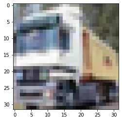
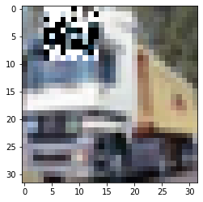

# Training Outlier Detector for CIFAR10 with Poetry

## Outlier Detector for Cifar10 model with Poetry-defined Environment

### Prerequisites

* A kubernetes cluster with kubectl configured
* poetry
* rclone
* curl

### Setup Seldon Core

Use the setup notebook to [Setup Cluster](seldon-core-setup.md#setup-cluster) with [Ambassador Ingress](seldon-core-setup.md#ambassador) and [Install Seldon Core](seldon-core-setup.md#Install-Seldon-Core). Instructions [also online](seldon-core-setup.md).

We will assume that ambassador (or Istio) ingress is port-forwarded to `localhost:8003`

```python
!kubectl create namespace cifar10 || true
```

```
namespace/cifar10 created
```

### Setup MinIO

Use the provided [notebook](minio_setup.md) to install Minio in your cluster. Instructions [also online](minio_setup.md).

We will assume that MinIO service is port-forwarded to `localhost:8090`

```python
%%writefile rclone.conf
[s3]
type = s3
provider = minio
env_auth = false
access_key_id = minioadmin
secret_access_key = minioadmin
endpoint = http://localhost:8090
```

```
Overwriting rclone.conf
```

```python
%%writefile secret.yaml
apiVersion: v1
kind: Secret
metadata:
  name: seldon-rclone-secret
  namespace: cifar10
type: Opaque
stringData:
  RCLONE_CONFIG_S3_TYPE: s3
  RCLONE_CONFIG_S3_PROVIDER: minio
  RCLONE_CONFIG_S3_ENV_AUTH: "false"
  RCLONE_CONFIG_S3_ACCESS_KEY_ID: minioadmin
  RCLONE_CONFIG_S3_SECRET_ACCESS_KEY: minioadmin
  RCLONE_CONFIG_S3_ENDPOINT: http://minio.minio-system.svc.cluster.local:9000
```

```
Overwriting secret.yaml
```

```python
!kubectl apply -f secret.yaml
```

```
secret/seldon-rclone-secret created
```

### Poetry

We will use `poetry.lock` to fully define the explainer environment. Install poetry following official [documentation](https://python-poetry.org/docs/#installation). Usually this goes down to

```bash
curl -sSL https://install.python-poetry.org | python3 - --version 1.1.15
```

## Train Outlier Detector

### Prepare Training Environment

We are going to use `pyproject.toml` and `poetry.lock` files from [Alibi Detect Server](https://github.com/SeldonIO/seldon-core/tree/master/components/alibi-detect-server). This will allow us to create environment that will match the runtime one.

Currently, the server's pyproject.toml is structured in the way that it uses a locally present source code of seldon-core.

Please, make sure that you obtain the source code that match the version of used alibi-detect-server.

```bash
%%bash
cp ../../../components/alibi-detect-server/pyproject.toml .
cp ../../../components/alibi-detect-server/poetry.lock .

(rm _seldon_core -rf || true) && cp -rT ../../../python/ _seldon_core/

conda create --yes --prefix ./venv python=3.7.10
```

```
Collecting package metadata (current_repodata.json): ...working... done
Solving environment: ...working... failed with repodata from current_repodata.json, will retry with next repodata source.
Collecting package metadata (repodata.json): ...working... done
Solving environment: ...working... done

## Package Plan ##

  environment location: /home/rskolasinski/work/seldon-core/examples/outliers/cifar10-od-poetry/venv

  added / updated specs:
    - conda-ecosystem-user-package-isolation
    - python=3.7.10


The following NEW packages will be INSTALLED:

  _libgcc_mutex      conda-forge/linux-64::_libgcc_mutex-0.1-conda_forge
  _openmp_mutex      conda-forge/linux-64::_openmp_mutex-4.5-1_gnu
  ca-certificates    conda-forge/linux-64::ca-certificates-2021.10.8-ha878542_0
  conda-ecosystem-u~ conda-forge/linux-64::conda-ecosystem-user-package-isolation-1.0-ha770c72_1
  ld_impl_linux-64   conda-forge/linux-64::ld_impl_linux-64-2.36.1-hea4e1c9_2
  libffi             conda-forge/linux-64::libffi-3.4.2-h7f98852_5
  libgcc-ng          conda-forge/linux-64::libgcc-ng-11.2.0-h1d223b6_15
  libgomp            conda-forge/linux-64::libgomp-11.2.0-h1d223b6_15
  libnsl             conda-forge/linux-64::libnsl-2.0.0-h7f98852_0
  libstdcxx-ng       conda-forge/linux-64::libstdcxx-ng-11.2.0-he4da1e4_15
  libzlib            conda-forge/linux-64::libzlib-1.2.11-h166bdaf_1014
  ncurses            conda-forge/linux-64::ncurses-6.3-h27087fc_1
  openssl            conda-forge/linux-64::openssl-3.0.2-h166bdaf_1
  pip                conda-forge/noarch::pip-22.0.4-pyhd8ed1ab_0
  python             conda-forge/linux-64::python-3.7.10-hf930737_104_cpython
  python_abi         conda-forge/linux-64::python_abi-3.7-2_cp37m
  readline           conda-forge/linux-64::readline-8.1-h46c0cb4_0
  setuptools         conda-forge/linux-64::setuptools-62.1.0-py37h89c1867_0
  sqlite             conda-forge/linux-64::sqlite-3.38.2-h4ff8645_0
  tk                 conda-forge/linux-64::tk-8.6.12-h27826a3_0
  wheel              conda-forge/noarch::wheel-0.37.1-pyhd8ed1ab_0
  xz                 conda-forge/linux-64::xz-5.2.5-h516909a_1
  zlib               conda-forge/linux-64::zlib-1.2.11-h166bdaf_1014


Preparing transaction: ...working... done
Verifying transaction: ...working... done
Executing transaction: ...working... done
#
# To activate this environment, use
#
#     $ conda activate /home/rskolasinski/work/seldon-core/examples/outliers/cifar10-od-poetry/venv
#
# To deactivate an active environment, use
#
#     $ conda deactivate
```

```bash
%%bash
source ~/miniconda3/etc/profile.d/conda.sh
conda activate ./venv
poetry install
```

```
Installing dependencies from lock file

Package operations: 169 installs, 0 updates, 0 removals

  • Installing certifi (2021.10.8)
  • Installing charset-normalizer (2.0.12)
  • Installing idna (3.3)
  • Installing pyasn1 (0.4.8)
  • Installing urllib3 (1.26.5)
  • Installing cachetools (4.2.4)
  • Installing oauthlib (3.2.0)
  • Installing protobuf (3.19.4)
  • Installing pyasn1-modules (0.2.8)
  • Installing pycparser (2.21)
  • Installing pyparsing (3.0.7)
  • Installing rsa (4.7.2)
  • Installing six (1.16.0)
  • Installing typing-extensions (4.1.1)
  • Installing zipp (3.7.0)
  • Installing requests (2.27.1)
  • Installing cffi (1.15.0)
  • Installing google-auth (1.35.0)
  • Installing googleapis-common-protos (1.56.0)
  • Installing importlib-metadata (4.11.3)
  • Installing markupsafe (1.1.1)
  • Installing packaging (21.3)
  • Installing pytz (2022.1)
  • Installing requests-oauthlib (1.3.1)
  • Installing absl-py (1.0.0)
  • Installing azure-common (1.1.28)
  • Installing cached-property (1.5.2)
  • Installing click (8.0.4)
  • Installing filelock (3.6.0)
  • Installing google-api-core (1.31.5)
  • Installing google-crc32c (1.3.0)
  • Installing grpcio (1.44.0)
  • Installing itsdangerous (1.1.0)
  • Installing jinja2 (2.11.3)
  • Installing joblib (1.1.0)
  • Installing markdown (3.3.6)
  • Installing httplib2 (0.20.4)
  • Installing google-auth-oauthlib (0.4.6)
  • Installing numpy (1.21.5)
  • Installing cryptography (3.4.8)
  • Installing pillow (9.0.1)
  • Installing pymeeus (0.5.11)
  • Installing python-dateutil (2.8.2)
  • Installing pyu2f (0.1.5)
  • Installing pyyaml (5.4.1)
  • Installing regex (2022.3.15)
  • Installing tensorboard-data-server (0.6.1)
  • Installing tensorboard-plugin-wit (1.8.1)
  • Installing tomli (1.2.3)
  • Installing tornado (6.1)
  • Installing tqdm (4.63.0)
  • Installing werkzeug (2.0.3)
  • Installing astunparse (1.6.3)
  • Installing attrs (21.4.0)
  • Installing azure-storage-common (2.1.0)
  • Installing boto (2.49.0)
  • Installing cloudpickle (2.0.0)
  • Installing convertdate (2.4.0)
  • Installing cycler (0.11.0)
  • Installing cython (0.29.28)
  • Installing decorator (5.1.1)
  • Installing dm-tree (0.1.6)
  • Installing ephem (4.1.3)
  • Installing fasteners (0.17.3)
  • Installing flask (1.1.2)
  • Installing flatbuffers (1.12)
  • Installing fonttools (4.31.2)
  • Installing gast (0.4.0)
  • Installing google-cloud-core (1.4.1)
  • Installing google-pasta (0.2.0)
  • Installing google-reauth (0.1.1)
  • Installing google-resumable-media (1.3.3)
  • Installing h5py (3.6.0)
  • Installing hijri-converter (2.2.3)
  • Installing huggingface-hub (0.4.0)
  • Installing imageio (2.16.1)
  • Installing iniconfig (1.1.1)
  • Installing keras (2.7.0)
  • Installing keras-preprocessing (1.1.2)
  • Installing kiwisolver (1.4.0)
  • Installing korean-lunar-calendar (0.2.1)
  • Installing libclang (13.0.0)
  • Installing llvmlite (0.38.0)
  • Installing networkx (2.6.3)
  • Installing oauth2client (4.1.3)
  • Installing opentracing (2.4.0)
  • Installing opt-einsum (3.3.0)
  • Installing pandas (1.1.5)
  • Installing pluggy (1.0.0)
  • Installing py (1.11.0)
  • Installing pyjwt (2.3.0)
  • Installing pyopenssl (21.0.0)
  • Installing pyrsistent (0.18.1)
  • Installing pywavelets (1.3.0)
  • Installing retry-decorator (1.1.1)
  • Installing sacremoses (0.0.49)
  • Installing scipy (1.7.3)
  • Installing setuptools-scm (6.4.2)
  • Installing tensorboard (2.8.0)
  • Installing tensorflow-estimator (2.7.0)
  • Installing tensorflow-io-gcs-filesystem (0.24.0)
  • Installing termcolor (1.1.0)
  • Installing threadloop (1.0.2)
  • Installing threadpoolctl (3.1.0)
  • Installing thrift (0.15.0)
  • Installing tifffile (2021.11.2)
  • Installing tokenizers (0.11.6)
  • Installing toml (0.10.2)
  • Installing websocket-client (1.3.1)
  • Installing wrapt (1.14.0)
  • Installing adal (1.2.7)
  • Installing appdirs (1.4.4)
  • Installing argcomplete (2.0.0)
  • Installing argparse (1.4.0)
  • Installing azure-storage-blob (2.1.0)
  • Installing cmdstanpy (0.4.0)
  • Installing crcmod (1.7)
  • Installing dill (0.3.2)
  • Installing deprecation (2.1.0)
  • Installing flask-cors (3.0.10)
  • Installing gcs-oauth2-boto-plugin (3.0)
  • Installing google-cloud-storage (1.31.2)
  • Installing flask-opentracing (1.1.0)
  • Installing grpcio-reflection (1.34.1)
  • Installing google-apitools (0.5.32)
  • Installing grpcio-opentracing (1.1.4)
  • Installing gunicorn (20.1.0)
  • Installing holidays (0.13)
  • Installing jaeger-client (4.4.0)
  • Installing jsonschema (3.2.0)
  • Installing kubernetes (10.0.1)
  • Installing lunarcalendar (0.0.9)
  • Installing matplotlib (3.5.1)
  • Installing minio (7.1.5)
  • Installing monotonic (1.6)
  • Installing mypy-extensions (0.4.3)
  • Installing numba (0.55.1)
  • Installing opencv-python (4.5.5.64)
  • Installing pathspec (0.9.0)
  • Installing prometheus-client (0.8.0)
  • Installing ptable (0.9.2)
  • Installing pystan (2.19.1.1)
  • Installing pytest (6.2.5)
  • Installing scikit-image (0.19.2)
  • Installing scikit-learn (0.24.2)
  • Installing setuptools-git (1.2)
  • Installing table-logger (0.3.6)
  • Installing tensorflow (2.7.0)
  • Installing tensorflow-probability (0.12.2)
  • Installing transformers (4.17.0)
  • Installing typed-ast (1.4.3)
  • Installing alibi-detect (0.9.0)
  • Installing black (21.7b0)
  • Installing cloudevents (1.2.0)
  • Installing elasticsearch (7.9.1)
  • Installing fbprophet (0.6)
  • Installing grpcio-tools (1.31.0)
  • Installing gsutil (5.5)
  • Installing isort (5.9.0)
  • Installing kfserving (0.3.0.2)
  • Installing mypy-protobuf (1.22)
  • Installing pip-licenses (3.5.3)
  • Installing requests-mock (1.9.3)
  • Installing seldon-core (1.14.0.dev0 /home/rskolasinski/work/seldon-core/examples/outliers/cifar10-od-poetry/_seldon_core)
  • Installing sh (1.14.2)
  • Installing pytest-tornasync (0.6.0.post2)
  • Installing mypy (0.910)
  • Installing tenacity (8.0.1)
  • Installing types-requests (2.26.0)
```

### Prepare Training Script

```python
%%writefile train.py
import logging
import os

import tensorflow as tf
import numpy as np

from tensorflow.keras.layers import Conv2D, Conv2DTranspose, Dense
from tensorflow.keras.layers import Flatten, Layer, Reshape, InputLayer
from tensorflow.keras.regularizers import l1

from alibi_detect.od import OutlierVAE
from alibi_detect.utils.fetching import fetch_detector
from alibi_detect.utils.perturbation import apply_mask
from alibi_detect.utils.saving import save_detector, load_detector


logger = tf.get_logger()
logger.setLevel(logging.ERROR)

(X_train, y_train), (X_test, y_test) = tf.keras.datasets.cifar10.load_data()

X_train = X_train.astype('float32') / 255
X_test = X_test.astype('float32') / 255
y_train = y_train.astype('int64').reshape(-1,)
y_test = y_test.astype('int64').reshape(-1,)

print('Train: ', X_train.shape, y_train.shape)
print('Test: ', X_test.shape, y_test.shape)

detector_type = 'outlier'
dataset = 'cifar10'
detector_name = 'OutlierVAE'

# define encoder and decoder networks
latent_dim = 1024
encoder_net = tf.keras.Sequential(
  [
      InputLayer(input_shape=(32, 32, 3)),
      Conv2D(64, 4, strides=2, padding='same', activation=tf.nn.relu),
      Conv2D(128, 4, strides=2, padding='same', activation=tf.nn.relu),
      Conv2D(512, 4, strides=2, padding='same', activation=tf.nn.relu)
  ]
)

decoder_net = tf.keras.Sequential(
  [
      InputLayer(input_shape=(latent_dim,)),
      Dense(4*4*128),
      Reshape(target_shape=(4, 4, 128)),
      Conv2DTranspose(256, 4, strides=2, padding='same', activation=tf.nn.relu),
      Conv2DTranspose(64, 4, strides=2, padding='same', activation=tf.nn.relu),
      Conv2DTranspose(3, 4, strides=2, padding='same', activation='sigmoid')
  ]
)

# initialize outlier detector
od = OutlierVAE(
    threshold=.015,  # threshold for outlier score
    encoder_net=encoder_net,  # can also pass VAE model instead
    decoder_net=decoder_net,  # of separate encoder and decoder
    latent_dim=latent_dim
)

# train
od.fit(X_train, epochs=50, verbose=True)

# save the trained outlier detector
save_detector(od, './outlier-detector')
```

```
Overwriting train.py
```

```python
%%time
!./venv/bin/python3 train.py
```

```
2022-04-14 13:41:54.199577: I tensorflow/stream_executor/cuda/cuda_gpu_executor.cc:939] successful NUMA node read from SysFS had negative value (-1), but there must be at least one NUMA node, so returning NUMA node zero
2022-04-14 13:41:54.217047: I tensorflow/stream_executor/cuda/cuda_gpu_executor.cc:939] successful NUMA node read from SysFS had negative value (-1), but there must be at least one NUMA node, so returning NUMA node zero
2022-04-14 13:41:54.217420: I tensorflow/stream_executor/cuda/cuda_gpu_executor.cc:939] successful NUMA node read from SysFS had negative value (-1), but there must be at least one NUMA node, so returning NUMA node zero
2022-04-14 13:41:54.217938: I tensorflow/core/platform/cpu_feature_guard.cc:151] This TensorFlow binary is optimized with oneAPI Deep Neural Network Library (oneDNN) to use the following CPU instructions in performance-critical operations:  AVX2 FMA
To enable them in other operations, rebuild TensorFlow with the appropriate compiler flags.
2022-04-14 13:41:54.218807: I tensorflow/stream_executor/cuda/cuda_gpu_executor.cc:939] successful NUMA node read from SysFS had negative value (-1), but there must be at least one NUMA node, so returning NUMA node zero
2022-04-14 13:41:54.219165: I tensorflow/stream_executor/cuda/cuda_gpu_executor.cc:939] successful NUMA node read from SysFS had negative value (-1), but there must be at least one NUMA node, so returning NUMA node zero
2022-04-14 13:41:54.219504: I tensorflow/stream_executor/cuda/cuda_gpu_executor.cc:939] successful NUMA node read from SysFS had negative value (-1), but there must be at least one NUMA node, so returning NUMA node zero
2022-04-14 13:41:54.848889: I tensorflow/stream_executor/cuda/cuda_gpu_executor.cc:939] successful NUMA node read from SysFS had negative value (-1), but there must be at least one NUMA node, so returning NUMA node zero
2022-04-14 13:41:54.849320: I tensorflow/stream_executor/cuda/cuda_gpu_executor.cc:939] successful NUMA node read from SysFS had negative value (-1), but there must be at least one NUMA node, so returning NUMA node zero
2022-04-14 13:41:54.849643: I tensorflow/stream_executor/cuda/cuda_gpu_executor.cc:939] successful NUMA node read from SysFS had negative value (-1), but there must be at least one NUMA node, so returning NUMA node zero
2022-04-14 13:41:54.849923: I tensorflow/core/common_runtime/gpu/gpu_device.cc:1525] Created device /job:localhost/replica:0/task:0/device:GPU:0 with 2644 MB memory:  -> device: 0, name: NVIDIA GeForce GTX 1650, pci bus id: 0000:01:00.0, compute capability: 7.5
Importing matplotlib failed. Plotting will not work.
Importing plotly failed. Interactive plots will not work.
Train:  (50000, 32, 32, 3) (50000,)
Test:  (10000, 32, 32, 3) (10000,)
2022-04-14 13:41:58.818151: W tensorflow/core/framework/cpu_allocator_impl.cc:82] Allocation of 614400000 exceeds 10% of free system memory.
2022-04-14 13:41:59.371330: W tensorflow/core/framework/cpu_allocator_impl.cc:82] Allocation of 614400000 exceeds 10% of free system memory.
2022-04-14 13:41:59.782408: W tensorflow/core/framework/cpu_allocator_impl.cc:82] Allocation of 614400000 exceeds 10% of free system memory.
2022-04-14 13:42:01.148966: I tensorflow/stream_executor/cuda/cuda_dnn.cc:366] Loaded cuDNN version 8101
782/782 [=] - 55s 64ms/step - loss_ma: 8927.7510
2022-04-14 13:42:54.773587: W tensorflow/core/framework/cpu_allocator_impl.cc:82] Allocation of 614400000 exceeds 10% of free system memory.
782/782 [=] - 99s 126ms/step - loss_ma: -2284.2741
2022-04-14 13:44:34.044742: W tensorflow/core/framework/cpu_allocator_impl.cc:82] Allocation of 614400000 exceeds 10% of free system memory.
782/782 [=] - 65s 82ms/step - loss_ma: -3521.0513
782/782 [=] - 69s 87ms/step - loss_ma: -4055.0235
782/782 [=] - 66s 83ms/step - loss_ma: -4369.6132
782/782 [=] - 65s 82ms/step - loss_ma: -4575.9023
782/782 [=] - 68s 86ms/step - loss_ma: -4773.8706
782/782 [=] - 67s 84ms/step - loss_ma: -4934.9222
782/782 [=] - 71s 90ms/step - loss_ma: -5055.4330
782/782 [=] - 59s 75ms/step - loss_ma: -5155.0893
782/782 [=] - 56s 71ms/step - loss_ma: -5198.4920
782/782 [=] - 57s 72ms/step - loss_ma: -5314.9975
782/782 [=] - 57s 72ms/step - loss_ma: -5366.3326
782/782 [=] - 57s 71ms/step - loss_ma: -5434.8929
782/782 [=] - 57s 72ms/step - loss_ma: -5468.0532
782/782 [=] - 56s 71ms/step - loss_ma: -5504.1972
782/782 [=] - 61s 76ms/step - loss_ma: -5549.6413
782/782 [=] - 73s 93ms/step - loss_ma: -5579.2789
782/782 [=] - 65s 82ms/step - loss_ma: -5593.0464
782/782 [=] - 65s 82ms/step - loss_ma: -5639.0633
782/782 [=] - 65s 82ms/step - loss_ma: -5658.0385
782/782 [=] - 67s 85ms/step - loss_ma: -5656.6797
782/782 [=] - 67s 85ms/step - loss_ma: -5701.8011
782/782 [=] - 63s 80ms/step - loss_ma: -5723.2239
782/782 [=] - 66s 83ms/step - loss_ma: -5740.9575
782/782 [=] - 65s 82ms/step - loss_ma: -5758.7366
782/782 [=] - 65s 82ms/step - loss_ma: -5781.2925
782/782 [=] - 67s 85ms/step - loss_ma: -5796.3319
782/782 [=] - 63s 80ms/step - loss_ma: -5815.1920
782/782 [=] - 64s 81ms/step - loss_ma: -5830.7356
782/782 [=] - 66s 84ms/step - loss_ma: -5842.1293
782/782 [=] - 63s 79ms/step - loss_ma: -5847.8182
782/782 [=] - 64s 81ms/step - loss_ma: -5866.5971
782/782 [=] - 69s 87ms/step - loss_ma: -5878.1151
782/782 [=] - 70s 89ms/step - loss_ma: -5893.1399
782/782 [=] - 65s 83ms/step - loss_ma: -5893.4249
782/782 [=] - 70s 88ms/step - loss_ma: -5909.6713
782/782 [=] - 58s 73ms/step - loss_ma: -5916.4036
782/782 [=] - 58s 74ms/step - loss_ma: -5921.7595
782/782 [=] - 58s 73ms/step - loss_ma: -5924.8622
782/782 [=] - 58s 73ms/step - loss_ma: -5935.0705
782/782 [=] - 58s 74ms/step - loss_ma: -5943.9454
782/782 [=] - 59s 75ms/step - loss_ma: -5948.6081
782/782 [=] - 58s 74ms/step - loss_ma: -5960.5511
782/782 [=] - 59s 75ms/step - loss_ma: -5970.2687
782/782 [=] - 59s 74ms/step - loss_ma: -5970.9040
782/782 [=] - 59s 75ms/step - loss_ma: -5980.7978
782/782 [=] - 58s 74ms/step - loss_ma: -5980.5145
782/782 [=] - 58s 73ms/step - loss_ma: -5986.5828
782/782 [=] - 54s 68ms/step - loss_ma: -5989.7350
CPU times: user 2min 14s, sys: 1min 2s, total: 3min 17s
Wall time: 52min 52s
```

```python
!tree outlier-detector
```

```
outlier-detector
├── meta.dill
├── model
│   ├── checkpoint
│   ├── decoder_net.h5
│   ├── encoder_net.h5
│   ├── vae.ckpt.data-00000-of-00001
│   └── vae.ckpt.index
└── OutlierVAE.dill

1 directory, 7 files
```

### Deploy Cifar10 model and Outlier Detector

Note, this requires Knative. Follow Knative [documentation](https://knative.dev/docs/install/) to install it.

```python
!rclone --config="rclone.conf" copy outlier-detector/ s3:outlier-detector/cifar10/
```

#### Deploy Event Display

```python
%%writefile event-display.yaml
apiVersion: apps/v1
kind: Deployment
metadata:
  name: event-display
  namespace: cifar10
spec:
  replicas: 1
  selector:
    matchLabels: &labels
      app: event-display
  template:
    metadata:
      labels: *labels
    spec:
      containers:
       - name: event-display
         image: gcr.io/knative-releases/knative.dev/eventing-contrib/cmd/event_display

---

kind: Service
apiVersion: v1
metadata:
  name: event-display
  namespace: cifar10
spec:
  selector:
    app: event-display
  ports:
  - protocol: TCP
    port: 80
    targetPort: 8080
```

```
Overwriting event-display.yaml
```

```python
!kubectl apply -f event-display.yaml
```

```
deployment.apps/event-display created
service/event-display created
```

#### Deploy Model

```python
%%writefile cifar10.yaml
apiVersion: machinelearning.seldon.io/v1
kind: SeldonDeployment
metadata:
  name: cifar10
  namespace: cifar10
spec:
  protocol: tensorflow
  predictors:
  - name: default
    replicas: 1
    graph:
      implementation: TENSORFLOW_SERVER
      modelUri: gs://seldon-models/tfserving/cifar10/resnet32
      name: cifar10-container
      logger:
        mode: all    
        url: http://broker-ingress.knative-eventing.svc.cluster.local/cifar10/default
```

```
Overwriting cifar10.yaml
```

```python
!kubectl apply -f cifar10.yaml
```

```
seldondeployment.machinelearning.seldon.io/cifar10 created
```

#### Create Knative Broker, Trigger and Kservice

```python
%%writefile broker.yaml

apiVersion: eventing.knative.dev/v1
kind: broker
metadata:
 name: default
 namespace: cifar10
```

```
Overwriting broker.yaml
```

```python
!kubectl create -f broker.yaml
```

```
broker.eventing.knative.dev/default created
```

```python
%%writefile kservice.yaml
apiVersion: serving.knative.dev/v1
kind: Service
metadata:
  name: vae-outlier
  namespace: cifar10
spec:
  template:
    metadata:
      annotations:
        autoscaling.knative.dev/minScale: "1"
    spec:
      containers:
      - image: seldonio/alibi-detect-server:1.15.0-dev
        imagePullPolicy: IfNotPresent
        args:
        - --model_name
        - cifar10od
        - --http_port
        - '8080'
        - --protocol
        - tensorflow.http
        - --storage_uri
        - s3:outlier-detector/cifar10
        - --reply_url
        - http://event-display.cifar10.svc.cluster.local
        - --event_type
        - io.seldon.serving.inference.outlier
        - --event_source
        - io.seldon.serving.cifar10od
        - OutlierDetector
        envFrom:
        - secretRef:
            name: seldon-rclone-secret
```

```
Overwriting kservice.yaml
```

```python
!kubectl apply -f kservice.yaml
```

```
service.serving.knative.dev/vae-outlier created
```

```python
%%writefile trigger.yaml
apiVersion: eventing.knative.dev/v1
kind: Trigger
metadata:
  name: vaeoutlier-trigger
  namespace: cifar10
spec:
  broker: default
  filter:
    attributes:
      type: io.seldon.serving.inference.request
  subscriber:
    ref:
      apiVersion: serving.knative.dev/v1
      kind: Service
      name: vae-outlier
      namespace: cifar10
```

```
Overwriting trigger.yaml
```

```python
!kubectl apply -f trigger.yaml
```

```
trigger.eventing.knative.dev/vaeoutlier-trigger created
```

### Test it!

In a terminal follow logs of the `event-display` deployment with for example

```bash
kubectl logs event-display-7f5f8647fb-t227z -f
```

Now we were send two requests, one containing a normal image and one outlier.

Note: it may take a moment for the kservice to become available

```bash
%%bash
deployment=$(kubectl get deploy -n cifar10 -l seldon-deployment-id=cifar10 -o jsonpath='{.items[0].metadata.name}')
kubectl rollout status deploy/${deployment} -n cifar10
```

```
deployment "cifar10-default-0-cifar10-container" successfully rolled out
```

```python
!kubectl get broker,trigger,kservice -n cifar10
```

```
NAME                                  URL                                                                        AGE   READY   REASON
broker.eventing.knative.dev/default   http://broker-ingress.knative-eventing.svc.cluster.local/cifar10/default   5m    True    

NAME                                              BROKER    SUBSCRIBER_URI                                 AGE     READY   REASON
trigger.eventing.knative.dev/vaeoutlier-trigger   default   http://vae-outlier.cifar10.svc.cluster.local   4m59s   True    

NAME                                      URL                                      LATESTCREATED       LATESTREADY         READY   REASON
service.serving.knative.dev/vae-outlier   http://vae-outlier.cifar10.example.com   vae-outlier-00001   vae-outlier-00001   True    
```

```python
import json

import matplotlib.pyplot as plt

with open("images/cifar10_image.json") as f:
    data = json.load(f)
plt.imshow(data["instances"][0])
plt.show()

with open("images/outlier_image.json") as f:
    data = json.load(f)
plt.imshow(data["instances"][0])
plt.show();
```



```
Clipping input data to the valid range for imshow with RGB data ([0..1] for floats or [0..255] for integers).


```



```bash
%%bash
curl -s -H "Content-Type: application/json" -d @images/cifar10_image.json http://localhost:8003/seldon/cifar10/cifar10/v1/models/:predict | jq .
curl -s -H "Content-Type: application/json" -d @images/outlier_image.json http://localhost:8003/seldon/cifar10/cifar10/v1/models/:predict | jq .
```

```
{
  "predictions": [
    [
      1.26448288e-06,
      4.88144e-09,
      1.51532642e-09,
      8.49054249e-09,
      5.51306611e-10,
      1.16171261e-09,
      5.77286274e-10,
      2.88394716e-07,
      0.00061489339,
      0.999383569
    ]
  ]
}
{
  "predictions": [
    [
      0.000593999459,
      1.13762019e-06,
      9.31399063e-06,
      4.24927e-05,
      2.75517505e-06,
      3.1435934e-06,
      1.53180349e-06,
      2.40643985e-05,
      0.320169568,
      0.679151952
    ]
  ]
}
```

```bash
%%bash
pod=$(kubectl get pod -n cifar10 -l app=event-display -o jsonpath='{.items[0].metadata.name}')
kubectl logs $pod -n cifar10
```

```
☁️  cloudevents.Event
Validation: valid
Context Attributes,
  specversion: 1.0
  type: io.seldon.serving.inference.outlier
  source: io.seldon.serving.cifar10od
  id: 10a3afa3-cff0-4635-ae9f-228a4606d4c4
  datacontenttype: application/json
Extensions,
  datacontenttype: application/json
  endpoint: default
  inferenceservicename: cifar10
  knativearrivaltime: 2022-04-14T13:39:51.246502704Z
  modelid: cifar10-container
  namespace: cifar10
  requestid: b1dd7f60-af19-4923-8798-fe0a59917f03
  traceparent: 00-96072a87694e76ba19866ae817338065-36d85cff2f7e96ed-00
Data,
  {
    "data": {
      "is_outlier": [
        0
      ]
    },
    "meta": {
      "name": "OutlierVAE",
      "detector_type": "offline",
      "data_type": null,
      "version": "0.9.0"
    }
  }
☁️  cloudevents.Event
Validation: valid
Context Attributes,
  specversion: 1.0
  type: io.seldon.serving.inference.outlier
  source: io.seldon.serving.cifar10od
  id: 9f01ad25-f9e0-4dde-b44b-4195f0215e7b
  datacontenttype: application/json
Extensions,
  datacontenttype: application/json
  endpoint: default
  inferenceservicename: cifar10
  knativearrivaltime: 2022-04-14T13:39:51.655837137Z
  modelid: cifar10-container
  namespace: cifar10
  requestid: c8d25839-7cc5-4724-8794-7b95a3cdb172
  traceparent: 00-75a6ca94a00a120da387dc97d202e6f9-9ac91209c1c8a958-00
Data,
  {
    "data": {
      "is_outlier": [
        0
      ]
    },
    "meta": {
      "name": "OutlierVAE",
      "detector_type": "offline",
      "data_type": null,
      "version": "0.9.0"
    }
  }
```

### Tear Down

```python
!kubectl delete ns cifar10
```

```
namespace "cifar10" deleted
```
