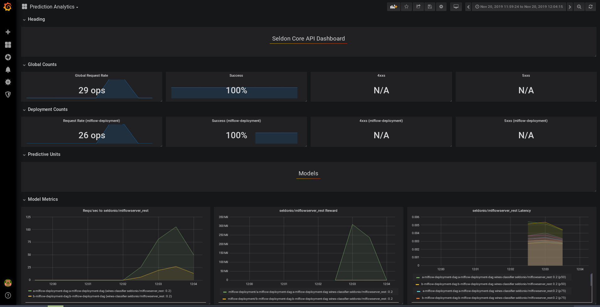

# MLFlow Pre-packaged Model Server AB Test Deployment 
In this example we will build two models with MLFlow and we will deploy them as an A/B test deployment. The reason this is powerful is because it allows you to deploy a new model next to the old one, distributing a percentage of traffic. These deployment strategies are quite simple using Seldon, and can be extended to shadow deployments, multi-armed-bandits, etc.

## Tutorial Overview

This tutorial will follow closely break down in the following sections:

1. Train the MLFlow elastic net wine example

2. Deploy your trained model leveraging our pre-packaged MLFlow model server

3. Test the deployed MLFlow model by sending requests

4. Deploy your second model as an A/B test

5. Visualise and monitor the performance of your models using Seldon Analytics

It will follow closely our talk at the [Spark + AI Summit 2019 on Seldon and MLflow](https://www.youtube.com/watch?v=D6eSfd9w9eA).

## Dependencies

For this example to work you must be running Seldon 0.3.2 or above - you can follow our [getting started guide for this](../install/installation.md).

In regards to other dependencies, make sure you have installed:

* Helm v3.0.0+
* kubectl v1.14+
* Python 3.6+
* MLFlow 1.1.0
* [pygmentize](https://pygments.org/docs/cmdline/)

We will also take this chance to load the Python dependencies we will use through the tutorial:


```python
import numpy as np
import pandas as pd

from seldon_core.seldon_client import SeldonClient
```

Let's get started! 🚀🔥

## 1. Train the first MLFlow Elastic Net Wine example

For our example, we will use the elastic net wine example from [MLflow's tutorial](https://github.com/mlflow/mlflow/tree/master/examples/sklearn_elasticnet_wine).

### MLproject

As any other MLflow project, it is defined by its `MLproject` file:


```python
!pygmentize -l yaml MLproject
```

We can see that this project uses Conda for the environment and that it's defined in the `conda.yaml` file:


```python
!pygmentize conda.yaml
```

Lastly, we can also see that the training will be performed by the `train.py` file, which receives two parameters `alpha` and `l1_ratio`:


```python
!pygmentize train.py
```

### Dataset

We will use the wine quality dataset.
Let's load it to see what's inside:


```python
data = pd.read_csv("wine-quality.csv")
data.head()
```

### Training

We've set up our MLflow project and our dataset is ready, so we are now good to start training.
MLflow allows us to train our model with the following command:

``` bash
$ mlflow run . -P alpha=... -P l1_ratio=...
```

On each run, `mlflow` will set up the Conda environment defined by the `conda.yaml` file and will run the training commands defined in the `MLproject` file.


```python
!mlflow run . -P alpha=0.5 -P l1_ratio=0.5
```

Each of these commands will create a new run which can be visualised through the MLFlow dashboard as per the screenshot below.


Each of these models can actually be found on the `mlruns` folder:


```python
!tree -L 1 mlruns/0
```

### MLmodel

Inside each of these folders, MLflow stores the parameters we used to train our model, any metric we logged during training, and a snapshot of our model.
If we look into one of them, we can see the following structure:


```python
!tree mlruns/0/$(ls mlruns/0 | head -1)
```

In particular, we are interested in the `MLmodel` file stored under `artifacts/model`:


```python
!pygmentize -l yaml mlruns/0/$(ls mlruns/0 | head -1)/artifacts/model/MLmodel
```

This file stores the details of how the model was stored.
With this information (plus the other files in the folder), we are able to load the model back.
Seldon's MLflow server will use this information to serve this model.

Now we should upload our newly trained model into a public Google Bucket or S3 bucket.
We have already done this to make it simpler, which you will be able to find at `gs://seldon-models/mlflow/model-a`.

## 2. Deploy your model using the Pre-packaged Moldel Server for MLFlow

Now we can deploy our trained MLFlow model.

For this we have to create a Seldon definition of the model server definition, which we will break down further below.

We will be using the model we updated to our google bucket (gs://seldon-models/mlflow/elasticnet_wine_1.8.0), but you can use your model if you uploaded it to a public bucket.

### Setup Seldon Core

Use the setup notebook to [Setup Cluster](../notebooks/seldon-core-setup.md#setup-cluster) with [Ambassador Ingress](../notebooks/seldon-core-setup.md#ambassador) and [Install Seldon Core](../notebooks/seldon-core-setup.md#Install-Seldon-Core). Instructions [also online](../notebooks/seldon-core-setup.md).


```python
!pygmentize mlflow-model-server-seldon-config.yaml
```

Once we write our configuration file, we are able to deploy it to our cluster by running it with our command


```python
!kubectl apply -f mlflow-model-server-seldon-config.yaml
```

Once it's created we just wait until it's deployed. 

It will basically download the image for the pre-packaged MLFlow model server, and initialise it with the model we specified above.

You can check the status of the deployment with the following command:


```python
!kubectl rollout status deployment.apps/mlflow-deployment-mlflow-deployment-dag-0-wines-classifier
```

Once it's deployed, we should see a "succcessfully rolled out" message above. We can now test it!

## 3. Test the deployed MLFlow model by sending requests
Now that our model is deployed in Kubernetes, we are able to send any requests.

We will first need the URL that is currently available through Ambassador. 

If you are running this locally, you should be able to reach it through localhost, in this case we can use port 80.


```python
!kubectl get svc | grep ambassador
```

Now we will select the first datapoint in our dataset to send to the model.


```python
x_0 = data.drop(["quality"], axis=1).values[:1]
print(list(x_0[0]))
```

We can try sending a request first using curl:


```python
!curl -X POST -H 'Content-Type: application/json' \
    -d '{"data": {"names": [], "ndarray": [[7.0, 0.27, 0.36, 20.7, 0.045, 45.0, 170.0, 1.001, 3.0, 0.45, 8.8]]}}' \
    http://localhost:8003/seldon/seldon/mlflow-deployment/api/v0.1/predictions
```

We can also send the request by using our python client


```python
import math
import subprocess

import numpy as np

from seldon_core.seldon_client import SeldonClient

HOST = "localhost"  # Add the URL you found above
port = "80"  # Make sure you use the port above
batch = x_0
payload_type = "ndarray"

sc = SeldonClient(
    gateway="ambassador", namespace="seldon", gateway_endpoint=HOST + ":" + port
)

client_prediction = sc.predict(
    data=batch, deployment_name="mlflow-deployment", names=[], payload_type=payload_type
)

print(client_prediction.response)
```

## 4. Deploy your second model as an A/B test

Now that we have a model in production, it's possible to deploy a second model as an A/B test.
Our model will also be an Elastic Net model but using a different set of parameters.
We can easily train it by leveraging MLflow:


```python
!mlflow run . -P alpha=0.75 -P l1_ratio=0.2
```

As we did before, we will now need to upload our model to a cloud bucket.
To speed things up, we already have done so and the second model is now accessible in `gs://seldon-models/mlflow/model-b`.

### A/B test

We will deploy our second model as an A/B test.
In particular, we will redirect 20% of the traffic to the new model.

This can be done by simply adding a `traffic` attribute on our `SeldonDeployment` spec:


```python
!pygmentize ab-test-mlflow-model-server-seldon-config.yaml
```

And similar to the model above, we only need to run the following to deploy it:


```python
!kubectl apply -f ab-test-mlflow-model-server-seldon-config.yaml
```

We can check that the models have been deployed and are running with the following command.

We should now see the "a-" model and the "b-" models.


```python
!kubectl get pods
```

## 5. Visualise and monitor the performance of your models using Seldon Analytics

This section is optional, but by following the instructions you will be able to visualise the performance of both models as per the chart below.

In order for this example to work you need to install and run the [Grafana Analytics package for Seldon Core](https://docs.seldon.ai/seldon-core-1/configuration/integrations/analytics#helm-analytics-chart).

For this we can access the URL with the command below, it will request an admin and password which by default are set to the following:
* Username: admin
* Password: password

You can access the grafana dashboard through the port provided below:


```python
!kubectl get svc grafana-prom -o jsonpath='{.spec.ports[0].nodePort}'
```

Now that we have both models running in our Kubernetes cluster, we can analyse their performance using Seldon Core's integration with Prometheus and Grafana.
To do so, we will iterate over the training set (which can be found in `wine-quality.csv`), making a request and sending the feedback of the prediction.

Since the `/feedback` endpoint requires a `reward` signal (i.e. the higher the better), we will simulate one as:

$$
  R(x_{n})
    = \begin{cases}
        \frac{1}{(y_{n} - f(x_{n}))^{2}} &, y_{n} \neq f(x_{n}) \\
        500 &, y_{n} = f(x_{n})
      \end{cases}
$$

, where $R(x_{n})$ is the reward for input point $x_{n}$, $f(x_{n})$ is our trained model and $y_{n}$ is the actual value.


```python
sc = SeldonClient(
    gateway="ambassador", namespace="seldon", deployment_name="wines-classifier"
)


def _get_reward(y, y_pred):
    if y == y_pred:
        return 500

    return 1 / np.square(y - y_pred)


def _test_row(row):
    input_features = row[:-1]
    feature_names = input_features.index.to_list()
    X = input_features.values.reshape(1, -1)
    y = row[-1].reshape(1, -1)

    # Note that we are re-using the SeldonClient defined previously
    r = sc.predict(deployment_name="mlflow-deployment", data=X, names=feature_names)

    y_pred = r.response["data"]["tensor"]["values"]
    reward = _get_reward(y, y_pred)
    sc.feedback(
        deployment_name="mlflow-deployment",
        prediction_request=r.request,
        prediction_response=r.response,
        reward=reward,
    )

    return reward[0]


data.apply(_test_row, axis=1)
```

You should now be able to see Seldon's pre-built Grafana dashboard.



In bottom of the dashboard you can see the following charts: 

- On the left: the requests per second, which shows the different traffic breakdown we specified.
- On the center: the reward, where you can see how model `a` outperforms model `b` by a large margin.
- On the right, the latency for each one of them.

You are able to add your own custom metrics, and try out other more complex deployments by following [these guides](../notebooks/README.md)
