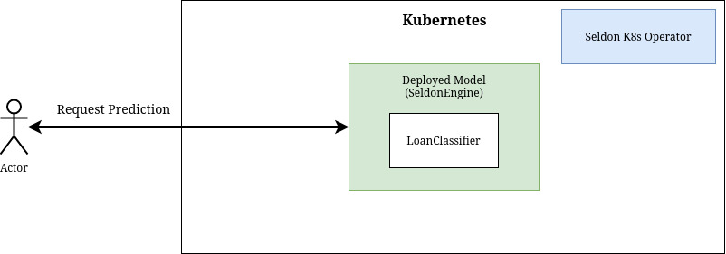
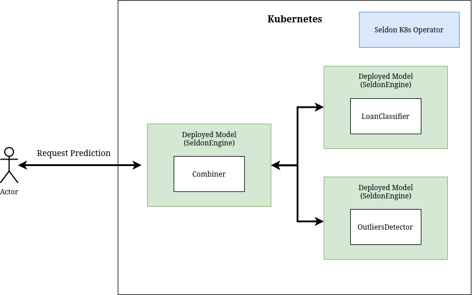

# Seldon deployment of Alibi Outlier detector

The objective of this tutorial is to build a "loan approval" classifier equipped with the outlier detector from the [alibi-detect](https://github.com/SeldonIO/alibi-detect) package.

The diagram of this tutorial is as follows:



In this tutorial we will follow these steps:

1. Train and test model to predict loan approvals
2. Train and test outlier detector
3. Containerize and deploy your models
4. Test your new Seldon deployment

---

## Before you start

Make sure you install the following dependencies, as they are critical for this example to work:

- Helm v3.0.0+
- A Kubernetes cluster running v1.13 or above (minikube / docker-for-windows work well if enough RAM)
- kubectl v1.14+
- ksonnet v0.13.1+
- kfctl 0.5.1 - Please use this exact version as there are major changes every few months
- Python 3.6+
- Python DEV requirements (we'll install them below)

You can follow this [notebook](../notebooks/seldon-core-setup.md#setup-cluster) to setup your cluster.

Let's get started! 🚀🔥

---

## Install Python dependencies

In the [requirements-dev](https://github.com/SeldonIO/seldon-core/blob/master/examples/outliers/alibi-detect-combiner/requirements-dev.txt) file you will find a set of Python dependencies required to run this notebook.

```bash
cat requirements-dev.txt
```

```
dill==0.3.1
xai==0.0.5
alibi==0.3.2
alibi-detect==0.2.0
seldon_core==1.0
scipy==1.1.0
numpy==1.15.4
scikit-learn==0.20.1
```

Install them with:

```bash
pip install -r requirements-dev.txt
```

---

## Train and test loanclassifier

We start with training the loanclassifier model by using a prepared Python script [train_classifier](https://github.com/SeldonIO/seldon-core/blob/master/examples/outliers/alibi-detect-combiner/train_classifier.py):

```python
# train_classifier.py
import alibi
def load_data(train_size=30000, random_state=0):
    # ...
    pass
# ...
```

Run the script:

```bash
python3 train_classifier.py
```

This script creates two dill-serialized files `preprocessor.dill` and `model.dill` that are used by the `Model` class to make predictions:

```python
# pipeline/loanclassifier/Model.py
import dill
import os
class Model:
    def __init__(self, *args, **kwargs):
        with open(os.path.join(dirname, "preprocessor.dill"), "rb") as prep_f:
            self.preprocessor = dill.load(prep_f)
        with open(os.path.join(dirname, "model.dill"), "rb") as model_f:
            self.clf = dill.load(model_f)
    def predict(self, X, feature_names=[]):
        X_prep = self.preprocessor.transform(X)
        output = self.clf.predict_proba(X_prep)
        return output
```

You can test how it will work from the notebook:

```python
import sys
sys.path.append("pipeline/loanclassifier")
from Model import Model
model = Model()
```

```python
import numpy as np
import xai
from train_classifier import load_data
data, X_train, y_train, X_test, y_test = load_data()
proba = model.predict(X_test)
pred = np.argmax(proba, axis=1)
xai.metrics_plot(y_test, pred)
```

| Metric      | Value    |
|-------------|----------|
| precision   | 0.704545 |
| recall      | 0.658497 |
| specificity | 0.913289 |
| accuracy    | 0.852401 |
| auc         | 0.785893 |
| f1          | 0.680743 |

---

## Train and test outliers detector

We will now train the outliers detector using another prepared script [train_detector](https://github.com/SeldonIO/seldon-core/blob/master/examples/outliers/alibi-detect-combiner/train_detector.py):

```python
# train_detector.py
import dill
# ...
```

Run the script:

```bash
python3 train_detector.py
```

This will create `dill-serialized` objects used by the `Detector` class:

```python
# pipeline/outliersdetector/Detector.py
import dill
import os
class Detector:
    def __init__(self, *args, **kwargs):
        with open(os.path.join(dirname, "preprocessor.dill"), "rb") as prep_f:
            self.preprocessor = dill.load(prep_f)
        with open(os.path.join(dirname, "model.dill"), "rb") as model_f:
            self.od = dill.load(model_f)
    def predict(self, X, feature_names=[]):
        X_prep = self.preprocessor.transform(X)
        output = self.od.predict(X_prep)['data']['is_outlier']
        return output
```

You can see how the detector works from this notebook:

```python
import sys
sys.path.append("pipeline/outliersdetector")
from Detector import Detector
detector = Detector()
```

```python
import numpy as np
from alibi_detect.utils.data import create_outlier_batch
from sklearn.metrics import confusion_matrix, f1_score
np.random.seed(1)
outlier_batch = create_outlier_batch(data.data, data.target, n_samples=1000, perc_outlier=10)
X_outlier, y_outlier = outlier_batch.data.astype("float"), outlier_batch.target
y_pred = detector.predict(X_outlier)
f1 = f1_score(y_outlier, y_pred)
print("F1 score: {}".format(f1))
cm = confusion_matrix(y_outlier, y_pred)
```

---

## Containerize your models

Before you can deploy classifier `Model` and outliers `Detector` as part of Seldon's graph you have to containerize them.

We will use s2i to do so with help of the provided [Makefile](https://github.com/SeldonIO/seldon-core/blob/master/examples/outliers/alibi-detect-combiner/Makefile):

```makefile
.ONESHELL:
all: base loanclassifier outliersdetector combiner
base:
	docker build . -t seldon-core-outliers-base:0.1
loanclassifier:
	s2i build pipeline/loanclassifier seldon-core-outliers-base:0.1 loanclassifier:0.1
outliersdetector:
	s2i build pipeline/outliersdetector seldon-core-outliers-base:0.1 outliersdetector:0.1
combiner:
	s2i build pipeline/combiner seldon-core-outliers-base:0.1 combiner:0.1
```

Build the images:

```bash
make
```

or if using Minikube:

```bash
eval $(minikube docker-env) && make
```

---

## Deploy your models separately

Now, you can include your newly built containers as part of a Seldon deployment.

First, we will create two separate deployments: `loanclassifier` and `outliersdetector`.
Each of them will have their own separate endpoint and can be queried independently depending on your needs.

### Deploy separate loanclassifier


```yaml
# pipeline/loanclassifier.yaml
apiVersion: machinelearning.seldon.io/v1alpha2
kind: SeldonDeployment
metadata:
  labels:
    app: seldon
  name: loanclassifier
spec:
  name: loanclassifier
  predictors:
  - componentSpecs:
    - spec:
        containers:
        - image: loanclassifier:0.1
          name: loanclassifier
          env:
          - name: SELDON_LOG_LEVEL
            value: DEBUG
    graph:
      children: []
      name: loanclassifier
      type: MODEL
      endpoint:
        type: REST
    name: loanclassifier
    replicas: 1
```

Apply the deployment:

```bash
kubectl apply -f pipeline/loanclassifier.yaml
```

### Deploy separate outliers detector


```yaml
# pipeline/outliersdetector.yaml
apiVersion: machinelearning.seldon.io/v1alpha2
kind: SeldonDeployment
metadata:
  labels:
    app: seldon
  name: outliersdetector
spec:
  name: outliersdetector
  predictors:
  - componentSpecs:
    - spec:
        containers:
        - image: outliersdetector:0.1
          name: outliersdetector
          env:
          - name: SELDON_LOG_LEVEL
            value: DEBUG
    graph:
      children: []
      name: outliersdetector
      type: MODEL
      endpoint:
        type: REST
    name: outliersdetector
    replicas: 1
```

Apply the deployment:

```bash
kubectl apply -f pipeline/outliersdetector.yaml
```

### View newly deployed Kubernetes pods

```bash
kubectl get pods
```

---

## Test deployed components

**IMPORTANT:** If you are using minikube (instead of Docker Desktop) you have to forward the port first with:

```bash
kubectl port-forward svc/ambassador 8003:80
```

Example prediction:

```python
from seldon_core.seldon_client import SeldonClient
from seldon_core.utils import get_data_from_proto
to_explain = X_test[:3]
sc = SeldonClient(
    gateway="ambassador",
    deployment_name="loanclassifier",
    gateway_endpoint="localhost:8003",
    payload_type="ndarray",
    namespace="seldon",
    transport="rest",
)
prediction = sc.predict(data=to_explain)
get_data_from_proto(prediction.response)
```

---

## Deploy loanclassifier and outliersdetector with combiner

Another possibility is to use a slightly more complicated graph with a `combiner` that will
gather outputs from `loanclassifier` and `outliersdetector`.

Please note that `loanclassifier` and `outliersdetector` are part of the `loanclassifier-combined` graph and this deployment is independent from the previous two.

In this approach there is a single API endpoint that serves both functionalities.



```yaml
# pipeline/combiner.yaml
apiVersion: machinelearning.seldon.io/v1alpha2
kind: SeldonDeployment
metadata:
  labels:
    app: seldon
  name: loanclassifier-combined
spec:
  annotations:
    project_name: Iris classification
  name: loanclassifier-combined
  predictors:
  - componentSpecs:
    - spec:
        containers:
        - image: loanclassifier:0.1
          name: loanclassifier
          env:
          - name: SELDON_LOG_LEVEL
            value: DEBUG
        - image: outliersdetector:0.1
          name: outliersdetector
          env:
          - name: SELDON_LOG_LEVEL
            value: DEBUG
        - image: combiner:0.1
          name: combiner
          env:
          - name: SELDON_LOG_LEVEL
            value: DEBUG
    graph:
      children:
      - children: []
        name: loanclassifier
        type: MODEL
        endpoint:
          type: REST
      - children: []
        name: outliersdetector
        type: MODEL
        endpoint:
          type: REST
      endpoint:
        type: REST
      name: combiner
      type: COMBINER
    name: combiner-graph
    replicas: 1
```

Apply the deployment:

```bash
kubectl apply -f pipeline/combiner.yaml
```

Check pods:

```bash
kubectl get pods
```

Example prediction:

```python
sc = SeldonClient(
    gateway="ambassador",
    deployment_name="loanclassifier-combined",
    gateway_endpoint="localhost:8003",
    payload_type="ndarray",
    namespace="seldon",
    transport="rest",
)
prediction = sc.predict(data=to_explain)
output = get_data_from_proto(prediction.response)
print(output["loanclassifier"])
print(output["outliersdetector"])
```
