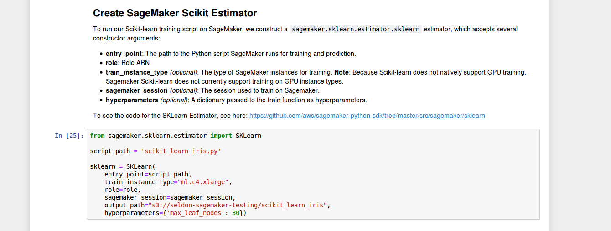

# Sagemaker and Seldon Core Scikit-learn Example

 * Train a model on AWS Sagemaker
 * Deploy locally on Seldon Core
 
 This tutorial assumes you are already familiar with Sagemaker and have an AWS account you can use.
 
 Dependencies
 
  * AWS CLI
  * Docker
  * Git
  * Minikube

## Train Scikit-learn Iris Model

We will use the Sagemaker example notebook [Iris Training and Prediction with Sagemaker Scikit-learn](https://github.com/aws/amazon-sagemaker-examples/blob/master/sagemaker-python-sdk/scikit_learn_iris/scikit_learn_estimator_example_with_batch_transform.ipynb)

  1. Run this notebook inside Sagemaker but change the training step to include an ```output_path``` parameter with value an S3 bucket you have created. For example ```output_path="s3://<my-bucket>/<my-path>``` as shown below:
     * 
  1. Once trained you should find the model saved to the location you specified. You will need to use this S3 location later when deploying locally.

## Create Sagemaker SKLearn Image

To run your model locally you will need to create the sagemaker sklearn image


```python
!git clone https://github.com/aws/sagemaker-scikit-learn-container.git
```

    Cloning into 'sagemaker-scikit-learn-container'...
    remote: Enumerating objects: 53, done.
    remote: Total 53 (delta 0), reused 0 (delta 0), pack-reused 53
    Unpacking objects: 100% (53/53), done.
    Checking connectivity... done.


Build the base container.


```python
!cd sagemaker-scikit-learn-container && \
    docker build -t sklearn-base:0.20.0-cpu-py3 -f docker/0.20.0/base/Dockerfile.cpu --build-arg py_version=3 .
```

    Sending build context to Docker daemon  238.1kB
    Step 1/7 : FROM ubuntu:16.04
    16.04: Pulling from library/ubuntu
    
    7c7e4631: Pulling fs layer 
    76a881a4: Pulling fs layer 
    7358fbfc: Pulling fs layer 
    Digest: sha256:4d8065a49c2b4c5bb225b4dd5fba3a77c119d925cfe34d5a0095388f128922d0
    Status: Downloaded newer image for ubuntu:16.04
     ---> 9361ce633ff1
    Step 2/7 : ARG py_version
     ---> Running in 39d0efb5f605
    Removing intermediate container 39d0efb5f605
     ---> 74758aba076b
    Step 3/7 : RUN test $py_version || exit 1
     ---> Running in 4a5bcd9a904d
    Removing intermediate container 4a5bcd9a904d
     ---> 6e27c0b9b5fb
    Step 4/7 : RUN apt-get update &&     apt-get -y install build-essential libatlas-dev git wget curl nginx jq &&     if [ $py_version -eq 2 ];        then apt-get -y install python-dev python-setuptools                      python-numpy python-scipy libatlas3-base;        else apt-get -y install python3-dev python3-setuptools                      python3-numpy python3-scipy libatlas3-base; fi
     ---> Running in 5aea2afd75bb
    Get:1 http://archive.ubuntu.com/ubuntu xenial InRelease [247 kB]
    Get:2 http://security.ubuntu.com/ubuntu xenial-security InRelease [109 kB]
    Get:3 http://archive.ubuntu.com/ubuntu xenial-updates InRelease [109 kB]
    Get:4 http://archive.ubuntu.com/ubuntu xenial-backports InRelease [107 kB]
    Get:5 http://security.ubuntu.com/ubuntu xenial-security/main amd64 Packages [795 kB]
    Get:6 http://archive.ubuntu.com/ubuntu xenial/main amd64 Packages [1558 kB]
    Get:7 http://security.ubuntu.com/ubuntu xenial-security/restricted amd64 Packages [12.7 kB]
    Get:8 http://security.ubuntu.com/ubuntu xenial-security/universe amd64 Packages [544 kB]
    Get:9 http://security.ubuntu.com/ubuntu xenial-security/multiverse amd64 Packages [6117 B]
    Get:10 http://archive.ubuntu.com/ubuntu xenial/restricted amd64 Packages [14.1 kB]
    Get:11 http://archive.ubuntu.com/ubuntu xenial/universe amd64 Packages [9827 kB]
    Get:12 http://archive.ubuntu.com/ubuntu xenial/multiverse amd64 Packages [176 kB]
    Get:13 http://archive.ubuntu.com/ubuntu xenial-updates/main amd64 Packages [1189 kB]
    Get:14 http://archive.ubuntu.com/ubuntu xenial-updates/restricted amd64 Packages [13.1 kB]
    Get:15 http://archive.ubuntu.com/ubuntu xenial-updates/universe amd64 Packages [952 kB]
    Get:16 http://archive.ubuntu.com/ubuntu xenial-updates/multiverse amd64 Packages [19.0 kB]
    Get:17 http://archive.ubuntu.com/ubuntu xenial-backports/main amd64 Packages [7942 B]
    Get:18 http://archive.ubuntu.com/ubuntu xenial-backports/universe amd64 Packages [8532 B]
    Fetched 15.7 MB in 1s (10.2 MB/s)
    Reading package lists...
    Reading package lists...
    Building dependency tree...
    Reading state information...
    The following additional packages will be installed:
      binutils bzip2 ca-certificates cpp cpp-5 dpkg-dev fakeroot fontconfig-config
      fonts-dejavu-core g++ g++-5 gcc gcc-5 geoip-database gfortran gfortran-5
      git-man ifupdown iproute2 isc-dhcp-client isc-dhcp-common krb5-locales less
      libalgorithm-diff-perl libalgorithm-diff-xs-perl libalgorithm-merge-perl
      libasan2 libasn1-8-heimdal libatm1 libatomic1 libblas-common libblas-dev
      libblas3 libbsd0 libc-dev-bin libc6-dev libcc1-0 libcilkrts5 libcurl3-gnutls
      libdns-export162 libdpkg-perl libedit2 liberror-perl libexpat1 libfakeroot
      libffi6 libfile-fcntllock-perl libfontconfig1 libfreetype6 libgcc-5-dev
      libgd3 libgdbm3 libgeoip1 libgfortran-5-dev libgfortran3 libgmp10
      libgnutls30 libgomp1 libgssapi-krb5-2 libgssapi3-heimdal libhcrypto4-heimdal
      libheimbase1-heimdal libheimntlm0-heimdal libhogweed4 libhx509-5-heimdal
      libicu55 libidn11 libisc-export160 libisl15 libitm1 libjbig0 libjpeg-turbo8
      libjpeg8 libk5crypto3 libkeyutils1 libkrb5-26-heimdal libkrb5-3
      libkrb5support0 libldap-2.4-2 liblsan0 libmnl0 libmpc3 libmpfr4 libmpx0
      libnettle6 libonig2 libp11-kit0 libperl5.22 libpng12-0 libpopt0 libquadmath0
      libroken18-heimdal librtmp1 libsasl2-2 libsasl2-modules libsasl2-modules-db
      libsqlite3-0 libssl1.0.0 libstdc++-5-dev libtasn1-6 libtiff5 libtsan0
      libubsan0 libvpx3 libwind0-heimdal libx11-6 libx11-data libxau6 libxcb1
      libxdmcp6 libxext6 libxml2 libxmuu1 libxpm4 libxslt1.1 libxtables11
      linux-libc-dev make manpages manpages-dev netbase nginx-common nginx-core
      openssh-client openssl patch perl perl-modules-5.22 rename rsync sgml-base
      ucf xauth xml-core xz-utils
    Suggested packages:
      binutils-doc bzip2-doc cpp-doc gcc-5-locales debian-keyring g++-multilib
      g++-5-multilib gcc-5-doc libstdc++6-5-dbg gcc-multilib autoconf automake
      libtool flex bison gdb gcc-doc gcc-5-multilib libgcc1-dbg libgomp1-dbg
      libitm1-dbg libatomic1-dbg libasan2-dbg liblsan0-dbg libtsan0-dbg
      libubsan0-dbg libcilkrts5-dbg libmpx0-dbg libquadmath0-dbg gfortran-multilib
      gfortran-doc gfortran-5-multilib gfortran-5-doc libgfortran3-dbg
      gettext-base git-daemon-run | git-daemon-sysvinit git-doc git-el git-email
      git-gui gitk gitweb git-arch git-cvs git-mediawiki git-svn ppp rdnssd
      iproute2-doc resolvconf avahi-autoipd isc-dhcp-client-ddns apparmor
      liblapack-dev liblapack-doc liblapack-doc-man glibc-doc libgd-tools
      geoip-bin gnutls-bin krb5-doc krb5-user libsasl2-modules-otp
      libsasl2-modules-ldap libsasl2-modules-sql libsasl2-modules-gssapi-mit
      | libsasl2-modules-gssapi-heimdal libstdc++-5-doc make-doc man-browser
      fcgiwrap nginx-doc ssl-cert ssh-askpass libpam-ssh keychain monkeysphere ed
      diffutils-doc perl-doc libterm-readline-gnu-perl
      | libterm-readline-perl-perl openssh-server sgml-base-doc debhelper
    The following NEW packages will be installed:
      binutils build-essential bzip2 ca-certificates cpp cpp-5 curl dpkg-dev
      fakeroot fontconfig-config fonts-dejavu-core g++ g++-5 gcc gcc-5
      geoip-database gfortran gfortran-5 git git-man ifupdown iproute2
      isc-dhcp-client isc-dhcp-common jq krb5-locales less libalgorithm-diff-perl
      libalgorithm-diff-xs-perl libalgorithm-merge-perl libasan2 libasn1-8-heimdal
      libatlas-dev libatm1 libatomic1 libblas-common libblas-dev libblas3 libbsd0
      libc-dev-bin libc6-dev libcc1-0 libcilkrts5 libcurl3-gnutls libdns-export162
      libdpkg-perl libedit2 liberror-perl libexpat1 libfakeroot libffi6
      libfile-fcntllock-perl libfontconfig1 libfreetype6 libgcc-5-dev libgd3
      libgdbm3 libgeoip1 libgfortran-5-dev libgfortran3 libgmp10 libgnutls30
      libgomp1 libgssapi-krb5-2 libgssapi3-heimdal libhcrypto4-heimdal
      libheimbase1-heimdal libheimntlm0-heimdal libhogweed4 libhx509-5-heimdal
      libicu55 libidn11 libisc-export160 libisl15 libitm1 libjbig0 libjpeg-turbo8
      libjpeg8 libk5crypto3 libkeyutils1 libkrb5-26-heimdal libkrb5-3
      libkrb5support0 libldap-2.4-2 liblsan0 libmnl0 libmpc3 libmpfr4 libmpx0
      libnettle6 libonig2 libp11-kit0 libperl5.22 libpng12-0 libpopt0 libquadmath0
      libroken18-heimdal librtmp1 libsasl2-2 libsasl2-modules libsasl2-modules-db
      libsqlite3-0 libssl1.0.0 libstdc++-5-dev libtasn1-6 libtiff5 libtsan0
      libubsan0 libvpx3 libwind0-heimdal libx11-6 libx11-data libxau6 libxcb1
      libxdmcp6 libxext6 libxml2 libxmuu1 libxpm4 libxslt1.1 libxtables11
      linux-libc-dev make manpages manpages-dev netbase nginx nginx-common
      nginx-core openssh-client openssl patch perl perl-modules-5.22 rename rsync
      sgml-base ucf wget xauth xml-core xz-utils
    0 upgraded, 142 newly installed, 0 to remove and 4 not upgraded.
    Need to get 82.1 MB of archives.
    After this operation, 326 MB of additional disk space will be used.
    Get:1 http://archive.ubuntu.com/ubuntu xenial/main amd64 libatm1 amd64 1:2.5.1-1.5 [24.2 kB]
    Get:2 http://archive.ubuntu.com/ubuntu xenial/main amd64 libmnl0 amd64 1.0.3-5 [12.0 kB]
    Get:3 http://archive.ubuntu.com/ubuntu xenial/main amd64 libpopt0 amd64 1.16-10 [26.0 kB]
    Get:4 http://archive.ubuntu.com/ubuntu xenial/main amd64 libgdbm3 amd64 1.8.3-13.1 [16.9 kB]
    Get:5 http://archive.ubuntu.com/ubuntu xenial/main amd64 libxau6 amd64 1:1.0.8-1 [8376 B]
    Get:6 http://archive.ubuntu.com/ubuntu xenial/main amd64 libxdmcp6 amd64 1:1.1.2-1.1 [11.0 kB]
    Get:7 http://archive.ubuntu.com/ubuntu xenial/main amd64 libxcb1 amd64 1.11.1-1ubuntu1 [40.0 kB]
    Get:8 http://archive.ubuntu.com/ubuntu xenial-updates/main amd64 libx11-data all 2:1.6.3-1ubuntu2.1 [113 kB]
    Get:9 http://archive.ubuntu.com/ubuntu xenial-updates/main amd64 libx11-6 amd64 2:1.6.3-1ubuntu2.1 [570 kB]
    Get:10 http://archive.ubuntu.com/ubuntu xenial/main amd64 libxext6 amd64 2:1.3.3-1 [29.4 kB]
    Get:11 http://archive.ubuntu.com/ubuntu xenial/main amd64 sgml-base all 1.26+nmu4ubuntu1 [12.5 kB]
    Get:12 http://archive.ubuntu.com/ubuntu xenial-updates/main amd64 libjpeg-turbo8 amd64 1.4.2-0ubuntu3.1 [111 kB]
    Get:13 http://archive.ubuntu.com/ubuntu xenial-updates/main amd64 perl-modules-5.22 all 5.22.1-9ubuntu0.6 [2629 kB]
    Get:14 http://archive.ubuntu.com/ubuntu xenial-updates/main amd64 libperl5.22 amd64 5.22.1-9ubuntu0.6 [3405 kB]
    Get:15 http://archive.ubuntu.com/ubuntu xenial-updates/main amd64 perl amd64 5.22.1-9ubuntu0.6 [237 kB]
    Get:16 http://archive.ubuntu.com/ubuntu xenial/main amd64 libjbig0 amd64 2.1-3.1 [26.6 kB]
    Get:17 http://archive.ubuntu.com/ubuntu xenial/main amd64 libgmp10 amd64 2:6.1.0+dfsg-2 [240 kB]
    Get:18 http://archive.ubuntu.com/ubuntu xenial/main amd64 libmpfr4 amd64 3.1.4-1 [191 kB]
    Get:19 http://archive.ubuntu.com/ubuntu xenial/main amd64 libmpc3 amd64 1.0.3-1 [39.7 kB]
    Get:20 http://archive.ubuntu.com/ubuntu xenial/main amd64 bzip2 amd64 1.0.6-8 [32.7 kB]
    Get:21 http://archive.ubuntu.com/ubuntu xenial-updates/main amd64 iproute2 amd64 4.3.0-1ubuntu3.16.04.4 [521 kB]
    Get:22 http://archive.ubuntu.com/ubuntu xenial-updates/main amd64 ifupdown amd64 0.8.10ubuntu1.4 [54.9 kB]
    Get:23 http://archive.ubuntu.com/ubuntu xenial-updates/main amd64 libisc-export160 amd64 1:9.10.3.dfsg.P4-8ubuntu1.12 [153 kB]
    Get:24 http://archive.ubuntu.com/ubuntu xenial-updates/main amd64 libdns-export162 amd64 1:9.10.3.dfsg.P4-8ubuntu1.12 [666 kB]
    Get:25 http://archive.ubuntu.com/ubuntu xenial-updates/main amd64 isc-dhcp-client amd64 4.3.3-5ubuntu12.10 [224 kB]
    Get:26 http://archive.ubuntu.com/ubuntu xenial-updates/main amd64 isc-dhcp-common amd64 4.3.3-5ubuntu12.10 [105 kB]
    Get:27 http://archive.ubuntu.com/ubuntu xenial-updates/main amd64 less amd64 481-2.1ubuntu0.2 [110 kB]
    Get:28 http://archive.ubuntu.com/ubuntu xenial/main amd64 libbsd0 amd64 0.8.2-1 [41.7 kB]
    Get:29 http://archive.ubuntu.com/ubuntu xenial-updates/main amd64 libexpat1 amd64 2.1.0-7ubuntu0.16.04.3 [71.2 kB]
    Get:30 http://archive.ubuntu.com/ubuntu xenial/main amd64 libffi6 amd64 3.2.1-4 [17.8 kB]
    Get:31 http://archive.ubuntu.com/ubuntu xenial-updates/main amd64 libnettle6 amd64 3.2-1ubuntu0.16.04.1 [93.5 kB]
    Get:32 http://archive.ubuntu.com/ubuntu xenial-updates/main amd64 libhogweed4 amd64 3.2-1ubuntu0.16.04.1 [136 kB]
    Get:33 http://archive.ubuntu.com/ubuntu xenial-updates/main amd64 libidn11 amd64 1.32-3ubuntu1.2 [46.5 kB]
    Get:34 http://archive.ubuntu.com/ubuntu xenial-updates/main amd64 libp11-kit0 amd64 0.23.2-5~ubuntu16.04.1 [105 kB]
    Get:35 http://archive.ubuntu.com/ubuntu xenial-updates/main amd64 libtasn1-6 amd64 4.7-3ubuntu0.16.04.3 [43.5 kB]
    Get:36 http://archive.ubuntu.com/ubuntu xenial-updates/main amd64 libgnutls30 amd64 3.4.10-4ubuntu1.4 [548 kB]
    Get:37 http://archive.ubuntu.com/ubuntu xenial-updates/main amd64 libpng12-0 amd64 1.2.54-1ubuntu1.1 [116 kB]
    Get:38 http://archive.ubuntu.com/ubuntu xenial-updates/main amd64 libsqlite3-0 amd64 3.11.0-1ubuntu1.1 [396 kB]
    Get:39 http://archive.ubuntu.com/ubuntu xenial-updates/main amd64 libssl1.0.0 amd64 1.0.2g-1ubuntu4.15 [1084 kB]
    Get:40 http://archive.ubuntu.com/ubuntu xenial/main amd64 libxtables11 amd64 1.6.0-2ubuntu3 [27.2 kB]
    Get:41 http://archive.ubuntu.com/ubuntu xenial/main amd64 netbase all 5.3 [12.9 kB]
    Get:42 http://archive.ubuntu.com/ubuntu xenial/main amd64 ucf all 3.0036 [52.9 kB]
    Get:43 http://archive.ubuntu.com/ubuntu xenial-updates/main amd64 openssl amd64 1.0.2g-1ubuntu4.15 [492 kB]
    Get:44 http://archive.ubuntu.com/ubuntu xenial-updates/main amd64 ca-certificates all 20170717~16.04.2 [167 kB]
    Get:45 http://archive.ubuntu.com/ubuntu xenial/main amd64 geoip-database all 20160408-1 [1678 kB]
    Get:46 http://archive.ubuntu.com/ubuntu xenial-updates/main amd64 krb5-locales all 1.13.2+dfsg-5ubuntu2.1 [13.6 kB]
    Get:47 http://archive.ubuntu.com/ubuntu xenial-updates/main amd64 libroken18-heimdal amd64 1.7~git20150920+dfsg-4ubuntu1.16.04.1 [41.4 kB]
    Get:48 http://archive.ubuntu.com/ubuntu xenial-updates/main amd64 libasn1-8-heimdal amd64 1.7~git20150920+dfsg-4ubuntu1.16.04.1 [174 kB]
    Get:49 http://archive.ubuntu.com/ubuntu xenial-updates/main amd64 libkrb5support0 amd64 1.13.2+dfsg-5ubuntu2.1 [31.2 kB]
    Get:50 http://archive.ubuntu.com/ubuntu xenial-updates/main amd64 libk5crypto3 amd64 1.13.2+dfsg-5ubuntu2.1 [81.3 kB]
    Get:51 http://archive.ubuntu.com/ubuntu xenial/main amd64 libkeyutils1 amd64 1.5.9-8ubuntu1 [9904 B]
    Get:52 http://archive.ubuntu.com/ubuntu xenial-updates/main amd64 libkrb5-3 amd64 1.13.2+dfsg-5ubuntu2.1 [273 kB]
    Get:53 http://archive.ubuntu.com/ubuntu xenial-updates/main amd64 libgssapi-krb5-2 amd64 1.13.2+dfsg-5ubuntu2.1 [120 kB]
    Get:54 http://archive.ubuntu.com/ubuntu xenial-updates/main amd64 libhcrypto4-heimdal amd64 1.7~git20150920+dfsg-4ubuntu1.16.04.1 [85.0 kB]
    Get:55 http://archive.ubuntu.com/ubuntu xenial-updates/main amd64 libheimbase1-heimdal amd64 1.7~git20150920+dfsg-4ubuntu1.16.04.1 [29.3 kB]
    Get:56 http://archive.ubuntu.com/ubuntu xenial-updates/main amd64 libwind0-heimdal amd64 1.7~git20150920+dfsg-4ubuntu1.16.04.1 [47.8 kB]
    Get:57 http://archive.ubuntu.com/ubuntu xenial-updates/main amd64 libhx509-5-heimdal amd64 1.7~git20150920+dfsg-4ubuntu1.16.04.1 [107 kB]
    Get:58 http://archive.ubuntu.com/ubuntu xenial-updates/main amd64 libkrb5-26-heimdal amd64 1.7~git20150920+dfsg-4ubuntu1.16.04.1 [202 kB]
    Get:59 http://archive.ubuntu.com/ubuntu xenial-updates/main amd64 libheimntlm0-heimdal amd64 1.7~git20150920+dfsg-4ubuntu1.16.04.1 [15.1 kB]
    Get:60 http://archive.ubuntu.com/ubuntu xenial-updates/main amd64 libgssapi3-heimdal amd64 1.7~git20150920+dfsg-4ubuntu1.16.04.1 [96.1 kB]
    Get:61 http://archive.ubuntu.com/ubuntu xenial-updates/main amd64 libsasl2-modules-db amd64 2.1.26.dfsg1-14ubuntu0.1 [14.5 kB]
    Get:62 http://archive.ubuntu.com/ubuntu xenial-updates/main amd64 libsasl2-2 amd64 2.1.26.dfsg1-14ubuntu0.1 [48.6 kB]
    Get:63 http://archive.ubuntu.com/ubuntu xenial-updates/main amd64 libldap-2.4-2 amd64 2.4.42+dfsg-2ubuntu3.4 [160 kB]
    Get:64 http://archive.ubuntu.com/ubuntu xenial-updates/main amd64 librtmp1 amd64 2.4+20151223.gitfa8646d-1ubuntu0.1 [54.4 kB]
    Get:65 http://archive.ubuntu.com/ubuntu xenial-updates/main amd64 libcurl3-gnutls amd64 7.47.0-1ubuntu2.12 [185 kB]
    Get:66 http://archive.ubuntu.com/ubuntu xenial/main amd64 libedit2 amd64 3.1-20150325-1ubuntu2 [76.5 kB]
    Get:67 http://archive.ubuntu.com/ubuntu xenial/main amd64 libgeoip1 amd64 1.6.9-1 [70.1 kB]
    Get:68 http://archive.ubuntu.com/ubuntu xenial-updates/main amd64 libicu55 amd64 55.1-7ubuntu0.4 [7646 kB]
    Get:69 http://archive.ubuntu.com/ubuntu xenial-updates/main amd64 libsasl2-modules amd64 2.1.26.dfsg1-14ubuntu0.1 [47.5 kB]
    Get:70 http://archive.ubuntu.com/ubuntu xenial-updates/main amd64 libxml2 amd64 2.9.3+dfsg1-1ubuntu0.6 [697 kB]
    Get:71 http://archive.ubuntu.com/ubuntu xenial/main amd64 libxmuu1 amd64 2:1.1.2-2 [9674 B]
    Get:72 http://archive.ubuntu.com/ubuntu xenial/main amd64 manpages all 4.04-2 [1087 kB]
    Get:73 http://archive.ubuntu.com/ubuntu xenial-updates/main amd64 openssh-client amd64 1:7.2p2-4ubuntu2.8 [590 kB]
    Get:74 http://archive.ubuntu.com/ubuntu xenial-updates/main amd64 rsync amd64 3.1.1-3ubuntu1.2 [329 kB]
    Get:75 http://archive.ubuntu.com/ubuntu xenial-updates/main amd64 wget amd64 1.17.1-1ubuntu1.4 [299 kB]
    Get:76 http://archive.ubuntu.com/ubuntu xenial/main amd64 xauth amd64 1:1.0.9-1ubuntu2 [22.7 kB]
    Get:77 http://archive.ubuntu.com/ubuntu xenial/main amd64 xml-core all 0.13+nmu2 [23.3 kB]
    Get:78 http://archive.ubuntu.com/ubuntu xenial-updates/main amd64 binutils amd64 2.26.1-1ubuntu1~16.04.8 [2312 kB]
    Get:79 http://archive.ubuntu.com/ubuntu xenial-updates/main amd64 libc-dev-bin amd64 2.23-0ubuntu11 [68.5 kB]
    Get:80 http://archive.ubuntu.com/ubuntu xenial-updates/main amd64 linux-libc-dev amd64 4.4.0-142.168 [867 kB]
    Get:81 http://archive.ubuntu.com/ubuntu xenial-updates/main amd64 libc6-dev amd64 2.23-0ubuntu11 [2086 kB]
    Get:82 http://archive.ubuntu.com/ubuntu xenial/main amd64 libisl15 amd64 0.16.1-1 [524 kB]
    Get:83 http://archive.ubuntu.com/ubuntu xenial-updates/main amd64 cpp-5 amd64 5.4.0-6ubuntu1~16.04.11 [7660 kB]
    Get:84 http://archive.ubuntu.com/ubuntu xenial/main amd64 cpp amd64 4:5.3.1-1ubuntu1 [27.7 kB]
    Get:85 http://archive.ubuntu.com/ubuntu xenial-updates/main amd64 libcc1-0 amd64 5.4.0-6ubuntu1~16.04.11 [38.8 kB]
    Get:86 http://archive.ubuntu.com/ubuntu xenial-updates/main amd64 libgomp1 amd64 5.4.0-6ubuntu1~16.04.11 [55.0 kB]
    Get:87 http://archive.ubuntu.com/ubuntu xenial-updates/main amd64 libitm1 amd64 5.4.0-6ubuntu1~16.04.11 [27.4 kB]
    Get:88 http://archive.ubuntu.com/ubuntu xenial-updates/main amd64 libatomic1 amd64 5.4.0-6ubuntu1~16.04.11 [8896 B]
    Get:89 http://archive.ubuntu.com/ubuntu xenial-updates/main amd64 libasan2 amd64 5.4.0-6ubuntu1~16.04.11 [264 kB]
    Get:90 http://archive.ubuntu.com/ubuntu xenial-updates/main amd64 liblsan0 amd64 5.4.0-6ubuntu1~16.04.11 [105 kB]
    Get:91 http://archive.ubuntu.com/ubuntu xenial-updates/main amd64 libtsan0 amd64 5.4.0-6ubuntu1~16.04.11 [244 kB]
    Get:92 http://archive.ubuntu.com/ubuntu xenial-updates/main amd64 libubsan0 amd64 5.4.0-6ubuntu1~16.04.11 [95.4 kB]
    Get:93 http://archive.ubuntu.com/ubuntu xenial-updates/main amd64 libcilkrts5 amd64 5.4.0-6ubuntu1~16.04.11 [40.1 kB]
    Get:94 http://archive.ubuntu.com/ubuntu xenial-updates/main amd64 libmpx0 amd64 5.4.0-6ubuntu1~16.04.11 [9748 B]
    Get:95 http://archive.ubuntu.com/ubuntu xenial-updates/main amd64 libquadmath0 amd64 5.4.0-6ubuntu1~16.04.11 [131 kB]
    Get:96 http://archive.ubuntu.com/ubuntu xenial-updates/main amd64 libgcc-5-dev amd64 5.4.0-6ubuntu1~16.04.11 [2229 kB]
    Get:97 http://archive.ubuntu.com/ubuntu xenial-updates/main amd64 gcc-5 amd64 5.4.0-6ubuntu1~16.04.11 [8417 kB]
    Get:98 http://archive.ubuntu.com/ubuntu xenial/main amd64 gcc amd64 4:5.3.1-1ubuntu1 [5244 B]
    Get:99 http://archive.ubuntu.com/ubuntu xenial-updates/main amd64 libstdc++-5-dev amd64 5.4.0-6ubuntu1~16.04.11 [1426 kB]
    Get:100 http://archive.ubuntu.com/ubuntu xenial-updates/main amd64 g++-5 amd64 5.4.0-6ubuntu1~16.04.11 [8310 kB]
    Get:101 http://archive.ubuntu.com/ubuntu xenial/main amd64 g++ amd64 4:5.3.1-1ubuntu1 [1504 B]
    Get:102 http://archive.ubuntu.com/ubuntu xenial/main amd64 make amd64 4.1-6 [151 kB]
    Get:103 http://archive.ubuntu.com/ubuntu xenial-updates/main amd64 libdpkg-perl all 1.18.4ubuntu1.5 [195 kB]
    Get:104 http://archive.ubuntu.com/ubuntu xenial/main amd64 xz-utils amd64 5.1.1alpha+20120614-2ubuntu2 [78.8 kB]
    Get:105 http://archive.ubuntu.com/ubuntu xenial-updates/main amd64 patch amd64 2.7.5-1ubuntu0.16.04.1 [90.5 kB]
    Get:106 http://archive.ubuntu.com/ubuntu xenial-updates/main amd64 dpkg-dev all 1.18.4ubuntu1.5 [584 kB]
    Get:107 http://archive.ubuntu.com/ubuntu xenial/main amd64 build-essential amd64 12.1ubuntu2 [4758 B]
    Get:108 http://archive.ubuntu.com/ubuntu xenial-updates/main amd64 curl amd64 7.47.0-1ubuntu2.12 [139 kB]
    Get:109 http://archive.ubuntu.com/ubuntu xenial/main amd64 libfakeroot amd64 1.20.2-1ubuntu1 [25.5 kB]
    Get:110 http://archive.ubuntu.com/ubuntu xenial/main amd64 fakeroot amd64 1.20.2-1ubuntu1 [61.8 kB]
    Get:111 http://archive.ubuntu.com/ubuntu xenial/main amd64 fonts-dejavu-core all 2.35-1 [1039 kB]
    Get:112 http://archive.ubuntu.com/ubuntu xenial-updates/main amd64 fontconfig-config all 2.11.94-0ubuntu1.1 [49.9 kB]
    Get:113 http://archive.ubuntu.com/ubuntu xenial-updates/main amd64 libgfortran3 amd64 5.4.0-6ubuntu1~16.04.11 [260 kB]
    Get:114 http://archive.ubuntu.com/ubuntu xenial-updates/main amd64 libgfortran-5-dev amd64 5.4.0-6ubuntu1~16.04.11 [291 kB]
    Get:115 http://archive.ubuntu.com/ubuntu xenial-updates/main amd64 gfortran-5 amd64 5.4.0-6ubuntu1~16.04.11 [8034 kB]
    Get:116 http://archive.ubuntu.com/ubuntu xenial/main amd64 gfortran amd64 4:5.3.1-1ubuntu1 [1288 B]
    Get:117 http://archive.ubuntu.com/ubuntu xenial/main amd64 liberror-perl all 0.17-1.2 [19.6 kB]
    Get:118 http://archive.ubuntu.com/ubuntu xenial-updates/main amd64 git-man all 1:2.7.4-0ubuntu1.6 [736 kB]
    Get:119 http://archive.ubuntu.com/ubuntu xenial-updates/main amd64 git amd64 1:2.7.4-0ubuntu1.6 [3176 kB]
    Get:120 http://archive.ubuntu.com/ubuntu xenial-updates/universe amd64 libonig2 amd64 5.9.6-1ubuntu0.1 [86.7 kB]
    Get:121 http://archive.ubuntu.com/ubuntu xenial-updates/universe amd64 jq amd64 1.5+dfsg-1ubuntu0.1 [144 kB]
    Get:122 http://archive.ubuntu.com/ubuntu xenial/main amd64 libalgorithm-diff-perl all 1.19.03-1 [47.6 kB]
    Get:123 http://archive.ubuntu.com/ubuntu xenial/main amd64 libalgorithm-diff-xs-perl amd64 0.04-4build1 [11.0 kB]
    Get:124 http://archive.ubuntu.com/ubuntu xenial/main amd64 libalgorithm-merge-perl all 0.08-3 [12.0 kB]
    Get:125 http://archive.ubuntu.com/ubuntu xenial/main amd64 libblas-common amd64 3.6.0-2ubuntu2 [5342 B]
    Get:126 http://archive.ubuntu.com/ubuntu xenial/main amd64 libblas3 amd64 3.6.0-2ubuntu2 [147 kB]
    Get:127 http://archive.ubuntu.com/ubuntu xenial/main amd64 libblas-dev amd64 3.6.0-2ubuntu2 [153 kB]
    Get:128 http://archive.ubuntu.com/ubuntu xenial/universe amd64 libatlas-dev amd64 3.10.2-9 [22.1 kB]
    Get:129 http://archive.ubuntu.com/ubuntu xenial/main amd64 libfile-fcntllock-perl amd64 0.22-3 [32.0 kB]
    Get:130 http://archive.ubuntu.com/ubuntu xenial-updates/main amd64 libfreetype6 amd64 2.6.1-0.1ubuntu2.3 [316 kB]
    Get:131 http://archive.ubuntu.com/ubuntu xenial-updates/main amd64 libfontconfig1 amd64 2.11.94-0ubuntu1.1 [131 kB]
    Get:132 http://archive.ubuntu.com/ubuntu xenial/main amd64 libjpeg8 amd64 8c-2ubuntu8 [2194 B]
    Get:133 http://archive.ubuntu.com/ubuntu xenial-updates/main amd64 libtiff5 amd64 4.0.6-1ubuntu0.6 [149 kB]
    Get:134 http://archive.ubuntu.com/ubuntu xenial/main amd64 libvpx3 amd64 1.5.0-2ubuntu1 [732 kB]
    Get:135 http://archive.ubuntu.com/ubuntu xenial-updates/main amd64 libxpm4 amd64 1:3.5.11-1ubuntu0.16.04.1 [33.8 kB]
    Get:136 http://archive.ubuntu.com/ubuntu xenial-updates/main amd64 libgd3 amd64 2.1.1-4ubuntu0.16.04.11 [126 kB]
    Get:137 http://archive.ubuntu.com/ubuntu xenial-updates/main amd64 libxslt1.1 amd64 1.1.28-2.1ubuntu0.1 [145 kB]
    Get:138 http://archive.ubuntu.com/ubuntu xenial/main amd64 manpages-dev all 4.04-2 [2048 kB]
    Get:139 http://archive.ubuntu.com/ubuntu xenial-updates/main amd64 nginx-common all 1.10.3-0ubuntu0.16.04.3 [26.7 kB]
    Get:140 http://archive.ubuntu.com/ubuntu xenial-updates/main amd64 nginx-core amd64 1.10.3-0ubuntu0.16.04.3 [429 kB]
    Get:141 http://archive.ubuntu.com/ubuntu xenial-updates/main amd64 nginx all 1.10.3-0ubuntu0.16.04.3 [3506 B]
    Get:142 http://archive.ubuntu.com/ubuntu xenial/main amd64 rename all 0.20-4 [12.0 kB]
    debconf: delaying package configuration, since apt-utils is not installed
    Fetched 82.1 MB in 3s (22.3 MB/s)
    Selecting previously unselected package libatm1:amd64.
    (Reading database ... 4768 files and directories currently installed.)
    Preparing to unpack .../libatm1_1%3a2.5.1-1.5_amd64.deb ...
    Unpacking libatm1:amd64 (1:2.5.1-1.5) ...
    Selecting previously unselected package libmnl0:amd64.
    Preparing to unpack .../libmnl0_1.0.3-5_amd64.deb ...
    Unpacking libmnl0:amd64 (1.0.3-5) ...
    Selecting previously unselected package libpopt0:amd64.
    Preparing to unpack .../libpopt0_1.16-10_amd64.deb ...
    Unpacking libpopt0:amd64 (1.16-10) ...
    Selecting previously unselected package libgdbm3:amd64.
    Preparing to unpack .../libgdbm3_1.8.3-13.1_amd64.deb ...
    Unpacking libgdbm3:amd64 (1.8.3-13.1) ...
    Selecting previously unselected package libxau6:amd64.
    Preparing to unpack .../libxau6_1%3a1.0.8-1_amd64.deb ...
    Unpacking libxau6:amd64 (1:1.0.8-1) ...
    Selecting previously unselected package libxdmcp6:amd64.
    Preparing to unpack .../libxdmcp6_1%3a1.1.2-1.1_amd64.deb ...
    Unpacking libxdmcp6:amd64 (1:1.1.2-1.1) ...
    Selecting previously unselected package libxcb1:amd64.
    Preparing to unpack .../libxcb1_1.11.1-1ubuntu1_amd64.deb ...
    Unpacking libxcb1:amd64 (1.11.1-1ubuntu1) ...
    Selecting previously unselected package libx11-data.
    Preparing to unpack .../libx11-data_2%3a1.6.3-1ubuntu2.1_all.deb ...
    Unpacking libx11-data (2:1.6.3-1ubuntu2.1) ...
    Selecting previously unselected package libx11-6:amd64.
    Preparing to unpack .../libx11-6_2%3a1.6.3-1ubuntu2.1_amd64.deb ...
    Unpacking libx11-6:amd64 (2:1.6.3-1ubuntu2.1) ...
    Selecting previously unselected package libxext6:amd64.
    Preparing to unpack .../libxext6_2%3a1.3.3-1_amd64.deb ...
    Unpacking libxext6:amd64 (2:1.3.3-1) ...
    Selecting previously unselected package sgml-base.
    Preparing to unpack .../sgml-base_1.26+nmu4ubuntu1_all.deb ...
    Unpacking sgml-base (1.26+nmu4ubuntu1) ...
    Selecting previously unselected package libjpeg-turbo8:amd64.
    Preparing to unpack .../libjpeg-turbo8_1.4.2-0ubuntu3.1_amd64.deb ...
    Unpacking libjpeg-turbo8:amd64 (1.4.2-0ubuntu3.1) ...
    Selecting previously unselected package perl-modules-5.22.
    Preparing to unpack .../perl-modules-5.22_5.22.1-9ubuntu0.6_all.deb ...
    Unpacking perl-modules-5.22 (5.22.1-9ubuntu0.6) ...
    Selecting previously unselected package libperl5.22:amd64.
    Preparing to unpack .../libperl5.22_5.22.1-9ubuntu0.6_amd64.deb ...
    Unpacking libperl5.22:amd64 (5.22.1-9ubuntu0.6) ...
    Selecting previously unselected package perl.
    Preparing to unpack .../perl_5.22.1-9ubuntu0.6_amd64.deb ...
    Unpacking perl (5.22.1-9ubuntu0.6) ...
    Selecting previously unselected package libjbig0:amd64.
    Preparing to unpack .../libjbig0_2.1-3.1_amd64.deb ...
    Unpacking libjbig0:amd64 (2.1-3.1) ...
    Selecting previously unselected package libgmp10:amd64.
    Preparing to unpack .../libgmp10_2%3a6.1.0+dfsg-2_amd64.deb ...
    Unpacking libgmp10:amd64 (2:6.1.0+dfsg-2) ...
    Selecting previously unselected package libmpfr4:amd64.
    Preparing to unpack .../libmpfr4_3.1.4-1_amd64.deb ...
    Unpacking libmpfr4:amd64 (3.1.4-1) ...
    Selecting previously unselected package libmpc3:amd64.
    Preparing to unpack .../libmpc3_1.0.3-1_amd64.deb ...
    Unpacking libmpc3:amd64 (1.0.3-1) ...
    Selecting previously unselected package bzip2.
    Preparing to unpack .../bzip2_1.0.6-8_amd64.deb ...
    Unpacking bzip2 (1.0.6-8) ...
    Selecting previously unselected package iproute2.
    Preparing to unpack .../iproute2_4.3.0-1ubuntu3.16.04.4_amd64.deb ...
    Unpacking iproute2 (4.3.0-1ubuntu3.16.04.4) ...
    Selecting previously unselected package ifupdown.
    Preparing to unpack .../ifupdown_0.8.10ubuntu1.4_amd64.deb ...
    Unpacking ifupdown (0.8.10ubuntu1.4) ...
    Selecting previously unselected package libisc-export160.
    Preparing to unpack .../libisc-export160_1%3a9.10.3.dfsg.P4-8ubuntu1.12_amd64.deb ...
    Unpacking libisc-export160 (1:9.10.3.dfsg.P4-8ubuntu1.12) ...
    Selecting previously unselected package libdns-export162.
    Preparing to unpack .../libdns-export162_1%3a9.10.3.dfsg.P4-8ubuntu1.12_amd64.deb ...
    Unpacking libdns-export162 (1:9.10.3.dfsg.P4-8ubuntu1.12) ...
    Selecting previously unselected package isc-dhcp-client.
    Preparing to unpack .../isc-dhcp-client_4.3.3-5ubuntu12.10_amd64.deb ...
    Unpacking isc-dhcp-client (4.3.3-5ubuntu12.10) ...
    Selecting previously unselected package isc-dhcp-common.
    Preparing to unpack .../isc-dhcp-common_4.3.3-5ubuntu12.10_amd64.deb ...
    Unpacking isc-dhcp-common (4.3.3-5ubuntu12.10) ...
    Selecting previously unselected package less.
    Preparing to unpack .../less_481-2.1ubuntu0.2_amd64.deb ...
    Unpacking less (481-2.1ubuntu0.2) ...
    Selecting previously unselected package libbsd0:amd64.
    Preparing to unpack .../libbsd0_0.8.2-1_amd64.deb ...
    Unpacking libbsd0:amd64 (0.8.2-1) ...
    Selecting previously unselected package libexpat1:amd64.
    Preparing to unpack .../libexpat1_2.1.0-7ubuntu0.16.04.3_amd64.deb ...
    Unpacking libexpat1:amd64 (2.1.0-7ubuntu0.16.04.3) ...
    Selecting previously unselected package libffi6:amd64.
    Preparing to unpack .../libffi6_3.2.1-4_amd64.deb ...
    Unpacking libffi6:amd64 (3.2.1-4) ...
    Selecting previously unselected package libnettle6:amd64.
    Preparing to unpack .../libnettle6_3.2-1ubuntu0.16.04.1_amd64.deb ...
    Unpacking libnettle6:amd64 (3.2-1ubuntu0.16.04.1) ...
    Selecting previously unselected package libhogweed4:amd64.
    Preparing to unpack .../libhogweed4_3.2-1ubuntu0.16.04.1_amd64.deb ...
    Unpacking libhogweed4:amd64 (3.2-1ubuntu0.16.04.1) ...
    Selecting previously unselected package libidn11:amd64.
    Preparing to unpack .../libidn11_1.32-3ubuntu1.2_amd64.deb ...
    Unpacking libidn11:amd64 (1.32-3ubuntu1.2) ...
    Selecting previously unselected package libp11-kit0:amd64.
    Preparing to unpack .../libp11-kit0_0.23.2-5~ubuntu16.04.1_amd64.deb ...
    Unpacking libp11-kit0:amd64 (0.23.2-5~ubuntu16.04.1) ...
    Selecting previously unselected package libtasn1-6:amd64.
    Preparing to unpack .../libtasn1-6_4.7-3ubuntu0.16.04.3_amd64.deb ...
    Unpacking libtasn1-6:amd64 (4.7-3ubuntu0.16.04.3) ...
    Selecting previously unselected package libgnutls30:amd64.
    Preparing to unpack .../libgnutls30_3.4.10-4ubuntu1.4_amd64.deb ...
    Unpacking libgnutls30:amd64 (3.4.10-4ubuntu1.4) ...
    Selecting previously unselected package libpng12-0:amd64.
    Preparing to unpack .../libpng12-0_1.2.54-1ubuntu1.1_amd64.deb ...
    Unpacking libpng12-0:amd64 (1.2.54-1ubuntu1.1) ...
    Selecting previously unselected package libsqlite3-0:amd64.
    Preparing to unpack .../libsqlite3-0_3.11.0-1ubuntu1.1_amd64.deb ...
    Unpacking libsqlite3-0:amd64 (3.11.0-1ubuntu1.1) ...
    Selecting previously unselected package libssl1.0.0:amd64.
    Preparing to unpack .../libssl1.0.0_1.0.2g-1ubuntu4.15_amd64.deb ...
    Unpacking libssl1.0.0:amd64 (1.0.2g-1ubuntu4.15) ...
    Selecting previously unselected package libxtables11:amd64.
    Preparing to unpack .../libxtables11_1.6.0-2ubuntu3_amd64.deb ...
    Unpacking libxtables11:amd64 (1.6.0-2ubuntu3) ...
    Selecting previously unselected package netbase.
    Preparing to unpack .../archives/netbase_5.3_all.deb ...
    Unpacking netbase (5.3) ...
    Selecting previously unselected package ucf.
    Preparing to unpack .../archives/ucf_3.0036_all.deb ...
    Moving old data out of the way
    Unpacking ucf (3.0036) ...
    Selecting previously unselected package openssl.
    Preparing to unpack .../openssl_1.0.2g-1ubuntu4.15_amd64.deb ...
    Unpacking openssl (1.0.2g-1ubuntu4.15) ...
    Selecting previously unselected package ca-certificates.
    Preparing to unpack .../ca-certificates_20170717~16.04.2_all.deb ...
    Unpacking ca-certificates (20170717~16.04.2) ...
    Selecting previously unselected package geoip-database.
    Preparing to unpack .../geoip-database_20160408-1_all.deb ...
    Unpacking geoip-database (20160408-1) ...
    Selecting previously unselected package krb5-locales.
    Preparing to unpack .../krb5-locales_1.13.2+dfsg-5ubuntu2.1_all.deb ...
    Unpacking krb5-locales (1.13.2+dfsg-5ubuntu2.1) ...
    Selecting previously unselected package libroken18-heimdal:amd64.
    Preparing to unpack .../libroken18-heimdal_1.7~git20150920+dfsg-4ubuntu1.16.04.1_amd64.deb ...
    Unpacking libroken18-heimdal:amd64 (1.7~git20150920+dfsg-4ubuntu1.16.04.1) ...
    Selecting previously unselected package libasn1-8-heimdal:amd64.
    Preparing to unpack .../libasn1-8-heimdal_1.7~git20150920+dfsg-4ubuntu1.16.04.1_amd64.deb ...
    Unpacking libasn1-8-heimdal:amd64 (1.7~git20150920+dfsg-4ubuntu1.16.04.1) ...
    Selecting previously unselected package libkrb5support0:amd64.
    Preparing to unpack .../libkrb5support0_1.13.2+dfsg-5ubuntu2.1_amd64.deb ...
    Unpacking libkrb5support0:amd64 (1.13.2+dfsg-5ubuntu2.1) ...
    Selecting previously unselected package libk5crypto3:amd64.
    Preparing to unpack .../libk5crypto3_1.13.2+dfsg-5ubuntu2.1_amd64.deb ...
    Unpacking libk5crypto3:amd64 (1.13.2+dfsg-5ubuntu2.1) ...
    Selecting previously unselected package libkeyutils1:amd64.
    Preparing to unpack .../libkeyutils1_1.5.9-8ubuntu1_amd64.deb ...
    Unpacking libkeyutils1:amd64 (1.5.9-8ubuntu1) ...
    Selecting previously unselected package libkrb5-3:amd64.
    Preparing to unpack .../libkrb5-3_1.13.2+dfsg-5ubuntu2.1_amd64.deb ...
    Unpacking libkrb5-3:amd64 (1.13.2+dfsg-5ubuntu2.1) ...
    Selecting previously unselected package libgssapi-krb5-2:amd64.
    Preparing to unpack .../libgssapi-krb5-2_1.13.2+dfsg-5ubuntu2.1_amd64.deb ...
    Unpacking libgssapi-krb5-2:amd64 (1.13.2+dfsg-5ubuntu2.1) ...
    Selecting previously unselected package libhcrypto4-heimdal:amd64.
    Preparing to unpack .../libhcrypto4-heimdal_1.7~git20150920+dfsg-4ubuntu1.16.04.1_amd64.deb ...
    Unpacking libhcrypto4-heimdal:amd64 (1.7~git20150920+dfsg-4ubuntu1.16.04.1) ...
    Selecting previously unselected package libheimbase1-heimdal:amd64.
    Preparing to unpack .../libheimbase1-heimdal_1.7~git20150920+dfsg-4ubuntu1.16.04.1_amd64.deb ...
    Unpacking libheimbase1-heimdal:amd64 (1.7~git20150920+dfsg-4ubuntu1.16.04.1) ...
    Selecting previously unselected package libwind0-heimdal:amd64.
    Preparing to unpack .../libwind0-heimdal_1.7~git20150920+dfsg-4ubuntu1.16.04.1_amd64.deb ...
    Unpacking libwind0-heimdal:amd64 (1.7~git20150920+dfsg-4ubuntu1.16.04.1) ...
    Selecting previously unselected package libhx509-5-heimdal:amd64.
    Preparing to unpack .../libhx509-5-heimdal_1.7~git20150920+dfsg-4ubuntu1.16.04.1_amd64.deb ...
    Unpacking libhx509-5-heimdal:amd64 (1.7~git20150920+dfsg-4ubuntu1.16.04.1) ...
    Selecting previously unselected package libkrb5-26-heimdal:amd64.
    Preparing to unpack .../libkrb5-26-heimdal_1.7~git20150920+dfsg-4ubuntu1.16.04.1_amd64.deb ...
    Unpacking libkrb5-26-heimdal:amd64 (1.7~git20150920+dfsg-4ubuntu1.16.04.1) ...
    Selecting previously unselected package libheimntlm0-heimdal:amd64.
    Preparing to unpack .../libheimntlm0-heimdal_1.7~git20150920+dfsg-4ubuntu1.16.04.1_amd64.deb ...
    Unpacking libheimntlm0-heimdal:amd64 (1.7~git20150920+dfsg-4ubuntu1.16.04.1) ...
    Selecting previously unselected package libgssapi3-heimdal:amd64.
    Preparing to unpack .../libgssapi3-heimdal_1.7~git20150920+dfsg-4ubuntu1.16.04.1_amd64.deb ...
    Unpacking libgssapi3-heimdal:amd64 (1.7~git20150920+dfsg-4ubuntu1.16.04.1) ...
    Selecting previously unselected package libsasl2-modules-db:amd64.
    Preparing to unpack .../libsasl2-modules-db_2.1.26.dfsg1-14ubuntu0.1_amd64.deb ...
    Unpacking libsasl2-modules-db:amd64 (2.1.26.dfsg1-14ubuntu0.1) ...
    Selecting previously unselected package libsasl2-2:amd64.
    Preparing to unpack .../libsasl2-2_2.1.26.dfsg1-14ubuntu0.1_amd64.deb ...
    Unpacking libsasl2-2:amd64 (2.1.26.dfsg1-14ubuntu0.1) ...
    Selecting previously unselected package libldap-2.4-2:amd64.
    Preparing to unpack .../libldap-2.4-2_2.4.42+dfsg-2ubuntu3.4_amd64.deb ...
    Unpacking libldap-2.4-2:amd64 (2.4.42+dfsg-2ubuntu3.4) ...
    Selecting previously unselected package librtmp1:amd64.
    Preparing to unpack .../librtmp1_2.4+20151223.gitfa8646d-1ubuntu0.1_amd64.deb ...
    Unpacking librtmp1:amd64 (2.4+20151223.gitfa8646d-1ubuntu0.1) ...
    Selecting previously unselected package libcurl3-gnutls:amd64.
    Preparing to unpack .../libcurl3-gnutls_7.47.0-1ubuntu2.12_amd64.deb ...
    Unpacking libcurl3-gnutls:amd64 (7.47.0-1ubuntu2.12) ...
    Selecting previously unselected package libedit2:amd64.
    Preparing to unpack .../libedit2_3.1-20150325-1ubuntu2_amd64.deb ...
    Unpacking libedit2:amd64 (3.1-20150325-1ubuntu2) ...
    Selecting previously unselected package libgeoip1:amd64.
    Preparing to unpack .../libgeoip1_1.6.9-1_amd64.deb ...
    Unpacking libgeoip1:amd64 (1.6.9-1) ...
    Selecting previously unselected package libicu55:amd64.
    Preparing to unpack .../libicu55_55.1-7ubuntu0.4_amd64.deb ...
    Unpacking libicu55:amd64 (55.1-7ubuntu0.4) ...
    Selecting previously unselected package libsasl2-modules:amd64.
    Preparing to unpack .../libsasl2-modules_2.1.26.dfsg1-14ubuntu0.1_amd64.deb ...
    Unpacking libsasl2-modules:amd64 (2.1.26.dfsg1-14ubuntu0.1) ...
    Selecting previously unselected package libxml2:amd64.
    Preparing to unpack .../libxml2_2.9.3+dfsg1-1ubuntu0.6_amd64.deb ...
    Unpacking libxml2:amd64 (2.9.3+dfsg1-1ubuntu0.6) ...
    Selecting previously unselected package libxmuu1:amd64.
    Preparing to unpack .../libxmuu1_2%3a1.1.2-2_amd64.deb ...
    Unpacking libxmuu1:amd64 (2:1.1.2-2) ...
    Selecting previously unselected package manpages.
    Preparing to unpack .../manpages_4.04-2_all.deb ...
    Unpacking manpages (4.04-2) ...
    Selecting previously unselected package openssh-client.
    Preparing to unpack .../openssh-client_1%3a7.2p2-4ubuntu2.8_amd64.deb ...
    Unpacking openssh-client (1:7.2p2-4ubuntu2.8) ...
    Selecting previously unselected package rsync.
    Preparing to unpack .../rsync_3.1.1-3ubuntu1.2_amd64.deb ...
    Unpacking rsync (3.1.1-3ubuntu1.2) ...
    Selecting previously unselected package wget.
    Preparing to unpack .../wget_1.17.1-1ubuntu1.4_amd64.deb ...
    Unpacking wget (1.17.1-1ubuntu1.4) ...
    Selecting previously unselected package xauth.
    Preparing to unpack .../xauth_1%3a1.0.9-1ubuntu2_amd64.deb ...
    Unpacking xauth (1:1.0.9-1ubuntu2) ...
    Selecting previously unselected package xml-core.
    Preparing to unpack .../xml-core_0.13+nmu2_all.deb ...
    Unpacking xml-core (0.13+nmu2) ...
    Selecting previously unselected package binutils.
    Preparing to unpack .../binutils_2.26.1-1ubuntu1~16.04.8_amd64.deb ...
    Unpacking binutils (2.26.1-1ubuntu1~16.04.8) ...
    Selecting previously unselected package libc-dev-bin.
    Preparing to unpack .../libc-dev-bin_2.23-0ubuntu11_amd64.deb ...
    Unpacking libc-dev-bin (2.23-0ubuntu11) ...
    Selecting previously unselected package linux-libc-dev:amd64.
    Preparing to unpack .../linux-libc-dev_4.4.0-142.168_amd64.deb ...
    Unpacking linux-libc-dev:amd64 (4.4.0-142.168) ...
    Selecting previously unselected package libc6-dev:amd64.
    Preparing to unpack .../libc6-dev_2.23-0ubuntu11_amd64.deb ...
    Unpacking libc6-dev:amd64 (2.23-0ubuntu11) ...
    Selecting previously unselected package libisl15:amd64.
    Preparing to unpack .../libisl15_0.16.1-1_amd64.deb ...
    Unpacking libisl15:amd64 (0.16.1-1) ...
    Selecting previously unselected package cpp-5.
    Preparing to unpack .../cpp-5_5.4.0-6ubuntu1~16.04.11_amd64.deb ...
    Unpacking cpp-5 (5.4.0-6ubuntu1~16.04.11) ...
    Selecting previously unselected package cpp.
    Preparing to unpack .../cpp_4%3a5.3.1-1ubuntu1_amd64.deb ...
    Unpacking cpp (4:5.3.1-1ubuntu1) ...
    Selecting previously unselected package libcc1-0:amd64.
    Preparing to unpack .../libcc1-0_5.4.0-6ubuntu1~16.04.11_amd64.deb ...
    Unpacking libcc1-0:amd64 (5.4.0-6ubuntu1~16.04.11) ...
    Selecting previously unselected package libgomp1:amd64.
    Preparing to unpack .../libgomp1_5.4.0-6ubuntu1~16.04.11_amd64.deb ...
    Unpacking libgomp1:amd64 (5.4.0-6ubuntu1~16.04.11) ...
    Selecting previously unselected package libitm1:amd64.
    Preparing to unpack .../libitm1_5.4.0-6ubuntu1~16.04.11_amd64.deb ...
    Unpacking libitm1:amd64 (5.4.0-6ubuntu1~16.04.11) ...
    Selecting previously unselected package libatomic1:amd64.
    Preparing to unpack .../libatomic1_5.4.0-6ubuntu1~16.04.11_amd64.deb ...
    Unpacking libatomic1:amd64 (5.4.0-6ubuntu1~16.04.11) ...
    Selecting previously unselected package libasan2:amd64.
    Preparing to unpack .../libasan2_5.4.0-6ubuntu1~16.04.11_amd64.deb ...
    Unpacking libasan2:amd64 (5.4.0-6ubuntu1~16.04.11) ...
    Selecting previously unselected package liblsan0:amd64.
    Preparing to unpack .../liblsan0_5.4.0-6ubuntu1~16.04.11_amd64.deb ...
    Unpacking liblsan0:amd64 (5.4.0-6ubuntu1~16.04.11) ...
    Selecting previously unselected package libtsan0:amd64.
    Preparing to unpack .../libtsan0_5.4.0-6ubuntu1~16.04.11_amd64.deb ...
    Unpacking libtsan0:amd64 (5.4.0-6ubuntu1~16.04.11) ...
    Selecting previously unselected package libubsan0:amd64.
    Preparing to unpack .../libubsan0_5.4.0-6ubuntu1~16.04.11_amd64.deb ...
    Unpacking libubsan0:amd64 (5.4.0-6ubuntu1~16.04.11) ...
    Selecting previously unselected package libcilkrts5:amd64.
    Preparing to unpack .../libcilkrts5_5.4.0-6ubuntu1~16.04.11_amd64.deb ...
    Unpacking libcilkrts5:amd64 (5.4.0-6ubuntu1~16.04.11) ...
    Selecting previously unselected package libmpx0:amd64.
    Preparing to unpack .../libmpx0_5.4.0-6ubuntu1~16.04.11_amd64.deb ...
    Unpacking libmpx0:amd64 (5.4.0-6ubuntu1~16.04.11) ...
    Selecting previously unselected package libquadmath0:amd64.
    Preparing to unpack .../libquadmath0_5.4.0-6ubuntu1~16.04.11_amd64.deb ...
    Unpacking libquadmath0:amd64 (5.4.0-6ubuntu1~16.04.11) ...
    Selecting previously unselected package libgcc-5-dev:amd64.
    Preparing to unpack .../libgcc-5-dev_5.4.0-6ubuntu1~16.04.11_amd64.deb ...
    Unpacking libgcc-5-dev:amd64 (5.4.0-6ubuntu1~16.04.11) ...
    Selecting previously unselected package gcc-5.
    Preparing to unpack .../gcc-5_5.4.0-6ubuntu1~16.04.11_amd64.deb ...
    Unpacking gcc-5 (5.4.0-6ubuntu1~16.04.11) ...
    Selecting previously unselected package gcc.
    Preparing to unpack .../gcc_4%3a5.3.1-1ubuntu1_amd64.deb ...
    Unpacking gcc (4:5.3.1-1ubuntu1) ...
    Selecting previously unselected package libstdc++-5-dev:amd64.
    Preparing to unpack .../libstdc++-5-dev_5.4.0-6ubuntu1~16.04.11_amd64.deb ...
    Unpacking libstdc++-5-dev:amd64 (5.4.0-6ubuntu1~16.04.11) ...
    Selecting previously unselected package g++-5.
    Preparing to unpack .../g++-5_5.4.0-6ubuntu1~16.04.11_amd64.deb ...
    Unpacking g++-5 (5.4.0-6ubuntu1~16.04.11) ...
    Selecting previously unselected package g++.
    Preparing to unpack .../g++_4%3a5.3.1-1ubuntu1_amd64.deb ...
    Unpacking g++ (4:5.3.1-1ubuntu1) ...
    Selecting previously unselected package make.
    Preparing to unpack .../archives/make_4.1-6_amd64.deb ...
    Unpacking make (4.1-6) ...
    Selecting previously unselected package libdpkg-perl.
    Preparing to unpack .../libdpkg-perl_1.18.4ubuntu1.5_all.deb ...
    Unpacking libdpkg-perl (1.18.4ubuntu1.5) ...
    Selecting previously unselected package xz-utils.
    Preparing to unpack .../xz-utils_5.1.1alpha+20120614-2ubuntu2_amd64.deb ...
    Unpacking xz-utils (5.1.1alpha+20120614-2ubuntu2) ...
    Selecting previously unselected package patch.
    Preparing to unpack .../patch_2.7.5-1ubuntu0.16.04.1_amd64.deb ...
    Unpacking patch (2.7.5-1ubuntu0.16.04.1) ...
    Selecting previously unselected package dpkg-dev.
    Preparing to unpack .../dpkg-dev_1.18.4ubuntu1.5_all.deb ...
    Unpacking dpkg-dev (1.18.4ubuntu1.5) ...
    Selecting previously unselected package build-essential.
    Preparing to unpack .../build-essential_12.1ubuntu2_amd64.deb ...
    Unpacking build-essential (12.1ubuntu2) ...
    Selecting previously unselected package curl.
    Preparing to unpack .../curl_7.47.0-1ubuntu2.12_amd64.deb ...
    Unpacking curl (7.47.0-1ubuntu2.12) ...
    Selecting previously unselected package libfakeroot:amd64.
    Preparing to unpack .../libfakeroot_1.20.2-1ubuntu1_amd64.deb ...
    Unpacking libfakeroot:amd64 (1.20.2-1ubuntu1) ...
    Selecting previously unselected package fakeroot.
    Preparing to unpack .../fakeroot_1.20.2-1ubuntu1_amd64.deb ...
    Unpacking fakeroot (1.20.2-1ubuntu1) ...
    Selecting previously unselected package fonts-dejavu-core.
    Preparing to unpack .../fonts-dejavu-core_2.35-1_all.deb ...
    Unpacking fonts-dejavu-core (2.35-1) ...
    Selecting previously unselected package fontconfig-config.
    Preparing to unpack .../fontconfig-config_2.11.94-0ubuntu1.1_all.deb ...
    Unpacking fontconfig-config (2.11.94-0ubuntu1.1) ...
    Selecting previously unselected package libgfortran3:amd64.
    Preparing to unpack .../libgfortran3_5.4.0-6ubuntu1~16.04.11_amd64.deb ...
    Unpacking libgfortran3:amd64 (5.4.0-6ubuntu1~16.04.11) ...
    Selecting previously unselected package libgfortran-5-dev:amd64.
    Preparing to unpack .../libgfortran-5-dev_5.4.0-6ubuntu1~16.04.11_amd64.deb ...
    Unpacking libgfortran-5-dev:amd64 (5.4.0-6ubuntu1~16.04.11) ...
    Selecting previously unselected package gfortran-5.
    Preparing to unpack .../gfortran-5_5.4.0-6ubuntu1~16.04.11_amd64.deb ...
    Unpacking gfortran-5 (5.4.0-6ubuntu1~16.04.11) ...
    Selecting previously unselected package gfortran.
    Preparing to unpack .../gfortran_4%3a5.3.1-1ubuntu1_amd64.deb ...
    Unpacking gfortran (4:5.3.1-1ubuntu1) ...
    Selecting previously unselected package liberror-perl.
    Preparing to unpack .../liberror-perl_0.17-1.2_all.deb ...
    Unpacking liberror-perl (0.17-1.2) ...
    Selecting previously unselected package git-man.
    Preparing to unpack .../git-man_1%3a2.7.4-0ubuntu1.6_all.deb ...
    Unpacking git-man (1:2.7.4-0ubuntu1.6) ...
    Selecting previously unselected package git.
    Preparing to unpack .../git_1%3a2.7.4-0ubuntu1.6_amd64.deb ...
    Unpacking git (1:2.7.4-0ubuntu1.6) ...
    Selecting previously unselected package libonig2:amd64.
    Preparing to unpack .../libonig2_5.9.6-1ubuntu0.1_amd64.deb ...
    Unpacking libonig2:amd64 (5.9.6-1ubuntu0.1) ...
    Selecting previously unselected package jq.
    Preparing to unpack .../jq_1.5+dfsg-1ubuntu0.1_amd64.deb ...
    Unpacking jq (1.5+dfsg-1ubuntu0.1) ...
    Selecting previously unselected package libalgorithm-diff-perl.
    Preparing to unpack .../libalgorithm-diff-perl_1.19.03-1_all.deb ...
    Unpacking libalgorithm-diff-perl (1.19.03-1) ...
    Selecting previously unselected package libalgorithm-diff-xs-perl.
    Preparing to unpack .../libalgorithm-diff-xs-perl_0.04-4build1_amd64.deb ...
    Unpacking libalgorithm-diff-xs-perl (0.04-4build1) ...
    Selecting previously unselected package libalgorithm-merge-perl.
    Preparing to unpack .../libalgorithm-merge-perl_0.08-3_all.deb ...
    Unpacking libalgorithm-merge-perl (0.08-3) ...
    Selecting previously unselected package libblas-common.
    Preparing to unpack .../libblas-common_3.6.0-2ubuntu2_amd64.deb ...
    Unpacking libblas-common (3.6.0-2ubuntu2) ...
    Selecting previously unselected package libblas3.
    Preparing to unpack .../libblas3_3.6.0-2ubuntu2_amd64.deb ...
    Unpacking libblas3 (3.6.0-2ubuntu2) ...
    Selecting previously unselected package libblas-dev.
    Preparing to unpack .../libblas-dev_3.6.0-2ubuntu2_amd64.deb ...
    Unpacking libblas-dev (3.6.0-2ubuntu2) ...
    Selecting previously unselected package libatlas-dev.
    Preparing to unpack .../libatlas-dev_3.10.2-9_amd64.deb ...
    Unpacking libatlas-dev (3.10.2-9) ...
    Selecting previously unselected package libfile-fcntllock-perl.
    Preparing to unpack .../libfile-fcntllock-perl_0.22-3_amd64.deb ...
    Unpacking libfile-fcntllock-perl (0.22-3) ...
    Selecting previously unselected package libfreetype6:amd64.
    Preparing to unpack .../libfreetype6_2.6.1-0.1ubuntu2.3_amd64.deb ...
    Unpacking libfreetype6:amd64 (2.6.1-0.1ubuntu2.3) ...
    Selecting previously unselected package libfontconfig1:amd64.
    Preparing to unpack .../libfontconfig1_2.11.94-0ubuntu1.1_amd64.deb ...
    Unpacking libfontconfig1:amd64 (2.11.94-0ubuntu1.1) ...
    Selecting previously unselected package libjpeg8:amd64.
    Preparing to unpack .../libjpeg8_8c-2ubuntu8_amd64.deb ...
    Unpacking libjpeg8:amd64 (8c-2ubuntu8) ...
    Selecting previously unselected package libtiff5:amd64.
    Preparing to unpack .../libtiff5_4.0.6-1ubuntu0.6_amd64.deb ...
    Unpacking libtiff5:amd64 (4.0.6-1ubuntu0.6) ...
    Selecting previously unselected package libvpx3:amd64.
    Preparing to unpack .../libvpx3_1.5.0-2ubuntu1_amd64.deb ...
    Unpacking libvpx3:amd64 (1.5.0-2ubuntu1) ...
    Selecting previously unselected package libxpm4:amd64.
    Preparing to unpack .../libxpm4_1%3a3.5.11-1ubuntu0.16.04.1_amd64.deb ...
    Unpacking libxpm4:amd64 (1:3.5.11-1ubuntu0.16.04.1) ...
    Selecting previously unselected package libgd3:amd64.
    Preparing to unpack .../libgd3_2.1.1-4ubuntu0.16.04.11_amd64.deb ...
    Unpacking libgd3:amd64 (2.1.1-4ubuntu0.16.04.11) ...
    Selecting previously unselected package libxslt1.1:amd64.
    Preparing to unpack .../libxslt1.1_1.1.28-2.1ubuntu0.1_amd64.deb ...
    Unpacking libxslt1.1:amd64 (1.1.28-2.1ubuntu0.1) ...
    Selecting previously unselected package manpages-dev.
    Preparing to unpack .../manpages-dev_4.04-2_all.deb ...
    Unpacking manpages-dev (4.04-2) ...
    Selecting previously unselected package nginx-common.
    Preparing to unpack .../nginx-common_1.10.3-0ubuntu0.16.04.3_all.deb ...
    Unpacking nginx-common (1.10.3-0ubuntu0.16.04.3) ...
    Selecting previously unselected package nginx-core.
    Preparing to unpack .../nginx-core_1.10.3-0ubuntu0.16.04.3_amd64.deb ...
    Unpacking nginx-core (1.10.3-0ubuntu0.16.04.3) ...
    Selecting previously unselected package nginx.
    Preparing to unpack .../nginx_1.10.3-0ubuntu0.16.04.3_all.deb ...
    Unpacking nginx (1.10.3-0ubuntu0.16.04.3) ...
    Selecting previously unselected package rename.
    Preparing to unpack .../archives/rename_0.20-4_all.deb ...
    Unpacking rename (0.20-4) ...
    Processing triggers for libc-bin (2.23-0ubuntu11) ...
    Processing triggers for systemd (229-4ubuntu21.16) ...
    Setting up libatm1:amd64 (1:2.5.1-1.5) ...
    Setting up libmnl0:amd64 (1.0.3-5) ...
    Setting up libpopt0:amd64 (1.16-10) ...
    Setting up libgdbm3:amd64 (1.8.3-13.1) ...
    Setting up libxau6:amd64 (1:1.0.8-1) ...
    Setting up libxdmcp6:amd64 (1:1.1.2-1.1) ...
    Setting up libxcb1:amd64 (1.11.1-1ubuntu1) ...
    Setting up libx11-data (2:1.6.3-1ubuntu2.1) ...
    Setting up libx11-6:amd64 (2:1.6.3-1ubuntu2.1) ...
    Setting up libxext6:amd64 (2:1.3.3-1) ...
    Setting up sgml-base (1.26+nmu4ubuntu1) ...
    Setting up libjpeg-turbo8:amd64 (1.4.2-0ubuntu3.1) ...
    Setting up perl-modules-5.22 (5.22.1-9ubuntu0.6) ...
    Setting up libperl5.22:amd64 (5.22.1-9ubuntu0.6) ...
    Setting up perl (5.22.1-9ubuntu0.6) ...
    update-alternatives: using /usr/bin/prename to provide /usr/bin/rename (rename) in auto mode
    Setting up libjbig0:amd64 (2.1-3.1) ...
    Setting up libgmp10:amd64 (2:6.1.0+dfsg-2) ...
    Setting up libmpfr4:amd64 (3.1.4-1) ...
    Setting up libmpc3:amd64 (1.0.3-1) ...
    Setting up bzip2 (1.0.6-8) ...
    Setting up iproute2 (4.3.0-1ubuntu3.16.04.4) ...
    Setting up ifupdown (0.8.10ubuntu1.4) ...
    Creating /etc/network/interfaces.
    Setting up libisc-export160 (1:9.10.3.dfsg.P4-8ubuntu1.12) ...
    Setting up libdns-export162 (1:9.10.3.dfsg.P4-8ubuntu1.12) ...
    Setting up isc-dhcp-client (4.3.3-5ubuntu12.10) ...
    Setting up isc-dhcp-common (4.3.3-5ubuntu12.10) ...
    Setting up less (481-2.1ubuntu0.2) ...
    debconf: unable to initialize frontend: Dialog
    debconf: (TERM is not set, so the dialog frontend is not usable.)
    debconf: falling back to frontend: Readline
    Setting up libbsd0:amd64 (0.8.2-1) ...
    Setting up libexpat1:amd64 (2.1.0-7ubuntu0.16.04.3) ...
    Setting up libffi6:amd64 (3.2.1-4) ...
    Setting up libnettle6:amd64 (3.2-1ubuntu0.16.04.1) ...
    Setting up libhogweed4:amd64 (3.2-1ubuntu0.16.04.1) ...
    Setting up libidn11:amd64 (1.32-3ubuntu1.2) ...
    Setting up libp11-kit0:amd64 (0.23.2-5~ubuntu16.04.1) ...
    Setting up libtasn1-6:amd64 (4.7-3ubuntu0.16.04.3) ...
    Setting up libgnutls30:amd64 (3.4.10-4ubuntu1.4) ...
    Setting up libpng12-0:amd64 (1.2.54-1ubuntu1.1) ...
    Setting up libsqlite3-0:amd64 (3.11.0-1ubuntu1.1) ...
    Setting up libssl1.0.0:amd64 (1.0.2g-1ubuntu4.15) ...
    debconf: unable to initialize frontend: Dialog
    debconf: (TERM is not set, so the dialog frontend is not usable.)
    debconf: falling back to frontend: Readline
    Setting up libxtables11:amd64 (1.6.0-2ubuntu3) ...
    Setting up netbase (5.3) ...
    Setting up ucf (3.0036) ...
    debconf: unable to initialize frontend: Dialog
    debconf: (TERM is not set, so the dialog frontend is not usable.)
    debconf: falling back to frontend: Readline
    Setting up openssl (1.0.2g-1ubuntu4.15) ...
    Setting up ca-certificates (20170717~16.04.2) ...
    debconf: unable to initialize frontend: Dialog
    debconf: (TERM is not set, so the dialog frontend is not usable.)
    debconf: falling back to frontend: Readline
    Setting up geoip-database (20160408-1) ...
    Setting up krb5-locales (1.13.2+dfsg-5ubuntu2.1) ...
    Setting up libroken18-heimdal:amd64 (1.7~git20150920+dfsg-4ubuntu1.16.04.1) ...
    Setting up libasn1-8-heimdal:amd64 (1.7~git20150920+dfsg-4ubuntu1.16.04.1) ...
    Setting up libkrb5support0:amd64 (1.13.2+dfsg-5ubuntu2.1) ...
    Setting up libk5crypto3:amd64 (1.13.2+dfsg-5ubuntu2.1) ...
    Setting up libkeyutils1:amd64 (1.5.9-8ubuntu1) ...
    Setting up libkrb5-3:amd64 (1.13.2+dfsg-5ubuntu2.1) ...
    Setting up libgssapi-krb5-2:amd64 (1.13.2+dfsg-5ubuntu2.1) ...
    Setting up libhcrypto4-heimdal:amd64 (1.7~git20150920+dfsg-4ubuntu1.16.04.1) ...
    Setting up libheimbase1-heimdal:amd64 (1.7~git20150920+dfsg-4ubuntu1.16.04.1) ...
    Setting up libwind0-heimdal:amd64 (1.7~git20150920+dfsg-4ubuntu1.16.04.1) ...
    Setting up libhx509-5-heimdal:amd64 (1.7~git20150920+dfsg-4ubuntu1.16.04.1) ...
    Setting up libkrb5-26-heimdal:amd64 (1.7~git20150920+dfsg-4ubuntu1.16.04.1) ...
    Setting up libheimntlm0-heimdal:amd64 (1.7~git20150920+dfsg-4ubuntu1.16.04.1) ...
    Setting up libgssapi3-heimdal:amd64 (1.7~git20150920+dfsg-4ubuntu1.16.04.1) ...
    Setting up libsasl2-modules-db:amd64 (2.1.26.dfsg1-14ubuntu0.1) ...
    Setting up libsasl2-2:amd64 (2.1.26.dfsg1-14ubuntu0.1) ...
    Setting up libldap-2.4-2:amd64 (2.4.42+dfsg-2ubuntu3.4) ...
    Setting up librtmp1:amd64 (2.4+20151223.gitfa8646d-1ubuntu0.1) ...
    Setting up libcurl3-gnutls:amd64 (7.47.0-1ubuntu2.12) ...
    Setting up libedit2:amd64 (3.1-20150325-1ubuntu2) ...
    Setting up libgeoip1:amd64 (1.6.9-1) ...
    Setting up libicu55:amd64 (55.1-7ubuntu0.4) ...
    Setting up libsasl2-modules:amd64 (2.1.26.dfsg1-14ubuntu0.1) ...
    Setting up libxml2:amd64 (2.9.3+dfsg1-1ubuntu0.6) ...
    Setting up libxmuu1:amd64 (2:1.1.2-2) ...
    Setting up manpages (4.04-2) ...
    Setting up openssh-client (1:7.2p2-4ubuntu2.8) ...
    Setting up rsync (3.1.1-3ubuntu1.2) ...
    invoke-rc.d: could not determine current runlevel
    invoke-rc.d: policy-rc.d denied execution of restart.
    Setting up wget (1.17.1-1ubuntu1.4) ...
    Setting up xauth (1:1.0.9-1ubuntu2) ...
    Setting up xml-core (0.13+nmu2) ...
    Setting up binutils (2.26.1-1ubuntu1~16.04.8) ...
    Setting up libc-dev-bin (2.23-0ubuntu11) ...
    Setting up linux-libc-dev:amd64 (4.4.0-142.168) ...
    Setting up libc6-dev:amd64 (2.23-0ubuntu11) ...
    Setting up libisl15:amd64 (0.16.1-1) ...
    Setting up cpp-5 (5.4.0-6ubuntu1~16.04.11) ...
    Setting up cpp (4:5.3.1-1ubuntu1) ...
    Setting up libcc1-0:amd64 (5.4.0-6ubuntu1~16.04.11) ...
    Setting up libgomp1:amd64 (5.4.0-6ubuntu1~16.04.11) ...
    Setting up libitm1:amd64 (5.4.0-6ubuntu1~16.04.11) ...
    Setting up libatomic1:amd64 (5.4.0-6ubuntu1~16.04.11) ...
    Setting up libasan2:amd64 (5.4.0-6ubuntu1~16.04.11) ...
    Setting up liblsan0:amd64 (5.4.0-6ubuntu1~16.04.11) ...
    Setting up libtsan0:amd64 (5.4.0-6ubuntu1~16.04.11) ...
    Setting up libubsan0:amd64 (5.4.0-6ubuntu1~16.04.11) ...
    Setting up libcilkrts5:amd64 (5.4.0-6ubuntu1~16.04.11) ...
    Setting up libmpx0:amd64 (5.4.0-6ubuntu1~16.04.11) ...
    Setting up libquadmath0:amd64 (5.4.0-6ubuntu1~16.04.11) ...
    Setting up libgcc-5-dev:amd64 (5.4.0-6ubuntu1~16.04.11) ...
    Setting up gcc-5 (5.4.0-6ubuntu1~16.04.11) ...
    Setting up gcc (4:5.3.1-1ubuntu1) ...
    Setting up libstdc++-5-dev:amd64 (5.4.0-6ubuntu1~16.04.11) ...
    Setting up g++-5 (5.4.0-6ubuntu1~16.04.11) ...
    Setting up g++ (4:5.3.1-1ubuntu1) ...
    update-alternatives: using /usr/bin/g++ to provide /usr/bin/c++ (c++) in auto mode
    Setting up make (4.1-6) ...
    Setting up libdpkg-perl (1.18.4ubuntu1.5) ...
    Setting up xz-utils (5.1.1alpha+20120614-2ubuntu2) ...
    update-alternatives: using /usr/bin/xz to provide /usr/bin/lzma (lzma) in auto mode
    Setting up patch (2.7.5-1ubuntu0.16.04.1) ...
    Setting up dpkg-dev (1.18.4ubuntu1.5) ...
    Setting up build-essential (12.1ubuntu2) ...
    Setting up curl (7.47.0-1ubuntu2.12) ...
    Setting up libfakeroot:amd64 (1.20.2-1ubuntu1) ...
    Setting up fakeroot (1.20.2-1ubuntu1) ...
    update-alternatives: using /usr/bin/fakeroot-sysv to provide /usr/bin/fakeroot (fakeroot) in auto mode
    Setting up fonts-dejavu-core (2.35-1) ...
    Setting up fontconfig-config (2.11.94-0ubuntu1.1) ...
    Setting up libgfortran3:amd64 (5.4.0-6ubuntu1~16.04.11) ...
    Setting up libgfortran-5-dev:amd64 (5.4.0-6ubuntu1~16.04.11) ...
    Setting up gfortran-5 (5.4.0-6ubuntu1~16.04.11) ...
    Setting up gfortran (4:5.3.1-1ubuntu1) ...
    update-alternatives: using /usr/bin/gfortran to provide /usr/bin/f95 (f95) in auto mode
    update-alternatives: using /usr/bin/gfortran to provide /usr/bin/f77 (f77) in auto mode
    Setting up liberror-perl (0.17-1.2) ...
    Setting up git-man (1:2.7.4-0ubuntu1.6) ...
    Setting up git (1:2.7.4-0ubuntu1.6) ...
    Setting up libonig2:amd64 (5.9.6-1ubuntu0.1) ...
    Setting up jq (1.5+dfsg-1ubuntu0.1) ...
    Setting up libalgorithm-diff-perl (1.19.03-1) ...
    Setting up libalgorithm-diff-xs-perl (0.04-4build1) ...
    Setting up libalgorithm-merge-perl (0.08-3) ...
    Setting up libblas-common (3.6.0-2ubuntu2) ...
    Setting up libblas3 (3.6.0-2ubuntu2) ...
    update-alternatives: using /usr/lib/libblas/libblas.so.3 to provide /usr/lib/libblas.so.3 (libblas.so.3) in auto mode
    Setting up libblas-dev (3.6.0-2ubuntu2) ...
    update-alternatives: using /usr/lib/libblas/libblas.so to provide /usr/lib/libblas.so (libblas.so) in auto mode
    Setting up libatlas-dev (3.10.2-9) ...
    Setting up libfile-fcntllock-perl (0.22-3) ...
    Setting up libfreetype6:amd64 (2.6.1-0.1ubuntu2.3) ...
    Setting up libfontconfig1:amd64 (2.11.94-0ubuntu1.1) ...
    Setting up libjpeg8:amd64 (8c-2ubuntu8) ...
    Setting up libtiff5:amd64 (4.0.6-1ubuntu0.6) ...
    Setting up libvpx3:amd64 (1.5.0-2ubuntu1) ...
    Setting up libxpm4:amd64 (1:3.5.11-1ubuntu0.16.04.1) ...
    Setting up libgd3:amd64 (2.1.1-4ubuntu0.16.04.11) ...
    Setting up libxslt1.1:amd64 (1.1.28-2.1ubuntu0.1) ...
    Setting up manpages-dev (4.04-2) ...
    Setting up nginx-common (1.10.3-0ubuntu0.16.04.3) ...
    debconf: unable to initialize frontend: Dialog
    debconf: (TERM is not set, so the dialog frontend is not usable.)
    debconf: falling back to frontend: Readline
    Setting up nginx-core (1.10.3-0ubuntu0.16.04.3) ...
    invoke-rc.d: could not determine current runlevel
    invoke-rc.d: policy-rc.d denied execution of start.
    Setting up nginx (1.10.3-0ubuntu0.16.04.3) ...
    Setting up rename (0.20-4) ...
    update-alternatives: using /usr/bin/file-rename to provide /usr/bin/rename (rename) in auto mode
    Processing triggers for libc-bin (2.23-0ubuntu11) ...
    Processing triggers for systemd (229-4ubuntu21.16) ...
    Processing triggers for ca-certificates (20170717~16.04.2) ...
    Updating certificates in /etc/ssl/certs...
    148 added, 0 removed; done.
    Running hooks in /etc/ca-certificates/update.d...
    done.
    Processing triggers for sgml-base (1.26+nmu4ubuntu1) ...
    Reading package lists...
    Building dependency tree...
    Reading state information...
    The following additional packages will be installed:
      dh-python file libexpat1-dev libmagic1 libmpdec2 libpython3-dev
      libpython3-stdlib libpython3.5 libpython3.5-dev libpython3.5-minimal
      libpython3.5-stdlib mime-support python3 python3-decorator python3-minimal
      python3-pkg-resources python3.5 python3.5-dev python3.5-minimal
    Suggested packages:
      python3-doc python3-tk python3-venv python-numpy-doc python3-nose
      python3-numpy-dbg python-scipy-doc python-setuptools-doc python3.5-venv
      python3.5-doc binfmt-support
    The following NEW packages will be installed:
      dh-python file libatlas3-base libexpat1-dev libmagic1 libmpdec2
      libpython3-dev libpython3-stdlib libpython3.5 libpython3.5-dev
      libpython3.5-minimal libpython3.5-stdlib mime-support python3
      python3-decorator python3-dev python3-minimal python3-numpy
      python3-pkg-resources python3-scipy python3-setuptools python3.5
      python3.5-dev python3.5-minimal
    0 upgraded, 24 newly installed, 0 to remove and 4 not upgraded.
    Need to get 57.1 MB of archives.
    After this operation, 143 MB of additional disk space will be used.
    Get:1 http://archive.ubuntu.com/ubuntu xenial-updates/main amd64 libpython3.5-minimal amd64 3.5.2-2ubuntu0~16.04.5 [524 kB]
    Get:2 http://archive.ubuntu.com/ubuntu xenial-updates/main amd64 python3.5-minimal amd64 3.5.2-2ubuntu0~16.04.5 [1598 kB]
    Get:3 http://archive.ubuntu.com/ubuntu xenial/main amd64 python3-minimal amd64 3.5.1-3 [23.3 kB]
    Get:4 http://archive.ubuntu.com/ubuntu xenial/main amd64 mime-support all 3.59ubuntu1 [31.0 kB]
    Get:5 http://archive.ubuntu.com/ubuntu xenial/main amd64 libmpdec2 amd64 2.4.2-1 [82.6 kB]
    Get:6 http://archive.ubuntu.com/ubuntu xenial-updates/main amd64 libpython3.5-stdlib amd64 3.5.2-2ubuntu0~16.04.5 [2134 kB]
    Get:7 http://archive.ubuntu.com/ubuntu xenial-updates/main amd64 python3.5 amd64 3.5.2-2ubuntu0~16.04.5 [165 kB]
    Get:8 http://archive.ubuntu.com/ubuntu xenial/main amd64 libpython3-stdlib amd64 3.5.1-3 [6818 B]
    Get:9 http://archive.ubuntu.com/ubuntu xenial-updates/main amd64 dh-python all 2.20151103ubuntu1.1 [74.1 kB]
    Get:10 http://archive.ubuntu.com/ubuntu xenial/main amd64 python3 amd64 3.5.1-3 [8710 B]
    Get:11 http://archive.ubuntu.com/ubuntu xenial-updates/main amd64 libmagic1 amd64 1:5.25-2ubuntu1.1 [216 kB]
    Get:12 http://archive.ubuntu.com/ubuntu xenial-updates/main amd64 file amd64 1:5.25-2ubuntu1.1 [21.2 kB]
    Get:13 http://archive.ubuntu.com/ubuntu xenial/universe amd64 libatlas3-base amd64 3.10.2-9 [2697 kB]
    Get:14 http://archive.ubuntu.com/ubuntu xenial-updates/main amd64 libexpat1-dev amd64 2.1.0-7ubuntu0.16.04.3 [115 kB]
    Get:15 http://archive.ubuntu.com/ubuntu xenial-updates/main amd64 libpython3.5 amd64 3.5.2-2ubuntu0~16.04.5 [1360 kB]
    Get:16 http://archive.ubuntu.com/ubuntu xenial-updates/main amd64 libpython3.5-dev amd64 3.5.2-2ubuntu0~16.04.5 [37.3 MB]
    Get:17 http://archive.ubuntu.com/ubuntu xenial/main amd64 libpython3-dev amd64 3.5.1-3 [6926 B]
    Get:18 http://archive.ubuntu.com/ubuntu xenial/universe amd64 python3-decorator all 4.0.6-1 [9388 B]
    Get:19 http://archive.ubuntu.com/ubuntu xenial-updates/main amd64 python3.5-dev amd64 3.5.2-2ubuntu0~16.04.5 [413 kB]
    Get:20 http://archive.ubuntu.com/ubuntu xenial/main amd64 python3-dev amd64 3.5.1-3 [1186 B]
    Get:21 http://archive.ubuntu.com/ubuntu xenial/main amd64 python3-numpy amd64 1:1.11.0-1ubuntu1 [1762 kB]
    Get:22 http://archive.ubuntu.com/ubuntu xenial/main amd64 python3-pkg-resources all 20.7.0-1 [79.0 kB]
    Get:23 http://archive.ubuntu.com/ubuntu xenial/main amd64 python3-setuptools all 20.7.0-1 [88.0 kB]
    Get:24 http://archive.ubuntu.com/ubuntu xenial/universe amd64 python3-scipy amd64 0.17.0-1 [8327 kB]
    debconf: delaying package configuration, since apt-utils is not installed
    Fetched 57.1 MB in 2s (25.0 MB/s)
    Selecting previously unselected package libpython3.5-minimal:amd64.
    (Reading database ... 14605 files and directories currently installed.)
    Preparing to unpack .../libpython3.5-minimal_3.5.2-2ubuntu0~16.04.5_amd64.deb ...
    Unpacking libpython3.5-minimal:amd64 (3.5.2-2ubuntu0~16.04.5) ...
    Selecting previously unselected package python3.5-minimal.
    Preparing to unpack .../python3.5-minimal_3.5.2-2ubuntu0~16.04.5_amd64.deb ...
    Unpacking python3.5-minimal (3.5.2-2ubuntu0~16.04.5) ...
    Selecting previously unselected package python3-minimal.
    Preparing to unpack .../python3-minimal_3.5.1-3_amd64.deb ...
    Unpacking python3-minimal (3.5.1-3) ...
    Selecting previously unselected package mime-support.
    Preparing to unpack .../mime-support_3.59ubuntu1_all.deb ...
    Unpacking mime-support (3.59ubuntu1) ...
    Selecting previously unselected package libmpdec2:amd64.
    Preparing to unpack .../libmpdec2_2.4.2-1_amd64.deb ...
    Unpacking libmpdec2:amd64 (2.4.2-1) ...
    Selecting previously unselected package libpython3.5-stdlib:amd64.
    Preparing to unpack .../libpython3.5-stdlib_3.5.2-2ubuntu0~16.04.5_amd64.deb ...
    Unpacking libpython3.5-stdlib:amd64 (3.5.2-2ubuntu0~16.04.5) ...
    Selecting previously unselected package python3.5.
    Preparing to unpack .../python3.5_3.5.2-2ubuntu0~16.04.5_amd64.deb ...
    Unpacking python3.5 (3.5.2-2ubuntu0~16.04.5) ...
    Selecting previously unselected package libpython3-stdlib:amd64.
    Preparing to unpack .../libpython3-stdlib_3.5.1-3_amd64.deb ...
    Unpacking libpython3-stdlib:amd64 (3.5.1-3) ...
    Selecting previously unselected package dh-python.
    Preparing to unpack .../dh-python_2.20151103ubuntu1.1_all.deb ...
    Unpacking dh-python (2.20151103ubuntu1.1) ...
    Processing triggers for libc-bin (2.23-0ubuntu11) ...
    Setting up libpython3.5-minimal:amd64 (3.5.2-2ubuntu0~16.04.5) ...
    Setting up python3.5-minimal (3.5.2-2ubuntu0~16.04.5) ...
    Setting up python3-minimal (3.5.1-3) ...
    Selecting previously unselected package python3.
    (Reading database ... 15547 files and directories currently installed.)
    Preparing to unpack .../python3_3.5.1-3_amd64.deb ...
    Unpacking python3 (3.5.1-3) ...
    Selecting previously unselected package libmagic1:amd64.
    Preparing to unpack .../libmagic1_1%3a5.25-2ubuntu1.1_amd64.deb ...
    Unpacking libmagic1:amd64 (1:5.25-2ubuntu1.1) ...
    Selecting previously unselected package file.
    Preparing to unpack .../file_1%3a5.25-2ubuntu1.1_amd64.deb ...
    Unpacking file (1:5.25-2ubuntu1.1) ...
    Selecting previously unselected package libatlas3-base.
    Preparing to unpack .../libatlas3-base_3.10.2-9_amd64.deb ...
    Unpacking libatlas3-base (3.10.2-9) ...
    Selecting previously unselected package libexpat1-dev:amd64.
    Preparing to unpack .../libexpat1-dev_2.1.0-7ubuntu0.16.04.3_amd64.deb ...
    Unpacking libexpat1-dev:amd64 (2.1.0-7ubuntu0.16.04.3) ...
    Selecting previously unselected package libpython3.5:amd64.
    Preparing to unpack .../libpython3.5_3.5.2-2ubuntu0~16.04.5_amd64.deb ...
    Unpacking libpython3.5:amd64 (3.5.2-2ubuntu0~16.04.5) ...
    Selecting previously unselected package libpython3.5-dev:amd64.
    Preparing to unpack .../libpython3.5-dev_3.5.2-2ubuntu0~16.04.5_amd64.deb ...
    Unpacking libpython3.5-dev:amd64 (3.5.2-2ubuntu0~16.04.5) ...
    Selecting previously unselected package libpython3-dev:amd64.
    Preparing to unpack .../libpython3-dev_3.5.1-3_amd64.deb ...
    Unpacking libpython3-dev:amd64 (3.5.1-3) ...
    Selecting previously unselected package python3-decorator.
    Preparing to unpack .../python3-decorator_4.0.6-1_all.deb ...
    Unpacking python3-decorator (4.0.6-1) ...
    Selecting previously unselected package python3.5-dev.
    Preparing to unpack .../python3.5-dev_3.5.2-2ubuntu0~16.04.5_amd64.deb ...
    Unpacking python3.5-dev (3.5.2-2ubuntu0~16.04.5) ...
    Selecting previously unselected package python3-dev.
    Preparing to unpack .../python3-dev_3.5.1-3_amd64.deb ...
    Unpacking python3-dev (3.5.1-3) ...
    Selecting previously unselected package python3-numpy.
    Preparing to unpack .../python3-numpy_1%3a1.11.0-1ubuntu1_amd64.deb ...
    Unpacking python3-numpy (1:1.11.0-1ubuntu1) ...
    Selecting previously unselected package python3-pkg-resources.
    Preparing to unpack .../python3-pkg-resources_20.7.0-1_all.deb ...
    Unpacking python3-pkg-resources (20.7.0-1) ...
    Selecting previously unselected package python3-setuptools.
    Preparing to unpack .../python3-setuptools_20.7.0-1_all.deb ...
    Unpacking python3-setuptools (20.7.0-1) ...
    Selecting previously unselected package python3-scipy.
    Preparing to unpack .../python3-scipy_0.17.0-1_amd64.deb ...
    Unpacking python3-scipy (0.17.0-1) ...
    Processing triggers for libc-bin (2.23-0ubuntu11) ...
    Setting up mime-support (3.59ubuntu1) ...
    Setting up libmpdec2:amd64 (2.4.2-1) ...
    Setting up libpython3.5-stdlib:amd64 (3.5.2-2ubuntu0~16.04.5) ...
    Setting up python3.5 (3.5.2-2ubuntu0~16.04.5) ...
    Setting up libpython3-stdlib:amd64 (3.5.1-3) ...
    Setting up libmagic1:amd64 (1:5.25-2ubuntu1.1) ...
    Setting up file (1:5.25-2ubuntu1.1) ...
    Setting up libatlas3-base (3.10.2-9) ...
    update-alternatives: using /usr/lib/atlas-base/atlas/libblas.so.3 to provide /usr/lib/libblas.so.3 (libblas.so.3) in auto mode
    update-alternatives: using /usr/lib/atlas-base/atlas/liblapack.so.3 to provide /usr/lib/liblapack.so.3 (liblapack.so.3) in auto mode
    Setting up libexpat1-dev:amd64 (2.1.0-7ubuntu0.16.04.3) ...
    Setting up libpython3.5:amd64 (3.5.2-2ubuntu0~16.04.5) ...
    Setting up libpython3.5-dev:amd64 (3.5.2-2ubuntu0~16.04.5) ...
    Setting up libpython3-dev:amd64 (3.5.1-3) ...
    Setting up python3.5-dev (3.5.2-2ubuntu0~16.04.5) ...
    Setting up python3 (3.5.1-3) ...
    running python rtupdate hooks for python3.5...
    running python post-rtupdate hooks for python3.5...
    Setting up python3-decorator (4.0.6-1) ...
    Setting up python3-dev (3.5.1-3) ...
    Setting up python3-numpy (1:1.11.0-1ubuntu1) ...
    Setting up python3-pkg-resources (20.7.0-1) ...
    Setting up python3-setuptools (20.7.0-1) ...
    Setting up python3-scipy (0.17.0-1) ...
    Setting up dh-python (2.20151103ubuntu1.1) ...
    Processing triggers for libc-bin (2.23-0ubuntu11) ...
    Removing intermediate container 5aea2afd75bb
     ---> cac7438c0b56
    Step 5/7 : RUN cd /tmp &&      curl -O https://bootstrap.pypa.io/get-pip.py &&      if [ $py_version -eq 2 ];         then python2 get-pip.py;         else python3 get-pip.py; fi &&      rm get-pip.py
     ---> Running in ae1f8396d583
      % Total    % Received % Xferd  Average Speed   Time    Time     Time  Current
                                     Dload  Upload   Total   Spent    Left  Speed
    100 1659k  100 1659k    0     0  1489k      0  0:00:01  0:00:01 --:--:-- 1489k    0
    Collecting pip
      Downloading https://files.pythonhosted.org/packages/d8/f3/413bab4ff08e1fc4828dfc59996d721917df8e8583ea85385d51125dceff/pip-19.0.3-py2.py3-none-any.whl (1.4MB)
    Collecting wheel
      Downloading https://files.pythonhosted.org/packages/96/ba/a4702cbb6a3a485239fbe9525443446203f00771af9ac000fa3ef2788201/wheel-0.33.1-py2.py3-none-any.whl
    Installing collected packages: pip, wheel
    Successfully installed pip-19.0.3 wheel-0.33.1
    Removing intermediate container ae1f8396d583
     ---> 81ce44af2316
    Step 6/7 : ENV PYTHONDONTWRITEBYTECODE=1 PYTHONUNBUFFERED=1
     ---> Running in c221068f7faa
    Removing intermediate container c221068f7faa
     ---> 5f1ca4a4cd8e
    Step 7/7 : RUN pip install --no-cache -I scikit-learn==0.20.0 retrying
     ---> Running in 40264f012a96
    Collecting scikit-learn==0.20.0
      Downloading https://files.pythonhosted.org/packages/dc/8f/416ccf81408cd8ea84be2a38efe34cc885966c4b6edbe705d2642e22d208/scikit_learn-0.20.0-cp35-cp35m-manylinux1_x86_64.whl (5.3MB)
    Collecting retrying
      Downloading https://files.pythonhosted.org/packages/44/ef/beae4b4ef80902f22e3af073397f079c96969c69b2c7d52a57ea9ae61c9d/retrying-1.3.3.tar.gz
    Collecting scipy>=0.13.3 (from scikit-learn==0.20.0)
      Downloading https://files.pythonhosted.org/packages/f0/30/526bee2ce18c066f9ff13ba89603f6c2b96c9fd406b57a21a7ba14bf5679/scipy-1.2.1-cp35-cp35m-manylinux1_x86_64.whl (24.7MB)
    Collecting numpy>=1.8.2 (from scikit-learn==0.20.0)
      Downloading https://files.pythonhosted.org/packages/e3/18/4f013c3c3051f4e0ffbaa4bf247050d6d5e527fe9cb1907f5975b172f23f/numpy-1.16.2-cp35-cp35m-manylinux1_x86_64.whl (17.2MB)
    Collecting six>=1.7.0 (from retrying)
      Downloading https://files.pythonhosted.org/packages/73/fb/00a976f728d0d1fecfe898238ce23f502a721c0ac0ecfedb80e0d88c64e9/six-1.12.0-py2.py3-none-any.whl
    Installing collected packages: numpy, scipy, scikit-learn, six, retrying
      Running setup.py install for retrying: started
        Running setup.py install for retrying: finished with status 'done'
    Successfully installed numpy-1.16.2 retrying-1.3.3 scikit-learn-0.20.0 scipy-1.2.1 six-1.12.0
    Removing intermediate container 40264f012a96
     ---> ceba4ba850cf
    Successfully built ceba4ba850cf
    Successfully tagged sklearn-base:0.20.0-cpu-py3


```python
!cd sagemaker-scikit-learn-container && python setup.py bdist_wheel
```

    running bdist_wheel
    running build
    running build_py
    creating build
    creating build/lib
    creating build/lib/sagemaker_sklearn_container
    copying src/sagemaker_sklearn_container/serving.py -> build/lib/sagemaker_sklearn_container
    copying src/sagemaker_sklearn_container/__init__.py -> build/lib/sagemaker_sklearn_container
    copying src/sagemaker_sklearn_container/training.py -> build/lib/sagemaker_sklearn_container
    installing to build/bdist.linux-x86_64/wheel
    running install
    running install_lib
    creating build/bdist.linux-x86_64
    creating build/bdist.linux-x86_64/wheel
    creating build/bdist.linux-x86_64/wheel/sagemaker_sklearn_container
    copying build/lib/sagemaker_sklearn_container/serving.py -> build/bdist.linux-x86_64/wheel/sagemaker_sklearn_container
    copying build/lib/sagemaker_sklearn_container/__init__.py -> build/bdist.linux-x86_64/wheel/sagemaker_sklearn_container
    copying build/lib/sagemaker_sklearn_container/training.py -> build/bdist.linux-x86_64/wheel/sagemaker_sklearn_container
    running install_egg_info
    running egg_info
    creating src/sagemaker_sklearn_container.egg-info
    writing src/sagemaker_sklearn_container.egg-info/PKG-INFO
    writing dependency_links to src/sagemaker_sklearn_container.egg-info/dependency_links.txt
    writing requirements to src/sagemaker_sklearn_container.egg-info/requires.txt
    writing top-level names to src/sagemaker_sklearn_container.egg-info/top_level.txt
    writing manifest file 'src/sagemaker_sklearn_container.egg-info/SOURCES.txt'
    reading manifest file 'src/sagemaker_sklearn_container.egg-info/SOURCES.txt'
    writing manifest file 'src/sagemaker_sklearn_container.egg-info/SOURCES.txt'
    Copying src/sagemaker_sklearn_container.egg-info to build/bdist.linux-x86_64/wheel/sagemaker_sklearn_container-1.0-py3.6.egg-info
    running install_scripts
    creating build/bdist.linux-x86_64/wheel/sagemaker_sklearn_container-1.0.dist-info/WHEEL
    creating '/home/clive/work/seldon-core/fork-seldon-core/examples/models/sagemaker/sagemaker-scikit-learn-container/dist/sagemaker_sklearn_container-1.0-py2.py3-none-any.whl' and adding '.' to it
    adding 'sagemaker_sklearn_container/__init__.py'
    adding 'sagemaker_sklearn_container/serving.py'
    adding 'sagemaker_sklearn_container/training.py'
    adding 'sagemaker_sklearn_container-1.0.dist-info/DESCRIPTION.rst'
    adding 'sagemaker_sklearn_container-1.0.dist-info/metadata.json'
    adding 'sagemaker_sklearn_container-1.0.dist-info/top_level.txt'
    adding 'sagemaker_sklearn_container-1.0.dist-info/WHEEL'
    adding 'sagemaker_sklearn_container-1.0.dist-info/METADATA'
    adding 'sagemaker_sklearn_container-1.0.dist-info/RECORD'


```python
!cd sagemaker-scikit-learn-container && docker build -t sklearn-final:0.20.0-cpu-py3 -f docker/0.20.0/final/Dockerfile.cpu --build-arg py_version=3 .
```

    Sending build context to Docker daemon  275.5kB
    Step 1/7 : ARG py_version
    Step 2/7 : FROM sklearn-base:0.20.0-cpu-py$py_version
     ---> ceba4ba850cf
    Step 3/7 : LABEL com.amazonaws.sagemaker.capabilities.accept-bind-to-port=true
     ---> Running in bfc6184c7edd
    Removing intermediate container bfc6184c7edd
     ---> da04d67b8df6
    Step 4/7 : COPY dist/sagemaker_sklearn_container-1.0-py2.py3-none-any.whl /sagemaker_sklearn_container-1.0-py2.py3-none-any.whl
     ---> 764fa3089bf1
    Step 5/7 : RUN pip install --no-cache /sagemaker_sklearn_container-1.0-py2.py3-none-any.whl &&     rm /sagemaker_sklearn_container-1.0-py2.py3-none-any.whl
     ---> Running in a4548c037c0d
    Processing /sagemaker_sklearn_container-1.0-py2.py3-none-any.whl
    Requirement already satisfied: scikit-learn>=0.20.0 in /usr/local/lib/python3.5/dist-packages (from sagemaker-sklearn-container==1.0) (0.20.0)
    Collecting sagemaker-containers>=2.2.0 (from sagemaker-sklearn-container==1.0)
      Downloading https://files.pythonhosted.org/packages/cf/97/2e24b306b518960a4c58514d9b43f90c1ab626e72a4108bf8101e4303849/sagemaker_containers-2.4.4.post2.tar.gz (49kB)
    Requirement already satisfied: numpy in /usr/local/lib/python3.5/dist-packages (from sagemaker-sklearn-container==1.0) (1.16.2)
    Collecting pandas (from sagemaker-sklearn-container==1.0)
      Downloading https://files.pythonhosted.org/packages/e2/a3/c42cd52e40527ba35aed53a988c485ffeddbae0722b8b756da82464baa73/pandas-0.24.1-cp35-cp35m-manylinux1_x86_64.whl (10.0MB)
    Requirement already satisfied: six in /usr/local/lib/python3.5/dist-packages (from sagemaker-sklearn-container==1.0) (1.12.0)
    Requirement already satisfied: retrying==1.3.3 in /usr/local/lib/python3.5/dist-packages (from sagemaker-sklearn-container==1.0) (1.3.3)
    Requirement already satisfied: scipy>=0.13.3 in /usr/local/lib/python3.5/dist-packages (from scikit-learn>=0.20.0->sagemaker-sklearn-container==1.0) (1.2.1)
    Collecting boto3 (from sagemaker-containers>=2.2.0->sagemaker-sklearn-container==1.0)
      Downloading https://files.pythonhosted.org/packages/b6/99/4736997c6b993591dc433123235f6d9a4a1d5384f145c54af279a151e4c5/boto3-1.9.113-py2.py3-none-any.whl (128kB)
    Requirement already satisfied: pip in /usr/local/lib/python3.5/dist-packages (from sagemaker-containers>=2.2.0->sagemaker-sklearn-container==1.0) (19.0.3)
    Collecting flask (from sagemaker-containers>=2.2.0->sagemaker-sklearn-container==1.0)
      Downloading https://files.pythonhosted.org/packages/7f/e7/08578774ed4536d3242b14dacb4696386634607af824ea997202cd0edb4b/Flask-1.0.2-py2.py3-none-any.whl (91kB)
    Collecting gunicorn (from sagemaker-containers>=2.2.0->sagemaker-sklearn-container==1.0)
      Downloading https://files.pythonhosted.org/packages/8c/da/b8dd8deb741bff556db53902d4706774c8e1e67265f69528c14c003644e6/gunicorn-19.9.0-py2.py3-none-any.whl (112kB)
    Collecting typing (from sagemaker-containers>=2.2.0->sagemaker-sklearn-container==1.0)
      Downloading https://files.pythonhosted.org/packages/4a/bd/eee1157fc2d8514970b345d69cb9975dcd1e42cd7e61146ed841f6e68309/typing-3.6.6-py3-none-any.whl
    Collecting gevent (from sagemaker-containers>=2.2.0->sagemaker-sklearn-container==1.0)
      Downloading https://files.pythonhosted.org/packages/95/d2/f2f454b00fde1608f6f4889c8cc3e12b5000f26cd5c3e11b5427c7781de9/gevent-1.4.0-cp35-cp35m-manylinux1_x86_64.whl (5.4MB)
    Collecting inotify_simple (from sagemaker-containers>=2.2.0->sagemaker-sklearn-container==1.0)
      Downloading https://files.pythonhosted.org/packages/55/80/4bbd33f6d6b305c509a90b37c1cf7255000344f513b36827ec2c17af5ad5/inotify_simple-1.1.8.tar.gz
    Collecting werkzeug (from sagemaker-containers>=2.2.0->sagemaker-sklearn-container==1.0)
      Downloading https://files.pythonhosted.org/packages/20/c4/12e3e56473e52375aa29c4764e70d1b8f3efa6682bef8d0aae04fe335243/Werkzeug-0.14.1-py2.py3-none-any.whl (322kB)
    Collecting paramiko==2.4.2 (from sagemaker-containers>=2.2.0->sagemaker-sklearn-container==1.0)
      Downloading https://files.pythonhosted.org/packages/cf/ae/94e70d49044ccc234bfdba20114fa947d7ba6eb68a2e452d89b920e62227/paramiko-2.4.2-py2.py3-none-any.whl (193kB)
    Collecting psutil==5.4.8 (from sagemaker-containers>=2.2.0->sagemaker-sklearn-container==1.0)
      Downloading https://files.pythonhosted.org/packages/e3/58/0eae6e4466e5abf779d7e2b71fac7fba5f59e00ea36ddb3ed690419ccb0f/psutil-5.4.8.tar.gz (422kB)
    Collecting pytz>=2011k (from pandas->sagemaker-sklearn-container==1.0)
      Downloading https://files.pythonhosted.org/packages/61/28/1d3920e4d1d50b19bc5d24398a7cd85cc7b9a75a490570d5a30c57622d34/pytz-2018.9-py2.py3-none-any.whl (510kB)
    Collecting python-dateutil>=2.5.0 (from pandas->sagemaker-sklearn-container==1.0)
      Downloading https://files.pythonhosted.org/packages/41/17/c62faccbfbd163c7f57f3844689e3a78bae1f403648a6afb1d0866d87fbb/python_dateutil-2.8.0-py2.py3-none-any.whl (226kB)
    Collecting s3transfer<0.3.0,>=0.2.0 (from boto3->sagemaker-containers>=2.2.0->sagemaker-sklearn-container==1.0)
      Downloading https://files.pythonhosted.org/packages/d7/de/5737f602e22073ecbded7a0c590707085e154e32b68d86545dcc31004c02/s3transfer-0.2.0-py2.py3-none-any.whl (69kB)
    Collecting jmespath<1.0.0,>=0.7.1 (from boto3->sagemaker-containers>=2.2.0->sagemaker-sklearn-container==1.0)
      Downloading https://files.pythonhosted.org/packages/83/94/7179c3832a6d45b266ddb2aac329e101367fbdb11f425f13771d27f225bb/jmespath-0.9.4-py2.py3-none-any.whl
    Collecting botocore<1.13.0,>=1.12.113 (from boto3->sagemaker-containers>=2.2.0->sagemaker-sklearn-container==1.0)
      Downloading https://files.pythonhosted.org/packages/74/74/a37b666cf341168c2e737d569cf2e68453c64286853515a8f9340fe6acc0/botocore-1.12.113-py2.py3-none-any.whl (5.3MB)
    Collecting click>=5.1 (from flask->sagemaker-containers>=2.2.0->sagemaker-sklearn-container==1.0)
      Downloading https://files.pythonhosted.org/packages/fa/37/45185cb5abbc30d7257104c434fe0b07e5a195a6847506c074527aa599ec/Click-7.0-py2.py3-none-any.whl (81kB)
    Collecting itsdangerous>=0.24 (from flask->sagemaker-containers>=2.2.0->sagemaker-sklearn-container==1.0)
      Downloading https://files.pythonhosted.org/packages/76/ae/44b03b253d6fade317f32c24d100b3b35c2239807046a4c953c7b89fa49e/itsdangerous-1.1.0-py2.py3-none-any.whl
    Collecting Jinja2>=2.10 (from flask->sagemaker-containers>=2.2.0->sagemaker-sklearn-container==1.0)
      Downloading https://files.pythonhosted.org/packages/7f/ff/ae64bacdfc95f27a016a7bed8e8686763ba4d277a78ca76f32659220a731/Jinja2-2.10-py2.py3-none-any.whl (126kB)
    Collecting greenlet>=0.4.14; platform_python_implementation == "CPython" (from gevent->sagemaker-containers>=2.2.0->sagemaker-sklearn-container==1.0)
      Downloading https://files.pythonhosted.org/packages/2e/65/27f35497cc0102a792390d056e793e064da95fc9eae45d75ae0ba49c0a0d/greenlet-0.4.15-cp35-cp35m-manylinux1_x86_64.whl (41kB)
    Collecting pyasn1>=0.1.7 (from paramiko==2.4.2->sagemaker-containers>=2.2.0->sagemaker-sklearn-container==1.0)
      Downloading https://files.pythonhosted.org/packages/7b/7c/c9386b82a25115cccf1903441bba3cbadcfae7b678a20167347fa8ded34c/pyasn1-0.4.5-py2.py3-none-any.whl (73kB)
    Collecting pynacl>=1.0.1 (from paramiko==2.4.2->sagemaker-containers>=2.2.0->sagemaker-sklearn-container==1.0)
      Downloading https://files.pythonhosted.org/packages/27/15/2cd0a203f318c2240b42cd9dd13c931ddd61067809fee3479f44f086103e/PyNaCl-1.3.0-cp34-abi3-manylinux1_x86_64.whl (759kB)
    Collecting bcrypt>=3.1.3 (from paramiko==2.4.2->sagemaker-containers>=2.2.0->sagemaker-sklearn-container==1.0)
      Downloading https://files.pythonhosted.org/packages/d0/79/79a4d167a31cc206117d9b396926615fa9c1fdbd52017bcced80937ac501/bcrypt-3.1.6-cp34-abi3-manylinux1_x86_64.whl (55kB)
    Collecting cryptography>=1.5 (from paramiko==2.4.2->sagemaker-containers>=2.2.0->sagemaker-sklearn-container==1.0)
      Downloading https://files.pythonhosted.org/packages/5b/12/b0409a94dad366d98a8eee2a77678c7a73aafd8c0e4b835abea634ea3896/cryptography-2.6.1-cp34-abi3-manylinux1_x86_64.whl (2.3MB)
    Collecting docutils>=0.10 (from botocore<1.13.0,>=1.12.113->boto3->sagemaker-containers>=2.2.0->sagemaker-sklearn-container==1.0)
      Downloading https://files.pythonhosted.org/packages/36/fa/08e9e6e0e3cbd1d362c3bbee8d01d0aedb2155c4ac112b19ef3cae8eed8d/docutils-0.14-py3-none-any.whl (543kB)
    Collecting urllib3<1.25,>=1.20; python_version >= "3.4" (from botocore<1.13.0,>=1.12.113->boto3->sagemaker-containers>=2.2.0->sagemaker-sklearn-container==1.0)
      Downloading https://files.pythonhosted.org/packages/62/00/ee1d7de624db8ba7090d1226aebefab96a2c71cd5cfa7629d6ad3f61b79e/urllib3-1.24.1-py2.py3-none-any.whl (118kB)
    Collecting MarkupSafe>=0.23 (from Jinja2>=2.10->flask->sagemaker-containers>=2.2.0->sagemaker-sklearn-container==1.0)
      Downloading https://files.pythonhosted.org/packages/6e/57/d40124076756c19ff2269678de7ae25a14ebbb3f6314eb5ce9477f191350/MarkupSafe-1.1.1-cp35-cp35m-manylinux1_x86_64.whl
    Collecting cffi>=1.4.1 (from pynacl>=1.0.1->paramiko==2.4.2->sagemaker-containers>=2.2.0->sagemaker-sklearn-container==1.0)
      Downloading https://files.pythonhosted.org/packages/5b/44/fdae2a8f66af426055f9b6fff0b155217081eddaf08a3df79ca11fe05bda/cffi-1.12.2-cp35-cp35m-manylinux1_x86_64.whl (428kB)
    Collecting asn1crypto>=0.21.0 (from cryptography>=1.5->paramiko==2.4.2->sagemaker-containers>=2.2.0->sagemaker-sklearn-container==1.0)
      Downloading https://files.pythonhosted.org/packages/ea/cd/35485615f45f30a510576f1a56d1e0a7ad7bd8ab5ed7cdc600ef7cd06222/asn1crypto-0.24.0-py2.py3-none-any.whl (101kB)
    Collecting pycparser (from cffi>=1.4.1->pynacl>=1.0.1->paramiko==2.4.2->sagemaker-containers>=2.2.0->sagemaker-sklearn-container==1.0)
      Downloading https://files.pythonhosted.org/packages/68/9e/49196946aee219aead1290e00d1e7fdeab8567783e83e1b9ab5585e6206a/pycparser-2.19.tar.gz (158kB)
    Installing collected packages: docutils, jmespath, urllib3, python-dateutil, botocore, s3transfer, boto3, click, itsdangerous, MarkupSafe, Jinja2, werkzeug, flask, gunicorn, typing, greenlet, gevent, inotify-simple, pyasn1, pycparser, cffi, pynacl, bcrypt, asn1crypto, cryptography, paramiko, psutil, sagemaker-containers, pytz, pandas, sagemaker-sklearn-container
      Running setup.py install for inotify-simple: started
        Running setup.py install for inotify-simple: finished with status 'done'
      Running setup.py install for pycparser: started
        Running setup.py install for pycparser: finished with status 'done'
      Running setup.py install for psutil: started
        Running setup.py install for psutil: finished with status 'done'
      Running setup.py install for sagemaker-containers: started
        Running setup.py install for sagemaker-containers: finished with status 'done'
    Successfully installed Jinja2-2.10 MarkupSafe-1.1.1 asn1crypto-0.24.0 bcrypt-3.1.6 boto3-1.9.113 botocore-1.12.113 cffi-1.12.2 click-7.0 cryptography-2.6.1 docutils-0.14 flask-1.0.2 gevent-1.4.0 greenlet-0.4.15 gunicorn-19.9.0 inotify-simple-1.1.8 itsdangerous-1.1.0 jmespath-0.9.4 pandas-0.24.1 paramiko-2.4.2 psutil-5.4.8 pyasn1-0.4.5 pycparser-2.19 pynacl-1.3.0 python-dateutil-2.8.0 pytz-2018.9 s3transfer-0.2.0 sagemaker-containers-2.4.4.post2 sagemaker-sklearn-container-1.0 typing-3.6.6 urllib3-1.24.1 werkzeug-0.14.1
    Removing intermediate container a4548c037c0d
     ---> 1b0693ec2db7
    Step 6/7 : ENV SAGEMAKER_TRAINING_MODULE sagemaker_sklearn_container.training:main
     ---> Running in 9bf0253661c4
    Removing intermediate container 9bf0253661c4
     ---> 216ce5477449
    Step 7/7 : ENV SAGEMAKER_SERVING_MODULE sagemaker_sklearn_container.serving:main
     ---> Running in e5d2b42fbce6
    Removing intermediate container e5d2b42fbce6
     ---> 7e31b3d9f5f5
    Successfully built 7e31b3d9f5f5
    Successfully tagged sklearn-final:0.20.0-cpu-py3


**Specify the location of the model.tar.gz that AWS Sagemaker created on S3** An example is shown below.


```python
%env SAGEMAKER_MODEL_DIRECTORY=s3://seldon-sagemaker-testing/scikit_learn_iris/sagemaker-scikit-learn-2019-01-04-19-26-40-470/output/model.tar.gz
```

    env: SAGEMAKER_MODEL_DIRECTORY=s3://seldon-sagemaker-testing/scikit_learn_iris/sagemaker-scikit-learn-2019-01-04-19-26-40-470/output/model.tar.gz


## Prepare Prediction Code

We will create the methods required to load and predict against our trained model as a module that can be loaded by the Sagemaker scikit-learn-container image we created.


```python
!pygmentize scikit_learn_iris/scikit_learn_iris.py
```

    from sklearn.externals import joblib
    import numpy as np
    import os
    import logging
    from sagemaker_containers.beta.framework import files
    
    logging.basicConfig(format='%(asctime)s %(levelname)s - %(name)s - %(message)s', level=logging.INFO)
    
    logging.getLogger('boto3').setLevel(logging.INFO)
    logging.getLogger('s3transfer').setLevel(logging.INFO)
    logging.getLogger('botocore').setLevel(logging.WARN)
    
    logger = logging.getLogger(__name__)
    logger.setLevel(logging.DEBUG)
    
    # Example predict function that extracts a model into the provided model_dir
    def model_fn(model_dir):
        model_dir_env = os.environ["SAGEMAKER_MODEL_DIRECTORY"]
        logger.info("Using model directory %s",model_dir_env)
        files.download_and_extract(model_dir_env, "", model_dir)
        clf = joblib.load(os.path.join(model_dir, "model.joblib"))
        return clf
    
    def predict_fn(data, model):
        if len(data.shape) == 1:
            data = np.reshape(data,(1,data.shape[0]))
        return model.predict(data)


Package the code as a tar.gz file


```python
!cd scikit_learn_iris && tar -cvf ../scikit_learn_iris_code.tar .
!gzip -f scikit_learn_iris_code.tar
```

    ./
    ./scikit_learn_iris.py


**Set the path to store the code**


```python
%env SAGEMAKER_SUBMIT_DIRECTORY=s3://seldon-sagemaker-testing/scikit_learn_iris_code.tar.gz
```

    env: SAGEMAKER_SUBMIT_DIRECTORY=s3://seldon-sagemaker-testing/scikit_learn_iris_code.tar.gz


```python
!aws s3 cp scikit_learn_iris_code.tar.gz ${SAGEMAKER_SUBMIT_DIRECTORY}
```

    upload: ./scikit_learn_iris_code.tar.gz to s3://seldon-sagemaker-testing/scikit_learn_iris_code.tar.gz


We can now do a local test with Docker. To make this work you will need to have your aws credentials in ~/.aws/config.


```python
!docker run -d --rm -p 8080:8080 \
        -e SAGEMAKER_MODEL_DIRECTORY=${SAGEMAKER_MODEL_DIRECTORY} \
        -e SAGEMAKER_SUBMIT_DIRECTORY=${SAGEMAKER_SUBMIT_DIRECTORY} \
        -e SAGEMAKER_PROGRAM="scikit_learn_iris.py" \
        -v ~/.aws:/root/.aws \
        --name "scikit_predictor" \
        sklearn-final:0.20.0-cpu-py3 serve
```

    8dc0e37abaa1f5ac92fc96cc287b4d33d2fed4bf9ddbb8dde4b04e4f6f5571f0


Test the running image with a prediction call


```python
!curl 0.0.0.0:8080/invocations -d '1.0,2.0,3.0,4.0' -H "Content-Type: text/csv"
```

    [1.0]


```python
!docker rm -f scikit_predictor
```

    scikit_predictor


## Test with Seldon-Core in Minikube


```python
!minikube start --memory 4096
```

    😄  minikube v0.34.1 on linux (amd64)
    🔥  Creating virtualbox VM (CPUs=2, Memory=4096MB, Disk=20000MB) ...
    📶  "minikube" IP address is 192.168.99.100
    🐳  Configuring Docker as the container runtime ...
    ✨  Preparing Kubernetes environment ...
    🚜  Pulling images required by Kubernetes v1.13.3 ...
    🚀  Launching Kubernetes v1.13.3 using kubeadm ... 
    🔑  Configuring cluster permissions ...
    🤔  Verifying component health .....
    💗  kubectl is now configured to use "minikube"
    🏄  Done! Thank you for using minikube!


## Setup Seldon Core

Use the setup notebook to [Setup Cluster](../notebooks/seldon-core-setup.md#setup-cluster) with [Ambassador Ingress](../notebooks/seldon-core-setup.md#ambassador) and [Install Seldon Core](../notebooks/seldon-core-setup.md#ambassador). Instructions [also online](../notebooks/seldon-core-setup.md).

## Wrap Model and Test

Recreate the Sagemaker scikit-learn base and final containers inside Minikube. In a production scenario you would build these images and push to your DockerHub or private repo.


```python
!eval $(minikube docker-env) && \
    cd sagemaker-scikit-learn-container && \
    docker build -t sklearn-base:0.20.0-cpu-py3 -f docker/0.20.0/base/Dockerfile.cpu --build-arg py_version=3 .
```

    Sending build context to Docker daemon  275.5kB
    Step 1/7 : FROM ubuntu:16.04
    16.04: Pulling from library/ubuntu
    
    7c7e4631: Pulling fs layer 
    76a881a4: Pulling fs layer 
    7358fbfc: Pulling fs layer 
    Digest: sha256:58d0da8bc2f434983c6ca4713b08be00ff5586eb5cdff47bcde4b2e88fd40f88
    Status: Downloaded newer image for ubuntu:16.04
     ---> 9361ce633ff1
    Step 2/7 : ARG py_version
     ---> Running in 1fc359ec522a
    Removing intermediate container 1fc359ec522a
     ---> 0d53a0355dc9
    Step 3/7 : RUN test $py_version || exit 1
     ---> Running in d44f818ef17c
    Removing intermediate container d44f818ef17c
     ---> 2092375bbf59
    Step 4/7 : RUN apt-get update &&     apt-get -y install build-essential libatlas-dev git wget curl nginx jq &&     if [ $py_version -eq 2 ];        then apt-get -y install python-dev python-setuptools                      python-numpy python-scipy libatlas3-base;        else apt-get -y install python3-dev python3-setuptools                      python3-numpy python3-scipy libatlas3-base; fi
     ---> Running in 98304ed5ca82
    Get:1 http://security.ubuntu.com/ubuntu xenial-security InRelease [109 kB]
    Get:2 http://archive.ubuntu.com/ubuntu xenial InRelease [247 kB]
    Get:3 http://archive.ubuntu.com/ubuntu xenial-updates InRelease [109 kB]
    Get:4 http://archive.ubuntu.com/ubuntu xenial-backports InRelease [107 kB]
    Get:5 http://security.ubuntu.com/ubuntu xenial-security/main amd64 Packages [816 kB]
    Get:6 http://security.ubuntu.com/ubuntu xenial-security/restricted amd64 Packages [12.7 kB]
    Get:7 http://security.ubuntu.com/ubuntu xenial-security/universe amd64 Packages [552 kB]
    Get:8 http://security.ubuntu.com/ubuntu xenial-security/multiverse amd64 Packages [6121 B]
    Get:9 http://archive.ubuntu.com/ubuntu xenial/main amd64 Packages [1558 kB]
    Get:10 http://archive.ubuntu.com/ubuntu xenial/restricted amd64 Packages [14.1 kB]
    Get:11 http://archive.ubuntu.com/ubuntu xenial/universe amd64 Packages [9827 kB]
    Get:12 http://archive.ubuntu.com/ubuntu xenial/multiverse amd64 Packages [176 kB]
    Get:13 http://archive.ubuntu.com/ubuntu xenial-updates/main amd64 Packages [1221 kB]
    Get:14 http://archive.ubuntu.com/ubuntu xenial-updates/restricted amd64 Packages [13.1 kB]
    Get:15 http://archive.ubuntu.com/ubuntu xenial-updates/universe amd64 Packages [963 kB]
    Get:16 http://archive.ubuntu.com/ubuntu xenial-updates/multiverse amd64 Packages [19.1 kB]
    Get:17 http://archive.ubuntu.com/ubuntu xenial-backports/main amd64 Packages [7942 B]
    Get:18 http://archive.ubuntu.com/ubuntu xenial-backports/universe amd64 Packages [8532 B]
    Fetched 15.8 MB in 1s (9961 kB/s)
    Reading package lists...
    Reading package lists...
    Building dependency tree...
    Reading state information...
    The following additional packages will be installed:
      binutils bzip2 ca-certificates cpp cpp-5 dpkg-dev fakeroot fontconfig-config
      fonts-dejavu-core g++ g++-5 gcc gcc-5 geoip-database gfortran gfortran-5
      git-man ifupdown iproute2 isc-dhcp-client isc-dhcp-common krb5-locales less
      libalgorithm-diff-perl libalgorithm-diff-xs-perl libalgorithm-merge-perl
      libasan2 libasn1-8-heimdal libatm1 libatomic1 libblas-common libblas-dev
      libblas3 libbsd0 libc-dev-bin libc6-dev libcc1-0 libcilkrts5 libcurl3-gnutls
      libdns-export162 libdpkg-perl libedit2 liberror-perl libexpat1 libfakeroot
      libffi6 libfile-fcntllock-perl libfontconfig1 libfreetype6 libgcc-5-dev
      libgd3 libgdbm3 libgeoip1 libgfortran-5-dev libgfortran3 libgmp10
      libgnutls30 libgomp1 libgssapi-krb5-2 libgssapi3-heimdal libhcrypto4-heimdal
      libheimbase1-heimdal libheimntlm0-heimdal libhogweed4 libhx509-5-heimdal
      libicu55 libidn11 libisc-export160 libisl15 libitm1 libjbig0 libjpeg-turbo8
      libjpeg8 libk5crypto3 libkeyutils1 libkrb5-26-heimdal libkrb5-3
      libkrb5support0 libldap-2.4-2 liblsan0 libmnl0 libmpc3 libmpfr4 libmpx0
      libnettle6 libonig2 libp11-kit0 libperl5.22 libpng12-0 libpopt0 libquadmath0
      libroken18-heimdal librtmp1 libsasl2-2 libsasl2-modules libsasl2-modules-db
      libsqlite3-0 libssl1.0.0 libstdc++-5-dev libtasn1-6 libtiff5 libtsan0
      libubsan0 libvpx3 libwind0-heimdal libx11-6 libx11-data libxau6 libxcb1
      libxdmcp6 libxext6 libxml2 libxmuu1 libxpm4 libxslt1.1 libxtables11
      linux-libc-dev make manpages manpages-dev netbase nginx-common nginx-core
      openssh-client openssl patch perl perl-modules-5.22 rename rsync sgml-base
      ucf xauth xml-core xz-utils
    Suggested packages:
      binutils-doc bzip2-doc cpp-doc gcc-5-locales debian-keyring g++-multilib
      g++-5-multilib gcc-5-doc libstdc++6-5-dbg gcc-multilib autoconf automake
      libtool flex bison gdb gcc-doc gcc-5-multilib libgcc1-dbg libgomp1-dbg
      libitm1-dbg libatomic1-dbg libasan2-dbg liblsan0-dbg libtsan0-dbg
      libubsan0-dbg libcilkrts5-dbg libmpx0-dbg libquadmath0-dbg gfortran-multilib
      gfortran-doc gfortran-5-multilib gfortran-5-doc libgfortran3-dbg
      gettext-base git-daemon-run | git-daemon-sysvinit git-doc git-el git-email
      git-gui gitk gitweb git-arch git-cvs git-mediawiki git-svn ppp rdnssd
      iproute2-doc resolvconf avahi-autoipd isc-dhcp-client-ddns apparmor
      liblapack-dev liblapack-doc liblapack-doc-man glibc-doc libgd-tools
      geoip-bin gnutls-bin krb5-doc krb5-user libsasl2-modules-otp
      libsasl2-modules-ldap libsasl2-modules-sql libsasl2-modules-gssapi-mit
      | libsasl2-modules-gssapi-heimdal libstdc++-5-doc make-doc man-browser
      fcgiwrap nginx-doc ssl-cert ssh-askpass libpam-ssh keychain monkeysphere ed
      diffutils-doc perl-doc libterm-readline-gnu-perl
      | libterm-readline-perl-perl openssh-server sgml-base-doc debhelper
    The following NEW packages will be installed:
      binutils build-essential bzip2 ca-certificates cpp cpp-5 curl dpkg-dev
      fakeroot fontconfig-config fonts-dejavu-core g++ g++-5 gcc gcc-5
      geoip-database gfortran gfortran-5 git git-man ifupdown iproute2
      isc-dhcp-client isc-dhcp-common jq krb5-locales less libalgorithm-diff-perl
      libalgorithm-diff-xs-perl libalgorithm-merge-perl libasan2 libasn1-8-heimdal
      libatlas-dev libatm1 libatomic1 libblas-common libblas-dev libblas3 libbsd0
      libc-dev-bin libc6-dev libcc1-0 libcilkrts5 libcurl3-gnutls libdns-export162
      libdpkg-perl libedit2 liberror-perl libexpat1 libfakeroot libffi6
      libfile-fcntllock-perl libfontconfig1 libfreetype6 libgcc-5-dev libgd3
      libgdbm3 libgeoip1 libgfortran-5-dev libgfortran3 libgmp10 libgnutls30
      libgomp1 libgssapi-krb5-2 libgssapi3-heimdal libhcrypto4-heimdal
      libheimbase1-heimdal libheimntlm0-heimdal libhogweed4 libhx509-5-heimdal
      libicu55 libidn11 libisc-export160 libisl15 libitm1 libjbig0 libjpeg-turbo8
      libjpeg8 libk5crypto3 libkeyutils1 libkrb5-26-heimdal libkrb5-3
      libkrb5support0 libldap-2.4-2 liblsan0 libmnl0 libmpc3 libmpfr4 libmpx0
      libnettle6 libonig2 libp11-kit0 libperl5.22 libpng12-0 libpopt0 libquadmath0
      libroken18-heimdal librtmp1 libsasl2-2 libsasl2-modules libsasl2-modules-db
      libsqlite3-0 libssl1.0.0 libstdc++-5-dev libtasn1-6 libtiff5 libtsan0
      libubsan0 libvpx3 libwind0-heimdal libx11-6 libx11-data libxau6 libxcb1
      libxdmcp6 libxext6 libxml2 libxmuu1 libxpm4 libxslt1.1 libxtables11
      linux-libc-dev make manpages manpages-dev netbase nginx nginx-common
      nginx-core openssh-client openssl patch perl perl-modules-5.22 rename rsync
      sgml-base ucf wget xauth xml-core xz-utils
    0 upgraded, 142 newly installed, 0 to remove and 6 not upgraded.
    Need to get 82.1 MB of archives.
    After this operation, 326 MB of additional disk space will be used.
    Get:1 http://archive.ubuntu.com/ubuntu xenial/main amd64 libatm1 amd64 1:2.5.1-1.5 [24.2 kB]
    Get:2 http://archive.ubuntu.com/ubuntu xenial/main amd64 libmnl0 amd64 1.0.3-5 [12.0 kB]
    Get:3 http://archive.ubuntu.com/ubuntu xenial/main amd64 libpopt0 amd64 1.16-10 [26.0 kB]
    Get:4 http://archive.ubuntu.com/ubuntu xenial/main amd64 libgdbm3 amd64 1.8.3-13.1 [16.9 kB]
    Get:5 http://archive.ubuntu.com/ubuntu xenial/main amd64 libxau6 amd64 1:1.0.8-1 [8376 B]
    Get:6 http://archive.ubuntu.com/ubuntu xenial/main amd64 libxdmcp6 amd64 1:1.1.2-1.1 [11.0 kB]
    Get:7 http://archive.ubuntu.com/ubuntu xenial/main amd64 libxcb1 amd64 1.11.1-1ubuntu1 [40.0 kB]
    Get:8 http://archive.ubuntu.com/ubuntu xenial-updates/main amd64 libx11-data all 2:1.6.3-1ubuntu2.1 [113 kB]
    Get:9 http://archive.ubuntu.com/ubuntu xenial-updates/main amd64 libx11-6 amd64 2:1.6.3-1ubuntu2.1 [570 kB]
    Get:10 http://archive.ubuntu.com/ubuntu xenial/main amd64 libxext6 amd64 2:1.3.3-1 [29.4 kB]
    Get:11 http://archive.ubuntu.com/ubuntu xenial/main amd64 sgml-base all 1.26+nmu4ubuntu1 [12.5 kB]
    Get:12 http://archive.ubuntu.com/ubuntu xenial-updates/main amd64 libjpeg-turbo8 amd64 1.4.2-0ubuntu3.1 [111 kB]
    Get:13 http://archive.ubuntu.com/ubuntu xenial-updates/main amd64 perl-modules-5.22 all 5.22.1-9ubuntu0.6 [2629 kB]
    Get:14 http://archive.ubuntu.com/ubuntu xenial-updates/main amd64 libperl5.22 amd64 5.22.1-9ubuntu0.6 [3405 kB]
    Get:15 http://archive.ubuntu.com/ubuntu xenial-updates/main amd64 perl amd64 5.22.1-9ubuntu0.6 [237 kB]
    Get:16 http://archive.ubuntu.com/ubuntu xenial/main amd64 libjbig0 amd64 2.1-3.1 [26.6 kB]
    Get:17 http://archive.ubuntu.com/ubuntu xenial/main amd64 libgmp10 amd64 2:6.1.0+dfsg-2 [240 kB]
    Get:18 http://archive.ubuntu.com/ubuntu xenial/main amd64 libmpfr4 amd64 3.1.4-1 [191 kB]
    Get:19 http://archive.ubuntu.com/ubuntu xenial/main amd64 libmpc3 amd64 1.0.3-1 [39.7 kB]
    Get:20 http://archive.ubuntu.com/ubuntu xenial/main amd64 bzip2 amd64 1.0.6-8 [32.7 kB]
    Get:21 http://archive.ubuntu.com/ubuntu xenial-updates/main amd64 iproute2 amd64 4.3.0-1ubuntu3.16.04.4 [521 kB]
    Get:22 http://archive.ubuntu.com/ubuntu xenial-updates/main amd64 ifupdown amd64 0.8.10ubuntu1.4 [54.9 kB]
    Get:23 http://archive.ubuntu.com/ubuntu xenial-updates/main amd64 libisc-export160 amd64 1:9.10.3.dfsg.P4-8ubuntu1.12 [153 kB]
    Get:24 http://archive.ubuntu.com/ubuntu xenial-updates/main amd64 libdns-export162 amd64 1:9.10.3.dfsg.P4-8ubuntu1.12 [666 kB]
    Get:25 http://archive.ubuntu.com/ubuntu xenial-updates/main amd64 isc-dhcp-client amd64 4.3.3-5ubuntu12.10 [224 kB]
    Get:26 http://archive.ubuntu.com/ubuntu xenial-updates/main amd64 isc-dhcp-common amd64 4.3.3-5ubuntu12.10 [105 kB]
    Get:27 http://archive.ubuntu.com/ubuntu xenial-updates/main amd64 less amd64 481-2.1ubuntu0.2 [110 kB]
    Get:28 http://archive.ubuntu.com/ubuntu xenial/main amd64 libbsd0 amd64 0.8.2-1 [41.7 kB]
    Get:29 http://archive.ubuntu.com/ubuntu xenial-updates/main amd64 libexpat1 amd64 2.1.0-7ubuntu0.16.04.3 [71.2 kB]
    Get:30 http://archive.ubuntu.com/ubuntu xenial/main amd64 libffi6 amd64 3.2.1-4 [17.8 kB]
    Get:31 http://archive.ubuntu.com/ubuntu xenial-updates/main amd64 libnettle6 amd64 3.2-1ubuntu0.16.04.1 [93.5 kB]
    Get:32 http://archive.ubuntu.com/ubuntu xenial-updates/main amd64 libhogweed4 amd64 3.2-1ubuntu0.16.04.1 [136 kB]
    Get:33 http://archive.ubuntu.com/ubuntu xenial-updates/main amd64 libidn11 amd64 1.32-3ubuntu1.2 [46.5 kB]
    Get:34 http://archive.ubuntu.com/ubuntu xenial-updates/main amd64 libp11-kit0 amd64 0.23.2-5~ubuntu16.04.1 [105 kB]
    Get:35 http://archive.ubuntu.com/ubuntu xenial-updates/main amd64 libtasn1-6 amd64 4.7-3ubuntu0.16.04.3 [43.5 kB]
    Get:36 http://archive.ubuntu.com/ubuntu xenial-updates/main amd64 libgnutls30 amd64 3.4.10-4ubuntu1.4 [548 kB]
    Get:37 http://archive.ubuntu.com/ubuntu xenial-updates/main amd64 libpng12-0 amd64 1.2.54-1ubuntu1.1 [116 kB]
    Get:38 http://archive.ubuntu.com/ubuntu xenial-updates/main amd64 libsqlite3-0 amd64 3.11.0-1ubuntu1.1 [396 kB]
    Get:39 http://archive.ubuntu.com/ubuntu xenial-updates/main amd64 libssl1.0.0 amd64 1.0.2g-1ubuntu4.15 [1084 kB]
    Get:40 http://archive.ubuntu.com/ubuntu xenial/main amd64 libxtables11 amd64 1.6.0-2ubuntu3 [27.2 kB]
    Get:41 http://archive.ubuntu.com/ubuntu xenial/main amd64 netbase all 5.3 [12.9 kB]
    Get:42 http://archive.ubuntu.com/ubuntu xenial/main amd64 ucf all 3.0036 [52.9 kB]
    Get:43 http://archive.ubuntu.com/ubuntu xenial-updates/main amd64 openssl amd64 1.0.2g-1ubuntu4.15 [492 kB]
    Get:44 http://archive.ubuntu.com/ubuntu xenial-updates/main amd64 ca-certificates all 20170717~16.04.2 [167 kB]
    Get:45 http://archive.ubuntu.com/ubuntu xenial/main amd64 geoip-database all 20160408-1 [1678 kB]
    Get:46 http://archive.ubuntu.com/ubuntu xenial-updates/main amd64 krb5-locales all 1.13.2+dfsg-5ubuntu2.1 [13.6 kB]
    Get:47 http://archive.ubuntu.com/ubuntu xenial-updates/main amd64 libroken18-heimdal amd64 1.7~git20150920+dfsg-4ubuntu1.16.04.1 [41.4 kB]
    Get:48 http://archive.ubuntu.com/ubuntu xenial-updates/main amd64 libasn1-8-heimdal amd64 1.7~git20150920+dfsg-4ubuntu1.16.04.1 [174 kB]
    Get:49 http://archive.ubuntu.com/ubuntu xenial-updates/main amd64 libkrb5support0 amd64 1.13.2+dfsg-5ubuntu2.1 [31.2 kB]
    Get:50 http://archive.ubuntu.com/ubuntu xenial-updates/main amd64 libk5crypto3 amd64 1.13.2+dfsg-5ubuntu2.1 [81.3 kB]
    Get:51 http://archive.ubuntu.com/ubuntu xenial/main amd64 libkeyutils1 amd64 1.5.9-8ubuntu1 [9904 B]
    Get:52 http://archive.ubuntu.com/ubuntu xenial-updates/main amd64 libkrb5-3 amd64 1.13.2+dfsg-5ubuntu2.1 [273 kB]
    Get:53 http://archive.ubuntu.com/ubuntu xenial-updates/main amd64 libgssapi-krb5-2 amd64 1.13.2+dfsg-5ubuntu2.1 [120 kB]
    Get:54 http://archive.ubuntu.com/ubuntu xenial-updates/main amd64 libhcrypto4-heimdal amd64 1.7~git20150920+dfsg-4ubuntu1.16.04.1 [85.0 kB]
    Get:55 http://archive.ubuntu.com/ubuntu xenial-updates/main amd64 libheimbase1-heimdal amd64 1.7~git20150920+dfsg-4ubuntu1.16.04.1 [29.3 kB]
    Get:56 http://archive.ubuntu.com/ubuntu xenial-updates/main amd64 libwind0-heimdal amd64 1.7~git20150920+dfsg-4ubuntu1.16.04.1 [47.8 kB]
    Get:57 http://archive.ubuntu.com/ubuntu xenial-updates/main amd64 libhx509-5-heimdal amd64 1.7~git20150920+dfsg-4ubuntu1.16.04.1 [107 kB]
    Get:58 http://archive.ubuntu.com/ubuntu xenial-updates/main amd64 libkrb5-26-heimdal amd64 1.7~git20150920+dfsg-4ubuntu1.16.04.1 [202 kB]
    Get:59 http://archive.ubuntu.com/ubuntu xenial-updates/main amd64 libheimntlm0-heimdal amd64 1.7~git20150920+dfsg-4ubuntu1.16.04.1 [15.1 kB]
    Get:60 http://archive.ubuntu.com/ubuntu xenial-updates/main amd64 libgssapi3-heimdal amd64 1.7~git20150920+dfsg-4ubuntu1.16.04.1 [96.1 kB]
    Get:61 http://archive.ubuntu.com/ubuntu xenial-updates/main amd64 libsasl2-modules-db amd64 2.1.26.dfsg1-14ubuntu0.1 [14.5 kB]
    Get:62 http://archive.ubuntu.com/ubuntu xenial-updates/main amd64 libsasl2-2 amd64 2.1.26.dfsg1-14ubuntu0.1 [48.6 kB]
    Get:63 http://archive.ubuntu.com/ubuntu xenial-updates/main amd64 libldap-2.4-2 amd64 2.4.42+dfsg-2ubuntu3.4 [160 kB]
    Get:64 http://archive.ubuntu.com/ubuntu xenial-updates/main amd64 librtmp1 amd64 2.4+20151223.gitfa8646d-1ubuntu0.1 [54.4 kB]
    Get:65 http://archive.ubuntu.com/ubuntu xenial-updates/main amd64 libcurl3-gnutls amd64 7.47.0-1ubuntu2.12 [185 kB]
    Get:66 http://archive.ubuntu.com/ubuntu xenial/main amd64 libedit2 amd64 3.1-20150325-1ubuntu2 [76.5 kB]
    Get:67 http://archive.ubuntu.com/ubuntu xenial/main amd64 libgeoip1 amd64 1.6.9-1 [70.1 kB]
    Get:68 http://archive.ubuntu.com/ubuntu xenial-updates/main amd64 libicu55 amd64 55.1-7ubuntu0.4 [7646 kB]
    Get:69 http://archive.ubuntu.com/ubuntu xenial-updates/main amd64 libsasl2-modules amd64 2.1.26.dfsg1-14ubuntu0.1 [47.5 kB]
    Get:70 http://archive.ubuntu.com/ubuntu xenial-updates/main amd64 libxml2 amd64 2.9.3+dfsg1-1ubuntu0.6 [697 kB]
    Get:71 http://archive.ubuntu.com/ubuntu xenial/main amd64 libxmuu1 amd64 2:1.1.2-2 [9674 B]
    Get:72 http://archive.ubuntu.com/ubuntu xenial/main amd64 manpages all 4.04-2 [1087 kB]
    Get:73 http://archive.ubuntu.com/ubuntu xenial-updates/main amd64 openssh-client amd64 1:7.2p2-4ubuntu2.8 [590 kB]
    Get:74 http://archive.ubuntu.com/ubuntu xenial-updates/main amd64 rsync amd64 3.1.1-3ubuntu1.2 [329 kB]
    Get:75 http://archive.ubuntu.com/ubuntu xenial-updates/main amd64 wget amd64 1.17.1-1ubuntu1.5 [299 kB]
    Get:76 http://archive.ubuntu.com/ubuntu xenial/main amd64 xauth amd64 1:1.0.9-1ubuntu2 [22.7 kB]
    Get:77 http://archive.ubuntu.com/ubuntu xenial/main amd64 xml-core all 0.13+nmu2 [23.3 kB]
    Get:78 http://archive.ubuntu.com/ubuntu xenial-updates/main amd64 binutils amd64 2.26.1-1ubuntu1~16.04.8 [2312 kB]
    Get:79 http://archive.ubuntu.com/ubuntu xenial-updates/main amd64 libc-dev-bin amd64 2.23-0ubuntu11 [68.5 kB]
    Get:80 http://archive.ubuntu.com/ubuntu xenial-updates/main amd64 linux-libc-dev amd64 4.4.0-146.172 [877 kB]
    Get:81 http://archive.ubuntu.com/ubuntu xenial-updates/main amd64 libc6-dev amd64 2.23-0ubuntu11 [2086 kB]
    Get:82 http://archive.ubuntu.com/ubuntu xenial/main amd64 libisl15 amd64 0.16.1-1 [524 kB]
    Get:83 http://archive.ubuntu.com/ubuntu xenial-updates/main amd64 cpp-5 amd64 5.4.0-6ubuntu1~16.04.11 [7660 kB]
    Get:84 http://archive.ubuntu.com/ubuntu xenial/main amd64 cpp amd64 4:5.3.1-1ubuntu1 [27.7 kB]
    Get:85 http://archive.ubuntu.com/ubuntu xenial-updates/main amd64 libcc1-0 amd64 5.4.0-6ubuntu1~16.04.11 [38.8 kB]
    Get:86 http://archive.ubuntu.com/ubuntu xenial-updates/main amd64 libgomp1 amd64 5.4.0-6ubuntu1~16.04.11 [55.0 kB]
    Get:87 http://archive.ubuntu.com/ubuntu xenial-updates/main amd64 libitm1 amd64 5.4.0-6ubuntu1~16.04.11 [27.4 kB]
    Get:88 http://archive.ubuntu.com/ubuntu xenial-updates/main amd64 libatomic1 amd64 5.4.0-6ubuntu1~16.04.11 [8896 B]
    Get:89 http://archive.ubuntu.com/ubuntu xenial-updates/main amd64 libasan2 amd64 5.4.0-6ubuntu1~16.04.11 [264 kB]
    Get:90 http://archive.ubuntu.com/ubuntu xenial-updates/main amd64 liblsan0 amd64 5.4.0-6ubuntu1~16.04.11 [105 kB]
    Get:91 http://archive.ubuntu.com/ubuntu xenial-updates/main amd64 libtsan0 amd64 5.4.0-6ubuntu1~16.04.11 [244 kB]
    Get:92 http://archive.ubuntu.com/ubuntu xenial-updates/main amd64 libubsan0 amd64 5.4.0-6ubuntu1~16.04.11 [95.4 kB]
    Get:93 http://archive.ubuntu.com/ubuntu xenial-updates/main amd64 libcilkrts5 amd64 5.4.0-6ubuntu1~16.04.11 [40.1 kB]
    Get:94 http://archive.ubuntu.com/ubuntu xenial-updates/main amd64 libmpx0 amd64 5.4.0-6ubuntu1~16.04.11 [9748 B]
    Get:95 http://archive.ubuntu.com/ubuntu xenial-updates/main amd64 libquadmath0 amd64 5.4.0-6ubuntu1~16.04.11 [131 kB]
    Get:96 http://archive.ubuntu.com/ubuntu xenial-updates/main amd64 libgcc-5-dev amd64 5.4.0-6ubuntu1~16.04.11 [2229 kB]
    Get:97 http://archive.ubuntu.com/ubuntu xenial-updates/main amd64 gcc-5 amd64 5.4.0-6ubuntu1~16.04.11 [8417 kB]
    Get:98 http://archive.ubuntu.com/ubuntu xenial/main amd64 gcc amd64 4:5.3.1-1ubuntu1 [5244 B]
    Get:99 http://archive.ubuntu.com/ubuntu xenial-updates/main amd64 libstdc++-5-dev amd64 5.4.0-6ubuntu1~16.04.11 [1426 kB]
    Get:100 http://archive.ubuntu.com/ubuntu xenial-updates/main amd64 g++-5 amd64 5.4.0-6ubuntu1~16.04.11 [8310 kB]
    Get:101 http://archive.ubuntu.com/ubuntu xenial/main amd64 g++ amd64 4:5.3.1-1ubuntu1 [1504 B]
    Get:102 http://archive.ubuntu.com/ubuntu xenial/main amd64 make amd64 4.1-6 [151 kB]
    Get:103 http://archive.ubuntu.com/ubuntu xenial-updates/main amd64 libdpkg-perl all 1.18.4ubuntu1.5 [195 kB]
    Get:104 http://archive.ubuntu.com/ubuntu xenial/main amd64 xz-utils amd64 5.1.1alpha+20120614-2ubuntu2 [78.8 kB]
    Get:105 http://archive.ubuntu.com/ubuntu xenial-updates/main amd64 patch amd64 2.7.5-1ubuntu0.16.04.1 [90.5 kB]
    Get:106 http://archive.ubuntu.com/ubuntu xenial-updates/main amd64 dpkg-dev all 1.18.4ubuntu1.5 [584 kB]
    Get:107 http://archive.ubuntu.com/ubuntu xenial/main amd64 build-essential amd64 12.1ubuntu2 [4758 B]
    Get:108 http://archive.ubuntu.com/ubuntu xenial-updates/main amd64 curl amd64 7.47.0-1ubuntu2.12 [139 kB]
    Get:109 http://archive.ubuntu.com/ubuntu xenial/main amd64 libfakeroot amd64 1.20.2-1ubuntu1 [25.5 kB]
    Get:110 http://archive.ubuntu.com/ubuntu xenial/main amd64 fakeroot amd64 1.20.2-1ubuntu1 [61.8 kB]
    Get:111 http://archive.ubuntu.com/ubuntu xenial/main amd64 fonts-dejavu-core all 2.35-1 [1039 kB]
    Get:112 http://archive.ubuntu.com/ubuntu xenial-updates/main amd64 fontconfig-config all 2.11.94-0ubuntu1.1 [49.9 kB]
    Get:113 http://archive.ubuntu.com/ubuntu xenial-updates/main amd64 libgfortran3 amd64 5.4.0-6ubuntu1~16.04.11 [260 kB]
    Get:114 http://archive.ubuntu.com/ubuntu xenial-updates/main amd64 libgfortran-5-dev amd64 5.4.0-6ubuntu1~16.04.11 [291 kB]
    Get:115 http://archive.ubuntu.com/ubuntu xenial-updates/main amd64 gfortran-5 amd64 5.4.0-6ubuntu1~16.04.11 [8034 kB]
    Get:116 http://archive.ubuntu.com/ubuntu xenial/main amd64 gfortran amd64 4:5.3.1-1ubuntu1 [1288 B]
    Get:117 http://archive.ubuntu.com/ubuntu xenial/main amd64 liberror-perl all 0.17-1.2 [19.6 kB]
    Get:118 http://archive.ubuntu.com/ubuntu xenial-updates/main amd64 git-man all 1:2.7.4-0ubuntu1.6 [736 kB]
    Get:119 http://archive.ubuntu.com/ubuntu xenial-updates/main amd64 git amd64 1:2.7.4-0ubuntu1.6 [3176 kB]
    Get:120 http://archive.ubuntu.com/ubuntu xenial-updates/universe amd64 libonig2 amd64 5.9.6-1ubuntu0.1 [86.7 kB]
    Get:121 http://archive.ubuntu.com/ubuntu xenial-updates/universe amd64 jq amd64 1.5+dfsg-1ubuntu0.1 [144 kB]
    Get:122 http://archive.ubuntu.com/ubuntu xenial/main amd64 libalgorithm-diff-perl all 1.19.03-1 [47.6 kB]
    Get:123 http://archive.ubuntu.com/ubuntu xenial/main amd64 libalgorithm-diff-xs-perl amd64 0.04-4build1 [11.0 kB]
    Get:124 http://archive.ubuntu.com/ubuntu xenial/main amd64 libalgorithm-merge-perl all 0.08-3 [12.0 kB]
    Get:125 http://archive.ubuntu.com/ubuntu xenial/main amd64 libblas-common amd64 3.6.0-2ubuntu2 [5342 B]
    Get:126 http://archive.ubuntu.com/ubuntu xenial/main amd64 libblas3 amd64 3.6.0-2ubuntu2 [147 kB]
    Get:127 http://archive.ubuntu.com/ubuntu xenial/main amd64 libblas-dev amd64 3.6.0-2ubuntu2 [153 kB]
    Get:128 http://archive.ubuntu.com/ubuntu xenial/universe amd64 libatlas-dev amd64 3.10.2-9 [22.1 kB]
    Get:129 http://archive.ubuntu.com/ubuntu xenial/main amd64 libfile-fcntllock-perl amd64 0.22-3 [32.0 kB]
    Get:130 http://archive.ubuntu.com/ubuntu xenial-updates/main amd64 libfreetype6 amd64 2.6.1-0.1ubuntu2.3 [316 kB]
    Get:131 http://archive.ubuntu.com/ubuntu xenial-updates/main amd64 libfontconfig1 amd64 2.11.94-0ubuntu1.1 [131 kB]
    Get:132 http://archive.ubuntu.com/ubuntu xenial/main amd64 libjpeg8 amd64 8c-2ubuntu8 [2194 B]
    Get:133 http://archive.ubuntu.com/ubuntu xenial-updates/main amd64 libtiff5 amd64 4.0.6-1ubuntu0.6 [149 kB]
    Get:134 http://archive.ubuntu.com/ubuntu xenial/main amd64 libvpx3 amd64 1.5.0-2ubuntu1 [732 kB]
    Get:135 http://archive.ubuntu.com/ubuntu xenial-updates/main amd64 libxpm4 amd64 1:3.5.11-1ubuntu0.16.04.1 [33.8 kB]
    Get:136 http://archive.ubuntu.com/ubuntu xenial-updates/main amd64 libgd3 amd64 2.1.1-4ubuntu0.16.04.11 [126 kB]
    Get:137 http://archive.ubuntu.com/ubuntu xenial-updates/main amd64 libxslt1.1 amd64 1.1.28-2.1ubuntu0.2 [146 kB]
    Get:138 http://archive.ubuntu.com/ubuntu xenial/main amd64 manpages-dev all 4.04-2 [2048 kB]
    Get:139 http://archive.ubuntu.com/ubuntu xenial-updates/main amd64 nginx-common all 1.10.3-0ubuntu0.16.04.3 [26.7 kB]
    Get:140 http://archive.ubuntu.com/ubuntu xenial-updates/main amd64 nginx-core amd64 1.10.3-0ubuntu0.16.04.3 [429 kB]
    Get:141 http://archive.ubuntu.com/ubuntu xenial-updates/main amd64 nginx all 1.10.3-0ubuntu0.16.04.3 [3506 B]
    Get:142 http://archive.ubuntu.com/ubuntu xenial/main amd64 rename all 0.20-4 [12.0 kB]
    debconf: delaying package configuration, since apt-utils is not installed
    Fetched 82.1 MB in 3s (23.6 MB/s)
    Selecting previously unselected package libatm1:amd64.
    (Reading database ... 4768 files and directories currently installed.)
    Preparing to unpack .../libatm1_1%3a2.5.1-1.5_amd64.deb ...
    Unpacking libatm1:amd64 (1:2.5.1-1.5) ...
    Selecting previously unselected package libmnl0:amd64.
    Preparing to unpack .../libmnl0_1.0.3-5_amd64.deb ...
    Unpacking libmnl0:amd64 (1.0.3-5) ...
    Selecting previously unselected package libpopt0:amd64.
    Preparing to unpack .../libpopt0_1.16-10_amd64.deb ...
    Unpacking libpopt0:amd64 (1.16-10) ...
    Selecting previously unselected package libgdbm3:amd64.
    Preparing to unpack .../libgdbm3_1.8.3-13.1_amd64.deb ...
    Unpacking libgdbm3:amd64 (1.8.3-13.1) ...
    Selecting previously unselected package libxau6:amd64.
    Preparing to unpack .../libxau6_1%3a1.0.8-1_amd64.deb ...
    Unpacking libxau6:amd64 (1:1.0.8-1) ...
    Selecting previously unselected package libxdmcp6:amd64.
    Preparing to unpack .../libxdmcp6_1%3a1.1.2-1.1_amd64.deb ...
    Unpacking libxdmcp6:amd64 (1:1.1.2-1.1) ...
    Selecting previously unselected package libxcb1:amd64.
    Preparing to unpack .../libxcb1_1.11.1-1ubuntu1_amd64.deb ...
    Unpacking libxcb1:amd64 (1.11.1-1ubuntu1) ...
    Selecting previously unselected package libx11-data.
    Preparing to unpack .../libx11-data_2%3a1.6.3-1ubuntu2.1_all.deb ...
    Unpacking libx11-data (2:1.6.3-1ubuntu2.1) ...
    Selecting previously unselected package libx11-6:amd64.
    Preparing to unpack .../libx11-6_2%3a1.6.3-1ubuntu2.1_amd64.deb ...
    Unpacking libx11-6:amd64 (2:1.6.3-1ubuntu2.1) ...
    Selecting previously unselected package libxext6:amd64.
    Preparing to unpack .../libxext6_2%3a1.3.3-1_amd64.deb ...
    Unpacking libxext6:amd64 (2:1.3.3-1) ...
    Selecting previously unselected package sgml-base.
    Preparing to unpack .../sgml-base_1.26+nmu4ubuntu1_all.deb ...
    Unpacking sgml-base (1.26+nmu4ubuntu1) ...
    Selecting previously unselected package libjpeg-turbo8:amd64.
    Preparing to unpack .../libjpeg-turbo8_1.4.2-0ubuntu3.1_amd64.deb ...
    Unpacking libjpeg-turbo8:amd64 (1.4.2-0ubuntu3.1) ...
    Selecting previously unselected package perl-modules-5.22.
    Preparing to unpack .../perl-modules-5.22_5.22.1-9ubuntu0.6_all.deb ...
    Unpacking perl-modules-5.22 (5.22.1-9ubuntu0.6) ...
    Selecting previously unselected package libperl5.22:amd64.
    Preparing to unpack .../libperl5.22_5.22.1-9ubuntu0.6_amd64.deb ...
    Unpacking libperl5.22:amd64 (5.22.1-9ubuntu0.6) ...
    Selecting previously unselected package perl.
    Preparing to unpack .../perl_5.22.1-9ubuntu0.6_amd64.deb ...
    Unpacking perl (5.22.1-9ubuntu0.6) ...
    Selecting previously unselected package libjbig0:amd64.
    Preparing to unpack .../libjbig0_2.1-3.1_amd64.deb ...
    Unpacking libjbig0:amd64 (2.1-3.1) ...
    Selecting previously unselected package libgmp10:amd64.
    Preparing to unpack .../libgmp10_2%3a6.1.0+dfsg-2_amd64.deb ...
    Unpacking libgmp10:amd64 (2:6.1.0+dfsg-2) ...
    Selecting previously unselected package libmpfr4:amd64.
    Preparing to unpack .../libmpfr4_3.1.4-1_amd64.deb ...
    Unpacking libmpfr4:amd64 (3.1.4-1) ...
    Selecting previously unselected package libmpc3:amd64.
    Preparing to unpack .../libmpc3_1.0.3-1_amd64.deb ...
    Unpacking libmpc3:amd64 (1.0.3-1) ...
    Selecting previously unselected package bzip2.
    Preparing to unpack .../bzip2_1.0.6-8_amd64.deb ...
    Unpacking bzip2 (1.0.6-8) ...
    Selecting previously unselected package iproute2.
    Preparing to unpack .../iproute2_4.3.0-1ubuntu3.16.04.4_amd64.deb ...
    Unpacking iproute2 (4.3.0-1ubuntu3.16.04.4) ...
    Selecting previously unselected package ifupdown.
    Preparing to unpack .../ifupdown_0.8.10ubuntu1.4_amd64.deb ...
    Unpacking ifupdown (0.8.10ubuntu1.4) ...
    Selecting previously unselected package libisc-export160.
    Preparing to unpack .../libisc-export160_1%3a9.10.3.dfsg.P4-8ubuntu1.12_amd64.deb ...
    Unpacking libisc-export160 (1:9.10.3.dfsg.P4-8ubuntu1.12) ...
    Selecting previously unselected package libdns-export162.
    Preparing to unpack .../libdns-export162_1%3a9.10.3.dfsg.P4-8ubuntu1.12_amd64.deb ...
    Unpacking libdns-export162 (1:9.10.3.dfsg.P4-8ubuntu1.12) ...
    Selecting previously unselected package isc-dhcp-client.
    Preparing to unpack .../isc-dhcp-client_4.3.3-5ubuntu12.10_amd64.deb ...
    Unpacking isc-dhcp-client (4.3.3-5ubuntu12.10) ...
    Selecting previously unselected package isc-dhcp-common.
    Preparing to unpack .../isc-dhcp-common_4.3.3-5ubuntu12.10_amd64.deb ...
    Unpacking isc-dhcp-common (4.3.3-5ubuntu12.10) ...
    Selecting previously unselected package less.
    Preparing to unpack .../less_481-2.1ubuntu0.2_amd64.deb ...
    Unpacking less (481-2.1ubuntu0.2) ...
    Selecting previously unselected package libbsd0:amd64.
    Preparing to unpack .../libbsd0_0.8.2-1_amd64.deb ...
    Unpacking libbsd0:amd64 (0.8.2-1) ...
    Selecting previously unselected package libexpat1:amd64.
    Preparing to unpack .../libexpat1_2.1.0-7ubuntu0.16.04.3_amd64.deb ...
    Unpacking libexpat1:amd64 (2.1.0-7ubuntu0.16.04.3) ...
    Selecting previously unselected package libffi6:amd64.
    Preparing to unpack .../libffi6_3.2.1-4_amd64.deb ...
    Unpacking libffi6:amd64 (3.2.1-4) ...
    Selecting previously unselected package libnettle6:amd64.
    Preparing to unpack .../libnettle6_3.2-1ubuntu0.16.04.1_amd64.deb ...
    Unpacking libnettle6:amd64 (3.2-1ubuntu0.16.04.1) ...
    Selecting previously unselected package libhogweed4:amd64.
    Preparing to unpack .../libhogweed4_3.2-1ubuntu0.16.04.1_amd64.deb ...
    Unpacking libhogweed4:amd64 (3.2-1ubuntu0.16.04.1) ...
    Selecting previously unselected package libidn11:amd64.
    Preparing to unpack .../libidn11_1.32-3ubuntu1.2_amd64.deb ...
    Unpacking libidn11:amd64 (1.32-3ubuntu1.2) ...
    Selecting previously unselected package libp11-kit0:amd64.
    Preparing to unpack .../libp11-kit0_0.23.2-5~ubuntu16.04.1_amd64.deb ...
    Unpacking libp11-kit0:amd64 (0.23.2-5~ubuntu16.04.1) ...
    Selecting previously unselected package libtasn1-6:amd64.
    Preparing to unpack .../libtasn1-6_4.7-3ubuntu0.16.04.3_amd64.deb ...
    Unpacking libtasn1-6:amd64 (4.7-3ubuntu0.16.04.3) ...
    Selecting previously unselected package libgnutls30:amd64.
    Preparing to unpack .../libgnutls30_3.4.10-4ubuntu1.4_amd64.deb ...
    Unpacking libgnutls30:amd64 (3.4.10-4ubuntu1.4) ...
    Selecting previously unselected package libpng12-0:amd64.
    Preparing to unpack .../libpng12-0_1.2.54-1ubuntu1.1_amd64.deb ...
    Unpacking libpng12-0:amd64 (1.2.54-1ubuntu1.1) ...
    Selecting previously unselected package libsqlite3-0:amd64.
    Preparing to unpack .../libsqlite3-0_3.11.0-1ubuntu1.1_amd64.deb ...
    Unpacking libsqlite3-0:amd64 (3.11.0-1ubuntu1.1) ...
    Selecting previously unselected package libssl1.0.0:amd64.
    Preparing to unpack .../libssl1.0.0_1.0.2g-1ubuntu4.15_amd64.deb ...
    Unpacking libssl1.0.0:amd64 (1.0.2g-1ubuntu4.15) ...
    Selecting previously unselected package libxtables11:amd64.
    Preparing to unpack .../libxtables11_1.6.0-2ubuntu3_amd64.deb ...
    Unpacking libxtables11:amd64 (1.6.0-2ubuntu3) ...
    Selecting previously unselected package netbase.
    Preparing to unpack .../archives/netbase_5.3_all.deb ...
    Unpacking netbase (5.3) ...
    Selecting previously unselected package ucf.
    Preparing to unpack .../archives/ucf_3.0036_all.deb ...
    Moving old data out of the way
    Unpacking ucf (3.0036) ...
    Selecting previously unselected package openssl.
    Preparing to unpack .../openssl_1.0.2g-1ubuntu4.15_amd64.deb ...
    Unpacking openssl (1.0.2g-1ubuntu4.15) ...
    Selecting previously unselected package ca-certificates.
    Preparing to unpack .../ca-certificates_20170717~16.04.2_all.deb ...
    Unpacking ca-certificates (20170717~16.04.2) ...
    Selecting previously unselected package geoip-database.
    Preparing to unpack .../geoip-database_20160408-1_all.deb ...
    Unpacking geoip-database (20160408-1) ...
    Selecting previously unselected package krb5-locales.
    Preparing to unpack .../krb5-locales_1.13.2+dfsg-5ubuntu2.1_all.deb ...
    Unpacking krb5-locales (1.13.2+dfsg-5ubuntu2.1) ...
    Selecting previously unselected package libroken18-heimdal:amd64.
    Preparing to unpack .../libroken18-heimdal_1.7~git20150920+dfsg-4ubuntu1.16.04.1_amd64.deb ...
    Unpacking libroken18-heimdal:amd64 (1.7~git20150920+dfsg-4ubuntu1.16.04.1) ...
    Selecting previously unselected package libasn1-8-heimdal:amd64.
    Preparing to unpack .../libasn1-8-heimdal_1.7~git20150920+dfsg-4ubuntu1.16.04.1_amd64.deb ...
    Unpacking libasn1-8-heimdal:amd64 (1.7~git20150920+dfsg-4ubuntu1.16.04.1) ...
    Selecting previously unselected package libkrb5support0:amd64.
    Preparing to unpack .../libkrb5support0_1.13.2+dfsg-5ubuntu2.1_amd64.deb ...
    Unpacking libkrb5support0:amd64 (1.13.2+dfsg-5ubuntu2.1) ...
    Selecting previously unselected package libk5crypto3:amd64.
    Preparing to unpack .../libk5crypto3_1.13.2+dfsg-5ubuntu2.1_amd64.deb ...
    Unpacking libk5crypto3:amd64 (1.13.2+dfsg-5ubuntu2.1) ...
    Selecting previously unselected package libkeyutils1:amd64.
    Preparing to unpack .../libkeyutils1_1.5.9-8ubuntu1_amd64.deb ...
    Unpacking libkeyutils1:amd64 (1.5.9-8ubuntu1) ...
    Selecting previously unselected package libkrb5-3:amd64.
    Preparing to unpack .../libkrb5-3_1.13.2+dfsg-5ubuntu2.1_amd64.deb ...
    Unpacking libkrb5-3:amd64 (1.13.2+dfsg-5ubuntu2.1) ...
    Selecting previously unselected package libgssapi-krb5-2:amd64.
    Preparing to unpack .../libgssapi-krb5-2_1.13.2+dfsg-5ubuntu2.1_amd64.deb ...
    Unpacking libgssapi-krb5-2:amd64 (1.13.2+dfsg-5ubuntu2.1) ...
    Selecting previously unselected package libhcrypto4-heimdal:amd64.
    Preparing to unpack .../libhcrypto4-heimdal_1.7~git20150920+dfsg-4ubuntu1.16.04.1_amd64.deb ...
    Unpacking libhcrypto4-heimdal:amd64 (1.7~git20150920+dfsg-4ubuntu1.16.04.1) ...
    Selecting previously unselected package libheimbase1-heimdal:amd64.
    Preparing to unpack .../libheimbase1-heimdal_1.7~git20150920+dfsg-4ubuntu1.16.04.1_amd64.deb ...
    Unpacking libheimbase1-heimdal:amd64 (1.7~git20150920+dfsg-4ubuntu1.16.04.1) ...
    Selecting previously unselected package libwind0-heimdal:amd64.
    Preparing to unpack .../libwind0-heimdal_1.7~git20150920+dfsg-4ubuntu1.16.04.1_amd64.deb ...
    Unpacking libwind0-heimdal:amd64 (1.7~git20150920+dfsg-4ubuntu1.16.04.1) ...
    Selecting previously unselected package libhx509-5-heimdal:amd64.
    Preparing to unpack .../libhx509-5-heimdal_1.7~git20150920+dfsg-4ubuntu1.16.04.1_amd64.deb ...
    Unpacking libhx509-5-heimdal:amd64 (1.7~git20150920+dfsg-4ubuntu1.16.04.1) ...
    Selecting previously unselected package libkrb5-26-heimdal:amd64.
    Preparing to unpack .../libkrb5-26-heimdal_1.7~git20150920+dfsg-4ubuntu1.16.04.1_amd64.deb ...
    Unpacking libkrb5-26-heimdal:amd64 (1.7~git20150920+dfsg-4ubuntu1.16.04.1) ...
    Selecting previously unselected package libheimntlm0-heimdal:amd64.
    Preparing to unpack .../libheimntlm0-heimdal_1.7~git20150920+dfsg-4ubuntu1.16.04.1_amd64.deb ...
    Unpacking libheimntlm0-heimdal:amd64 (1.7~git20150920+dfsg-4ubuntu1.16.04.1) ...
    Selecting previously unselected package libgssapi3-heimdal:amd64.
    Preparing to unpack .../libgssapi3-heimdal_1.7~git20150920+dfsg-4ubuntu1.16.04.1_amd64.deb ...
    Unpacking libgssapi3-heimdal:amd64 (1.7~git20150920+dfsg-4ubuntu1.16.04.1) ...
    Selecting previously unselected package libsasl2-modules-db:amd64.
    Preparing to unpack .../libsasl2-modules-db_2.1.26.dfsg1-14ubuntu0.1_amd64.deb ...
    Unpacking libsasl2-modules-db:amd64 (2.1.26.dfsg1-14ubuntu0.1) ...
    Selecting previously unselected package libsasl2-2:amd64.
    Preparing to unpack .../libsasl2-2_2.1.26.dfsg1-14ubuntu0.1_amd64.deb ...
    Unpacking libsasl2-2:amd64 (2.1.26.dfsg1-14ubuntu0.1) ...
    Selecting previously unselected package libldap-2.4-2:amd64.
    Preparing to unpack .../libldap-2.4-2_2.4.42+dfsg-2ubuntu3.4_amd64.deb ...
    Unpacking libldap-2.4-2:amd64 (2.4.42+dfsg-2ubuntu3.4) ...
    Selecting previously unselected package librtmp1:amd64.
    Preparing to unpack .../librtmp1_2.4+20151223.gitfa8646d-1ubuntu0.1_amd64.deb ...
    Unpacking librtmp1:amd64 (2.4+20151223.gitfa8646d-1ubuntu0.1) ...
    Selecting previously unselected package libcurl3-gnutls:amd64.
    Preparing to unpack .../libcurl3-gnutls_7.47.0-1ubuntu2.12_amd64.deb ...
    Unpacking libcurl3-gnutls:amd64 (7.47.0-1ubuntu2.12) ...
    Selecting previously unselected package libedit2:amd64.
    Preparing to unpack .../libedit2_3.1-20150325-1ubuntu2_amd64.deb ...
    Unpacking libedit2:amd64 (3.1-20150325-1ubuntu2) ...
    Selecting previously unselected package libgeoip1:amd64.
    Preparing to unpack .../libgeoip1_1.6.9-1_amd64.deb ...
    Unpacking libgeoip1:amd64 (1.6.9-1) ...
    Selecting previously unselected package libicu55:amd64.
    Preparing to unpack .../libicu55_55.1-7ubuntu0.4_amd64.deb ...
    Unpacking libicu55:amd64 (55.1-7ubuntu0.4) ...
    Selecting previously unselected package libsasl2-modules:amd64.
    Preparing to unpack .../libsasl2-modules_2.1.26.dfsg1-14ubuntu0.1_amd64.deb ...
    Unpacking libsasl2-modules:amd64 (2.1.26.dfsg1-14ubuntu0.1) ...
    Selecting previously unselected package libxml2:amd64.
    Preparing to unpack .../libxml2_2.9.3+dfsg1-1ubuntu0.6_amd64.deb ...
    Unpacking libxml2:amd64 (2.9.3+dfsg1-1ubuntu0.6) ...
    Selecting previously unselected package libxmuu1:amd64.
    Preparing to unpack .../libxmuu1_2%3a1.1.2-2_amd64.deb ...
    Unpacking libxmuu1:amd64 (2:1.1.2-2) ...
    Selecting previously unselected package manpages.
    Preparing to unpack .../manpages_4.04-2_all.deb ...
    Unpacking manpages (4.04-2) ...
    Selecting previously unselected package openssh-client.
    Preparing to unpack .../openssh-client_1%3a7.2p2-4ubuntu2.8_amd64.deb ...
    Unpacking openssh-client (1:7.2p2-4ubuntu2.8) ...
    Selecting previously unselected package rsync.
    Preparing to unpack .../rsync_3.1.1-3ubuntu1.2_amd64.deb ...
    Unpacking rsync (3.1.1-3ubuntu1.2) ...
    Selecting previously unselected package wget.
    Preparing to unpack .../wget_1.17.1-1ubuntu1.5_amd64.deb ...
    Unpacking wget (1.17.1-1ubuntu1.5) ...
    Selecting previously unselected package xauth.
    Preparing to unpack .../xauth_1%3a1.0.9-1ubuntu2_amd64.deb ...
    Unpacking xauth (1:1.0.9-1ubuntu2) ...
    Selecting previously unselected package xml-core.
    Preparing to unpack .../xml-core_0.13+nmu2_all.deb ...
    Unpacking xml-core (0.13+nmu2) ...
    Selecting previously unselected package binutils.
    Preparing to unpack .../binutils_2.26.1-1ubuntu1~16.04.8_amd64.deb ...
    Unpacking binutils (2.26.1-1ubuntu1~16.04.8) ...
    Selecting previously unselected package libc-dev-bin.
    Preparing to unpack .../libc-dev-bin_2.23-0ubuntu11_amd64.deb ...
    Unpacking libc-dev-bin (2.23-0ubuntu11) ...
    Selecting previously unselected package linux-libc-dev:amd64.
    Preparing to unpack .../linux-libc-dev_4.4.0-146.172_amd64.deb ...
    Unpacking linux-libc-dev:amd64 (4.4.0-146.172) ...
    Selecting previously unselected package libc6-dev:amd64.
    Preparing to unpack .../libc6-dev_2.23-0ubuntu11_amd64.deb ...
    Unpacking libc6-dev:amd64 (2.23-0ubuntu11) ...
    Selecting previously unselected package libisl15:amd64.
    Preparing to unpack .../libisl15_0.16.1-1_amd64.deb ...
    Unpacking libisl15:amd64 (0.16.1-1) ...
    Selecting previously unselected package cpp-5.
    Preparing to unpack .../cpp-5_5.4.0-6ubuntu1~16.04.11_amd64.deb ...
    Unpacking cpp-5 (5.4.0-6ubuntu1~16.04.11) ...
    Selecting previously unselected package cpp.
    Preparing to unpack .../cpp_4%3a5.3.1-1ubuntu1_amd64.deb ...
    Unpacking cpp (4:5.3.1-1ubuntu1) ...
    Selecting previously unselected package libcc1-0:amd64.
    Preparing to unpack .../libcc1-0_5.4.0-6ubuntu1~16.04.11_amd64.deb ...
    Unpacking libcc1-0:amd64 (5.4.0-6ubuntu1~16.04.11) ...
    Selecting previously unselected package libgomp1:amd64.
    Preparing to unpack .../libgomp1_5.4.0-6ubuntu1~16.04.11_amd64.deb ...
    Unpacking libgomp1:amd64 (5.4.0-6ubuntu1~16.04.11) ...
    Selecting previously unselected package libitm1:amd64.
    Preparing to unpack .../libitm1_5.4.0-6ubuntu1~16.04.11_amd64.deb ...
    Unpacking libitm1:amd64 (5.4.0-6ubuntu1~16.04.11) ...
    Selecting previously unselected package libatomic1:amd64.
    Preparing to unpack .../libatomic1_5.4.0-6ubuntu1~16.04.11_amd64.deb ...
    Unpacking libatomic1:amd64 (5.4.0-6ubuntu1~16.04.11) ...
    Selecting previously unselected package libasan2:amd64.
    Preparing to unpack .../libasan2_5.4.0-6ubuntu1~16.04.11_amd64.deb ...
    Unpacking libasan2:amd64 (5.4.0-6ubuntu1~16.04.11) ...
    Selecting previously unselected package liblsan0:amd64.
    Preparing to unpack .../liblsan0_5.4.0-6ubuntu1~16.04.11_amd64.deb ...
    Unpacking liblsan0:amd64 (5.4.0-6ubuntu1~16.04.11) ...
    Selecting previously unselected package libtsan0:amd64.
    Preparing to unpack .../libtsan0_5.4.0-6ubuntu1~16.04.11_amd64.deb ...
    Unpacking libtsan0:amd64 (5.4.0-6ubuntu1~16.04.11) ...
    Selecting previously unselected package libubsan0:amd64.
    Preparing to unpack .../libubsan0_5.4.0-6ubuntu1~16.04.11_amd64.deb ...
    Unpacking libubsan0:amd64 (5.4.0-6ubuntu1~16.04.11) ...
    Selecting previously unselected package libcilkrts5:amd64.
    Preparing to unpack .../libcilkrts5_5.4.0-6ubuntu1~16.04.11_amd64.deb ...
    Unpacking libcilkrts5:amd64 (5.4.0-6ubuntu1~16.04.11) ...
    Selecting previously unselected package libmpx0:amd64.
    Preparing to unpack .../libmpx0_5.4.0-6ubuntu1~16.04.11_amd64.deb ...
    Unpacking libmpx0:amd64 (5.4.0-6ubuntu1~16.04.11) ...
    Selecting previously unselected package libquadmath0:amd64.
    Preparing to unpack .../libquadmath0_5.4.0-6ubuntu1~16.04.11_amd64.deb ...
    Unpacking libquadmath0:amd64 (5.4.0-6ubuntu1~16.04.11) ...
    Selecting previously unselected package libgcc-5-dev:amd64.
    Preparing to unpack .../libgcc-5-dev_5.4.0-6ubuntu1~16.04.11_amd64.deb ...
    Unpacking libgcc-5-dev:amd64 (5.4.0-6ubuntu1~16.04.11) ...
    Selecting previously unselected package gcc-5.
    Preparing to unpack .../gcc-5_5.4.0-6ubuntu1~16.04.11_amd64.deb ...
    Unpacking gcc-5 (5.4.0-6ubuntu1~16.04.11) ...
    Selecting previously unselected package gcc.
    Preparing to unpack .../gcc_4%3a5.3.1-1ubuntu1_amd64.deb ...
    Unpacking gcc (4:5.3.1-1ubuntu1) ...
    Selecting previously unselected package libstdc++-5-dev:amd64.
    Preparing to unpack .../libstdc++-5-dev_5.4.0-6ubuntu1~16.04.11_amd64.deb ...
    Unpacking libstdc++-5-dev:amd64 (5.4.0-6ubuntu1~16.04.11) ...
    Selecting previously unselected package g++-5.
    Preparing to unpack .../g++-5_5.4.0-6ubuntu1~16.04.11_amd64.deb ...
    Unpacking g++-5 (5.4.0-6ubuntu1~16.04.11) ...
    Selecting previously unselected package g++.
    Preparing to unpack .../g++_4%3a5.3.1-1ubuntu1_amd64.deb ...
    Unpacking g++ (4:5.3.1-1ubuntu1) ...
    Selecting previously unselected package make.
    Preparing to unpack .../archives/make_4.1-6_amd64.deb ...
    Unpacking make (4.1-6) ...
    Selecting previously unselected package libdpkg-perl.
    Preparing to unpack .../libdpkg-perl_1.18.4ubuntu1.5_all.deb ...
    Unpacking libdpkg-perl (1.18.4ubuntu1.5) ...
    Selecting previously unselected package xz-utils.
    Preparing to unpack .../xz-utils_5.1.1alpha+20120614-2ubuntu2_amd64.deb ...
    Unpacking xz-utils (5.1.1alpha+20120614-2ubuntu2) ...
    Selecting previously unselected package patch.
    Preparing to unpack .../patch_2.7.5-1ubuntu0.16.04.1_amd64.deb ...
    Unpacking patch (2.7.5-1ubuntu0.16.04.1) ...
    Selecting previously unselected package dpkg-dev.
    Preparing to unpack .../dpkg-dev_1.18.4ubuntu1.5_all.deb ...
    Unpacking dpkg-dev (1.18.4ubuntu1.5) ...
    Selecting previously unselected package build-essential.
    Preparing to unpack .../build-essential_12.1ubuntu2_amd64.deb ...
    Unpacking build-essential (12.1ubuntu2) ...
    Selecting previously unselected package curl.
    Preparing to unpack .../curl_7.47.0-1ubuntu2.12_amd64.deb ...
    Unpacking curl (7.47.0-1ubuntu2.12) ...
    Selecting previously unselected package libfakeroot:amd64.
    Preparing to unpack .../libfakeroot_1.20.2-1ubuntu1_amd64.deb ...
    Unpacking libfakeroot:amd64 (1.20.2-1ubuntu1) ...
    Selecting previously unselected package fakeroot.
    Preparing to unpack .../fakeroot_1.20.2-1ubuntu1_amd64.deb ...
    Unpacking fakeroot (1.20.2-1ubuntu1) ...
    Selecting previously unselected package fonts-dejavu-core.
    Preparing to unpack .../fonts-dejavu-core_2.35-1_all.deb ...
    Unpacking fonts-dejavu-core (2.35-1) ...
    Selecting previously unselected package fontconfig-config.
    Preparing to unpack .../fontconfig-config_2.11.94-0ubuntu1.1_all.deb ...
    Unpacking fontconfig-config (2.11.94-0ubuntu1.1) ...
    Selecting previously unselected package libgfortran3:amd64.
    Preparing to unpack .../libgfortran3_5.4.0-6ubuntu1~16.04.11_amd64.deb ...
    Unpacking libgfortran3:amd64 (5.4.0-6ubuntu1~16.04.11) ...
    Selecting previously unselected package libgfortran-5-dev:amd64.
    Preparing to unpack .../libgfortran-5-dev_5.4.0-6ubuntu1~16.04.11_amd64.deb ...
    Unpacking libgfortran-5-dev:amd64 (5.4.0-6ubuntu1~16.04.11) ...
    Selecting previously unselected package gfortran-5.
    Preparing to unpack .../gfortran-5_5.4.0-6ubuntu1~16.04.11_amd64.deb ...
    Unpacking gfortran-5 (5.4.0-6ubuntu1~16.04.11) ...
    Selecting previously unselected package gfortran.
    Preparing to unpack .../gfortran_4%3a5.3.1-1ubuntu1_amd64.deb ...
    Unpacking gfortran (4:5.3.1-1ubuntu1) ...
    Selecting previously unselected package liberror-perl.
    Preparing to unpack .../liberror-perl_0.17-1.2_all.deb ...
    Unpacking liberror-perl (0.17-1.2) ...
    Selecting previously unselected package git-man.
    Preparing to unpack .../git-man_1%3a2.7.4-0ubuntu1.6_all.deb ...
    Unpacking git-man (1:2.7.4-0ubuntu1.6) ...
    Selecting previously unselected package git.
    Preparing to unpack .../git_1%3a2.7.4-0ubuntu1.6_amd64.deb ...
    Unpacking git (1:2.7.4-0ubuntu1.6) ...
    Selecting previously unselected package libonig2:amd64.
    Preparing to unpack .../libonig2_5.9.6-1ubuntu0.1_amd64.deb ...
    Unpacking libonig2:amd64 (5.9.6-1ubuntu0.1) ...
    Selecting previously unselected package jq.
    Preparing to unpack .../jq_1.5+dfsg-1ubuntu0.1_amd64.deb ...
    Unpacking jq (1.5+dfsg-1ubuntu0.1) ...
    Selecting previously unselected package libalgorithm-diff-perl.
    Preparing to unpack .../libalgorithm-diff-perl_1.19.03-1_all.deb ...
    Unpacking libalgorithm-diff-perl (1.19.03-1) ...
    Selecting previously unselected package libalgorithm-diff-xs-perl.
    Preparing to unpack .../libalgorithm-diff-xs-perl_0.04-4build1_amd64.deb ...
    Unpacking libalgorithm-diff-xs-perl (0.04-4build1) ...
    Selecting previously unselected package libalgorithm-merge-perl.
    Preparing to unpack .../libalgorithm-merge-perl_0.08-3_all.deb ...
    Unpacking libalgorithm-merge-perl (0.08-3) ...
    Selecting previously unselected package libblas-common.
    Preparing to unpack .../libblas-common_3.6.0-2ubuntu2_amd64.deb ...
    Unpacking libblas-common (3.6.0-2ubuntu2) ...
    Selecting previously unselected package libblas3.
    Preparing to unpack .../libblas3_3.6.0-2ubuntu2_amd64.deb ...
    Unpacking libblas3 (3.6.0-2ubuntu2) ...
    Selecting previously unselected package libblas-dev.
    Preparing to unpack .../libblas-dev_3.6.0-2ubuntu2_amd64.deb ...
    Unpacking libblas-dev (3.6.0-2ubuntu2) ...
    Selecting previously unselected package libatlas-dev.
    Preparing to unpack .../libatlas-dev_3.10.2-9_amd64.deb ...
    Unpacking libatlas-dev (3.10.2-9) ...
    Selecting previously unselected package libfile-fcntllock-perl.
    Preparing to unpack .../libfile-fcntllock-perl_0.22-3_amd64.deb ...
    Unpacking libfile-fcntllock-perl (0.22-3) ...
    Selecting previously unselected package libfreetype6:amd64.
    Preparing to unpack .../libfreetype6_2.6.1-0.1ubuntu2.3_amd64.deb ...
    Unpacking libfreetype6:amd64 (2.6.1-0.1ubuntu2.3) ...
    Selecting previously unselected package libfontconfig1:amd64.
    Preparing to unpack .../libfontconfig1_2.11.94-0ubuntu1.1_amd64.deb ...
    Unpacking libfontconfig1:amd64 (2.11.94-0ubuntu1.1) ...
    Selecting previously unselected package libjpeg8:amd64.
    Preparing to unpack .../libjpeg8_8c-2ubuntu8_amd64.deb ...
    Unpacking libjpeg8:amd64 (8c-2ubuntu8) ...
    Selecting previously unselected package libtiff5:amd64.
    Preparing to unpack .../libtiff5_4.0.6-1ubuntu0.6_amd64.deb ...
    Unpacking libtiff5:amd64 (4.0.6-1ubuntu0.6) ...
    Selecting previously unselected package libvpx3:amd64.
    Preparing to unpack .../libvpx3_1.5.0-2ubuntu1_amd64.deb ...
    Unpacking libvpx3:amd64 (1.5.0-2ubuntu1) ...
    Selecting previously unselected package libxpm4:amd64.
    Preparing to unpack .../libxpm4_1%3a3.5.11-1ubuntu0.16.04.1_amd64.deb ...
    Unpacking libxpm4:amd64 (1:3.5.11-1ubuntu0.16.04.1) ...
    Selecting previously unselected package libgd3:amd64.
    Preparing to unpack .../libgd3_2.1.1-4ubuntu0.16.04.11_amd64.deb ...
    Unpacking libgd3:amd64 (2.1.1-4ubuntu0.16.04.11) ...
    Selecting previously unselected package libxslt1.1:amd64.
    Preparing to unpack .../libxslt1.1_1.1.28-2.1ubuntu0.2_amd64.deb ...
    Unpacking libxslt1.1:amd64 (1.1.28-2.1ubuntu0.2) ...
    Selecting previously unselected package manpages-dev.
    Preparing to unpack .../manpages-dev_4.04-2_all.deb ...
    Unpacking manpages-dev (4.04-2) ...
    Selecting previously unselected package nginx-common.
    Preparing to unpack .../nginx-common_1.10.3-0ubuntu0.16.04.3_all.deb ...
    Unpacking nginx-common (1.10.3-0ubuntu0.16.04.3) ...
    Selecting previously unselected package nginx-core.
    Preparing to unpack .../nginx-core_1.10.3-0ubuntu0.16.04.3_amd64.deb ...
    Unpacking nginx-core (1.10.3-0ubuntu0.16.04.3) ...
    Selecting previously unselected package nginx.
    Preparing to unpack .../nginx_1.10.3-0ubuntu0.16.04.3_all.deb ...
    Unpacking nginx (1.10.3-0ubuntu0.16.04.3) ...
    Selecting previously unselected package rename.
    Preparing to unpack .../archives/rename_0.20-4_all.deb ...
    Unpacking rename (0.20-4) ...
    Processing triggers for libc-bin (2.23-0ubuntu11) ...
    Processing triggers for systemd (229-4ubuntu21.16) ...
    Setting up libatm1:amd64 (1:2.5.1-1.5) ...
    Setting up libmnl0:amd64 (1.0.3-5) ...
    Setting up libpopt0:amd64 (1.16-10) ...
    Setting up libgdbm3:amd64 (1.8.3-13.1) ...
    Setting up libxau6:amd64 (1:1.0.8-1) ...
    Setting up libxdmcp6:amd64 (1:1.1.2-1.1) ...
    Setting up libxcb1:amd64 (1.11.1-1ubuntu1) ...
    Setting up libx11-data (2:1.6.3-1ubuntu2.1) ...
    Setting up libx11-6:amd64 (2:1.6.3-1ubuntu2.1) ...
    Setting up libxext6:amd64 (2:1.3.3-1) ...
    Setting up sgml-base (1.26+nmu4ubuntu1) ...
    Setting up libjpeg-turbo8:amd64 (1.4.2-0ubuntu3.1) ...
    Setting up perl-modules-5.22 (5.22.1-9ubuntu0.6) ...
    Setting up libperl5.22:amd64 (5.22.1-9ubuntu0.6) ...
    Setting up perl (5.22.1-9ubuntu0.6) ...
    update-alternatives: using /usr/bin/prename to provide /usr/bin/rename (rename) in auto mode
    Setting up libjbig0:amd64 (2.1-3.1) ...
    Setting up libgmp10:amd64 (2:6.1.0+dfsg-2) ...
    Setting up libmpfr4:amd64 (3.1.4-1) ...
    Setting up libmpc3:amd64 (1.0.3-1) ...
    Setting up bzip2 (1.0.6-8) ...
    Setting up iproute2 (4.3.0-1ubuntu3.16.04.4) ...
    Setting up ifupdown (0.8.10ubuntu1.4) ...
    Creating /etc/network/interfaces.
    Setting up libisc-export160 (1:9.10.3.dfsg.P4-8ubuntu1.12) ...
    Setting up libdns-export162 (1:9.10.3.dfsg.P4-8ubuntu1.12) ...
    Setting up isc-dhcp-client (4.3.3-5ubuntu12.10) ...
    Setting up isc-dhcp-common (4.3.3-5ubuntu12.10) ...
    Setting up less (481-2.1ubuntu0.2) ...
    debconf: unable to initialize frontend: Dialog
    debconf: (TERM is not set, so the dialog frontend is not usable.)
    debconf: falling back to frontend: Readline
    Setting up libbsd0:amd64 (0.8.2-1) ...
    Setting up libexpat1:amd64 (2.1.0-7ubuntu0.16.04.3) ...
    Setting up libffi6:amd64 (3.2.1-4) ...
    Setting up libnettle6:amd64 (3.2-1ubuntu0.16.04.1) ...
    Setting up libhogweed4:amd64 (3.2-1ubuntu0.16.04.1) ...
    Setting up libidn11:amd64 (1.32-3ubuntu1.2) ...
    Setting up libp11-kit0:amd64 (0.23.2-5~ubuntu16.04.1) ...
    Setting up libtasn1-6:amd64 (4.7-3ubuntu0.16.04.3) ...
    Setting up libgnutls30:amd64 (3.4.10-4ubuntu1.4) ...
    Setting up libpng12-0:amd64 (1.2.54-1ubuntu1.1) ...
    Setting up libsqlite3-0:amd64 (3.11.0-1ubuntu1.1) ...
    Setting up libssl1.0.0:amd64 (1.0.2g-1ubuntu4.15) ...
    debconf: unable to initialize frontend: Dialog
    debconf: (TERM is not set, so the dialog frontend is not usable.)
    debconf: falling back to frontend: Readline
    Setting up libxtables11:amd64 (1.6.0-2ubuntu3) ...
    Setting up netbase (5.3) ...
    Setting up ucf (3.0036) ...
    debconf: unable to initialize frontend: Dialog
    debconf: (TERM is not set, so the dialog frontend is not usable.)
    debconf: falling back to frontend: Readline
    Setting up openssl (1.0.2g-1ubuntu4.15) ...
    Setting up ca-certificates (20170717~16.04.2) ...
    debconf: unable to initialize frontend: Dialog
    debconf: (TERM is not set, so the dialog frontend is not usable.)
    debconf: falling back to frontend: Readline
    Setting up geoip-database (20160408-1) ...
    Setting up krb5-locales (1.13.2+dfsg-5ubuntu2.1) ...
    Setting up libroken18-heimdal:amd64 (1.7~git20150920+dfsg-4ubuntu1.16.04.1) ...
    Setting up libasn1-8-heimdal:amd64 (1.7~git20150920+dfsg-4ubuntu1.16.04.1) ...
    Setting up libkrb5support0:amd64 (1.13.2+dfsg-5ubuntu2.1) ...
    Setting up libk5crypto3:amd64 (1.13.2+dfsg-5ubuntu2.1) ...
    Setting up libkeyutils1:amd64 (1.5.9-8ubuntu1) ...
    Setting up libkrb5-3:amd64 (1.13.2+dfsg-5ubuntu2.1) ...
    Setting up libgssapi-krb5-2:amd64 (1.13.2+dfsg-5ubuntu2.1) ...
    Setting up libhcrypto4-heimdal:amd64 (1.7~git20150920+dfsg-4ubuntu1.16.04.1) ...
    Setting up libheimbase1-heimdal:amd64 (1.7~git20150920+dfsg-4ubuntu1.16.04.1) ...
    Setting up libwind0-heimdal:amd64 (1.7~git20150920+dfsg-4ubuntu1.16.04.1) ...
    Setting up libhx509-5-heimdal:amd64 (1.7~git20150920+dfsg-4ubuntu1.16.04.1) ...
    Setting up libkrb5-26-heimdal:amd64 (1.7~git20150920+dfsg-4ubuntu1.16.04.1) ...
    Setting up libheimntlm0-heimdal:amd64 (1.7~git20150920+dfsg-4ubuntu1.16.04.1) ...
    Setting up libgssapi3-heimdal:amd64 (1.7~git20150920+dfsg-4ubuntu1.16.04.1) ...
    Setting up libsasl2-modules-db:amd64 (2.1.26.dfsg1-14ubuntu0.1) ...
    Setting up libsasl2-2:amd64 (2.1.26.dfsg1-14ubuntu0.1) ...
    Setting up libldap-2.4-2:amd64 (2.4.42+dfsg-2ubuntu3.4) ...
    Setting up librtmp1:amd64 (2.4+20151223.gitfa8646d-1ubuntu0.1) ...
    Setting up libcurl3-gnutls:amd64 (7.47.0-1ubuntu2.12) ...
    Setting up libedit2:amd64 (3.1-20150325-1ubuntu2) ...
    Setting up libgeoip1:amd64 (1.6.9-1) ...
    Setting up libicu55:amd64 (55.1-7ubuntu0.4) ...
    Setting up libsasl2-modules:amd64 (2.1.26.dfsg1-14ubuntu0.1) ...
    Setting up libxml2:amd64 (2.9.3+dfsg1-1ubuntu0.6) ...
    Setting up libxmuu1:amd64 (2:1.1.2-2) ...
    Setting up manpages (4.04-2) ...
    Setting up openssh-client (1:7.2p2-4ubuntu2.8) ...
    Setting up rsync (3.1.1-3ubuntu1.2) ...
    invoke-rc.d: could not determine current runlevel
    invoke-rc.d: policy-rc.d denied execution of restart.
    Setting up wget (1.17.1-1ubuntu1.5) ...
    Setting up xauth (1:1.0.9-1ubuntu2) ...
    Setting up xml-core (0.13+nmu2) ...
    Setting up binutils (2.26.1-1ubuntu1~16.04.8) ...
    Setting up libc-dev-bin (2.23-0ubuntu11) ...
    Setting up linux-libc-dev:amd64 (4.4.0-146.172) ...
    Setting up libc6-dev:amd64 (2.23-0ubuntu11) ...
    Setting up libisl15:amd64 (0.16.1-1) ...
    Setting up cpp-5 (5.4.0-6ubuntu1~16.04.11) ...
    Setting up cpp (4:5.3.1-1ubuntu1) ...
    Setting up libcc1-0:amd64 (5.4.0-6ubuntu1~16.04.11) ...
    Setting up libgomp1:amd64 (5.4.0-6ubuntu1~16.04.11) ...
    Setting up libitm1:amd64 (5.4.0-6ubuntu1~16.04.11) ...
    Setting up libatomic1:amd64 (5.4.0-6ubuntu1~16.04.11) ...
    Setting up libasan2:amd64 (5.4.0-6ubuntu1~16.04.11) ...
    Setting up liblsan0:amd64 (5.4.0-6ubuntu1~16.04.11) ...
    Setting up libtsan0:amd64 (5.4.0-6ubuntu1~16.04.11) ...
    Setting up libubsan0:amd64 (5.4.0-6ubuntu1~16.04.11) ...
    Setting up libcilkrts5:amd64 (5.4.0-6ubuntu1~16.04.11) ...
    Setting up libmpx0:amd64 (5.4.0-6ubuntu1~16.04.11) ...
    Setting up libquadmath0:amd64 (5.4.0-6ubuntu1~16.04.11) ...
    Setting up libgcc-5-dev:amd64 (5.4.0-6ubuntu1~16.04.11) ...
    Setting up gcc-5 (5.4.0-6ubuntu1~16.04.11) ...
    Setting up gcc (4:5.3.1-1ubuntu1) ...
    Setting up libstdc++-5-dev:amd64 (5.4.0-6ubuntu1~16.04.11) ...
    Setting up g++-5 (5.4.0-6ubuntu1~16.04.11) ...
    Setting up g++ (4:5.3.1-1ubuntu1) ...
    update-alternatives: using /usr/bin/g++ to provide /usr/bin/c++ (c++) in auto mode
    Setting up make (4.1-6) ...
    Setting up libdpkg-perl (1.18.4ubuntu1.5) ...
    Setting up xz-utils (5.1.1alpha+20120614-2ubuntu2) ...
    update-alternatives: using /usr/bin/xz to provide /usr/bin/lzma (lzma) in auto mode
    Setting up patch (2.7.5-1ubuntu0.16.04.1) ...
    Setting up dpkg-dev (1.18.4ubuntu1.5) ...
    Setting up build-essential (12.1ubuntu2) ...
    Setting up curl (7.47.0-1ubuntu2.12) ...
    Setting up libfakeroot:amd64 (1.20.2-1ubuntu1) ...
    Setting up fakeroot (1.20.2-1ubuntu1) ...
    update-alternatives: using /usr/bin/fakeroot-sysv to provide /usr/bin/fakeroot (fakeroot) in auto mode
    Setting up fonts-dejavu-core (2.35-1) ...
    Setting up fontconfig-config (2.11.94-0ubuntu1.1) ...
    Setting up libgfortran3:amd64 (5.4.0-6ubuntu1~16.04.11) ...
    Setting up libgfortran-5-dev:amd64 (5.4.0-6ubuntu1~16.04.11) ...
    Setting up gfortran-5 (5.4.0-6ubuntu1~16.04.11) ...
    Setting up gfortran (4:5.3.1-1ubuntu1) ...
    update-alternatives: using /usr/bin/gfortran to provide /usr/bin/f95 (f95) in auto mode
    update-alternatives: using /usr/bin/gfortran to provide /usr/bin/f77 (f77) in auto mode
    Setting up liberror-perl (0.17-1.2) ...
    Setting up git-man (1:2.7.4-0ubuntu1.6) ...
    Setting up git (1:2.7.4-0ubuntu1.6) ...
    Setting up libonig2:amd64 (5.9.6-1ubuntu0.1) ...
    Setting up jq (1.5+dfsg-1ubuntu0.1) ...
    Setting up libalgorithm-diff-perl (1.19.03-1) ...
    Setting up libalgorithm-diff-xs-perl (0.04-4build1) ...
    Setting up libalgorithm-merge-perl (0.08-3) ...
    Setting up libblas-common (3.6.0-2ubuntu2) ...
    Setting up libblas3 (3.6.0-2ubuntu2) ...
    update-alternatives: using /usr/lib/libblas/libblas.so.3 to provide /usr/lib/libblas.so.3 (libblas.so.3) in auto mode
    Setting up libblas-dev (3.6.0-2ubuntu2) ...
    update-alternatives: using /usr/lib/libblas/libblas.so to provide /usr/lib/libblas.so (libblas.so) in auto mode
    Setting up libatlas-dev (3.10.2-9) ...
    Setting up libfile-fcntllock-perl (0.22-3) ...
    Setting up libfreetype6:amd64 (2.6.1-0.1ubuntu2.3) ...
    Setting up libfontconfig1:amd64 (2.11.94-0ubuntu1.1) ...
    Setting up libjpeg8:amd64 (8c-2ubuntu8) ...
    Setting up libtiff5:amd64 (4.0.6-1ubuntu0.6) ...
    Setting up libvpx3:amd64 (1.5.0-2ubuntu1) ...
    Setting up libxpm4:amd64 (1:3.5.11-1ubuntu0.16.04.1) ...
    Setting up libgd3:amd64 (2.1.1-4ubuntu0.16.04.11) ...
    Setting up libxslt1.1:amd64 (1.1.28-2.1ubuntu0.2) ...
    Setting up manpages-dev (4.04-2) ...
    Setting up nginx-common (1.10.3-0ubuntu0.16.04.3) ...
    debconf: unable to initialize frontend: Dialog
    debconf: (TERM is not set, so the dialog frontend is not usable.)
    debconf: falling back to frontend: Readline
    Setting up nginx-core (1.10.3-0ubuntu0.16.04.3) ...
    invoke-rc.d: could not determine current runlevel
    invoke-rc.d: policy-rc.d denied execution of start.
    Setting up nginx (1.10.3-0ubuntu0.16.04.3) ...
    Setting up rename (0.20-4) ...
    update-alternatives: using /usr/bin/file-rename to provide /usr/bin/rename (rename) in auto mode
    Processing triggers for libc-bin (2.23-0ubuntu11) ...
    Processing triggers for systemd (229-4ubuntu21.16) ...
    Processing triggers for ca-certificates (20170717~16.04.2) ...
    Updating certificates in /etc/ssl/certs...
    148 added, 0 removed; done.
    Running hooks in /etc/ca-certificates/update.d...
    done.
    Processing triggers for sgml-base (1.26+nmu4ubuntu1) ...
    Reading package lists...
    Building dependency tree...
    Reading state information...
    The following additional packages will be installed:
      dh-python file libexpat1-dev libmagic1 libmpdec2 libpython3-dev
      libpython3-stdlib libpython3.5 libpython3.5-dev libpython3.5-minimal
      libpython3.5-stdlib mime-support python3 python3-decorator python3-minimal
      python3-pkg-resources python3.5 python3.5-dev python3.5-minimal
    Suggested packages:
      python3-doc python3-tk python3-venv python-numpy-doc python3-nose
      python3-numpy-dbg python-scipy-doc python-setuptools-doc python3.5-venv
      python3.5-doc binfmt-support
    The following NEW packages will be installed:
      dh-python file libatlas3-base libexpat1-dev libmagic1 libmpdec2
      libpython3-dev libpython3-stdlib libpython3.5 libpython3.5-dev
      libpython3.5-minimal libpython3.5-stdlib mime-support python3
      python3-decorator python3-dev python3-minimal python3-numpy
      python3-pkg-resources python3-scipy python3-setuptools python3.5
      python3.5-dev python3.5-minimal
    0 upgraded, 24 newly installed, 0 to remove and 6 not upgraded.
    Need to get 57.1 MB of archives.
    After this operation, 143 MB of additional disk space will be used.
    Get:1 http://archive.ubuntu.com/ubuntu xenial-updates/main amd64 libpython3.5-minimal amd64 3.5.2-2ubuntu0~16.04.5 [524 kB]
    Get:2 http://archive.ubuntu.com/ubuntu xenial-updates/main amd64 python3.5-minimal amd64 3.5.2-2ubuntu0~16.04.5 [1598 kB]
    Get:3 http://archive.ubuntu.com/ubuntu xenial/main amd64 python3-minimal amd64 3.5.1-3 [23.3 kB]
    Get:4 http://archive.ubuntu.com/ubuntu xenial/main amd64 mime-support all 3.59ubuntu1 [31.0 kB]
    Get:5 http://archive.ubuntu.com/ubuntu xenial/main amd64 libmpdec2 amd64 2.4.2-1 [82.6 kB]
    Get:6 http://archive.ubuntu.com/ubuntu xenial-updates/main amd64 libpython3.5-stdlib amd64 3.5.2-2ubuntu0~16.04.5 [2134 kB]
    Get:7 http://archive.ubuntu.com/ubuntu xenial-updates/main amd64 python3.5 amd64 3.5.2-2ubuntu0~16.04.5 [165 kB]
    Get:8 http://archive.ubuntu.com/ubuntu xenial/main amd64 libpython3-stdlib amd64 3.5.1-3 [6818 B]
    Get:9 http://archive.ubuntu.com/ubuntu xenial-updates/main amd64 dh-python all 2.20151103ubuntu1.1 [74.1 kB]
    Get:10 http://archive.ubuntu.com/ubuntu xenial/main amd64 python3 amd64 3.5.1-3 [8710 B]
    Get:11 http://archive.ubuntu.com/ubuntu xenial-updates/main amd64 libmagic1 amd64 1:5.25-2ubuntu1.2 [216 kB]
    Get:12 http://archive.ubuntu.com/ubuntu xenial-updates/main amd64 file amd64 1:5.25-2ubuntu1.2 [21.2 kB]
    Get:13 http://archive.ubuntu.com/ubuntu xenial/universe amd64 libatlas3-base amd64 3.10.2-9 [2697 kB]
    Get:14 http://archive.ubuntu.com/ubuntu xenial-updates/main amd64 libexpat1-dev amd64 2.1.0-7ubuntu0.16.04.3 [115 kB]
    Get:15 http://archive.ubuntu.com/ubuntu xenial-updates/main amd64 libpython3.5 amd64 3.5.2-2ubuntu0~16.04.5 [1360 kB]
    Get:16 http://archive.ubuntu.com/ubuntu xenial-updates/main amd64 libpython3.5-dev amd64 3.5.2-2ubuntu0~16.04.5 [37.3 MB]
    Get:17 http://archive.ubuntu.com/ubuntu xenial/main amd64 libpython3-dev amd64 3.5.1-3 [6926 B]
    Get:18 http://archive.ubuntu.com/ubuntu xenial/universe amd64 python3-decorator all 4.0.6-1 [9388 B]
    Get:19 http://archive.ubuntu.com/ubuntu xenial-updates/main amd64 python3.5-dev amd64 3.5.2-2ubuntu0~16.04.5 [413 kB]
    Get:20 http://archive.ubuntu.com/ubuntu xenial/main amd64 python3-dev amd64 3.5.1-3 [1186 B]
    Get:21 http://archive.ubuntu.com/ubuntu xenial/main amd64 python3-numpy amd64 1:1.11.0-1ubuntu1 [1762 kB]
    Get:22 http://archive.ubuntu.com/ubuntu xenial/main amd64 python3-pkg-resources all 20.7.0-1 [79.0 kB]
    Get:23 http://archive.ubuntu.com/ubuntu xenial/main amd64 python3-setuptools all 20.7.0-1 [88.0 kB]
    Get:24 http://archive.ubuntu.com/ubuntu xenial/universe amd64 python3-scipy amd64 0.17.0-1 [8327 kB]
    debconf: delaying package configuration, since apt-utils is not installed
    Fetched 57.1 MB in 2s (25.3 MB/s)
    Selecting previously unselected package libpython3.5-minimal:amd64.
    (Reading database ... 14605 files and directories currently installed.)
    Preparing to unpack .../libpython3.5-minimal_3.5.2-2ubuntu0~16.04.5_amd64.deb ...
    Unpacking libpython3.5-minimal:amd64 (3.5.2-2ubuntu0~16.04.5) ...
    Selecting previously unselected package python3.5-minimal.
    Preparing to unpack .../python3.5-minimal_3.5.2-2ubuntu0~16.04.5_amd64.deb ...
    Unpacking python3.5-minimal (3.5.2-2ubuntu0~16.04.5) ...
    Selecting previously unselected package python3-minimal.
    Preparing to unpack .../python3-minimal_3.5.1-3_amd64.deb ...
    Unpacking python3-minimal (3.5.1-3) ...
    Selecting previously unselected package mime-support.
    Preparing to unpack .../mime-support_3.59ubuntu1_all.deb ...
    Unpacking mime-support (3.59ubuntu1) ...
    Selecting previously unselected package libmpdec2:amd64.
    Preparing to unpack .../libmpdec2_2.4.2-1_amd64.deb ...
    Unpacking libmpdec2:amd64 (2.4.2-1) ...
    Selecting previously unselected package libpython3.5-stdlib:amd64.
    Preparing to unpack .../libpython3.5-stdlib_3.5.2-2ubuntu0~16.04.5_amd64.deb ...
    Unpacking libpython3.5-stdlib:amd64 (3.5.2-2ubuntu0~16.04.5) ...
    Selecting previously unselected package python3.5.
    Preparing to unpack .../python3.5_3.5.2-2ubuntu0~16.04.5_amd64.deb ...
    Unpacking python3.5 (3.5.2-2ubuntu0~16.04.5) ...
    Selecting previously unselected package libpython3-stdlib:amd64.
    Preparing to unpack .../libpython3-stdlib_3.5.1-3_amd64.deb ...
    Unpacking libpython3-stdlib:amd64 (3.5.1-3) ...
    Selecting previously unselected package dh-python.
    Preparing to unpack .../dh-python_2.20151103ubuntu1.1_all.deb ...
    Unpacking dh-python (2.20151103ubuntu1.1) ...
    Processing triggers for libc-bin (2.23-0ubuntu11) ...
    Setting up libpython3.5-minimal:amd64 (3.5.2-2ubuntu0~16.04.5) ...
    Setting up python3.5-minimal (3.5.2-2ubuntu0~16.04.5) ...
    Setting up python3-minimal (3.5.1-3) ...
    Selecting previously unselected package python3.
    (Reading database ... 15547 files and directories currently installed.)
    Preparing to unpack .../python3_3.5.1-3_amd64.deb ...
    Unpacking python3 (3.5.1-3) ...
    Selecting previously unselected package libmagic1:amd64.
    Preparing to unpack .../libmagic1_1%3a5.25-2ubuntu1.2_amd64.deb ...
    Unpacking libmagic1:amd64 (1:5.25-2ubuntu1.2) ...
    Selecting previously unselected package file.
    Preparing to unpack .../file_1%3a5.25-2ubuntu1.2_amd64.deb ...
    Unpacking file (1:5.25-2ubuntu1.2) ...
    Selecting previously unselected package libatlas3-base.
    Preparing to unpack .../libatlas3-base_3.10.2-9_amd64.deb ...
    Unpacking libatlas3-base (3.10.2-9) ...
    Selecting previously unselected package libexpat1-dev:amd64.
    Preparing to unpack .../libexpat1-dev_2.1.0-7ubuntu0.16.04.3_amd64.deb ...
    Unpacking libexpat1-dev:amd64 (2.1.0-7ubuntu0.16.04.3) ...
    Selecting previously unselected package libpython3.5:amd64.
    Preparing to unpack .../libpython3.5_3.5.2-2ubuntu0~16.04.5_amd64.deb ...
    Unpacking libpython3.5:amd64 (3.5.2-2ubuntu0~16.04.5) ...
    Selecting previously unselected package libpython3.5-dev:amd64.
    Preparing to unpack .../libpython3.5-dev_3.5.2-2ubuntu0~16.04.5_amd64.deb ...
    Unpacking libpython3.5-dev:amd64 (3.5.2-2ubuntu0~16.04.5) ...
    Selecting previously unselected package libpython3-dev:amd64.
    Preparing to unpack .../libpython3-dev_3.5.1-3_amd64.deb ...
    Unpacking libpython3-dev:amd64 (3.5.1-3) ...
    Selecting previously unselected package python3-decorator.
    Preparing to unpack .../python3-decorator_4.0.6-1_all.deb ...
    Unpacking python3-decorator (4.0.6-1) ...
    Selecting previously unselected package python3.5-dev.
    Preparing to unpack .../python3.5-dev_3.5.2-2ubuntu0~16.04.5_amd64.deb ...
    Unpacking python3.5-dev (3.5.2-2ubuntu0~16.04.5) ...
    Selecting previously unselected package python3-dev.
    Preparing to unpack .../python3-dev_3.5.1-3_amd64.deb ...
    Unpacking python3-dev (3.5.1-3) ...
    Selecting previously unselected package python3-numpy.
    Preparing to unpack .../python3-numpy_1%3a1.11.0-1ubuntu1_amd64.deb ...
    Unpacking python3-numpy (1:1.11.0-1ubuntu1) ...
    Selecting previously unselected package python3-pkg-resources.
    Preparing to unpack .../python3-pkg-resources_20.7.0-1_all.deb ...
    Unpacking python3-pkg-resources (20.7.0-1) ...
    Selecting previously unselected package python3-setuptools.
    Preparing to unpack .../python3-setuptools_20.7.0-1_all.deb ...
    Unpacking python3-setuptools (20.7.0-1) ...
    Selecting previously unselected package python3-scipy.
    Preparing to unpack .../python3-scipy_0.17.0-1_amd64.deb ...
    Unpacking python3-scipy (0.17.0-1) ...
    Processing triggers for libc-bin (2.23-0ubuntu11) ...
    Setting up mime-support (3.59ubuntu1) ...
    Setting up libmpdec2:amd64 (2.4.2-1) ...
    Setting up libpython3.5-stdlib:amd64 (3.5.2-2ubuntu0~16.04.5) ...
    Setting up python3.5 (3.5.2-2ubuntu0~16.04.5) ...
    Setting up libpython3-stdlib:amd64 (3.5.1-3) ...
    Setting up libmagic1:amd64 (1:5.25-2ubuntu1.2) ...
    Setting up file (1:5.25-2ubuntu1.2) ...
    Setting up libatlas3-base (3.10.2-9) ...
    update-alternatives: using /usr/lib/atlas-base/atlas/libblas.so.3 to provide /usr/lib/libblas.so.3 (libblas.so.3) in auto mode
    update-alternatives: using /usr/lib/atlas-base/atlas/liblapack.so.3 to provide /usr/lib/liblapack.so.3 (liblapack.so.3) in auto mode
    Setting up libexpat1-dev:amd64 (2.1.0-7ubuntu0.16.04.3) ...
    Setting up libpython3.5:amd64 (3.5.2-2ubuntu0~16.04.5) ...
    Setting up libpython3.5-dev:amd64 (3.5.2-2ubuntu0~16.04.5) ...
    Setting up libpython3-dev:amd64 (3.5.1-3) ...
    Setting up python3.5-dev (3.5.2-2ubuntu0~16.04.5) ...
    Setting up python3 (3.5.1-3) ...
    running python rtupdate hooks for python3.5...
    running python post-rtupdate hooks for python3.5...
    Setting up python3-decorator (4.0.6-1) ...
    Setting up python3-dev (3.5.1-3) ...
    Setting up python3-numpy (1:1.11.0-1ubuntu1) ...
    Setting up python3-pkg-resources (20.7.0-1) ...
    Setting up python3-setuptools (20.7.0-1) ...
    Setting up python3-scipy (0.17.0-1) ...
    Setting up dh-python (2.20151103ubuntu1.1) ...
    Processing triggers for libc-bin (2.23-0ubuntu11) ...
    Removing intermediate container 98304ed5ca82
     ---> 048fe8f57074
    Step 5/7 : RUN cd /tmp &&      curl -O https://bootstrap.pypa.io/get-pip.py &&      if [ $py_version -eq 2 ];         then python2 get-pip.py;         else python3 get-pip.py; fi &&      rm get-pip.py
     ---> Running in d88a72472ffd
      % Total    % Received % Xferd  Average Speed   Time    Time     Time  Current
                                     Dload  Upload   Total   Spent    Left  Speed
    100 1669k  100 1669k    0     0  1514k      0  0:00:01  0:00:01 --:--:-- 1515k
    Collecting pip
      Downloading https://files.pythonhosted.org/packages/f9/fb/863012b13912709c13cf5cfdbfb304fa6c727659d6290438e1a88df9d848/pip-19.1-py2.py3-none-any.whl (1.4MB)
    Collecting wheel
      Downloading https://files.pythonhosted.org/packages/96/ba/a4702cbb6a3a485239fbe9525443446203f00771af9ac000fa3ef2788201/wheel-0.33.1-py2.py3-none-any.whl
    Installing collected packages: pip, wheel
    Successfully installed pip-19.1 wheel-0.33.1
    Removing intermediate container d88a72472ffd
     ---> 60b83775cd42
    Step 6/7 : ENV PYTHONDONTWRITEBYTECODE=1 PYTHONUNBUFFERED=1
     ---> Running in 6965bf0d1ce6
    Removing intermediate container 6965bf0d1ce6
     ---> cc45932fd22c
    Step 7/7 : RUN pip install --no-cache -I scikit-learn==0.20.0 retrying
     ---> Running in ddea82835ded
    Collecting scikit-learn==0.20.0
      Downloading https://files.pythonhosted.org/packages/dc/8f/416ccf81408cd8ea84be2a38efe34cc885966c4b6edbe705d2642e22d208/scikit_learn-0.20.0-cp35-cp35m-manylinux1_x86_64.whl (5.3MB)
    Collecting retrying
      Downloading https://files.pythonhosted.org/packages/44/ef/beae4b4ef80902f22e3af073397f079c96969c69b2c7d52a57ea9ae61c9d/retrying-1.3.3.tar.gz
    Collecting numpy>=1.8.2 (from scikit-learn==0.20.0)
      Downloading https://files.pythonhosted.org/packages/f6/f3/cc6c6745347c1e997cc3e58390584a250b8e22b6dfc45414a7d69a3df016/numpy-1.16.3-cp35-cp35m-manylinux1_x86_64.whl (17.2MB)
    Collecting scipy>=0.13.3 (from scikit-learn==0.20.0)
      Downloading https://files.pythonhosted.org/packages/f0/30/526bee2ce18c066f9ff13ba89603f6c2b96c9fd406b57a21a7ba14bf5679/scipy-1.2.1-cp35-cp35m-manylinux1_x86_64.whl (24.7MB)
    Collecting six>=1.7.0 (from retrying)
      Downloading https://files.pythonhosted.org/packages/73/fb/00a976f728d0d1fecfe898238ce23f502a721c0ac0ecfedb80e0d88c64e9/six-1.12.0-py2.py3-none-any.whl
    Building wheels for collected packages: retrying
      Building wheel for retrying (setup.py): started
      Building wheel for retrying (setup.py): finished with status 'done'
      Stored in directory: /tmp/pip-ephem-wheel-cache-bkctb462/wheels/d7/a9/33/acc7b709e2a35caa7d4cae442f6fe6fbf2c43f80823d46460c
    Successfully built retrying
    Installing collected packages: numpy, scipy, scikit-learn, six, retrying
    Successfully installed numpy-1.16.3 retrying-1.3.3 scikit-learn-0.20.0 scipy-1.2.1 six-1.12.0
    Removing intermediate container ddea82835ded
     ---> 3b30a8018255
    Successfully built 3b30a8018255
    Successfully tagged sklearn-base:0.20.0-cpu-py3


```python
!eval $(minikube docker-env) && \
    cd sagemaker-scikit-learn-container && \
    docker build -t sklearn-final:0.20.0-cpu-py3 -f docker/0.20.0/final/Dockerfile.cpu --build-arg py_version=3 .
```

    Sending build context to Docker daemon  275.5kB
    Step 1/7 : ARG py_version
    Step 2/7 : FROM sklearn-base:0.20.0-cpu-py$py_version
     ---> 3b30a8018255
    Step 3/7 : LABEL com.amazonaws.sagemaker.capabilities.accept-bind-to-port=true
     ---> Running in d7dacaa645e8
    Removing intermediate container d7dacaa645e8
     ---> add10439f4af
    Step 4/7 : COPY dist/sagemaker_sklearn_container-1.0-py2.py3-none-any.whl /sagemaker_sklearn_container-1.0-py2.py3-none-any.whl
     ---> 827ce81bf6e0
    Step 5/7 : RUN pip install --no-cache /sagemaker_sklearn_container-1.0-py2.py3-none-any.whl &&     rm /sagemaker_sklearn_container-1.0-py2.py3-none-any.whl
     ---> Running in e9bc4fd9a4e4
    Processing /sagemaker_sklearn_container-1.0-py2.py3-none-any.whl
    Requirement already satisfied: retrying==1.3.3 in /usr/local/lib/python3.5/dist-packages (from sagemaker-sklearn-container==1.0) (1.3.3)
    Collecting pandas (from sagemaker-sklearn-container==1.0)
      Downloading https://files.pythonhosted.org/packages/74/24/0cdbf8907e1e3bc5a8da03345c23cbed7044330bb8f73bb12e711a640a00/pandas-0.24.2-cp35-cp35m-manylinux1_x86_64.whl (10.0MB)
    Collecting sagemaker-containers>=2.2.0 (from sagemaker-sklearn-container==1.0)
      Downloading https://files.pythonhosted.org/packages/84/93/afa466aaac4d34074ba9cc184a8b67a6cb3ce5c0cc135f2a8191a4c334a8/sagemaker_containers-2.4.6.post0.tar.gz (46kB)
    Requirement already satisfied: scikit-learn>=0.20.0 in /usr/local/lib/python3.5/dist-packages (from sagemaker-sklearn-container==1.0) (0.20.0)
    Requirement already satisfied: six in /usr/local/lib/python3.5/dist-packages (from sagemaker-sklearn-container==1.0) (1.12.0)
    Requirement already satisfied: numpy in /usr/local/lib/python3.5/dist-packages (from sagemaker-sklearn-container==1.0) (1.16.3)
    Collecting pytz>=2011k (from pandas->sagemaker-sklearn-container==1.0)
      Downloading https://files.pythonhosted.org/packages/3d/73/fe30c2daaaa0713420d0382b16fbb761409f532c56bdcc514bf7b6262bb6/pytz-2019.1-py2.py3-none-any.whl (510kB)
    Collecting python-dateutil>=2.5.0 (from pandas->sagemaker-sklearn-container==1.0)
      Downloading https://files.pythonhosted.org/packages/41/17/c62faccbfbd163c7f57f3844689e3a78bae1f403648a6afb1d0866d87fbb/python_dateutil-2.8.0-py2.py3-none-any.whl (226kB)
    Collecting boto3 (from sagemaker-containers>=2.2.0->sagemaker-sklearn-container==1.0)
      Downloading https://files.pythonhosted.org/packages/3f/1b/4adde85d1cbbe8a8f2fef47276daf496328fc8d7c40d7a8d6a67b0eba45b/boto3-1.9.135-py2.py3-none-any.whl (128kB)
    Requirement already satisfied: pip in /usr/local/lib/python3.5/dist-packages (from sagemaker-containers>=2.2.0->sagemaker-sklearn-container==1.0) (19.1)
    Collecting flask (from sagemaker-containers>=2.2.0->sagemaker-sklearn-container==1.0)
      Downloading https://files.pythonhosted.org/packages/7f/e7/08578774ed4536d3242b14dacb4696386634607af824ea997202cd0edb4b/Flask-1.0.2-py2.py3-none-any.whl (91kB)
    Collecting gunicorn (from sagemaker-containers>=2.2.0->sagemaker-sklearn-container==1.0)
      Downloading https://files.pythonhosted.org/packages/8c/da/b8dd8deb741bff556db53902d4706774c8e1e67265f69528c14c003644e6/gunicorn-19.9.0-py2.py3-none-any.whl (112kB)
    Collecting typing (from sagemaker-containers>=2.2.0->sagemaker-sklearn-container==1.0)
      Downloading https://files.pythonhosted.org/packages/4a/bd/eee1157fc2d8514970b345d69cb9975dcd1e42cd7e61146ed841f6e68309/typing-3.6.6-py3-none-any.whl
    Collecting gevent (from sagemaker-containers>=2.2.0->sagemaker-sklearn-container==1.0)
      Downloading https://files.pythonhosted.org/packages/95/d2/f2f454b00fde1608f6f4889c8cc3e12b5000f26cd5c3e11b5427c7781de9/gevent-1.4.0-cp35-cp35m-manylinux1_x86_64.whl (5.4MB)
    Collecting inotify_simple (from sagemaker-containers>=2.2.0->sagemaker-sklearn-container==1.0)
      Downloading https://files.pythonhosted.org/packages/55/80/4bbd33f6d6b305c509a90b37c1cf7255000344f513b36827ec2c17af5ad5/inotify_simple-1.1.8.tar.gz
    Collecting werkzeug (from sagemaker-containers>=2.2.0->sagemaker-sklearn-container==1.0)
      Downloading https://files.pythonhosted.org/packages/18/79/84f02539cc181cdbf5ff5a41b9f52cae870b6f632767e43ba6ac70132e92/Werkzeug-0.15.2-py2.py3-none-any.whl (328kB)
    Collecting paramiko==2.4.2 (from sagemaker-containers>=2.2.0->sagemaker-sklearn-container==1.0)
      Downloading https://files.pythonhosted.org/packages/cf/ae/94e70d49044ccc234bfdba20114fa947d7ba6eb68a2e452d89b920e62227/paramiko-2.4.2-py2.py3-none-any.whl (193kB)
    Collecting psutil==5.4.8 (from sagemaker-containers>=2.2.0->sagemaker-sklearn-container==1.0)
      Downloading https://files.pythonhosted.org/packages/e3/58/0eae6e4466e5abf779d7e2b71fac7fba5f59e00ea36ddb3ed690419ccb0f/psutil-5.4.8.tar.gz (422kB)
    Requirement already satisfied: scipy>=0.13.3 in /usr/local/lib/python3.5/dist-packages (from scikit-learn>=0.20.0->sagemaker-sklearn-container==1.0) (1.2.1)
    Collecting botocore<1.13.0,>=1.12.135 (from boto3->sagemaker-containers>=2.2.0->sagemaker-sklearn-container==1.0)
      Downloading https://files.pythonhosted.org/packages/d3/36/08db4978d59d75750ef6da9835150b901c6fb96f6d5f30d8c50eb424ed4e/botocore-1.12.135-py2.py3-none-any.whl (5.4MB)
    Collecting jmespath<1.0.0,>=0.7.1 (from boto3->sagemaker-containers>=2.2.0->sagemaker-sklearn-container==1.0)
      Downloading https://files.pythonhosted.org/packages/83/94/7179c3832a6d45b266ddb2aac329e101367fbdb11f425f13771d27f225bb/jmespath-0.9.4-py2.py3-none-any.whl
    Collecting s3transfer<0.3.0,>=0.2.0 (from boto3->sagemaker-containers>=2.2.0->sagemaker-sklearn-container==1.0)
      Downloading https://files.pythonhosted.org/packages/d7/de/5737f602e22073ecbded7a0c590707085e154e32b68d86545dcc31004c02/s3transfer-0.2.0-py2.py3-none-any.whl (69kB)
    Collecting itsdangerous>=0.24 (from flask->sagemaker-containers>=2.2.0->sagemaker-sklearn-container==1.0)
      Downloading https://files.pythonhosted.org/packages/76/ae/44b03b253d6fade317f32c24d100b3b35c2239807046a4c953c7b89fa49e/itsdangerous-1.1.0-py2.py3-none-any.whl
    Collecting Jinja2>=2.10 (from flask->sagemaker-containers>=2.2.0->sagemaker-sklearn-container==1.0)
      Downloading https://files.pythonhosted.org/packages/1d/e7/fd8b501e7a6dfe492a433deb7b9d833d39ca74916fa8bc63dd1a4947a671/Jinja2-2.10.1-py2.py3-none-any.whl (124kB)
    Collecting click>=5.1 (from flask->sagemaker-containers>=2.2.0->sagemaker-sklearn-container==1.0)
      Downloading https://files.pythonhosted.org/packages/fa/37/45185cb5abbc30d7257104c434fe0b07e5a195a6847506c074527aa599ec/Click-7.0-py2.py3-none-any.whl (81kB)
    Collecting greenlet>=0.4.14; platform_python_implementation == "CPython" (from gevent->sagemaker-containers>=2.2.0->sagemaker-sklearn-container==1.0)
      Downloading https://files.pythonhosted.org/packages/2e/65/27f35497cc0102a792390d056e793e064da95fc9eae45d75ae0ba49c0a0d/greenlet-0.4.15-cp35-cp35m-manylinux1_x86_64.whl (41kB)
    Collecting bcrypt>=3.1.3 (from paramiko==2.4.2->sagemaker-containers>=2.2.0->sagemaker-sklearn-container==1.0)
      Downloading https://files.pythonhosted.org/packages/d0/79/79a4d167a31cc206117d9b396926615fa9c1fdbd52017bcced80937ac501/bcrypt-3.1.6-cp34-abi3-manylinux1_x86_64.whl (55kB)
    Collecting cryptography>=1.5 (from paramiko==2.4.2->sagemaker-containers>=2.2.0->sagemaker-sklearn-container==1.0)
      Downloading https://files.pythonhosted.org/packages/5b/12/b0409a94dad366d98a8eee2a77678c7a73aafd8c0e4b835abea634ea3896/cryptography-2.6.1-cp34-abi3-manylinux1_x86_64.whl (2.3MB)
    Collecting pynacl>=1.0.1 (from paramiko==2.4.2->sagemaker-containers>=2.2.0->sagemaker-sklearn-container==1.0)
      Downloading https://files.pythonhosted.org/packages/27/15/2cd0a203f318c2240b42cd9dd13c931ddd61067809fee3479f44f086103e/PyNaCl-1.3.0-cp34-abi3-manylinux1_x86_64.whl (759kB)
    Collecting pyasn1>=0.1.7 (from paramiko==2.4.2->sagemaker-containers>=2.2.0->sagemaker-sklearn-container==1.0)
      Downloading https://files.pythonhosted.org/packages/7b/7c/c9386b82a25115cccf1903441bba3cbadcfae7b678a20167347fa8ded34c/pyasn1-0.4.5-py2.py3-none-any.whl (73kB)
    Collecting urllib3<1.25,>=1.20; python_version >= "3.4" (from botocore<1.13.0,>=1.12.135->boto3->sagemaker-containers>=2.2.0->sagemaker-sklearn-container==1.0)
      Downloading https://files.pythonhosted.org/packages/df/1c/59cca3abf96f991f2ec3131a4ffe72ae3d9ea1f5894abe8a9c5e3c77cfee/urllib3-1.24.2-py2.py3-none-any.whl (131kB)
    Collecting docutils>=0.10 (from botocore<1.13.0,>=1.12.135->boto3->sagemaker-containers>=2.2.0->sagemaker-sklearn-container==1.0)
      Downloading https://files.pythonhosted.org/packages/36/fa/08e9e6e0e3cbd1d362c3bbee8d01d0aedb2155c4ac112b19ef3cae8eed8d/docutils-0.14-py3-none-any.whl (543kB)
    Collecting MarkupSafe>=0.23 (from Jinja2>=2.10->flask->sagemaker-containers>=2.2.0->sagemaker-sklearn-container==1.0)
      Downloading https://files.pythonhosted.org/packages/6e/57/d40124076756c19ff2269678de7ae25a14ebbb3f6314eb5ce9477f191350/MarkupSafe-1.1.1-cp35-cp35m-manylinux1_x86_64.whl
    Collecting cffi>=1.1 (from bcrypt>=3.1.3->paramiko==2.4.2->sagemaker-containers>=2.2.0->sagemaker-sklearn-container==1.0)
      Downloading https://files.pythonhosted.org/packages/62/76/135eeffe0089e6724bdd65c1bf9f1654db9b47783e65b8d9f1454c540d8b/cffi-1.12.3-cp35-cp35m-manylinux1_x86_64.whl (429kB)
    Collecting asn1crypto>=0.21.0 (from cryptography>=1.5->paramiko==2.4.2->sagemaker-containers>=2.2.0->sagemaker-sklearn-container==1.0)
      Downloading https://files.pythonhosted.org/packages/ea/cd/35485615f45f30a510576f1a56d1e0a7ad7bd8ab5ed7cdc600ef7cd06222/asn1crypto-0.24.0-py2.py3-none-any.whl (101kB)
    Collecting pycparser (from cffi>=1.1->bcrypt>=3.1.3->paramiko==2.4.2->sagemaker-containers>=2.2.0->sagemaker-sklearn-container==1.0)
      Downloading https://files.pythonhosted.org/packages/68/9e/49196946aee219aead1290e00d1e7fdeab8567783e83e1b9ab5585e6206a/pycparser-2.19.tar.gz (158kB)
    Building wheels for collected packages: sagemaker-containers, inotify-simple, psutil, pycparser
      Building wheel for sagemaker-containers (setup.py): started
      Building wheel for sagemaker-containers (setup.py): finished with status 'done'
      Stored in directory: /tmp/pip-ephem-wheel-cache-t2v0vdv8/wheels/ce/cf/f3/c0e4229f87f3b7242652850588b110c467e98c0ba2195827bb
      Building wheel for inotify-simple (setup.py): started
      Building wheel for inotify-simple (setup.py): finished with status 'done'
      Stored in directory: /tmp/pip-ephem-wheel-cache-t2v0vdv8/wheels/11/5d/7e/f325d21ffec71263368df56a2af6ab3c802e0e869abd4b3c03
      Building wheel for psutil (setup.py): started
      Building wheel for psutil (setup.py): finished with status 'done'
      Stored in directory: /tmp/pip-ephem-wheel-cache-t2v0vdv8/wheels/d2/71/40/9c6993129f8cda369d0f21c46a13a6adab7fb1664fe6512551
      Building wheel for pycparser (setup.py): started
      Building wheel for pycparser (setup.py): finished with status 'done'
      Stored in directory: /tmp/pip-ephem-wheel-cache-t2v0vdv8/wheels/f2/9a/90/de94f8556265ddc9d9c8b271b0f63e57b26fb1d67a45564511
    Successfully built sagemaker-containers inotify-simple psutil pycparser
    Installing collected packages: pytz, python-dateutil, pandas, jmespath, urllib3, docutils, botocore, s3transfer, boto3, itsdangerous, werkzeug, MarkupSafe, Jinja2, click, flask, gunicorn, typing, greenlet, gevent, inotify-simple, pycparser, cffi, bcrypt, asn1crypto, cryptography, pynacl, pyasn1, paramiko, psutil, sagemaker-containers, sagemaker-sklearn-container
    Successfully installed Jinja2-2.10.1 MarkupSafe-1.1.1 asn1crypto-0.24.0 bcrypt-3.1.6 boto3-1.9.135 botocore-1.12.135 cffi-1.12.3 click-7.0 cryptography-2.6.1 docutils-0.14 flask-1.0.2 gevent-1.4.0 greenlet-0.4.15 gunicorn-19.9.0 inotify-simple-1.1.8 itsdangerous-1.1.0 jmespath-0.9.4 pandas-0.24.2 paramiko-2.4.2 psutil-5.4.8 pyasn1-0.4.5 pycparser-2.19 pynacl-1.3.0 python-dateutil-2.8.0 pytz-2019.1 s3transfer-0.2.0 sagemaker-containers-2.4.6.post0 sagemaker-sklearn-container-1.0 typing-3.6.6 urllib3-1.24.2 werkzeug-0.15.2
    Removing intermediate container e9bc4fd9a4e4
     ---> 8d85d90db70a
    Step 6/7 : ENV SAGEMAKER_TRAINING_MODULE sagemaker_sklearn_container.training:main
     ---> Running in 20b90ac2d271
    Removing intermediate container 20b90ac2d271
     ---> cf49fd3dc891
    Step 7/7 : ENV SAGEMAKER_SERVING_MODULE sagemaker_sklearn_container.serving:main
     ---> Running in 115eb419c122
    Removing intermediate container 115eb419c122
     ---> 5a9e0462ccf5
    Successfully built 5a9e0462ccf5
    Successfully tagged sklearn-final:0.20.0-cpu-py3


## Create AWS Credential Secret from Template


```python
!cp aws-config-secret.yaml.tmpl aws-config-secret.yaml
```

Edit aws-config-secret.yaml and fill in the base64 encoded values, for example you can run on linux:

 ``` echo -n <my_aws_access_id> | base64```

Take the value and place into the file.

Once completed you can create the secret via ```kubectl```


```python
!kubectl create -f aws-config-secret.yaml
```

    secret/aws-config created


## Create Seldon Deployment from Template

We will use the environment variables you set above to fill in the details for the Seldon Deployment so the Sagemake image container knows where to download your code.


```python
!cat scikit_learn_iris_deployment.json.tmpl | sed s#{SAGEMAKER_MODEL_DIRECTORY}#${SAGEMAKER_MODEL_DIRECTORY}# | sed s#{SAGEMAKER_SUBMIT_DIRECTORY}#${SAGEMAKER_SUBMIT_DIRECTORY}# > scikit_learn_iris_deployment.json
```


```python
!kubectl create -f scikit_learn_iris_deployment.json
```

    seldondeployment.machinelearning.seldon.io/sklearn-sagemaker created


## Test Predictive Endpoint


```python
!seldon-core-api-tester contract.json `minikube ip` `kubectl get svc ambassador -o jsonpath='{.spec.ports[0].nodePort}'` \
    sklearn-sagemaker --namespace default -p
```

    ----------------------------------------
    SENDING NEW REQUEST:
    
    [[7.819 3.729 7.32  0.637]]
    RECEIVED RESPONSE:
    meta {
      puid: "gppntf4efgvmv2qfgka8hpfs7l"
      requestPath {
        key: "sagemaker-proxy"
        value: "seldonio/sagemaker-proxy:0.1"
      }
    }
    data {
      names: "t:0"
      ndarray {
        values {
          list_value {
            values {
              number_value: 2.0
            }
          }
        }
      }
    }
    
    


## Teardown


```python
!minikube delete
```
