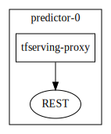

# TFserving MNIST

This example shows how you can combine Seldon with Tensorflo Serving. We will use a Seldon Tensorflow Serving proxy model image that will forward Seldon internal microservice prediction calls out to a Tensorflow serving server.

The example will use the MNIST digit classification task with the example MNIST model.

## Setup

```python
!pip install seldon-core
```

```python
%matplotlib inline
import json
import sys
from random import randint, random

import numpy as np
import requests
from matplotlib import pyplot as plt
from tensorflow.examples.tutorials.mnist import input_data

sys.path.append("../../../notebooks")
import grpc
import tensorflow as tf
from tensorflow.core.framework.tensor_pb2 import TensorProto
from visualizer import get_graph

from seldon_core.proto import prediction_pb2, prediction_pb2_grpc
```

```python
def gen_image(arr):
    two_d = (np.reshape(arr, (28, 28)) * 255).astype(np.uint8)
    plt.imshow(two_d, cmap=plt.cm.gray_r, interpolation="nearest")
    return plt


def download_mnist():
    return input_data.read_data_sets("MNIST_data/", one_hot=True)


def rest_predict_request(endpoint, data):
    request = {"data": {"ndarray": data.tolist()}}
    response = requests.post(
        "http://" + endpoint + "/predict",
        data={"json": json.dumps(request), "isDefault": True},
    )
    return response.json()


def rest_transform_input_request(endpoint, data):
    request = {"data": {"ndarray": data.tolist()}}
    response = requests.post(
        "http://" + endpoint + "/transform-input",
        data={"json": json.dumps(request), "isDefault": True},
    )
    return response.json()


def rest_transform_output_request(endpoint, data):
    request = {"data": {"ndarray": data.tolist()}}
    response = requests.post(
        "http://" + endpoint + "/transform-output",
        data={"json": json.dumps(request), "isDefault": True},
    )
    return response.json()


def rest_request_ambassador(
    deploymentName, namespace, endpoint="localhost:8003", arr=None
):
    payload = {
        "data": {
            "names": ["a", "b"],
            "tensor": {"shape": [1, 784], "values": arr.tolist()},
        }
    }
    response = requests.post(
        "http://"
        + endpoint
        + "/seldon/"
        + namespace
        + "/"
        + deploymentName
        + "/api/v0.1/predictions",
        json=payload,
    )
    print(response.status_code)
    print(response.text)


def grpc_request_internal(data, endpoint="localhost:5000"):
    datadef = prediction_pb2.DefaultData(tftensor=tf.make_tensor_proto(data))

    request = prediction_pb2.SeldonMessage(data=datadef)
    channel = grpc.insecure_channel(endpoint)
    stub = prediction_pb2_grpc.ModelStub(channel)
    response = stub.Predict(request=request)
    return response


def gen_mnist_data(mnist):
    batch_xs, batch_ys = mnist.train.next_batch(1)
    chosen = 0
    gen_image(batch_xs[chosen]).show()
    data = batch_xs[chosen].reshape((1, 784))
    return data
```

```python
mnist = download_mnist()
```

```
WARNING:tensorflow:From <ipython-input-2-04b637d7613e>:7: read_data_sets (from tensorflow.contrib.learn.python.learn.datasets.mnist) is deprecated and will be removed in a future version.
Instructions for updating:
Please use alternatives such as official/mnist/dataset.py from tensorflow/models.
WARNING:tensorflow:From /home/clive/anaconda3/lib/python3.6/site-packages/tensorflow/contrib/learn/python/learn/datasets/mnist.py:260: maybe_download (from tensorflow.contrib.learn.python.learn.datasets.base) is deprecated and will be removed in a future version.
Instructions for updating:
Please write your own downloading logic.
WARNING:tensorflow:From /home/clive/anaconda3/lib/python3.6/site-packages/tensorflow/contrib/learn/python/learn/datasets/base.py:252: _internal_retry.<locals>.wrap.<locals>.wrapped_fn (from tensorflow.contrib.learn.python.learn.datasets.base) is deprecated and will be removed in a future version.
Instructions for updating:
Please use urllib or similar directly.
Successfully downloaded train-images-idx3-ubyte.gz 9912422 bytes.
WARNING:tensorflow:From /home/clive/anaconda3/lib/python3.6/site-packages/tensorflow/contrib/learn/python/learn/datasets/mnist.py:262: extract_images (from tensorflow.contrib.learn.python.learn.datasets.mnist) is deprecated and will be removed in a future version.
Instructions for updating:
Please use tf.data to implement this functionality.
Extracting MNIST_data/train-images-idx3-ubyte.gz
Successfully downloaded train-labels-idx1-ubyte.gz 28881 bytes.
WARNING:tensorflow:From /home/clive/anaconda3/lib/python3.6/site-packages/tensorflow/contrib/learn/python/learn/datasets/mnist.py:267: extract_labels (from tensorflow.contrib.learn.python.learn.datasets.mnist) is deprecated and will be removed in a future version.
Instructions for updating:
Please use tf.data to implement this functionality.
Extracting MNIST_data/train-labels-idx1-ubyte.gz
WARNING:tensorflow:From /home/clive/anaconda3/lib/python3.6/site-packages/tensorflow/contrib/learn/python/learn/datasets/mnist.py:110: dense_to_one_hot (from tensorflow.contrib.learn.python.learn.datasets.mnist) is deprecated and will be removed in a future version.
Instructions for updating:
Please use tf.one_hot on tensors.
Successfully downloaded t10k-images-idx3-ubyte.gz 1648877 bytes.
Extracting MNIST_data/t10k-images-idx3-ubyte.gz
Successfully downloaded t10k-labels-idx1-ubyte.gz 4542 bytes.
Extracting MNIST_data/t10k-labels-idx1-ubyte.gz
WARNING:tensorflow:From /home/clive/anaconda3/lib/python3.6/site-packages/tensorflow/contrib/learn/python/learn/datasets/mnist.py:290: DataSet.__init__ (from tensorflow.contrib.learn.python.learn.datasets.mnist) is deprecated and will be removed in a future version.
Instructions for updating:
Please use alternatives such as official/mnist/dataset.py from tensorflow/models.
```

## Create MNIST Model Repository

You will need tensorflow installed to run these steps.

### Train Tensorflow MNIST example model

```python
!git clone https://github.com/tensorflow/serving.git
```

```
Cloning into 'serving'...
remote: Enumerating objects: 36, done.
remote: Counting objects: 100% (36/36), done.
remote: Compressing objects: 100% (24/24), done.
remote: Total 17758 (delta 18), reused 19 (delta 12), pack-reused 17722
Receiving objects: 100% (17758/17758), 4.77 MiB | 3.13 MiB/s, done.
Resolving deltas: 100% (13224/13224), done.
Checking connectivity... done.
```

```python
!cd serving/tensorflow_serving/example && python mnist_saved_model.py --training_iteration=100000 ../../../mnist-model
```

```
Training model...
Successfully downloaded train-images-idx3-ubyte.gz 9912422 bytes.
Extracting /tmp/train-images-idx3-ubyte.gz
Successfully downloaded train-labels-idx1-ubyte.gz 28881 bytes.
Extracting /tmp/train-labels-idx1-ubyte.gz
Successfully downloaded t10k-images-idx3-ubyte.gz 1648877 bytes.
Extracting /tmp/t10k-images-idx3-ubyte.gz
Successfully downloaded t10k-labels-idx1-ubyte.gz 4542 bytes.
Extracting /tmp/t10k-labels-idx1-ubyte.gz
2019-05-03 14:41:16.119184: I tensorflow/core/platform/cpu_feature_guard.cc:141] Your CPU supports instructions that this TensorFlow binary was not compiled to use: AVX2 FMA
training accuracy 0.9178
Done training!
Exporting trained model to b'../../../mnist-model/1'
Done exporting!
```

### Copy Model to Google Bucket

```python
# CHANGE THIS TO YOUR OWN CHOSEN GOOGLE BUCKET NAME
%env MODEL_REPOSITORY_BUCKET=gs://seldon-tfserving-store
```

```
env: MODEL_REPOSITORY_BUCKET=gs://seldon-tfserving-store
```

```python
!gsutil mb ${MODEL_REPOSITORY_BUCKET}
```

```
Creating gs://seldon-tfserving-store/...
```

```python
!gsutil cp -r mnist-model ${MODEL_REPOSITORY_BUCKET}
```

```
Copying file://mnist-model/1/saved_model.pb [Content-Type=application/octet-stream]...
Copying file://mnist-model/1/variables/variables.data-00000-of-00001 [Content-Type=application/octet-stream]...
Copying file://mnist-model/1/variables/variables.index [Content-Type=application/octet-stream]...
| [3 files][ 48.6 KiB/ 48.6 KiB]                                                
Operation completed over 3 objects/48.6 KiB.                                     
```

## Test From GCP Cluster

## Setup Seldon Core

Instructions [also online](seldon-core-setup.md).

### Run MNIST Inference Graph

```python
!helm install tfserving-mnist tfserving-mnist --namespace seldon --set tfserving.model_base_path=${MODEL_REPOSITORY_BUCKET}/mnist-model
```

```
NAME:   tfserving-mnist
LAST DEPLOYED: Fri May  3 18:51:07 2019
NAMESPACE: seldon
STATUS: DEPLOYED

RESOURCES:
==> v1alpha2/SeldonDeployment
NAME             AGE
tfserving-mnist  1s

```

```python
!helm template tfserving-mnist tfserving-mnist --namespace seldon --set tfserving.model_base_path=${MODEL_REPOSITORY_BUCKET}/mnist-model > mnist.json
```

```python
!sed '1,2d' mnist.json > tmp.json
```

```python
get_graph("tmp.json")
```



```python
!pygmentize mnist.json
```

```
---
# Source: tfserving-mnist/templates/mnist_tfserving_deployment.json
{
    "apiVersion": "machinelearning.seldon.io/v1alpha2",
    "kind": "SeldonDeployment",
    "metadata": {
        "labels": {
            "app": "seldon"
        },
        "name": "tfserving-mnist",
	"namespace": "seldon"	
    },
    "spec": {
        "name": "tf-mnist",
        "predictors": [
            {
                "componentSpecs": [{
                    "spec": {
                        "containers": [
                            {
                                "image": "seldonio/tfserving-proxy:0.1",
                                "name": "tfserving-proxy"
                            },
			    {
				"args": [
				    "/usr/bin/tensorflow_model_server",
				    "--port=7001",
				    "--model_name=mnist-model",
				    "--model_base_path=gs://seldon-models/tfserving/mnist-model"
				],
				"image": "gcr.io/kubeflow-images-public/tensorflow-serving-1.7:v20180604-0da89b8a",
				"name": "mnist-model",
				"ports": [
				    {
					"containerPort": 7001,
					"protocol": "TCP"
				    }
				],
				"resources": {
				    "limits": {
					"cpu": "4",
					"memory": "4Gi"
				    },
				    "requests": {
					"cpu": "1",
					"memory": "1Gi"
				    }
				},
				"securityContext": {
				    "runAsUser": 1000
				}
			    }
			],
			"terminationGracePeriodSeconds": 1
		    }
		}],
                "graph": {
		    "name": "tfserving-proxy",
		    "endpoint": { "type" : "REST" },
		    "type": "MODEL",
		    "children": [],
		    "parameters":
		    [
			{
			    "name":"grpc_endpoint",
			    "type":"STRING",
			    "value":"localhost:7001"
			},
			{
			    "name":"model_name",
			    "type":"STRING",
			    "value":"mnist-model"
			},
			{
			    "name":"model_output",
			    "type":"STRING",
			    "value":"scores"
			},
			{
			    "name":"model_input",
			    "type":"STRING",
			    "value":"images"
			},
			{
			    "name":"signature_name",
			    "type":"STRING",
			    "value":"predict_images"
			}
		    ]
		},
                "name": "mnist-tfserving",
                "replicas": 1
            }
        ]
    }
}
```

**Port forward Ambassador**

```
kubectl port-forward $(kubectl get pods -n seldon -l app.kubernetes.io/name=ambassador -o jsonpath='{.items[0].metadata.name}') -n seldon 8003:8080
```

```python
data = gen_mnist_data(mnist)
data = data.reshape((784))
rest_request_ambassador(
    "tfserving-mnist", "seldon", endpoint="localhost:8003", arr=data
)
```


```
200
{
  "meta": {
    "puid": "h7n5gedmned98nt4l0s3m71mtl",
    "tags": {
    },
    "routing": {
    },
    "requestPath": {
      "tfserving-proxy": "seldonio/tfserving-proxy:0.1"
    },
    "metrics": []
  },
  "data": {
    "names": ["t:0", "t:1", "t:2", "t:3", "t:4", "t:5", "t:6", "t:7", "t:8", "t:9"],
    "tensor": {
      "shape": [1, 10],
      "values": [1.5026679900387307E-10, 7.648504052326643E-10, 2.311240223207278E-6, 5.463987235998502E-6, 0.9917333126068115, 5.872762812941801E-6, 4.898904748529276E-8, 1.9045433873543516E-5, 2.1104186089360155E-5, 0.008212855085730553]
    }
  }
}
```

## Analytics and Load Test

```python
!helm install seldon-core-analytics ../../../helm-charts/seldon-core-analytics \
    --set grafana_prom_admin_password=password \
    --set persistence.enabled=false \
    --namespace seldon
```

```
NAME:   seldon-core-analytics
LAST DEPLOYED: Mon Sep 24 15:52:34 2018
NAMESPACE: seldon
STATUS: DEPLOYED

RESOURCES:
==> v1/Service
NAME                      TYPE       CLUSTER-IP     EXTERNAL-IP  PORT(S)       AGE
alertmanager              ClusterIP  10.19.253.159  <none>       80/TCP        1s
grafana-prom              NodePort   10.19.251.82   <none>       80:30690/TCP  1s
prometheus-node-exporter  ClusterIP  None           <none>       9100/TCP      1s
prometheus-seldon         ClusterIP  10.19.245.167  <none>       80/TCP        1s

==> v1/Secret
NAME                 TYPE    DATA  AGE
grafana-prom-secret  Opaque  1     2s

==> v1/ServiceAccount
NAME        SECRETS  AGE
prometheus  1        2s

==> v1/Job
NAME                            DESIRED  SUCCESSFUL  AGE
grafana-prom-import-dashboards  1        0           1s

==> v1beta1/Deployment
NAME                     DESIRED  CURRENT  UP-TO-DATE  AVAILABLE  AGE
alertmanager-deployment  1        1        1           0          1s
grafana-prom-deployment  1        1        1           0          1s
prometheus-deployment    1        1        1           0          1s

==> v1beta1/DaemonSet
NAME                      DESIRED  CURRENT  READY  UP-TO-DATE  AVAILABLE  NODE SELECTOR  AGE
prometheus-node-exporter  1        1        0      1           0          <none>         1s

==> v1/Pod(related)
NAME                                      READY  STATUS             RESTARTS  AGE
grafana-prom-import-dashboards-wzl55      0/1    ContainerCreating  0         1s
alertmanager-deployment-557b99ccf8-m27mm  0/1    ContainerCreating  0         1s
grafana-prom-deployment-dd84b7788-gmdkc   0/1    ContainerCreating  0         1s
prometheus-node-exporter-pnv9k            0/1    ContainerCreating  0         1s
prometheus-deployment-78dd89b44f-7t62q    0/1    ContainerCreating  0         1s

==> v1/ConfigMap
NAME                       DATA  AGE
alertmanager-server-conf   1     2s
grafana-import-dashboards  7     2s
prometheus-rules           4     2s
prometheus-server-conf     1     2s

==> v1beta1/ClusterRole
NAME        AGE
prometheus  2s

==> v1beta1/ClusterRoleBinding
NAME        AGE
prometheus  2s


NOTES:
NOTES: TODO

```

```python
!kubectl label nodes $(kubectl get nodes -o jsonpath='{.items[0].metadata.name}') role=locust
```

```
node "gke-cluster-2-default-pool-54fbe785-wmcb" labeled
```

```python
!helm install loadtest seldon-core-loadtesting \
    --namespace seldon \
    --repo https://storage.googleapis.com/seldon-charts \
    --set locust.script=mnist_rest_locust.py \
    --set locust.host=http://tf-mnist:8000 \
    --set oauth.enabled=false \
    --set locust.hatchRate=1 \
    --set locust.clients=1 \
    --set loadtest.sendFeedback=1 \
    --set locust.minWait=0 \
    --set locust.maxWait=0 \
    --set replicaCount=1 \
    --set data.size=784
```

```
NAME:   loadtest
LAST DEPLOYED: Mon Sep 24 15:52:43 2018
NAMESPACE: seldon
STATUS: DEPLOYED

RESOURCES:
==> v1/ReplicationController
NAME             DESIRED  CURRENT  READY  AGE
locust-slave-1   1        1        0      0s
locust-master-1  1        1        0      0s

==> v1/Service
NAME             TYPE      CLUSTER-IP     EXTERNAL-IP  PORT(S)                                       AGE
locust-master-1  NodePort  10.19.255.204  <none>       5557:32342/TCP,5558:30493/TCP,8089:32034/TCP  0s

==> v1/Pod(related)
NAME                   READY  STATUS             RESTARTS  AGE
locust-slave-1-zncg4   0/1    ContainerCreating  0         0s
locust-master-1-9z8gm  0/1    ContainerCreating  0         0s

```

You should port-forward the grafana dashboard

```
kubectl port-forward $(kubectl get pods -n seldon -l app=grafana-prom-server -o jsonpath='{.items[0].metadata.name}') -n seldon 3000:3000
```

You can then view an analytics dashboard inside the cluster at http://localhost:3000/dashboard/db/prediction-analytics?refresh=5s\&orgId=1.

```python
```
