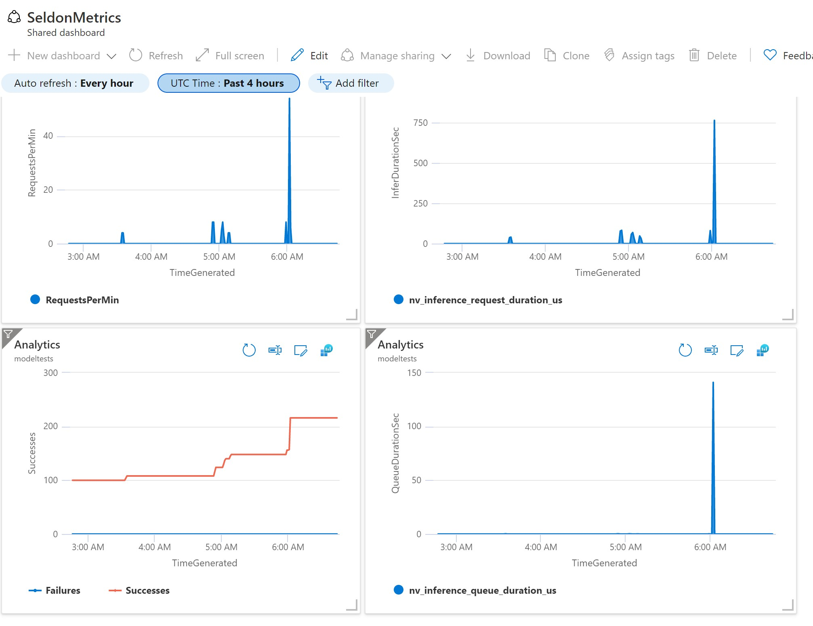

# Pre-trained GPT-2 Model Deployment with Triton on Azure

In this notebook, we will run an example of text generation using a GPT-2 model exported from HuggingFace and deployed with Seldon's Triton pre-packed server. The example also covers converting the model to ONNX format. The implemented example below uses a Greedy approach for next token prediction.

For more info, see the [HuggingFace GPT-2 documentation](https://huggingface.co/transformers/model_doc/gpt2.html?highlight=gpt2).

After we have the module deployed to Kubernetes, we will run a simple load test to evaluate the module's inference performance.

## Steps

- [Download pre-trained GPT-2 model from HuggingFace](#Export-HuggingFace-TFGPT2LMHeadModel-pre-trained-model-and-save-it-locally)
- [Convert the model to ONNX](#Convert-the-TensorFlow-saved-model-to-ONNX)
- [Store model in Azure Storage Blob](#Copy-your-model-to-Azure-Blob)
- [Create PersistentVolume and PVC](#Add-Azure-PersistentVolume-and-Claim) mounting Azure Storage Blob
- [Setup Seldon-Core](#Run-Seldon-in-your-kubernetes-cluster) in your Kubernetes cluster
- [Deploy the ONNX model](#Deploy-your-model-with-Seldon-pre-packaged-Triton-server) with Seldon’s pre-packaged Triton server
- [Run model inference](#Run-prediction-test:-generate-a-sentence-completion-using-GPT2-model---Greedy-approach) (greedy algorithm example)
- [Monitor model with Azure Monitor](#Configure-Model-Monitoring-with-Azure-Monitor)
- [Run load test using Vegeta](#Run-Load-Test-/-Performance-Test-using-vegeta)
- [Clean-up](#Clean-up)

## Basic Requirements

- Helm v3.0.0+
- A Kubernetes cluster running v1.13 or above
- kubectl v1.14+
- Python 3.6+

First, create a `requirements.txt` file:

```text
transformers==4.5.1
torch==1.8.1
tokenizers<0.11,>=0.10.1
tensorflow==2.4.1
tf2onnx
```

Now, install the dependencies:

```bash
pip install --trusted-host=pypi.python.org --trusted-host=pypi.org --trusted-host=files.pythonhosted.org -r requirements.txt
```

### Export HuggingFace TFGPT2LMHeadModel pre-trained model and save it locally <a id="hf"/>

```python
from transformers import GPT2Tokenizer, TFGPT2LMHeadModel

tokenizer = GPT2Tokenizer.from_pretrained("gpt2")
model = TFGPT2LMHeadModel.from_pretrained(
    "gpt2", from_pt=True, pad_token_id=tokenizer.eos_token_id
)
model.save_pretrained("./tfgpt2model", saved_model=True)
```

### Convert the TensorFlow saved model to ONNX <a id="onnx"/>

```bash
python -m tf2onnx.convert --saved-model ./tfgpt2model/saved_model/1 --opset 13  --output model.onnx
```

## Azure Setup

We have provided an [Azure Setup Notebook](../notebooks/triton_gpt2_example_azure_setup.md) that deploys an AKS cluster, an Azure storage account, and installs the Azure Blob CSI driver. If an AKS cluster already exists, skip to the creation of Blob Storage and CSI driver installation steps.

Upon completion of the Azure setup, the following infrastructure will be created:


```python
resource_group = "seldon"  # feel free to replace or use this default
aks_name = "modeltests"
storage_account_name = "modeltestsgpt"  # fill in
storage_container_name = "gpt2onnx"
```

### Copy your model to Azure Blob

```bash
# Copy model file
az extension add --name storage-preview
az storage azcopy blob upload --container {storage_container_name} \
                               --account-name {storage_account_name} \
                               --source  ./model.onnx \
                               --destination gpt2/1/model.onnx
```

```bash
#Verify Uploaded file
az storage blob list \
    --account-name {storage_account_name}\
    --container-name {storage_container_name} \
    --output table
```

```text
Name               IsDirectory    Blob Type    Blob Tier    Length     Content Type              Last Modified              Snapshot
-----------------  -------------  -----------  -----------  ---------  ------------------------  -------------------------  ----------
gpt2/1/model.onnx                 BlockBlob    Hot          652535462  application/octet-stream  2021-05-28T04:37:11+00:00
```

## Add Azure PersistentVolume and Claim

For more details on creating a PersistentVolume using the CSI driver, refer to the [official documentation](https://github.com/kubernetes-sigs/blob-csi-driver/blob/master/deploy/example/e2e_usage.md).
- Create secret
- Create a PersistentVolume pointing to the secret and Blob Container Name
- Create a PersistentVolumeClaim to bind to the volume

```python
key = !az storage account keys list --account-name {storage_account_name} -g {resource_group} --query '[0].value' -o tsv
storage_account_key = key[0]
```

```bash
# Create secret to access storage account
kubectl create secret generic azure-blobsecret --from-literal azurestorageaccountname={storage_account_name} --from-literal azurestorageaccountkey="{storage_account_key}" --type=Opaque
```

Create a file named `azure-blobfuse-pv.yaml`:
```yaml
apiVersion: v1
kind: PersistentVolume
metadata:
  name: pv-gpt2blob
spec:
  capacity:
    storage: 10Gi
  accessModes:
    - ReadWriteMany
  persistentVolumeReclaimPolicy: Retain
  csi:
    driver: blob.csi.azure.com
    readOnly: false
    volumeHandle: trainingdata
    volumeAttributes:
      containerName: gpt2onnx
    nodeStageSecretRef:
      name: azure-blobsecret
      namespace: default
  mountOptions:
    - -o uid=8888
    - -o allow_other
---
kind: PersistentVolumeClaim
apiVersion: v1
metadata:
  name: pvc-gpt2blob
spec:
  accessModes:
    - ReadWriteMany
  resources:
    requests:
      storage: 10Gi
  volumeName: pv-gpt2blob
  storageClassName: ""
```

```bash
kubectl apply -f  azure-blobfuse-pv.yaml
```

```bash
# Verify PVC is bound
kubectl get pv,pvc
```

```text
NAME                           CAPACITY   ACCESS MODES   RECLAIM POLICY   STATUS   CLAIM                  STORAGECLASS   REASON   AGE
persistentvolume/pv-gpt2blob   10Gi       RWX            Retain           Bound    default/pvc-gpt2blob                           4h54m

NAME                                 STATUS   VOLUME        CAPACITY   ACCESS MODES   STORAGECLASS   AGE
persistentvolumeclaim/pvc-gpt2blob   Bound    pv-gpt2blob   10Gi       RWX                           4h54m
```

### Run Seldon in your kubernetes cluster

Follow the [Seldon-Core Setup notebook](../notebooks/seldon-core-setup.md) to set up a cluster with Istio Ingress and install Seldon Core.

### Deploy your model with Seldon pre-packaged Triton server

Create a file named `gpt2-deploy.yaml`:
```yaml
apiVersion: machinelearning.seldon.io/v1alpha2
kind: SeldonDeployment
metadata:
  name: gpt2gpu
spec:
  annotations:
    prometheus.io/port: "8002"
    prometheus.io/path: "/metrics"
  predictors:
  - componentSpecs:
    - spec:
        containers:
        - name: gpt2
          resources:
            requests:
              memory: 2Gi
              cpu: 2
              nvidia.com/gpu: 1
            limits:
              memory: 4Gi
              cpu: 4
              nvidia.com/gpu: 1
         tolerations:
          - key: "nvidia.com"
            operator: "Equal"
            value: "gpu"
            effect: "NoSchedule"
    graph:
      implementation: TRITON_SERVER
      logger:
        mode: all
      modelUri: pvc://pvc-gpt2blob/
      name: gpt2
      type: MODEL
    name: default
    replicas: 1
  protocol: kfserving
```

```bash
kubectl apply -f gpt2-deploy.yaml -n default
```

```bash
kubectl rollout status deploy/$(kubectl get deploy -l seldon-deployment-id=gpt2gpu -o jsonpath='{.items[0].metadata.name}')
```

#### Interact with the model: get model metadata

```bash
ingress_ip=$(kubectl get svc --namespace istio-system istio-ingressgateway -o jsonpath='{.status.loadBalancer.ingress[0].ip}')
curl -v http://${ingress_ip}:80/seldon/default/gpt2gpu/v2/models/gpt2
```

```json
{"name":"gpt2","versions":["1"],"platform":"onnxruntime_onnx","inputs":[{"name":"input_ids:0","datatype":"INT32","shape":[-1,-1]},{"name":"attention_mask:0","datatype":"INT32","shape":[-1,-1]}],"outputs":[{"name":"past_key_values","datatype":"FP32","shape":[12,2,-1,12,-1,64]},{"name":"logits","datatype":"FP32","shape":[-1,-1,50257]}]}
```

### Run prediction test: generate a sentence completion using GPT2 model  - Greedy approach

```python
import http
import json
import numpy as np
import requests
from transformers import GPT2Tokenizer

tokenizer = GPT2Tokenizer.from_pretrained("gpt2")
input_text = "I love Artificial Intelligence"
count = 0
max_gen_len = 8
gen_sentence = input_text
while count < max_gen_len:
    input_ids = tokenizer.encode(gen_sentence, return_tensors="tf")
    shape = input_ids.shape.as_list()
    payload = {
        "inputs": [
            {
                "name": "input_ids:0",
                "datatype": "INT32",
                "shape": shape,
                "data": input_ids.numpy().tolist(),
            },
            {
                "name": "attention_mask:0",
                "datatype": "INT32",
                "shape": shape,
                "data": np.ones(shape, dtype=np.int32).tolist(),
            },
        ]
    }

    tfserving_url = (
        "http://" + str(ingress_ip) + "/seldon/default/gpt2gpu/v2/models/gpt2/infer"
    )
    print(f"sending request to {tfserving_url}")

    with requests.post(tfserving_url, json=payload) as ret:
        try:
            res = ret.json()
        except:
            continue

    # extract logits
    logits = np.array(res["outputs"][1]["data"])
    logits = logits.reshape(res["outputs"][1]["shape"])

    # take the best next token probability of the last token of input ( greedy approach)
    next_token = logits.argmax(axis=2)[0]
    next_token_str = tokenizer.decode(
        next_token[-1:], skip_special_tokens=True, clean_up_tokenization_spaces=True
    ).strip()
    gen_sentence += " " + next_token_str
    print(f"Sentence: {gen_sentence}")

    count += 1

print(f"Input: {input_text}\nOutput: {gen_sentence}")
```

```text
sending request to http://20.75.117.145/seldon/default/gpt2gpu/v2/models/gpt2/infer
Sentence: I love Artificial Intelligence .
sending request to http://20.75.117.145/seldon/default/gpt2gpu/v2/models/gpt2/infer
Sentence: I love Artificial Intelligence . I
sending request to http://20.75.117.145/seldon/default/gpt2gpu/v2/models/gpt2/infer
Sentence: I love Artificial Intelligence . I love
sending request to http://20.75.117.145/seldon/default/gpt2gpu/v2/models/gpt2/infer
Sentence: I love Artificial Intelligence . I love the
sending request to http://20.75.117.145/seldon/default/gpt2gpu/v2/models/gpt2/infer
Sentence: I love Artificial Intelligence . I love the way
sending request to http://20.75.117.145/seldon/default/gpt2gpu/v2/models/gpt2/infer
Sentence: I love Artificial Intelligence . I love the way it
sending request to http://20.75.117.145/seldon/default/gpt2gpu/v2/models/gpt2/infer
Sentence: I love Artificial Intelligence . I love the way it 's
sending request to http://20.75.117.145/seldon/default/gpt2gpu/v2/models/gpt2/infer
Sentence: I love Artificial Intelligence . I love the way it 's designed
Input: I love Artificial Intelligence
Output: I love Artificial Intelligence . I love the way it 's designed
```

## Configure Model Monitoring with Azure Monitor <a id="azuremonitor"/>

The Azure Monitor Containers Insights provides functionality to allow collecting data from any Prometheus endpoints. To turn on Azure Monitor Container Insights, follow the steps described [here](https://docs.microsoft.com/en-us/azure/azure-monitor/containers/container-insights-onboard).

```bash
kubectl get pods -n kube-system | grep omsagent
```

### Configure Prometheus Metrics scraping

For more details on how to configure the scraping endpoints and query collected data refer to [MS Docs on Configure scraping of Prometheus metrics with Container insights](https://docs.microsoft.com/en-us/azure/azure-monitor/containers/container-insights-prometheus-integration).

Our deployed model metrics are available from the [Seldon model orchestrator](../integrations/analytics.md) and [Nvidia Triton Server](https://github.com/triton-inference-server/server/blob/main/docs/user_guide/metrics.md). To enable scraping for both endpoints, update the `ConfigMap` that configures `omsagent` ([azure-metrics-cm.yaml](./azure-metrics-cm.yaml)).

```bash
kubectl apply -f azure-metrics-cm.yaml
```

### Query and Visualize collected data
Collected metrics are available in the Logs blade of Azure Monitor in a table **InsightsMetrics**.

To get Model Inference Requests per minute from Seldon Metrics, run the following KQL query:

```kql
InsightsMetrics 
| where Namespace == "prometheus"
| where Name == "seldon_api_executor_server_requests_seconds_count"
| extend Model = parse_json(Tags).deployment_name
| where parse_json(Tags).service == "predictions"  
| order by TimeGenerated asc 
| extend RequestsPerMin = Val - prev(Val,1)
| project TimeGenerated, RequestsPerMin
| render areachart 
```

To get Inference Duration from Triton Metrics:

```kql
InsightsMetrics 
| where Namespace == "prometheus"
| where Name in ("nv_inference_request_duration_us")
| order by TimeGenerated asc
| extend QueueDurationSec = (Val - prev(Val, 1)) / 1000
| project TimeGenerated, Name, QueueDurationSec
| render areachart   
```

Here is an example dashboard created using the queries above:

 


### Run Load Test / Performance Test using vegeta

#### Install vegeta
For more details, see the [official vegeta documentation](https://github.com/tsenart/vegeta#install).

```bash
wget https://github.com/tsenart/vegeta/releases/download/v12.8.3/vegeta-12.8.3-linux-arm64.tar.gz
tar -zxvf vegeta-12.8.3-linux-arm64.tar.gz
chmod +x vegeta
```

#### Generate vegeta target file

```python
import base64
import json
from subprocess import PIPE, Popen, run
import numpy as np
from transformers import GPT2Tokenizer, TFGPT2LMHeadModel

tokenizer = GPT2Tokenizer.from_pretrained("gpt2")
input_text = "I enjoy working in Seldon"
input_ids = tokenizer.encode(input_text, return_tensors="tf")
shape = input_ids.shape.as_list()
payload = {
    "inputs": [
        {
            "name": "input_ids:0",
            "datatype": "INT32",
            "shape": shape,
            "data": input_ids.numpy().tolist(),
        },
        {
            "name": "attention_mask:0",
            "datatype": "INT32",
            "shape": shape,
            "data": np.ones(shape, dtype=np.int32).tolist(),
        },
    ]
}
tfserving_url = (
    "http://" + str(ingress_ip) + "/seldon/default/gpt2gpu/v2/models/gpt2/infer"
)
print(f"preparing request to {tfserving_url}")

cmd = {
    "method": "POST",
    "header": {"Content-Type": ["application/json"]},
    "url": tfserving_url,
    "body": base64.b64encode(bytes(json.dumps(payload), "utf-8")).decode("utf-8"),
}

with open("vegeta_target.json", mode="w") as file:
    json.dump(cmd, file)
    file.write("\n\n")
```

```bash
./vegeta attack -targets=vegeta_target.json -rate=1 -duration=60s -format=json | ./vegeta report -type=text
```

```text
Requests      [total, rate, throughput]         60, 1.02, 0.95
Duration      [total, attack, wait]             1m3s, 58.994s, 4.445s
Latencies     [min, mean, 50, 90, 95, 99, max]  1.45s, 4.003s, 3.983s, 5.249s, 6.329s, 7.876s, 7.97s
Bytes In      [total, mean]                     475803960, 7930066.00
Bytes Out     [total, mean]                     13140, 219.00
Success       [ratio]                           100.00%
Status Codes  [code:count]                      200:60  
Error Set:
```

### Clean-up <a id="cleanup"/>

```bash
kubectl delete -f gpt2-deploy.yaml -n default
```
