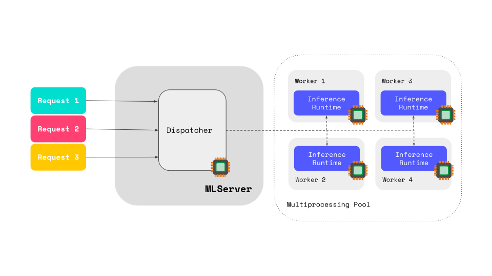

# Inference

When looking at optimizing the latency or throughput of deployed models or pipelines, it is important to consider different approaches to the execution of inference workloads. Below are some tips on different approaches that may be relevant depending on the requirements of a given use-case:

- gRPC may be more efficient than REST when your inference request payload benefits from a binary serialization format.
- Grouping multiple real-time requests into small batches can improve throughput while maintaining acceptable latency. For more information on adaptive batching in MLServer, see [here](https://docs.seldon.ai/mlserver/user-guide/adaptive-batching).
- Reducing input size by reducing the dimensions of your inputs can speed up processing. This also reduces (de)serialization overhead that might be needed around model deployments.
- For models deployed with MLServer, adjust `parallel_workers` in line with the number of CPU cores assigned to the Server pod. This is most effective for synchronous models, CPU-bound asynchronous models, and I/O-bound asynchronous models with high throughput. Proper tuning here can improve throughput, stabilize latency distribution, and potentially reduce overall latency due to reduced queuing. This is outlined in more detail in section below.

### Configuring Parallel Processing

When deploying models using MLServer, it is possible to execute inference workloads via a pool of workers running in separate processes (see in MLServer docs [here](https://docs.seldon.ai/mlserver/user-guide/parallel-inference)).

To assess the throughput behavior of individual model(s) it is first helpful to identify the maximum throughput possible with one worker (`one-worker max throughput`) and then the maximum throughput possible with *N* workers (`n_workers max throughput`). It is important to note that the `n_workers max throughput` is not simply `n_workers` × `one-worker max throughput` because workers run in separate processes, and the OS can only run as many processes in parallel as there are available CPUs. If all workers are CPU-bound, then setting `n_workers` higher than the number of CPU cores will be ineffective, as the OS will be limited by the number of CPU cores in terms of processes available to parallelize. 

However, if some workers are waiting for either I/O or for a GPU, then setting `n_workers` to a value higher than the number of CPUs can help increase throughput, as some workers can then continue processing while others wait. Generally, if a model is receiving inference requests at a throughput that is lower than the `one-worker max throughput`, then adding additional workers will not help increase throughput or decrease latency. Similarly, if MLServer is configured with `n_workers` (on a pod with more than `n_CPUs`) and the request rate is below the `n_workers worker max throughput`, latency remains constant - the system is below saturation. 

Given the above, it is worth considering increasing the number of workers available to process data for a given deployed model when the system becomes saturated. Increasing the number of workers up to or slightly above the number of CPU cores available may reduce latency when the system is saturated, provided the MLServer pod has sufficient spare CPU. The effect of increasing workers also depends on whether the model is CPU-bound or uses async versus blocking operations, where CPU-bound and blocking models would benefit most. When the system is saturated with requests, those requests will queue. Increasing workers aims to run enough tasks in parallel to cope with higher throughput while minimizing queuing.    

## Optimizing the model artefact

If optimizing for speed, the model artefact itself can have a big impact on performance. The speed at which an ML model can return results given input is based on the model’s architecture, model size, the precision of the model’s weights, and input size. In order to reduce the inherent complexity in the data processing required to execute an inference due to the attributes of a model, it is worth considering: 

- **Model pruning** to reduce parameters that may be unimportant. This can help reduce model size without having a big impact on the quality of the model’s outputs.
- **Quantization** to reduce the computational and memory overheads of running inference by using model weights and activations with lower precision data types.
- **Dimensionality reduction** of inputs to reduce the complexity of computation.
- **Efficient model architectures** such as MobileNet, EfficientNet, or DistilBERT, which are designed for faster inference with minimal accuracy loss.
- **Optimized model formats and runtimes** like ONNX Runtime, TensorRT, or OpenVINO, which leverage hardware-specific acceleration for improved performance.