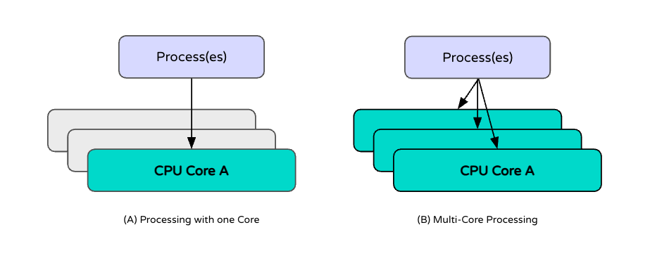

## Infrastructure Setup

## CPUs vs. GPUs

Overall performance of your models will be constrained by the specifications of the underlying hardware which it is run on, and how it is leveraged. Choosing between CPUs and GPUs depends on the latency and throughput requirements for your use-case, as well as the type of model you are putting into production:

* **CPUs** are generally sufficient for lightweight models, such as tree-based models, regression models, or small neural networks.
* **GPUs** are recommended for deep learning models, large-scale neural networks, and large language models (LLMs) where lower latency is critical. Models with high matrix computation demands (like transformers or CNNs) benefit significantly from GPU acceleration.

If cost is a concern, it is recommended to start with CPUs and use profiling or performance monitoring tools (e.g. as py-spy or scalene) to identify CPU bottlenecks. Based on these results, you can transition to GPUs as needed.

## Setting the right specifications for CPUs

If working with models that will receive many concurrent requests in production, individual CPUs can often act as bottlenecks when processing data. In these cases, increasing the parallel workers can help. This can be configured through your serving solution as described in the [Inference](inference.md) section. It is important to note that when increasing the number of workers available to process concurrent requests, it is best practice to ensure the number of workers is not significantly higher than the number of available CPU cores, in order to reduce contention. Each worker executes in it’s own process. This is most relevant for synchronous models where subsequent processing is blocked on completion of each request.

For more advanced configuration of CPU utilization, users can configure thread affinity through environment variables which determine how threads are bound to physical processors. For example, `KMP_AFFINITY` and `OMP_NUM_THREADS` are variables that can be set for technologies that use OpenMP. For more information on thread affinity, see [here](https://www.intel.com/content/www/us/en/docs/dpcpp-cpp-compiler/developer-guide-reference/2023-0/thread-affinity-interface.html). In general, the ML Framework that you’re using might have it’s own recommendations for improving resource usage.

Finally, increasing the RAM available for your models can improve performance for memory intensive models, such as models with large parameter sizes, ones that require high-dimensional data processing, or involve complex intermediate computations.
