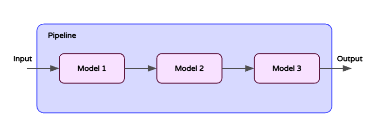
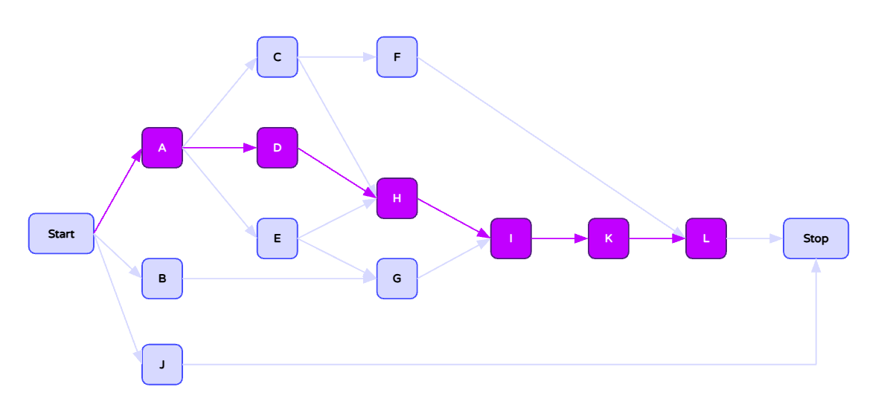

# Pipelines

In order to understand how pipelines will behave in a production setting, it is first helpful to isolate testing to the individual models within the pipeline. By obtaining the maximum throughput for each model given the infrastructure each are running on (e.g. GPU specs) and their configurations (e.g. how many workers are used), users will gain a better understanding of which models might be limiting to the performance of the pipeline around it. Given the performance profiles of models within a pipeline, it is recommended to optimize for the desired performance of those individual models first (see [here](https://www.notion.so/Performance-Tuning-Docs-1bc6a4c8852080ce94c4eb1dcd725b9f?pvs=21)), ensuring they have the right number of replicas and are running on the right infrastructure in order to achieve the right level of performance.

The performance behavior of Seldon Core 2 pipelines is more complex compared to individual models. Inference request latency can be broken down into:

1. The sum of the latencies for each model in the critical path of the pipeline (the one containing the bottleneck)
2. The per-stage data processing overhead caused by pipeline-specific operations (data movement, copying, writing to Kafka topics, etc)

## Reducing Bottlenecks

To simplify, first, we can consider a **linear pipeline** that consists of a chain of sequential components:

The maximum throughput achievable through the pipeline is the minimum of the maximum throughputs achievable by each individual model in the pipeline, given a number of workers. Exceeding this maximum will create a bottleneck in processing, degrading performance for the pipeline. To prevent bottlenecking from a given step in your pipeline, you can:

- Increase the resources available to a model’s server, as well as the number of workers
- Increase the number of model replicas among which the load is balanced (autoscaling can help set the correct number)

In the case of a more complex, **non-linear pipeline**, the first step would be to identify the critical path within the pipeline (the path containing the model that gets it’s throughput saturated first), and then, based on that critical path, follow the same steps above for any model in that path that creates a bottleneck. There will *always* be a bottleneck model in a pipeline; the goal is to balance the number of replicas of each model and/or the MLServer resources together with the number of workers so that each stage in the pipeline is able to handle the request throughput with as little queueing as possible happening **between the pipeline stages,** therefore reducing overall latency.

