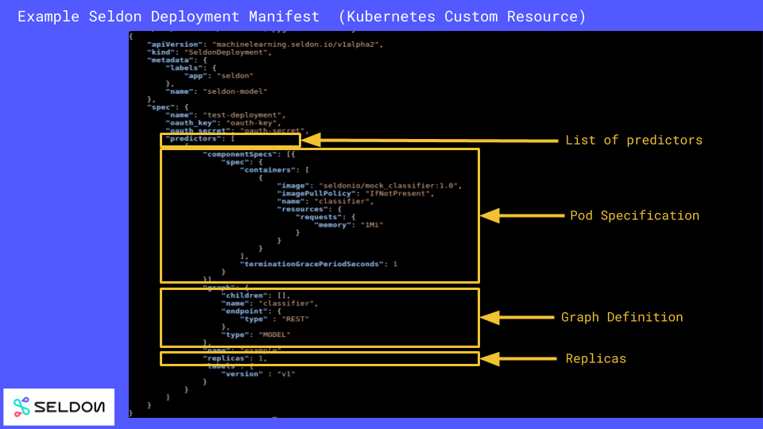

# Inference Graph

Seldon Core extends Kubernetes with its own custom resource SeldonDeployment where you can define your runtime inference graph made up of models and other components that Seldon will manage.

A SeldonDeployment is a JSON or YAML file that allows you to define your graph of component images and the resources each of those images will need to run (using a Kubernetes PodTemplateSpec). The parts of a SeldonDeployment are shown below:



A minimal example for a single model, this time in YAML, is shown below:
```yaml
apiVersion: machinelearning.seldon.io/v1alpha2
kind: SeldonDeployment
metadata:
  name: seldon-model
spec:
  name: test-deployment
  predictors:
  - componentSpecs:
    - spec:
        containers:
        - name: classifier
          image: seldonio/mock_classifier:1.0
    graph:
      children: []
      endpoint:
        type: REST
      name: classifier
      type: MODEL
    name: example
    replicas: 1
```

The key components are:

  * A list of Predictors, each with a specification for the number of replicas.
     * Each defines a graph and its set of deployments. Multiple predictors is useful when you want to split traffic between a main graph and a canary or for other production rollout scenarios.
  * For each predictor a list of componentSpecs. Each componentSpec is a Kubernetes PodTemplateSpec which Seldon will build into a Kubernetes Deployment. Place here the images from your graph and their requirements, e.g. Volumes, ImagePullSecrets, Resources Requests etc.
  * A graph specification that describes how your components are joined together.

## Example of graph with pre-processor and post-processor

Below we show an example that has a slightly more complex graph structure. In this case we are defining a pre-processor and post-processor components.

```yaml
apiVersion: machinelearning.seldon.io/v1alpha2
kind: SeldonDeployment
metadata:
  name: seldon-model
spec:
  name: test-deployment
  predictors:
  - componentSpecs:
    - spec:
        containers:
        - name: step_one
          image: seldonio/step_one:1.0
        - name: step_two
          image: seldonio/step_two:1.0
        - name: step_three
          image: seldonio/step_three:1.0
    graph:
      name: step_one
      endpoint:
        type: REST
      type: MODEL
      children:
          name: step_two
          endpoint:
            type: REST
          type: MODEL
          children:
              name: step_three
              endpoint:
                type: REST
              type: MODEL
              children: []
    name: example
    replicas: 1
```

## More complex inference graphs

It's possible to define complex graphs with ROUTERS, COMBINERS, and other components. You can find more of these specialised examples in our [examples section](../examples/notebooks.rst).

## Learn about all types through Go Reference

You can learn more about the SeldonDeployment YAML definition by reading the content on our [Kubernetes Seldon Deployment Go Types file](../reference/seldon-deployment.rst).


## Image UserIds

We provide an environment variable DEFAULT_USER_ID (set in the helm chart install with `.Values.defaultUserID`) which allows you to set the default user id the images will run under. This defaults to 8888. If you wish to override this for your specific Pod/Container rather than globally you can change it as shown in the example below:

```yaml
apiVersion: machinelearning.seldon.io/v1
kind: SeldonDeployment
metadata:
  name: seldon-model
spec:
  name: test-deployment
  predictors:
  - componentSpecs:
    - spec:
        containers:
        - image: seldonio/mock_classifier_rest:1.3
          name: classifier
          securityContext:
            runAsUser: 1000
    graph:
      children: []
      endpoint:
        type: REST
      name: classifier
      type: MODEL
    name: example
    replicas: 1
```

The above example makes the classifier container run with userId 1000. We recommend that all containers run with a non-root userid. On Openshift clusters this is usually enforced automatically.
