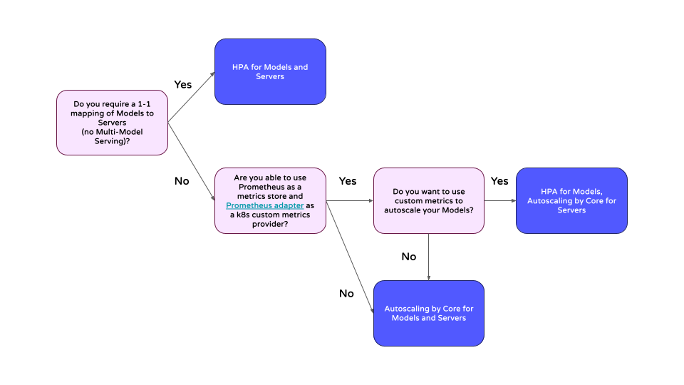

# Autoscaling in Seldon Core 2

Seldon Core 2 provides multiple approaches to scaling your machine learning deployments, allowing you to optimize resource utilization and handle varying workloads efficiently. In Core 2, we separate out Models and Servers, and Servers can have multiple Models loaded on them (Multi-Model Serving). Given this, setting up autoscaling requires defining the logic by which you want to scale your Models and _then_ configuring the autoscaling of Servers such that they autoscale in a coordinated way. The following steps can be followed to set up autoscaling based on specific requirements:

1. **Identify metrics** that you want to scale Models on. There are a couple of different options here:
    1. Core 2 natively supports scaling based on **Inference Lag**, meaning the difference between incoming and outgoing requests for a model in a given period of time. This is done by configuring `minReplicas` or `maxReplicas` in the Model CRDs and making sure you configure the Core 2 install with the `autoscaling.autoscalingModelEnabled` helm value set to `true` (default is `false`).
    2. Users can expose **custom or Kubernetes-native metrics**, and then target the scaling of models based on those metrics by using `HorizontalPodAutoscaler`. This requires exposing the right metrics, using the monitoring tool of your choice (e.g. Prometheus).

Once the approach for Model scaling is implemented, Server scaling needs to be configured. 

2. **Implement Server Scaling** by either:
    1. Enabling Autoscaling of Servers based on Model needs. This is managed by Seldon's scheduler, and is enabled by setting `minReplicas` and `maxReplicas` in the Server Custom Resource and making sure you configure the Core 2 install with the `autoscaling.autoscalingServerEnabled` helm value set to `true` (the default)
    2. If Models and Servers are to have a one-to-one mapping (no Multi-Model Serving) then users can also define scaling of Servers using an HPA manifest that matches the HPA applied to the associated Models. This approach is outlined [here](./single-model-serving-hpa.md). This approach will only work with custom metrics, as Kubernetes does not allow mutliple HPAs to target the same metrics from Kubernetes directly.

Based on the requirements above, one of the following three options for coordinated autoscaling of Models and Servers can be chosen:

| Scaling Approach | Scaling Metric | Multi-Model Serving | Pros | Cons |
|-----------------|------------------------|---------------------|------|------|
| [Seldon Core Autoscaling](./core-autoscaling.md) | Inference lag | ✅ | - Simplest Implementation - One metric across models | - Potentially suboptimal Server packing on scale down |
| [Model Autoscaling with HPA](./model-hpa-autoscaling.md) | User-defined (HPA) | ✅ | - Custom scaling metric | - Requires Metrics store integration (e.g. Prometheus) - Potentially suboptimal Server packing on scale down |
| [Model and Server Autoscaling with HPA](./single-model-serving-hpa.md) | User-defined (HPA) | ❌ | - Coordinated Model and Server scaling | - Requires Metrics store integration (e.g. Prometheus) - No Multi-Model Serving |

Alternatively, the following decision-tree showcases the approaches we recommend based on users' requirements:

# Scaling Seldon Services

When running Core 2 at scale, it is important to understand the scaling behaviour of Seldon's services as well as the scaling of the Models and Servers themselves. This is outlined in the [Scaling Core Services](scaling-core-services.md) page.
