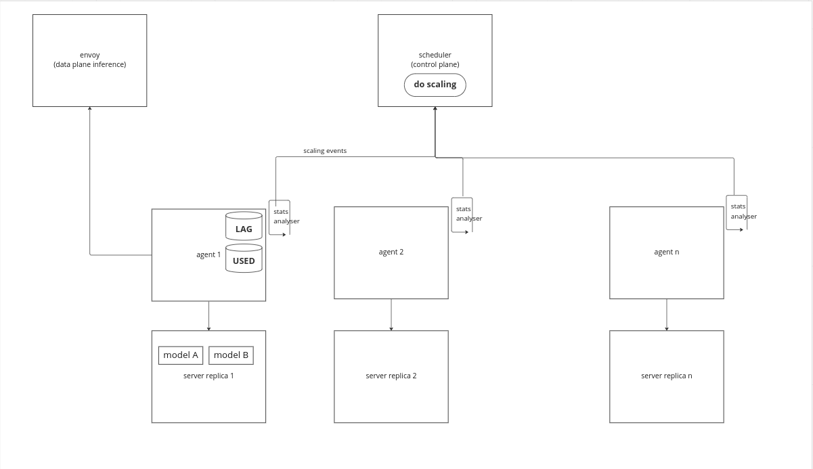

# Autoscaling Models

In order to set up autoscaling, users should first identify which metric they would want to scale their models on. Seldon Core provides an out-of-the-box approach to autoscaling models based on **Inference Lag** (described below), or supports more custom scaling logic based on HPA, (or [Horizontal Pod Autoscaler](https://kubernetes.io/docs/tasks/run-application/horizontal-pod-autoscale/)), whereby you can use custom metrics to automatically scale Kubernetes resources. This page will go through the first approach. To 

## Autoscaling Models based on Inference Lag

Seldon Core offers an out-of-the-box approach (managed by the Core scheduler) to scaling models based on a metric we will refer to as **Inference Lag** - the difference in incoming vs. outgoing requests in a given period of time. This implementation of autoscaling is enabled if at least `MinReplicas` or `MaxReplicas` is set in the Model Custom Resource. Then according to load the system will scale the number of `Replicas` within this range. As an example the following model will be deployed at first with 1 replica and will autoscale according to load.

```yaml
# samples/models/tfsimple_scaling.yaml
apiVersion: mlops.seldon.io/v1alpha1
kind: Model
metadata:
  name: tfsimple
spec:
  storageUri: "gs://seldon-models/triton/simple"
  requirements:
  - tensorflow
  memory: 100Ki
  minReplicas: 1
  replicas: 1
```

When the system autoscales, the initial model spec is not changed (e.g. the number of `replicas`) and therefore the user cannot reset the number of replicas back to the initial specified value without an explicit change. If only `replicas` is specified by the user, autoscaling of models is disabled and the system will have exactly the number of replicas of this model deployed regardless of inference load.

The scale-up and scale-down logic, and it's configurability is described below:

- **Scale Up**: To trigger scale up with the approach described above, we use **Inference Lag** as the metrics. **Inference Lag** is the difference between incoming and outgoing requests in a given time period. If the lag crosses a threshold, then we trigger a model scale up event. This threshold can be defined via `SELDON_MODEL_INFERENCE_LAG_THRESHOLD` inference server environment variable. The threshold used will apply to all the models hosted on the Server where the lag was configured.

- **Scale Down**: When using Model autoscaling that is managed by Seldon Core, model scale down events are triggered if a model has not been used for a number of seconds. This is defined in `SELDON_MODEL_INACTIVE_SECONDS_THRESHOLD` inference server environment variable.

- **Rate of metrics calculation**: Each agent checks the above stats periodically and if any model hits the corresponding threshold, then the agent sends an event to the scheduler to request model scaling. How often this process executes can be defined via `SELDON_SCALING_STATS_PERIOD_SECONDS` inference server environment variable.

Based on the logic above, the scheduler will trigger model autoscaling if:
* The model is stable (no state change in the last 5 minutes) and available.
* The desired number of replicas is within range. Note we always have a least 1 replica of any deployed model and we rely on over commit to reduce the resources used further.
* For scaling up, there is enough capacity for the new model replica.


If autoscaling models with the approach above, it is recommended to autoscale servers based on using Seldon's Server autoscaling (configured by setting `MinReplicas` and `MaxReplicas` for the Server CR - see below). Without Server autoscaling configured, the required number of servers will not necessarily spin up, even if the desired number of model replicas cannot be currently fulfilled by the current provisioned number of servers. Setting up Server Autoscaling is described in more detail below.


# Autoscaling Servers

Core 2 runs with long lived server replicas, each able to host multiple models (through Multi-Model Serving, or MMS). The server replicas can be autoscaled natively by Core 2 in response to dynamic changes in the requested number of model replicas, allowing users to seamlessly optimize the infrastructure cost associated with their deployments. 

This document outlines the autoscaling policies and mechanisms that are available for autoscaling server replicas. These policies are designed to ensure that the server replicas are scaled up or down in response to changes in the number replicas requested for each model. In other words if a given model is scaled up, the system will scale up the server replicas in order to host the new model replicas. Similarly, if a given model is scaled down, the system _may_ scale down the number of replicas of the server hosting the model, depending on other models that are loaded on the same server replica.


**Note**: Autoscaling of servers is required in the case of Multi-Model Serving as the models are dynamically loaded and unloaded onto these server replicas. In this case Core 2 would autoscale server replicas according to changes to the model replicas that are required. This is in contrast to single-model autoscaling approach explained [here](hpa-rps-autoscaling.md) where Server and Model replicas are independently scaled using HPA that targets the same metric.


To enable autoscaling of server replicas, the following requirements need to be met:
1. Setting `minReplicas` and `maxReplicas` in the `Server` CR. This will define the minimum and maximum number of server replicas that can be created.
2. Setting the `autoscaling.autoscalingServerEnabled` value to `true` (default) during installation of the Core 2 `seldon-core-v2-setup` helm chart. If not installing via helm, setting the `ENABLE_SERVER_AUTOSCALING` environment variable to `true` in the `seldon-scheduler` podSpec  (via either SeldonConfig or a SeldonRuntime podSpec override) will have the same effect. This will enable the autoscaling of server replicas.

An example of a `Server` CR with autoscaling enabled is shown below:

```yaml
apiVersion: mlops.seldon.io/v1alpha1
kind: Server
metadata:
  name: mlserver
  namespace: seldon
spec:
  replicas: 2
  minReplicas: 1
  maxReplicas: 4
  serverConfig: mlserver
```


**Note**: Not setting `minReplicas` and/or `maxReplicas` will also effectively disable autoscaling of server replicas. In this case, the user will need to manually scale the server replicas by setting the `replicas` field in the `Server` CR. This allows external autoscaling mechanisms to be used e.g. HPA. 


## Server Scaling Logic

### Scale Up
When we want to scale up the number of replicas for a model, the associated servers might not have enough capacity (replicas) available. In this case we need to scale up the server replicas to match the number required by our models. There is currently only one policy for scaling up server replicas, and that is via **Model Replica Count**. This policy scales up the server replicas to match the number of model replicas that are required. In other words, if a model is scaled up, the system will scale up the server replicas to host these models. This policy ensures that the server replicas are scaled up in response to changes in the number of model replicas that are required. During the scale up process, the system will create new server replicas to host the new model replicas. The new server replicas will be created with the same configuration as the existing server replicas. This includes the server configuration, resources, etc. The new server replicas will be added to the existing server replicas and will be used to host the new model replicas. 

There is a period of time where the new server replicas are being created and the new model replicas are being loaded onto these server replicas. During this period, the system will ensure that the existing server replicas are still serving load so that there is no downtime during the scale up process. This is achieved by using partial scheduling of the new model replicas onto the new server replicas. This ensures that the new server replicas are gradually loaded with the new model replicas and that the existing server replicas are still serving load. Check the [Partial Scheduling](../models/scheduling.md) document for more details.

### Scale Down
Once we have scaled down the number of replicas for a model, some of the corresponding server replicas might be left unused (depending on whether those replicas are hosting other models or not). If that is the case, the extra server pods might incur unnecessary infrastructure cost (especially if they have expensive resources such as GPUs attached). Scaling down servers in sync with models is not straightforward in the case of Multi-Model Serving. Scaling down one model does not necessarily mean that we also need to scale down the corresponding Server replica as this replica might be still serving load for other models. Therefore we define heuristics that can be used to scale down servers if we think that they are not properly used, described in the policies below.


**Note**: Scaling down the number of replicas for an inference server does not necessarily mean that the system is going to remove a specific replica that we want. As currently we have Servers deployed as `StatefulSets`, scaling down the number of replicas will mean that we are removing the pod with the largest index.

Upon scaling down Servers, the system will rebalance. Models from a draining server replica will be rescheduled after some wait time. This draining process is done without incurring downtime as models are being rescheduled onto other server replicas _before_ the draining server replica is removed.


### Policies
There are two possible policies we use to define the scale down of Servers:

1. **Empty Server Replica**: In the simplest case we can remove a server replica if it does not host any models. This guarantees that there is no load on a particular server replica before removing it. This policy works best in the case of single model serving where the server replicas are only hosting a single model. In this case, if the model is scaled down, the server replica will be empty and can be removed.

However in the case of MMS, only reducing the number of server replicas when one of the replicas no longer hosts any models can lead to a suboptimal packing of models onto server replicas. This is because the system will not automatically pack models onto the smaller set of replicas. This can lead to more server replicas being used than necessary. This can be mitigated by the lightly loaded server replicas policy.    
    
2. **Lightly Loaded Server Replicas** (Experimental):


**Warning**: This policy is experimental and is not enabled by default. It can be enabled by setting `autoscaling.serverPackingEnabled` to `true` and `autoscaling.serverPackingPercentage` to a value between 0 and 100. This policy is still under development and might in some cases increase latencies, so it's worth testing ahead of time to observer behavior for a given setup.


Using the above policy which MMS enabled, different model replicas will be hosted on potentially different server replicas and as we scale these models up and down the system can end up in a situation where the models are not consolidated to an optimized number of servers. For illustration, take the case of 3 Models: $$A$$, $$B$$ and $$C$$. We have 1 server $$S$$ with 2 replicas: $$S_1$$ and $$S_2$$ that can host these 3 models. Assuming that initially we have $$A$$ and $$B$$ with 1 replica and $$C$$ with 2 replicas therefore the assignment is:
    
Initial assignment:

- $$S_1$$: $$A_1$$, $$C_1$$
- $$S_2$$: $$B_1$$, $$C_2$$
    
Now if the user unloads Model $$C$$ the assignment is:
    
- $$S_1$$: $$A_1$$
- $$S_2$$: $$B_1$$
    
There is an argument that this is might not be optimized and in MMS the assignment could be:
    
- $$S_1$$: $$A_1$$, $$B_1$$
- $$S_2$$: removed

As the system evolves this imbalance can get larger and could cause the serving infrastructure to be less optimized. The behavior above is actually not limited to autoscaling, however autoscaling will aggravate the issue causing more imbalance over time. This imbalance can be mitigated by making by the following observation: If the max number of replicas of any given model (assigned to a server from a logical point of view) is less than the number of replicas for this server, then we can pack the models hosted onto a smaller set of replicas. Note in Core 2 a server replica can host only 1 replica of a given model.

In other words, consider the following example - for models $$A$$ and $$B$$ having 2 replicas each and we have 3 server $$S$$ replicas, the following assignment is not potentially optimized:


- $$S_1$$: $$A_1$$, $$B_1$$
- $$S_2$$: $$A_2$$
- $$S_3$$: $$B_2$$

In this case we could trigger removal of $$S_3$$ for the server which could pack the models more appropriately

- $$S_1$$: $$A_1$$, $$B_1$$
- $$S_2$$: $$A_2$$, $$B_2$$
- $$S_3$$: removed

While this heuristic is going to pack models onto a set of fewer replicas, which allows us to scale models down, there is still the risk that the packing could increase latencies, trigger a later scale up. Core 2 tries to make sure that do not flip-flopping between these states. The user can also reduce the number of packing events by setting `autoscaling.serverPackingPercentage` to a lower value.

Currently Core 2 triggers the packing logic only when there is model replica being removed, either from a model scale down or a model being deleted. In the future we might trigger this logic more frequently to ensure that the models are packed onto a fewer set of replicas.


<!-- ## Inference servers autoscaling

Autoscaling of servers can be done via `HorizontalPodAutoscaler` (HPA).

HPA can be applied to any deployed `Server` resource. In this case HPA will manage the number of server replicas in the corresponding statefulset according to utilisation metrics  (e.g. CPU or memory).

For example assuming that a `triton` server is deployed, then the user can attach an HPA based on cpu utilisation as follows:

```sh
kubectl autoscale server triton --cpu-percent=50 --min=1 --max=5
```

In this case, according to load, the system will add / remove server replicas to / from the `triton` statefulset.

It is worth considering the following points:

- If HPA adds a new server replica, this new replica will be included in any **future** scheduling decisions. In other words, when deploying a new model or rescheduling failed models this new replica will be considered.
- If HPA deletes an existing server replica, the scheduler will first attempt to drain any loaded model on this server replica before the server replica gets actually deleted. This is achieved by leveraging a `PreStop` hook on the server replica pod that triggers a process before receiving the termination signal. This draining process is capped by `terminationGracePeriodSeconds`, which the user can set (default is 2 minutes).

Therefore there should generally be minimal disruption to the inference workload during scaling.

For more details on HPA check this [Kubernetes walk-through](https://kubernetes.io/docs/tasks/run-application/horizontal-pod-autoscale-walkthrough/).


Autoscaling both Models and Servers using HPA and custom metrics is possible for the special case of single model serving (i.e. single model per server). Check the detailed documentation [here](hpa-rps-autoscaling.md). For multi-model serving (MMS), a different solution is needed as discussed below. -->

### Architecture

The model autoscaling architecture is designed such as each agent decides on which models to scale up / down according to some defined internal metrics and then sends a triggering message to the scheduler. The current metrics are collected from the data plane (inference path), representing a proxy on how loaded is a given model with fulfilling inference requests.



### Scheduler autoscaling


<!-- ## Model memory overcommit

Servers can hold more models than available memory if overcommit is swictched on (default yes). This allows under utilized models to be moved from inference server memory to allow for other models to take their place. Note that these evicted models are still registered and in the case future inference requests arrive, the system will reload the models back to memory before serving the requests. If traffic patterns for inference of models vary then this can allow more models than available server memory to be run on the system. -->
