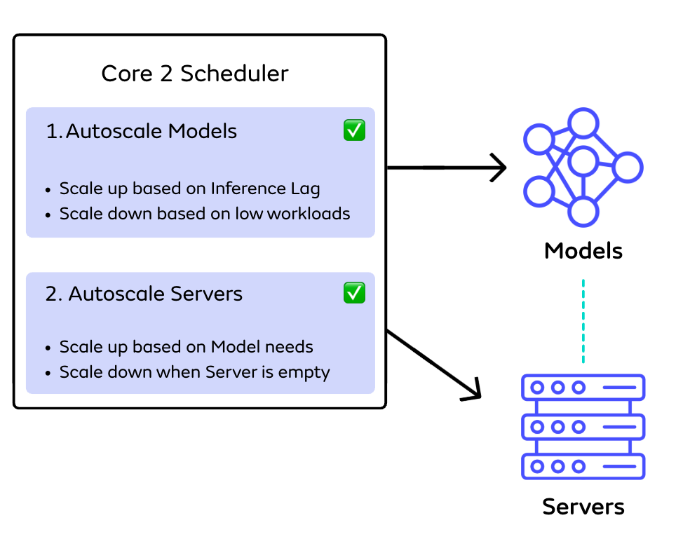

# Seldon Core Autoscaling

Seldon Core provides native autoscaling features for both Models and Servers, enabling automatic scaling based on inference load. The diagram below depicts an autoscaling implementation that uses both Model and Server autoscaling features native to Seldon Core (i.e. this implementation doesn't leverage HPA for autoscaling, an approach we cover [here](./hpa-overview.md)) 

## Model Autoscaling

Models can automatically scale their replicas based on load. Enable it by setting `MinReplicas` or `MaxReplicas` in your model spec. For more detail on this setup see [here](./core-autoscaling-models.md)

## Server Autoscaling

Server autoscaling automatically scales Servers based on Model needs. This implementation supports scaling in a Multi-Model Serving setup where multiple models are hosted on shared inference servers. For more detail on this setup see [here](./core-autoscaling-servers.md)
