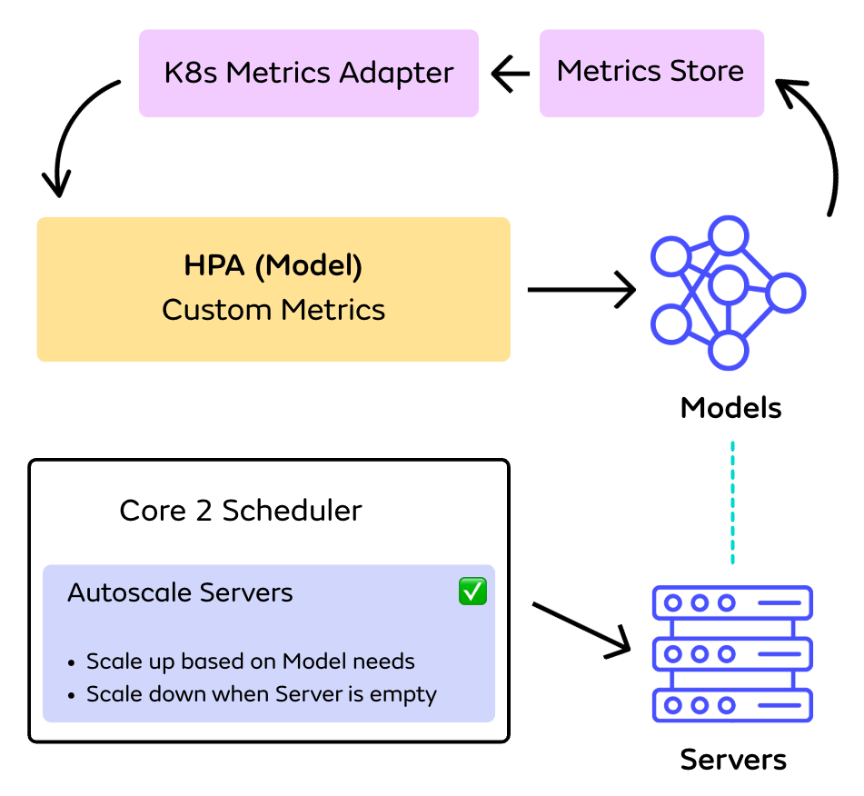

Given Seldon Core 2 is predominantly for serving ML in Kubernetes, it is possible to leverage `HorizontalPodAutoscaler` or [HPA](https://kubernetes.io/docs/tasks/run-application/horizontal-pod-autoscale/) to define scaling logic automatically scale up and down Kubernetes resources. This requires exposing the right metrics such that they can be used by HPA. In this tutorial, we will explain how to expose a requests per secong (RPS) metric associated to models using Prometheus, and then targetting that metrics for autoscaling models. Once scaling for models is set up in this way, autoscaling for servers can be achieved through either Seldon Core autoscaling of Servers [here](./autoscaling.md#autoscaling-servers) as shown below:

{width=50%}

In the case of single-model serving, by setting up HPA manifests for each Servers that matches the ones for their associated models (explained [here](./single-model-serving-hpa.md)).

# Setting up HPA to Autoscale Models

The following workflow will require: 

* Having a Seldon Core 2 install that publishes metrics to prometheus (default). In the following, we will assume that prometheus is already installed and configured in the `seldon-monitoring` namespace.
* Installing and configuring [Prometheus Adapter](https://github.com/kubernetes-sigs/prometheus-adapter), which allows prometheus queries on relevant metrics to be published as k8s custom metrics
* Configuring HPA manifests to scale Models 


Each Kubernetes cluster supports only one active custom metrics provider. If your cluster already uses a custom metrics provider different from `prometheus-adapter`, it will need to be removed before being able to scale Core 2 models and servers via HPA. The Kubernetes community is actively exploring solutions for allowing multiple custom metrics providers to coexist.


## Installing and configuring the Prometheus Adapter

The role of the Prometheus Adapter is to expose queries on metrics in Prometheus as k8s custom or external metrics. Those can then be accessed by HPA in order to take scaling decisions.

To install through helm:

```sh
helm repo add prometheus-community https://prometheus-community.github.io/helm-charts
helm repo update
helm install --set prometheus.url='http://seldon-monitoring-prometheus' hpa-metrics prometheus-community/prometheus-adapter -n seldon-monitoring
```

These commands install `prometheus-adapter` as a helm release named `hpa-metrics` in the same namespace where Prometheus is installed, and point to its service URL (without the port).

The URL is not fully qualified as it references a Prometheus instance running in the same namespace. If you are using a separately-managed Prometheus instance, please update the URL accordingly.

If you are running Prometheus on a different port than the default 9090, you can also pass `--set prometheus.port=[custom_port]` You may inspect all the options available as helm values by running `helm show values prometheus-community/prometheus-adapter`


Please check that the `metricsRelistInterval` helm value (default to 1m) works well in your setup, and update it otherwise. This value needs to be larger than or equal to your Prometheus scrape interval. The corresponding prometheus adapter command-line argument is `--metrics-relist-interval`. If the relist interval is set incorrectly, it will lead to some of the custom metrics being intermittently reported as missing.


We now need to configure the adapter to look for the correct prometheus metrics and compute per-model RPS values. On install, the adapter has created a `ConfigMap` in the same namespace as itself, named `[helm_release_name]-prometheus-adapter`. In our case, it will be `hpa-metrics-prometheus-adapter`.

Overwrite the ConfigMap as shown in the following manifest, after applying any required customizations.


Change the `name` if you've chosen a different value for the `prometheus-adapter` helm release name. Change the `namespace` to match the namespace where `prometheus-adapter` is installed.



````yaml
apiVersion: v1
kind: ConfigMap
metadata:
  name: hpa-metrics-prometheus-adapter
  namespace: seldon-monitoring
data:
  config.yaml: |-
    "rules":
    -
      "seriesQuery": |
         {__name__="seldon_model_infer_total",namespace!=""}
      "resources":
        "overrides":
          "model": {group: "mlops.seldon.io", resource: "model"}
          "server": {group: "mlops.seldon.io", resource: "server"}
          "pod": {resource: "pod"}
          "namespace": {resource: "namespace"}
      "name":
        "matches": "seldon_model_infer_total"
        "as": "infer_rps"
      "metricsQuery": |
        sum by (<<.GroupBy>>) (
          rate (
            <<.Series>>{<<.LabelMatchers>>}[2m]
          )
        )
````


In this example, a single rule is defined to fetch the `seldon_model_infer_total` metric from Prometheus, compute its per second change rate based on data within a 2 minute sliding window, and expose this to Kubernetes as the `infer_rps` metric, with aggregations available at model, server, inference server pod and namespace level.

When HPA requests the `infer_rps` metric via the custom metrics API for a specific model, prometheus-adapter issues a Prometheus query in line with what it is defined in its config.

For the configuration in our example, the query for a model named `irisa0` in namespace `seldon-mesh` would be:

```
sum by (model) (
  rate (
    seldon_model_infer_total{model="irisa0", namespace="seldon-mesh"}[2m]
  )
)
```

You may want to modify the query in the example to match the one that you typically use in your monitoring setup for RPS metrics. The example calls [`rate()`](https://prometheus.io/docs/prometheus/latest/querying/functions/#rate) with a 2 minute sliding window. Values scraped at the beginning and end of the 2 minute window before query time are used to compute the RPS.

It is important to sanity-check the query by executing it against your Prometheus instance. To do so, pick an existing model CR in your Seldon Core 2 install, and send some inference requests towards it. Then, wait for a period equal to at least twice the Prometheus scrape interval (Prometheus default 1 minute), so that two values from the series are captured and a rate can be computed. Finally, you can modify the model name and namespace in the query above to match the model you've picked and execute the query.

If the query result is empty, please adjust it until it consistently returns the expected metric values. Pay special attention to the window size (2 minutes in the example): if it is smaller than twice the Prometheus scrape interval, the query may return no results. A compromise needs to be reached to set the window size large enough to reject noise but also small enough to make the result responsive to quick changes in load.

Update the `metricsQuery` in the prometheus-adapter ConfigMap to match any query changes you have made during tests.

A list of all the Prometheus metrics exposed by Seldon Core 2 in relation to Models, Servers and Pipelines is available [here](../metrics/operational.md), and those may be used when customizing the configuration.

### Customizing prometheus-adapter rule definitions

The rule definition can be broken down in four parts:

1. **Discovery** (the `seriesQuery` and `seriesFilters` keys) controls what Prometheus metrics are considered for exposure via the k8s custom metrics API.

  As an alternative to the example above, all the Seldon Prometheus metrics of the form `seldon_model.*_total` could be considered, followed by excluding metrics pre-aggregated across all models (`.*_aggregate_.*`) as well as the cummulative infer time per model (`.*_seconds_total`):

    ```yaml
    "seriesQuery": |
            {__name__=~"^seldon_model.*_total",namespace!=""}
        "seriesFilters":
            - "isNot": "^seldon_.*_seconds_total"
            - "isNot": "^seldon_.*_aggregate_.*"
    ...
    ```

  For RPS, we are only interested in the model inference count (`seldon_model_infer_total`)

2. **Association** (the `resources` key) controls the Kubernetes resources that a particular metric can be attached to or aggregated over.

  The resources key defines an association between certain labels from the Prometheus metric and k8s resources. For example, on line 17, `"model": {group: "mlops.seldon.io", resource: "model"}` lets `prometheus-adapter` know that, for the selected Prometheus metrics, the value of the "model" label represents the name of a k8s `model.mlops.seldon.io` CR.

  One k8s custom metric is generated for each k8s resource associated with a prometheus metric. In this way, it becomes possible to request the k8s custom metric values for `models.mlops.seldon.io/iris` or for `servers.mlops.seldon.io/mlserver`.

  The labels that *do not* refer to a `namespace` resource generate "namespaced" custom metrics (the label values refer to resources which are part of a namespace) -- this distinction becomes important when needing to fetch the metrics via kubectl, and in understanding how certain Prometheus query template placeholders are replaced.

3. **Naming** (the `name` key) configures the naming of the k8s custom metric.

  In the example ConfigMap, this is configured to take the Prometheus metric named `seldon_model_infer_total` and expose custom metric endpoints named `infer_rps`, which when called return the result of a query over the Prometheus metric. Instead of a literal match, one could also use regex group capture expressions, which can then be referenced in the custom metric name:

  ```yaml
  "name":
    "matches": "^seldon_model_(.*)_total"
    "as": "${1}_rps"
  ```

4. **Querying** (the `metricsQuery` key) defines how a request for a specific k8s custom metric gets converted into a Prometheus query.

  The query can make use of the following placeholders:

    - .Series is replaced by the discovered prometheus metric name (e.g. `seldon_model_infer_total`)
    - .LabelMatchers, when requesting a namespaced metric for resource `X` with name `x` in namespace `n`, is replaced by `X=~"x",namespace="n"`. For example, `model=~"iris0", namespace="seldon-mesh"`. When requesting the namespace resource itself, only the `namespace="n"` is kept.
    - .GroupBy is replaced by the resource type of the requested metric (e.g. `model`, `server`, `pod` or `namespace`).

For a complete reference for how `prometheus-adapter` can be configured via the `ConfigMap`, please consult the docs [here](https://github.com/kubernetes-sigs/prometheus-adapter/blob/master/docs/config.md).

Once you have applied any necessary customizations, replace the default prometheus-adapter config with the new one, and restart the deployment (this restart is required so that prometheus-adapter picks up the new config):

```sh
# Replace default prometheus adapter config
kubectl replace -f prometheus-adapter.config.yaml
# Restart prometheus-adapter pods
kubectl rollout restart deployment hpa-metrics-prometheus-adapter -n seldon-monitoring
```

### Testing the install using the custom metrics API

In order to test that the prometheus adapter config works and everything is set up correctly, you can issue raw kubectl requests against the custom metrics API


**Note**: If no inference requests were issued towards any model in the Seldon install, the metrics configured above will not be available in prometheus, and thus will also not appear when checking via the commands below. Therefore, please first run some inference requests towards a sample model to ensure that the metrics are available — this is only required for the testing of the install.


Listing the available metrics:

```sh
kubectl get --raw /apis/custom.metrics.k8s.io/v1beta1/ | jq .
```

For namespaced metrics, the general template for fetching is:

```sh
kubectl get --raw "/apis/custom.metrics.k8s.io/v1beta1/namespaces/[NAMESPACE]/[API_RESOURCE_NAME]/[CR_NAME]/[METRIC_NAME]"
```

For example:

* Fetching model RPS metric for a specific `(namespace, model)` pair `(seldon-mesh, irisa0)`:

    ```sh
    kubectl get --raw /apis/custom.metrics.k8s.io/v1beta1/namespaces/seldon-mesh/models.mlops.seldon.io/irisa0/infer_rps
    ```

* Fetching model RPS metric aggregated at the `(namespace, server)` level `(seldon-mesh, mlserver)`:

    ```sh
    kubectl get --raw /apis/custom.metrics.k8s.io/v1beta1/namespaces/seldon-mesh/servers.mlops.seldon.io/mlserver/infer_rps
    ```

* Fetching model RPS metric aggregated at the `(namespace, pod)` level `(seldon-mesh, mlserver-0)`:

    ```sh
    kubectl get --raw /apis/custom.metrics.k8s.io/v1beta1/namespaces/seldon-mesh/pods/mlserver-0/infer_rps
    ```

* Fetching the same metric aggregated at `namespace` level `(seldon-mesh)`:

    ```sh
    kubectl get --raw /apis/custom.metrics.k8s.io/v1beta1/namespaces/*/metrics/infer_rps
    ```

## Configuring HPA manifests

For every Model you want to autoscale, you need to apply an HPA manifest based on the chosen scaling metric. If you want to scale Servers using HPA as well - this only works in a setup where all Models and Servers have a 1-1 maping - as opposed to having Seldon's scheduler automatically scale Servers up and down based on Model needs, you will also need to set up HPA manifests for Servers. This is explained in more detail [here](./single-model-serving-hpa.md). 

Consider a model named `irisa0` with the following manifest. Please note we don't set `minReplicas/maxReplicas` in order to disable the Seldon inference-lag-based autoscaling so that it doesn't interact with HPA (separate `minReplicas/maxReplicas` configs will be set on the HPA side)

You must also explicitly define a value for `spec.replicas`. This is the key modified by HPA to increase the number of replicas, and if not present in the manifest it will result in HPA not working until the Model CR is modified to have `spec.replicas` defined.


```yaml
apiVersion: mlops.seldon.io/v1alpha1
kind: Model
metadata:
  name: irisa0
  namespace: seldon-mesh
spec:
  memory: 3M
  replicas: 1
  requirements:
  - sklearn
  storageUri: gs://seldon-models/testing/iris1
```


Let's scale this model when it is deployed on a server named `mlserver`, with a target RPS **per replica** of 3 RPS (higher RPS would trigger scale-up, lower would trigger scale-down):


```yaml
apiVersion: autoscaling/v2
kind: HorizontalPodAutoscaler
metadata:
  name: irisa0-model-hpa
  namespace: seldon-mesh
spec:
  scaleTargetRef:
    apiVersion: mlops.seldon.io/v1alpha1
    kind: Model
    name: irisa0
  minReplicas: 1
  maxReplicas: 3
  metrics:
  - type: Object
    object:
      metric:
        name: infer_rps
      describedObject:
        apiVersion: mlops.seldon.io/v1alpha1
        kind: Model
        name: irisa0
      target:
        type: AverageValue
        averageValue: 3
```




If a Model gets scaled up slightly before its corresponding Server, the model is currently marked with the condition ModelReady "Status: False" with a "ScheduleFailed" message until new Server replicas become available. However, the existing replicas of that model remain available and will continue to serve inference load.



The Object metric allows for two target value types: `AverageValue` and `Value`. Of the two, only `AverageValue` is supported for the current Seldon Core 2 setup. The `Value` target type is typically used for metrics describing the utilization of a resource and would not be suitable for RPS-based scaling.


### HPA metrics of type Object

The example HPA manifests use metrics of type "Object" that fetch the data used in scaling decisions by querying k8s metrics associated with a particular k8s object. The endpoints that HPA uses for fetching those metrics are the same ones that were tested in the previous section using `kubectl get --raw ...`. Because you have configured the Prometheus Adapter to expose those k8s metrics based on queries to Prometheus, a mapping exists between the information contained in the HPA Object metric definition and the actual query that is executed against Prometheus. This section aims to give more details on how this mapping works.

In our example, the `metric.name:infer_rps` gets mapped to the `seldon_model_infer_total` metric on the prometheus side, based on the configuration in the `name` section of the Prometheus Adapter ConfigMap. The prometheus metric name is then used to fill in the `<<.Series>>` template in the query (`metricsQuery` in the same ConfigMap).

Then, the information provided in the `describedObject` is used within the Prometheus query to select the right aggregations of the metric. For the RPS metric used to scale the Model (and the Server because of the 1-1 mapping), it makes sense to compute the aggregate RPS across all the replicas of a given model, so the `describedObject` references a specific Model CR.

However, in the general case, the `describedObject` does not need to be a Model. Any k8s object listed in the `resources` section of the Prometheus Adapter ConfigMap may be used. The Prometheus label associated with the object kind fills in the `<<.GroupBy>>` template, while the name gets used as part of the `<<.LabelMatchers>>`. For example:

* If the described object is `{ kind: Namespace, name: seldon-mesh }`, then the Prometheus query template configured in our example would be transformed into:

```
sum by (namespace) (
  rate (
    seldon_model_infer_total{namespace="seldon-mesh"}[2m]
  )
)
```

* If the described object is not a namespace (for example, `{ kind: Pod, name: mlserver-0 }`) then the query will be passed the label describing the object, alongside an additional label identifying the namespace where the HPA manifest resides in.:

```
sum by (pod) (
  rate (
    seldon_model_infer_total{pod="mlserver-0", namespace="seldon-mesh"}[2m]
  )
)
```

The `target` section establishes the thresholds used in scaling decisions. For RPS, the `AverageValue` target type refers to the threshold per replica RPS above which the number of the `scaleTargetRef` (Model or Server) replicas should be increased. The target number of replicas is being computed by HPA according to the following formula:

$$\texttt{targetReplicas} = \frac{\texttt{infer\_rps}}{\texttt{averageValue}}$$

As an example, if `averageValue=50` and `infer_rps=150`, the `targetReplicas` would be 3.

Importantly, computing the target number of replicas does not require knowing the number of active pods currently associated with the Server or Model. This is what allows both the Model and the Server to be targeted by two separate HPA manifests. Otherwise, both HPA CRs would attempt to take ownership of the same set of pods, and transition into a failure state.

This is also why the `Value` target type is **not currently supported**. In this case, HPA first computes an `utilizationRatio`:

$$\texttt{utilizationRatio} = \frac{\texttt{custom\_metric\_value}}{\texttt{threshold\_value}}$$

As an example, if `threshold_value=100` and `custom_metric_value=200`, the `utilizationRatio` would be 2. HPA deduces from this that the number of active pods associated with the `scaleTargetRef` object should be doubled, and expects that once that target is achieved, the `custom_metric_value` will become equal to the `threshold_value` (`utilizationRatio=1`). However, by using the number of active pods, the HPA CRs for both the Model and the Server also try to take exclusive ownership of the same set of pods, and fail.

Each HPA CR has it's own timer on which it samples the specified custom metrics. This timer starts when the CR is created, with sampling of the metric being done at regular intervals (by default, 15 seconds). When showing the HPA CR information via `kubectl get`, a column of the output will display the current metric value per replica and the target average value in the format `[per replica metric value][target]`. This information is updated in accordance to the sampling rate of each HPA resource. 

### Advanced settings

*   **Filtering metrics by additional labels on the prometheus metric** - The prometheus metric from which the model RPS is computed has the following labels managed by Seldon Core 2:

    ```c-like
    seldon_model_infer_total{
        code="200", 
        container="agent", 
        endpoint="metrics", 
        instance="10.244.0.39:9006", 
        job="seldon-mesh/agent", 
        method_type="rest", 
        model="irisa0", 
        model_internal="irisa0_1", 
        namespace="seldon-mesh", 
        pod="mlserver-0", 
        server="mlserver", 
        server_replica="0"
    }
    ```

    If you want the scaling metric to be computed based on a subset of the Prometheus time series with particular label values (labels either managed by Seldon Core 2 or added automatically within your infrastructure), you can add this as a selector the HPA metric config. This is shown in the following example, which scales only based on the RPS of REST requests as opposed to REST + gRPC:

    ```yaml
      metrics:
      - type: Object
        object:
          describedObject:
            apiVersion: mlops.seldon.io/v1alpha1
            kind: Model
            name: irisa0
          metric:
            name: infer_rps
            selector:
              matchLabels:
                method_type: rest
          target:
    	    type: AverageValue
            averageValue: "3"
    ```

*   **Customize scale-up / scale-down rate & properties** by using scaling policies as described in the [HPA scaling policies docs](https://kubernetes.io/docs/tasks/run-application/horizontal-pod-autoscale/#configurable-scaling-behavior)

*   For more resources, please consult the [HPA docs](https://kubernetes.io/docs/tasks/run-application/horizontal-pod-autoscale/) and the [HPA walkthrough](https://kubernetes.io/docs/tasks/run-application/horizontal-pod-autoscale-walkthrough/)

## Cluster operation guidelines when using HPA-based scaling

When deploying HPA-based scaling for Seldon Core 2 models and servers as part of a production deployment, it is important to understand the exact interactions between HPA-triggered actions and Seldon Core 2 scheduling, as well as potential pitfalls in choosing particular HPA configurations.

Using the default scaling policy, HPA is relatively aggressive on scale-up (responding quickly to increases in load), with a maximum replicas increase of either 4 every 15 seconds or 100% of existing replicas within the same period (**whichever is highest**). In contrast, scaling-down is more gradual, with HPA only scaling down to the maximum number of recommended replicas in the most recent 5 minute rolling window, in order to avoid flapping. Those parameters can be customized via [scaling policies](https://kubernetes.io/docs/tasks/run-application/horizontal-pod-autoscale/#configurable-scaling-behavior).

When using custom metrics such as RPS, the actual number of replicas added during scale-up or reduced during scale-down will entirely depend, alongside the maximums imposed by the policy, on the configured target (`averageValue` RPS per replica) and on how quickly the inferencing load varies in your cluster. All three need to be considered jointly in order to deliver both an efficient use of resources and meeting SLAs.

### Customizing per-replica RPS targets and replica limits

Naturally, the first thing to consider is an estimated peak inference load (including some margins) for each of the models in the cluster. If the minimum number of model replicas needed to serve that load without breaching latency SLAs is known, it should be set as `spec.maxReplicas`, with the HPA `target.averageValue` set to `peak_infer_RPS`/`maxReplicas`.

If `maxReplicas` is not already known, an open-loop load test with a slowly ramping up request rate should be done on the target model (one replica, no scaling). This would allow you to determine the RPS (inference request throughput) when latency SLAs are breached or (depending on the desired operation point) when latency starts increasing. You would then set the HPA `target.averageValue` taking some margin below this saturation RPS, and compute `spec.maxReplicas` as `peak_infer_RPS`/`target.averageValue`. The margin taken below the saturation point is very important, because scaling-up cannot be instant (it requires spinning up new pods, downloading model artifacts, etc.). In the period until the new replicas become available, any load increases will still need to be absorbed by the existing replicas.

If there are multiple models which typically experience peak load in a correlated manner, you need to ensure that sufficient cluster resources are available for k8s to concurrently schedule the maximum number of server pods, with each pod holding one model replica. This can be ensured by using either [Cluster Autoscaler](https://kubernetes.io/docs/concepts/cluster-administration/cluster-autoscaling/) or, when running workloads in the cloud, any provider-specific cluster autoscaling services.


It is important for the cluster to have sufficient resources for creating the total number of desired server replicas set by the HPA CRs across all the models at a given time.

Not having sufficient cluster resources to serve the number of replicas configured by HPA at a given moment, in particular under aggressive scale-up HPA policies, may result in breaches of SLAs. This is discussed in more detail in the following section.


A similar approach should be taken for setting `minReplicas`, in relation to estimated RPS in the low-load regime. However, it's useful to balance lower resource usage to immediate availability of replicas for inference rate increases from that lowest load point. If low-load regimes only occur for small periods of time, and especially combined with a high rate of increase in RPS when moving out of the low-load regime, it might be worth to set the `minReplicas` floor higher in order to ensure SLAs are met at all times.

## Configuring Scaling Paramters

The following elements are important to take into account when setting the HPA policies for models:

- The duration of transient load spikes which you might want to absorb within the existing per-replica RPS margins.
    - Say you configures a scale-up stabilization window of one minute. This means that for all of the HPA recommended replicas in the last 60 second window (4 samples of the custom metric considering the default sampling rate), only the *smallest* will be applied.
    - Such stabilization windows should be set depending on typical load patterns in your cluster: not being too aggressive in reacting to increased load will allow you to achieve cost savings, but has the disadvantage of a delayed reaction if the load spike turns out to be sustained.

- The duration of any typical/expected sustained ramp-up period, and the RPS increase rate during this period.
    - It is useful to consider whether the replica scale-up rate configured via the policy is able to keep-up with this RPS increase rate.
    - Such a scenario may appear, for example, if you are planning for a smooth traffic ramp-up in a blue-green deployment as you are draining the "blue" deployment and transitioning to the "green" one 

