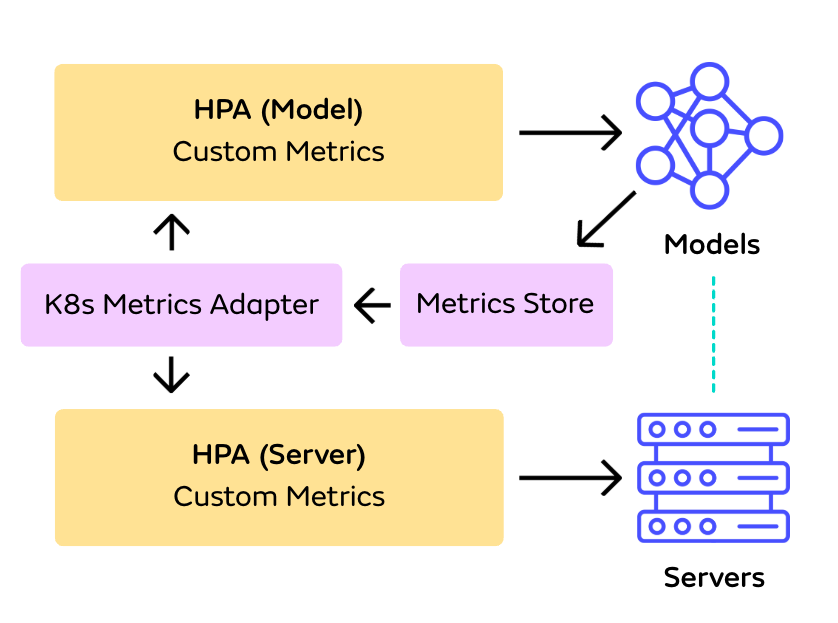

# Single-Model Serving HPA Autoscaling

This page describes how to implement autoscaling for both Models and Servers using Kubernetes HPA (Horizontal Pod Autoscaler) in a single-model serving setup. This approach is specifically designed for deployments where each Server hosts exactly one Model replica (1:1 mapping between Models and Servers). 

## Overview

In single-model serving deployments, you can use HPA to scale both Models and their associated Servers independently, while ensuring they scale in a coordinated manner. This is achieved by:

1. Setting up HPA for Models based on custom metrics (e.g., RPS)
2. Setting up matching HPA configurations for Servers
3. Ensuring both HPAs target the same metrics and scaling policies



## Key Considerations

- **Only custom metrics** from Prometheus are supported. Native Kubernetes resource metrics such as CPU or memory are not. This limitation exists because of HPA's design: In order to prevent multiple HPA CRs from issuing conflicting scaling instructions, each HPA CR must exclusively control a set of pods which is disjoint from the pods controlled by other HPA CRs. In Seldon Core 2, CPU/memory metrics can be used to scale the number of Server replicas via HPA. However, this also means that the CPU/memory metrics from the same set of pods can no longer be used to scale the number of model replicas.
- **No Multi-Model Serving** - this approach requires a 1-1 mapping of Models and Servers, meaning that consolidation of multiple Models onto shared Servers (Multi-Model Serving) is not possible.

## Implementation

In order to set up HPA Autoscaling for Models and Servers together, metrics need to be exposed in the same way as is explained in the [Exposing Metrics](./hpa-setup.md) tutorial. If metrics have not yet been exposed, follow that workflow until you are at the point where you will configure and apply the HPA manifests. 

In this implementation, Models _and_ Servers will be configured to autoscale with a separate HPA manifest targetting the same metric as Models. In order for the scaling metrics to be in sync, it's important to apply the HPA manifests simultaneously. It is important to keep both the scaling metric and any scaling policies the same across the two HPA manifests. This is to ensure that both the Models and the Servers are scaled up/down at approximately the same time. Small variations in the scale-up time are expected because each HPA samples the metrics independently, at regular intervals.

Here's an example configuration, utilizing the same `infer_rps` metric as was set up in the [previous example](./hpa-setup.md).


```yaml

apiVersion: autoscaling/v2
kind: HorizontalPodAutoscaler
metadata:
  name: irisa0-model-hpa
  namespace: seldon-mesh
spec:
  scaleTargetRef:
    apiVersion: mlops.seldon.io/v1alpha1
    kind: Model
    name: irisa0
  minReplicas: 1
  maxReplicas: 3
  metrics:
  - type: Object
    object:
      metric:
        name: infer_rps
      describedObject:
        apiVersion: mlops.seldon.io/v1alpha1
        kind: Model
        name: irisa0
      target:
        type: AverageValue
        averageValue: 3
---
apiVersion: autoscaling/v2
kind: HorizontalPodAutoscaler
metadata:
  name: mlserver-server-hpa
  namespace: seldon-mesh
spec:
  scaleTargetRef:
    apiVersion: mlops.seldon.io/v1alpha1
    kind: Server
    name: mlserver
  minReplicas: 1
  maxReplicas: 3
  metrics:
  - type: Object
    object:
      metric:
        name: infer_rps
      describedObject:
        apiVersion: mlops.seldon.io/v1alpha1
        kind: Model
        name: irisa0
      target:
        type: AverageValue
        averageValue: 3
```


## Scaling Behavior

In order to ensure similar scaling behaviour between Models and Servers, the number of `minReplicas` and `maxReplicas`, as well as any other configured scaling policies should be kept in sync across the HPA for the model and the server.

Each HPA CR has it's own timer on which it samples the specified custom metrics. This timer starts when the CR is created, with sampling of the metric being done at regular intervals (by default, 15 seconds). As a side effect of this, creating the Model HPA and the Server HPA (for a given model) at different times will mean that the scaling decisions on the two are taken at different times. Even when creating the two CRs together as part of the same manifest, there will usually be a small delay between the point where the Model and Server `spec.replicas` values are changed. Despite this delay, the two will converge to the same number when the decisions are taken based on the same metric (as in the previous examples).


**Note**: If a Model gets scaled up slightly before its corresponding Server, the model is currently marked with the condition ModelReady "Status: False" with a "ScheduleFailed" message until new Server replicas become available. However, the existing replicas of that model remain available and will continue to serve inference load.


## Monitoring Scaling

When showing the HPA CR information via `kubectl get`, a column of the output will display the current metric value per replica and the target average value in the format `[per replica metric value]/[target]`. This information is updated in accordance to the sampling rate of each HPA resource. It is therefore expected to sometimes see different metric values for the Model and its corresponding Server.


Some versions of k8s will display `[per pod metric value]` instead of `[per replica metric value]`, with the number of pods being computed based on a label selector present in the target resource CR (the `status.selector` value for the Model or Server in the Core 2 case).

HPA is designed so that multiple HPA CRs cannot target the same underlying pod with this selector (with HPA stopping when such a condition is detected). This means that in Core 2, the Model and Server selector cannot be the same. A design choice was made to assign the Model a unique selector that does not match any pods.

As a result, for the k8s versions displaying `[per pod metric value]`, the information shown for the Model HPA CR will be an overflow caused by division by zero. This is only a display artefact, with the Model HPA continuing to work normally. The actual value of the metric can be seen by inspecting the corresponding Server HPA CR, or by fetching the metric directly via `kubectl get --raw`


## Limitations

In this implementation, the scheduler itself does not create new Server replicas when the existing replicas are not sufficient for loading a Model's replicas (one Model replica per Server replica). Whenever a Model requests more replicas than available on any of the available Servers, its `ModelReady` condition transitions to `Status: False` with a `ScheduleFailed` message. However, any replicas of that Model that are already loaded at that point remain available for servicing inference load.

## Best Practices

The following elements are important to take into account when setting the HPA policies.

- The speed with which new Server replicas can become available versus how many new replicas may HPA request in a given time:
    - The HPA scale-up policy should not be configured to request more replicas than can become available in the specified time. The following example reflects a confidence that 5 Server pods will become available within 90 seconds, with some safety margin. The default scale-up config, that also adds a percentage based policy (double the existing replicas within the set `periodSeconds`) is not recommended because of this.
    - Perhaps more importantly, there is no reason to scale faster than the time it takes for replicas to become available - this is the true maximum rate with which scaling up can happen anyway.


```yaml
apiVersion: autoscaling/v2
kind: HorizontalPodAutoscaler
metadata:
  name: irisa0-model-hpa
  namespace: seldon-mesh
spec:
  scaleTargetRef:
    ...
  minReplicas: 1
  maxReplicas: 3
  behavior:
    scaleUp:
      stabilizationWindowSeconds: 60
      policies:
      - type: Pods
        value: 5
        periodSeconds: 90
  metrics:
    ...
```



- The duration of transient load spikes which you might want to absorb within the existing per-replica RPS margins.
    - The previous example, at line 13, configures a scale-up stabilization window of one minute. It means that for all of the HPA recommended replicas in the last 60 second window (4 samples of the custom metric considering the default sampling rate), only the *smallest* will be applied.
    - Such stabilization windows should be set depending on typical load patterns in your cluster: not being too aggressive in reacting to increased load will allow you to achieve cost savings, but has the disadvantage of a delayed reaction if the load spike turns out to be sustained.

- The duration of any typical/expected sustained ramp-up period, and the RPS increase rate during this period.
    - It is useful to consider whether the replica scale-up rate configured via the policy (line 15 in the example) is able to keep-up with this RPS increase rate.
    - Such a scenario may appear, for example, if you are planning for a smooth traffic ramp-up in a blue-green deployment as you are draining the "blue" deployment and transitioning to the "green" one 
