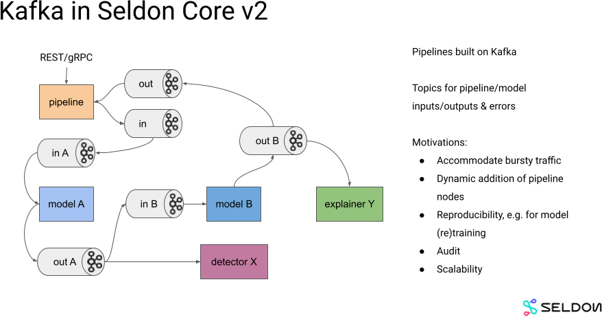

# Architecture

The current set of components used in Seldon Core V2 is shown below:


The core components are:

 * Scheduler : manages the load and unload of models, pipelines, explainers and experiments.
 * Pipeline gateway : handles REST/gRPC calls to pipelines.
 * Dataflow engine : handles the flow of data between components in a pipeline.
 * Model gateway : handles the flow of data from models to inference requests on servers and passes on the responses.
 * Agent : manages the loading and unloading of models on a server and access to the server over REST/gRPC.
 * Envoy : manages the proxying of requests to the correct servers including load balancing.

All the above are Kubernetes agnostic and can run locally, e.g. on Docker Compose.

We also provide a Kubernetes Operator to allow Kubernetes usage.

Kafka is used as the backbone for Pipelines allowing a decentralized, synchronous and asynchronous usage.

## Kafka

Kafka is used as the backbone for allowing Pipelines of Models to be connected together into arbitrary directed acyclic graphs. Models can be reused in different Pipelines. The flow of data between models is handled by the dataflow engine using [KStreams](https://docs.confluent.io/platform/current/streams/concepts.html).



## Dataflow Architecture

Seldon V2 follows a dataflow design paradigm and it's part of the current movement for data centric machine learning. By taking a decentralized route that focuses on the flow of data users can have more flexibility and insight in building complex applications containing machine learning and traditional components. This contrasts with a more centralized orchestration more traditional in service orientated architectures.


By focusing on the data we allow users to join various flows together using stream joining concepts as shown below.


We support several types of joins:
 * _inner joins_, where all inputs need to be present for a transaction to join the tensors passed through the Pipeline;
 * _outer joins_, where only a subset needs to be available during the join window
 * _triggers_, in which data flows need to wait until records on one or more trigger data flows appear. The data in these triggers is not passed onwards from the join.

These techniques allow users to create complex pipeline flows of data between machine learning components.

More discussion on the data flow view of machine learning and its effect on v2 design can be found [here](dataflow.md).

```{toctree}
:maxdepth: 1
:hidden:

dataflow.md
```